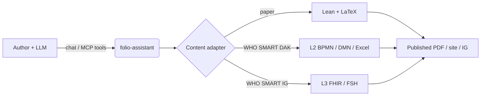

# folio-assistant

**A content-agnostic agent skills framework.** Author rigorous content with an
LLM — scientific papers & books, WHO SMART Guidelines, and FHIR Implementation
Guides — backed by an MCP server, role-based access control, a typed
content-object model, and a per-content-type skill system.

[](https://litlfred.github.io/folio-assistant/)
[](./LICENSE)

> **Platform, not content.** folio-assistant contains no content. It provides
> the skills, schemas, and MCP server an LLM uses to plan, author, validate,
> review, test, and publish a *folio* that lives in a **separate** repository.
> The **formalism of authoring is kept separate from any content** — examples in
> the docs are illustrative only.

📖 **Full documentation:** **<https://litlfred.github.io/folio-assistant/>**

---

## What it does



| Content type | Artifacts | Skill package |
|--------------|-----------|---------------|
| **Scientific papers & books** | Lean 4 + LaTeX/Markdown | `authoring-math` |
| **WHO SMART Guidelines DAKs (L2)** | BPMN, DMN, Excel, terminology | `authoring-who-smart-guidelines` |
| **WHO SMART Implementation Guides (L3)** | FHIR / FSH / IG Publisher | `authoring-who-smart-guidelines` |
| **Others** | pluggable adapter + skill package | _add your own_ |

---

## Quick start

```sh
# 1. Prerequisites: Bun ≥ 1.0
curl -fsSL https://bun.sh/install | bash

# 2. Clone + install
git clone https://github.com/litlfred/folio-assistant.git
cd folio-assistant
bun install

# 3. Check which capabilities are present (LaTeX, Lean, …)
bun run check-deps

# 4. Run the MCP server (point --repo at your content repo)
bun run src/index.ts --stdio --repo /path/to/your/content-repo
```

### Common commands

```sh
bun run start          # run the assistant (stdio MCP)
bun run start:http     # run over HTTP
bun run check-deps     # probe environment capabilities
bun test               # unit tests
bun run test:e2e       # Playwright end-to-end tests
bun run lint           # eslint

bun run scripts/gen-schema-docs.ts   # regenerate the skill schema reference
```

---

## Use it with your LLM harness

folio-assistant is an MCP server, so any MCP-capable harness can drive it. In
every case the agent launches it over **stdio**.

### Claude Code

`.mcp.json` in your content repo:

```json
{
  "mcpServers": {
    "folio-assistant": {
      "command": "bun",
      "args": ["run", "/path/to/folio-assistant/src/index.ts", "--stdio", "--repo", "."]
    }
  }
}
```

or:

```sh
claude mcp add folio-assistant -- bun run /path/to/folio-assistant/src/index.ts --stdio --repo .
```

### Antigravity / Gemini CLI

Add the same server block to the harness's MCP config (Antigravity and Gemini
CLI share the JSON format), and wire the `SessionStart` hook to
`scripts/session-start-coord-sweep.sh` so each session is primed with the
work-plan. Both read `AGENTS.md` natively.

### Any MCP client

Point it at the stdio command above, or run `bun run start:http` and connect
over HTTP. The `work_plan_prime` tool gives any connected agent identical
work-plan priming.

➡️ Full per-harness instructions:
[Connecting an LLM harness](https://litlfred.github.io/folio-assistant/installation.html#connecting-an-llm-harness).

---

## The tools the agent gets

| Tool | Purpose |
|------|---------|
| `work_plan_prime` | Surface the work-plan (beans) |
| `check_dependencies` | Probe installed toolchains |
| `skill_list` / `skill_fetch` | Discover + load skills |
| `content_list` / `content_validate` / `content_build` | Lifecycle over the folio |
| `paper_render_pdf` / `paper_render_html` / `paper_preview` / `formula_render` | Render (paper adapter) |
| `lean_setup` / `lean_build` / `lean_check` / `lean_status` | Lean lifecycle (paper adapter) |
| `paper_preferences` | Per-folio rendering preferences |

---

## Documentation

| Page | What |
|------|------|
| [Installation](https://litlfred.github.io/folio-assistant/installation.html) | prerequisites, harness setup |
| [Getting started](https://litlfred.github.io/folio-assistant/getting-started.html) | first skill run |
| [Tutorial: writing a paper](https://litlfred.github.io/folio-assistant/guides/writing-a-paper.html) | LLM-driven walk-through with a mock session |
| [Content types](https://litlfred.github.io/folio-assistant/content-types.html) | the authoring formalism per domain |
| [Skill schema reference](https://litlfred.github.io/folio-assistant/reference/skills/) | generated input/output contracts |
| [TypeScript API reference](https://litlfred.github.io/folio-assistant/api/) | the content-object model |
| [Architecture](https://litlfred.github.io/folio-assistant/architecture.html) | adapters, MCP, RBAC, blocks |

---

## Work-plan with `beans`

This project uses [`beans`](https://github.com/hmans/beans) as the single
work-plan / todo mechanism (durable, cross-session, cross-agent). See
[`AGENTS.md`](./AGENTS.md).

```sh
scripts/install-beans.sh
beans list
beans create "<title>"
beans <id> --status in-progress
```

## Contributing

See the [contributing guide](https://litlfred.github.io/folio-assistant/contributing.html)
and [`AGENTS.md`](./AGENTS.md). Run `bun test` and `eslint .` before pushing.

## License

[MIT](./LICENSE)
