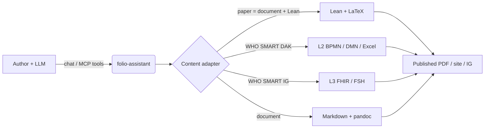

# folio-assistant

🤖 **Agent cold start — run this before any durable work:**
`cat-harness/scripts/install-beans.sh && export PATH="$HOME/.local/bin:$PATH" && beans prime`,
then [`AGENTS.md` §"At session start"](AGENTS.md#at-session-start) for the rest.

**A content-agnostic agent skills framework.** Author rigorous content with an
LLM — documents and policy guidance, scientific papers & books, WHO SMART
Guidelines, and FHIR Implementation Guides — backed by an MCP server,
role-based access control, a typed content-object model, and a
per-content-type skill system.

[](https://github.com/litlfred/folio-assistant/actions/workflows/code-quality-gates.yml?query=branch%3Amain)
[](https://github.com/litlfred/folio-assistant/actions/workflows/docs-site.yml?query=branch%3Amain)
[](https://github.com/litlfred/folio-assistant/actions/workflows/ci-health.yml?query=branch%3Amain)
[](https://litlfred.github.io/folio-assistant/)
[](./LICENSE)
[](./LICENSE-CONTENT.md)

<!--
The three live badges are the workflows that actually run on `main` — the only
ones a badge can tell the truth about. A badge for a `workflow_dispatch`-only
workflow reports its last dispatch forever, which is how `witness-refresh.yml`
and `qa-sweep.yml` would read as red for all time (bean `lq7e`). If you add a
workflow that auto-triggers on `main`, badge it here; if you add one that does
not, do not.
-->

> **Platform, not content.** folio-assistant contains no content. It provides
> the skills, schemas, and MCP server an LLM uses to plan, author, validate,
> review, test, and publish a *folio* that lives in a **separate** repository.
> The **formalism of authoring is kept separate from any content** — examples in
> the docs are illustrative only.

## Cold start — what an arriving agent does first

<!-- cat-harness:cold-start:begin -->

**Read this before you do anything else.**

**This repository is an ACTIVE knowledge graph.** `cat-harness` declares `beans` and `todos` — work somebody is partway through, which you can pick up.

| | |
|---|---|
| **1. What the harness is, from nothing** | [`bootstrap/README.md`](bootstrap/README.md) — the overview of skills and tasks, written to assume no MCP server, no `beans`, no build. |
| **2. How to find the graph, and the skills in it** | [`kg-navigation`](cat-harness/skills/kg-navigation/kg-navigation.md). **Ask for the skill list; never read one from here** — `skill_list` for what exists, `skill_fetch` to load one. No MCP? Resolve the `kg` graph from `<name>.json` and read the directory it names. |
| **3. Whether this graph is active or static** | The verdict above is computed, not asserted: an instance is ACTIVE when it declares a graph kind whose `recordsWork` is true. Static? Then determine your context instead — [`process-state`](cat-harness/skills/workflow/process-state.md). |
| **4. It is active, so** | Work out your role, process and task from the BPMN under [`processes/`](cat-harness/processes/) — the diagrams are executable, not illustrations. Then read the work plan in [`beans/`](beans/), prioritise it, and **ask which items to work on**. That last step is an interaction rule, not a formality. |

*Why no list of skills: a README is the one file no check reads, so a list in it is wrong the day a skill is added and nothing says so. The two calls above ask the graph instead.*

<!-- cat-harness:cold-start:end -->

## Harness instances

This repository holds several **instances**, each declaring its own
`<instance>.json`. Every one has two entry points on purpose: a **README**
saying what it *is*, and an **`AGENTS.md`** saying what to *do* — the second
augments the first rather than restating it.

The table is generated from the declarations themselves by `bun run
readme:sync`; it is not a list anybody keeps. Add an instance and it appears;
rename a directory and the links follow.

<!-- cat-harness:instances:begin -->

| Instance | Path | For an agent | For a person |
|----------|------|--------------|--------------|
| `folio-assistant` | . | [AGENTS.md](AGENTS.md) | [README](README.md) |
| `agent-skills` | agent-skills | [AGENTS.md](./agent-skills/AGENTS.md) | [README](./agent-skills/README.md) |
| `bootstrap` | bootstrap | [AGENTS.md](./bootstrap/AGENTS.md) | [README](./bootstrap/README.md) |
| `bootstrap-tools` | bootstrap-tools | [AGENTS.md](./bootstrap-tools/AGENTS.md) | [README](./bootstrap-tools/README.md) |
| `cat-harness` | cat-harness | [AGENTS.md](./cat-harness/AGENTS.md) · [memory](memory/) | [README](./cat-harness/README.md) · [docs](./cat-harness/docs/) · [docs](docs/) |
| `fhir-harness` | fhir-harness | [AGENTS.md](./fhir-harness/AGENTS.md) | [README](./fhir-harness/README.md) |
| `folio-assistant-core` | folio-assistant-core | [AGENTS.md](./folio-assistant-core/AGENTS.md) | [README](./folio-assistant-core/README.md) |
| `folio-assistant-sci` | folio-assistant-sci | [AGENTS.md](./folio-assistant-sci/AGENTS.md) | [README](./folio-assistant-sci/README.md) |
| `large-datasets` | large-datasets | [AGENTS.md](./large-datasets/AGENTS.md) | [README](./large-datasets/README.md) |
| `smart-base` | smart-base | [AGENTS.md](./smart-base/AGENTS.md) | [README](./smart-base/README.md) |
| `smart-dak` | smart-dak | [AGENTS.md](./smart-dak/AGENTS.md) | [README](./smart-dak/README.md) |
| `smart-ig` | smart-ig | [AGENTS.md](./smart-ig/AGENTS.md) | [README](./smart-ig/README.md) |
| `smart-immunizations` | smart-immunizations | [AGENTS.md](./smart-immunizations/AGENTS.md) | [README](./smart-immunizations/README.md) |
| `smart-l1` | smart-l1 | [AGENTS.md](./smart-l1/AGENTS.md) | [README](./smart-l1/README.md) |
| `smart-trust` | smart-trust | [AGENTS.md](./smart-trust/AGENTS.md) | [README](./smart-trust/README.md) · [docs](./smart-trust/docs/) |
| `who-iris` | who-iris | [AGENTS.md](./who-iris/AGENTS.md) | [README](./who-iris/README.md) · [docs](./who-iris/docs/) |
| `who-style-guide` | who-style-guide | [AGENTS.md](./who-style-guide/AGENTS.md) | [README](./who-style-guide/README.md) |

> **14 of 17** declare no `docs` graph of their own; their reader-facing documentation is the harness layer's site.

*`AGENTS.md` — What a cold agent DOES here, in order — augmenting the README rather than restating it, and read as a file so no injection budget truncates it.*  
*`README` — What this instance IS, for a reader — its entry point, and the human half of the pair.*

<!-- cat-harness:instances:end -->

## Bootstrapping — setting up a repository to write in

**`bootstrap litlfred/cat-harness`** means *set this repository up the same way
that one is set up.*

A repository that has been bootstrapped carries a small file saying what kind
of thing it holds and where to find the procedures for working on it — how to
draft, how to check, how to publish. Those procedures are a **harness**, and
they live in their own repository rather than being copied in.

You give one repository name. What kind of document, which procedures, and
which editorial style are all read from **that** repository's setup file, so
there is nothing else to ask.

An agent pointed at a repository that is not set up yet starts at
**[`bootstrap/README.md`](bootstrap/README.md)**, which is written for someone
who knows none of the above.

Why it is built this way, and the questions still open:
[proposals/bootstrap](cat-harness/docs/proposals/bootstrap.md) — in `fsh-guts/`, which
is kept and addressable but deliberately not published as a page, so that is a
repository link rather than a site one.

---

📖 **Full documentation:** **<https://litlfred.github.io/folio-assistant/>**

🤖 **Are you an LLM agent?** Start with
**[Agent onboarding](https://litlfred.github.io/folio-assistant/guides/agent-onboarding.html)**
(source: [`folio-assistant/docs/guides/agent-onboarding.md`](cat-harness/docs/guides/agent-onboarding.md)) —
which repo you are in, your first five minutes, how to find the right skill, the
content-object model, and the QA sidecar system. `AGENTS.md` is the command and
convention reference to come back to.

---

## What it does


```mermaid
flowchart LR
    A[Author + LLM] -->|chat / MCP tools| B(folio-assistant)
    B --> C{Content adapter}
    C -->|document| H[Markdown + pandoc]
    C -->|paper = document + Lean| D[Lean + LaTeX]
    C -->|WHO SMART DAK| E[L2 BPMN / DMN / Excel]
    C -->|WHO SMART IG| F[L3 FHIR / FSH]
    D & E & F & H --> G[Published PDF / site / IG]

    click B "https://litlfred.github.io/folio-assistant/" "Docs home" _blank
    click H "https://litlfred.github.io/folio-assistant/guides/writing-a-document.html" "Writing a document" _blank
    click D "https://litlfred.github.io/folio-assistant/guides/writing-a-paper.html" "Writing a paper" _blank
    click E "https://litlfred.github.io/folio-assistant/guides/who-smart-dak.html" "WHO SMART DAK (L2)" _blank
    click F "https://litlfred.github.io/folio-assistant/guides/who-smart-ig.html" "WHO SMART IG (L3)" _blank
```

> The diagram nodes link to the docs (clickable on the
> [docs site](https://litlfred.github.io/folio-assistant/) and in Mermaid-aware
> viewers). On GitHub itself, use the clickable map below.

| Content type | Artifacts | Skill package |
|--------------|-----------|---------------|
| **Documents & policy guidance** | Markdown → HTML/PDF (no TeX) | `folio-document-adapter` |
| **Scientific papers & books** | Lean 4 + LaTeX/Markdown | `authoring-math` |
| **WHO SMART Guidelines DAKs (L2)** | BPMN, DMN, Excel, terminology | `authoring-who-smart-guidelines` |
| **WHO SMART Implementation Guides (L3)** | FHIR / FSH / IG Publisher | `authoring-who-smart-guidelines` |
| **Others** | pluggable adapter + skill package | _add your own_ |

> **A paper is a document plus Lean.** The two share one content model, one
> editorial graph, one QA system and one publication pipeline; a paper adds the
> seven block kinds whose assertion is a formal mathematical claim, and the two
> toolchains that serve them. So the `paper` adapter *extends* the `document`
> adapter rather than sitting beside it, and a document folio needs neither
> Lean nor a TeX installation to publish.

---

## How a change gets published

The editing and publication processes are modelled as **BPMN 2.0 swimlane
diagrams**. Sources live in [`processes/`](cat-harness/processes) — open them in
[bpmn.io](https://demo.bpmn.io/) or Camunda Modeler; the SVGs below are
generated from them by `bun run render:bpmn`.

Full walk-through, with the roles and the skill each activity uses:
**[Publication workflow](https://litlfred.github.io/folio-assistant/publication-workflow.html)**.

### One proposed change to one content block — the HCI validation gate

An authoring agent produces a **proposed** change, never a commit. It fans out
through **mechanical** validation (schema, syntax, spelling, links, build and QA
gates) and **non-mechanical** validation (a review agent, escalating to a human
or SME on a judgement call). Both must report; the findings are shown to the
editor; only an accepted change is written to the corpus.


[BPMN source](cat-harness/processes/editing-hci-validation.bpmn)

### Corpus → draft → review team → published


[BPMN source](cat-harness/processes/draft-to-publication.bpmn)

### One cycle of a folio, plan → retire

Both diagrams above appear here as call activities, and the **work plan
(beans)** lane runs through all three — claimed before work starts, updated with
findings, resolved on commit — so a human and an agent read the same answer to
*what is done, and what is next*.


[BPMN source](cat-harness/processes/content-lifecycle.bpmn)

### Per content type

| Diagram | Content type |
|---------|--------------|
| [`authoring-a-document.bpmn`](cat-harness/processes/authoring-a-document.bpmn) · [SVG](cat-harness/docs/assets/img/workflows/authoring-a-document.svg) | Documents & policy guidance |
| [`authoring-a-paper.bpmn`](cat-harness/processes/authoring-a-paper.bpmn) · [SVG](cat-harness/docs/assets/img/workflows/authoring-a-paper.svg) | Scientific papers & books |
| [`l2-dak-authoring.bpmn`](cat-harness/processes/l2-dak-authoring.bpmn) · [SVG](cat-harness/docs/assets/img/workflows/l2-dak-authoring.svg) | WHO SMART Guidelines DAK (L2) |
| [`l3-fhir-pipeline.bpmn`](cat-harness/processes/l3-fhir-pipeline.bpmn) · [SVG](cat-harness/docs/assets/img/workflows/l3-fhir-pipeline.svg) | WHO SMART Implementation Guide (L3) |

---

## Start a new folio

A **folio** is your content repository — the paper, the guidance note, the
guideline. folio-assistant is the platform it uses. This gets you from an empty
repo to one where you can say *"add a chapter"* and have it work.

### 1. Create the repo and scaffold it

In a new, empty repository:

<!-- command-path-ok: run IN THE NEW FOLIO, where folio-assistant is the submodule just added -->
```sh
# Get the platform. A submodule pins the exact revision your content is
# authored against, so a fresh clone reproduces your build.
git init
git submodule add https://github.com/litlfred/folio-assistant.git folio-assistant
(cd folio-assistant && bun install)

# Scaffold. --type document for prose; --type paper to add Lean + LaTeX.
bun run folio-assistant/cat-harness/scripts/init-folio.ts \
    --type document \
    --title "My Guidance Note" \
    --author "Your Name"
```

That writes:

```
content/my-guidance-note/            the document
  my-guidance-note.ts                its manifest — chapters, in reading order
  introduction/introduction.ts       a chapter manifest — sections
  introduction/overview.ts + .md     a first block, wired into a section
content/schema/                      builder shim — the one place the platform path is written
uploads/                             source PDFs, for offline citation verification
library/                             ingested source documents (read-only reference)
<name>.config.json                   selects the adapter
AGENTS.md                            agent guidance, tailored to your content type
CLAUDE.md · GEMINI.md                thin stubs pointing at AGENTS.md
.mcp.json                            wires folio-assistant as an MCP server
.claude/settings.json                SessionStart hook → work-plan priming
.beans.yml · beans/                 the work plan
```

Nothing there is subject matter. The starter block explains what a block *is*
and says to replace itself — the scaffolder does not guess at your topic.

`--dry-run` shows what it would write; re-running never overwrites your edits
unless you pass `--force`.

### 2. Open your agent in the folio, not here

`.mcp.json` is already written, so Claude Code, Gemini CLI, Antigravity or any
other MCP harness picks the server up on launch. Your agent reads `AGENTS.md`,
which tells it which block kinds this folio may use and which skills to load.

Then just ask:

> *add a chapter on cold-chain monitoring*
>
> *add a recommendation about quarterly audits, and say what it depends on*
>
> *render the document and show me the ordering*

### 3. Or let the agent do step 1 too

If your harness is already connected to a folio-assistant server — from another
folio, or a checkout you point it at — it has the `folio_init` tool, and you can
skip straight to:

> *initialize a new document folio here using litlfred/folio-assistant, titled
> "My Guidance Note", author Your Name*

`folio_init` refuses to scaffold over an existing folio, so this is safe to say
in a repo you are not sure about.

### Which content type?

| You are writing | `--type` | Needs |
|---|---|---|
| Policy guidance, a standard, a report, a handbook | `document` | Bun; pandoc to render |
| A paper or book with machine-checked mathematics | `paper` | + Lean 4 (elan) and TeX Live |

Choose `document` unless the folio will actually carry formal mathematics —
`paper` adds two large toolchains. Switching later is a one-line change to
`<name>.config.json`; going from `paper` to `document` additionally means
removing the math blocks, which `content_profile_check` lists for you.

➡️ Full walk-throughs:
**[Writing a document](https://litlfred.github.io/folio-assistant/guides/writing-a-document.html)**
· **[Writing a paper](https://litlfred.github.io/folio-assistant/guides/writing-a-paper.html)**

---

## Working on the platform itself

```sh
# 1. Prerequisites: Bun ≥ 1.0
curl -fsSL https://bun.sh/install | bash

# 2. Clone + install
git clone https://github.com/litlfred/folio-assistant.git
cd folio-assistant
bun install

# 3. Check which capabilities are present (LaTeX, Lean, …)
bun run check-deps

# 4. Run the MCP server (point --repo at your content repo)
bun run cat-harness/src/index.ts --stdio --repo /path/to/your/content-repo
```

### Common commands

```sh
bun run start          # run the assistant (stdio MCP)
bun run start:http     # run over HTTP
bun run check-deps     # probe environment capabilities
bun test               # unit tests
bun run test:e2e       # Playwright end-to-end tests
bun run lint           # eslint

bun run cat-harness/scripts/gen-schema-docs.ts   # regenerate the skill schema reference
bun run init-folio --help            # scaffold a new folio
```

---

## Use it with your LLM harness

folio-assistant is an MCP server, so any MCP-capable harness can drive it. In
every case the agent launches it over **stdio**.

### Claude Code

`.mcp.json` in your content repo:

```json
{
  "mcpServers": {
    "folio-assistant": {
      "command": "bun",
      "args": ["run", "/path/to/folio-assistant/src/index.ts", "--stdio", "--repo", "."]
    }
  }
}
```

or:

```sh
claude mcp add folio-assistant -- bun run /path/to/folio-assistant/src/index.ts --stdio --repo .
```

### Antigravity / Gemini CLI

Add the same server block to the harness's MCP config (Antigravity and Gemini
CLI share the JSON format), and wire the `SessionStart` hook to
`scripts/session-start-coord-sweep.sh` so each session is primed with the
work-plan. Both read `AGENTS.md` natively.

### Any MCP client

Point it at the stdio command above, or run `bun run start:http` and connect
over HTTP. The `work_plan_prime` tool gives any connected agent identical
work-plan priming.

➡️ Full per-harness instructions:
[Connecting an LLM harness](https://litlfred.github.io/folio-assistant/installation.html#connecting-an-llm-harness).

---

## The tools the agent gets

| Tool | Purpose |
|------|---------|
| `folio_init` | Scaffold a new folio (runs before a folio has a content type) |
| `work_plan_prime` | Surface the work-plan (beans) |
| `check_dependencies` | Probe installed toolchains |
| `skill_list` / `skill_fetch` | Discover + load skills |
| `content_list` / `content_validate` / `content_build` | Lifecycle over the folio |
| `content_profile_check` | Enforce the folio's declared profile (no math kinds or Lean in a document) |
| `document_render_md` / `document_render_html` / `document_render_pdf` | Render without TeX (both content types) |
| `paper_render_pdf` / `paper_render_html` / `paper_preview` / `formula_render` | Render via LaTeX (paper adapter) |
| `lean_setup` / `lean_build` / `lean_check` / `lean_status` | Lean lifecycle (paper adapter) |
| `paper_preferences` | Per-folio rendering preferences |

---

## Documentation

| Page | What |
|------|------|
| [Installation](https://litlfred.github.io/folio-assistant/installation.html) | prerequisites, harness setup |
| [Getting started](https://litlfred.github.io/folio-assistant/getting-started.html) | first skill run |
| [Tutorial: writing a document](https://litlfred.github.io/folio-assistant/guides/writing-a-document.html) | prose folios — policy guidance, standards, reports |
| [Tutorial: writing a paper](https://litlfred.github.io/folio-assistant/guides/writing-a-paper.html) | LLM-driven walk-through with a mock session |
| [Content types](https://litlfred.github.io/folio-assistant/content-types.html) | the authoring formalism per domain |
| [Skills & roles](https://litlfred.github.io/folio-assistant/skills.html) | all skills + roles, and how they work with the LLM |
| [Skill schema reference](https://litlfred.github.io/folio-assistant/reference/skills/) | generated input/output contracts |
| [TypeScript API reference](https://litlfred.github.io/folio-assistant/api/) | the content-object model |
| [Architecture](https://litlfred.github.io/folio-assistant/architecture.html) | adapters, MCP, RBAC, blocks |

---

## Work-plan with `beans`

This project uses [`beans`](https://github.com/hmans/beans) as the single
work-plan / todo mechanism (durable, cross-session, cross-agent). See
[`AGENTS.md`](./AGENTS.md).

```sh
cat-harness/scripts/install-beans.sh
beans list
beans create "<title>"
beans <id> --status in-progress
```

## Contributing

See the [contributing guide](https://litlfred.github.io/folio-assistant/contributing.html)
and [`AGENTS.md`](./AGENTS.md). Run `bun test` and `eslint .` before pushing.

## License

Two licences, split by what the file is:

- **Code — [Apache License 2.0](./LICENSE).** Everything that is source:
  `src/`, `scripts/`, `schemas/`, `content/`, `adapters/`, `tools/`, `ui/`,
  `viewer/`, and every `.ts`, `.py`, `.sh`, `.json`, `.yml` and
  `.bpmn` file wherever it sits. Attribution notice in [`NOTICE`](./NOTICE).
- **Prose — [CC BY 3.0](./LICENSE-CONTENT.md).** `docs/`, the skill
  instruction bodies under `skills/` and `.claude/skills/`, and the Markdown
  at the repository root.

[`LICENSE-CONTENT.md`](./LICENSE-CONTENT.md) states the boundary, including
what happens to a Markdown file that embeds a code sample. Content authored in
a *folio* repository is covered by neither: folio-assistant is the platform,
and a folio carries its own licence.
