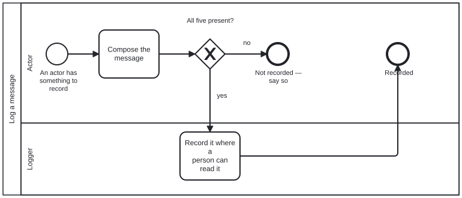

# bootstrap

This directory is where an agent starts when it has been handed a repository
and knows nothing else about it. Everything here is a file to read: text
(`.md`), data (`.json`) and diagrams (`.bpmn`). Nothing here is a program, so
you need nothing installed to use it.

A capitalized word on this page is a defined term. It links to its definition
the first time it appears, and `[src]` beside it opens the schema that defines
it. Every definition is drawn on one page,
[`schemas/README.md`](schemas/README.md), from one file,
[`schemas/graph.schema.json`](schemas/graph.schema.json).

**Contents**

1. [What you are setting up](#what-you-are-setting-up): what a repository becomes
2. [Who takes part](#who-takes-part): you, the person who asked, and the rest
3. [User story](#user-story): what you are here to do, in one sentence
4. [Steps](#steps): the six steps, drawn and then in order
5. [Functional Requirements](#functional-requirements): the eight rules the steps meet
6. [Every file here](#every-file-here): what each file is

---

## What you are setting up

A [Knowledge Graph](schemas/README.md#knowledge-graph) ([src](schemas/graph.schema.json#/$defs/KnowledgeGraph)) is
information kept as files in a repository: things, and the named relations
between them. One file at its root, `<name>.json`, declares it. That file
gives its name and lists its
[Subgraphs](schemas/README.md#subgraph) ([src](schemas/graph.schema.json#/$defs/Subgraph)), the named directories
it is divided into.

A [Harness](schemas/README.md#harness) ([src](schemas/graph.schema.json#/$defs/Harness)) is what you use to work
with a [Knowledge Graph](schemas/README.md#knowledge-graph). A [Harness](schemas/README.md#harness) is a [Knowledge Graph](schemas/README.md#knowledge-graph) too, declared the same
way. This directory is the first [Harness](schemas/README.md#harness), `bootstrap`, declared by
[`bootstrap.json`](bootstrap.json).

**Setting up a repository means instantiating one or more different kinds of
[Knowledge Graph](schemas/README.md#knowledge-graph) [Harness](schemas/README.md#harness) on the data in the repository.** A person chooses which
ones, and the choice is hard to undo.

---

## Who takes part

An [Actor](schemas/README.md#actor) ([src](schemas/graph.schema.json#/$defs/Actor)) is a person, an agent or a
program. Each [Actor](schemas/README.md#actor) takes a [Role](schemas/README.md#role) ([src](schemas/graph.schema.json#/$defs/Role)), and
the four [Roles](schemas/README.md#role) here are declared in [`scenarios/roles.json`](scenarios/roles.json):

| Role | who plays it |
|---|---|
| **Bootstrapping Agent** | you: the agent setting the repository up |
| **Requestor** | the person who asked for it. Only the Requestor chooses the [Harness](schemas/README.md#harness). |
| **Knowledge Graph Data Store** | a repository: the one being set up, and any a [Harness](schemas/README.md#harness) is read from |
| **Logger** | the record of what you did. Here, it is the conversation you are in. |

As the Bootstrapping Agent you have no [Harness](schemas/README.md#harness) yet, so you have no
tools (programs to call): a [Harness](schemas/README.md#harness) defines those, and bootstrap does not. If a step
seems to need one, it belongs to the [Harness](schemas/README.md#harness) you are about to set up, not to
this one.

---

## User story

> **As** the Bootstrapping Agent, **I want** to set up the repository I was handed as
> the [Harness](schemas/README.md#harness) the Requestor chooses, **so that** everything added to it later
> is built on the right [Harness](schemas/README.md#harness).

The story ends in one of two ways, and both are acceptable: the [Harness](schemas/README.md#harness) is set
up, or the reason it could not be is recorded.

---

## Steps

The steps are drawn as a
[Process](schemas/README.md#process) ([src](schemas/graph.schema.json#/$defs/Process)),
[`initialize-harness.bpmn`](processes/initialize-harness.bpmn). It is the only
[Process](schemas/README.md#process) you start. Each step names the
[Skill](schemas/README.md#skill) ([src](schemas/graph.schema.json#/$defs/Skill)) to read and the Functional
Requirement it must meet (see the next section).

```text
 1  Learn how to open files here
 |
 2  Find the candidates  --- ask --->  the Requestor chooses one Harness
 |
 3  Check each repository  --- already set up? --->  record it and stop
 |
 4  Record that you are starting
 |
 5  Follow the chosen Harness's own instructions
 |
 6  Leave a README at the repository's root, if it has none

    At any step: something cannot be found or read  --->  record it and stop
```

The same steps, and the [Processes](schemas/README.md#process) they start, as the diagrams themselves:

<!-- kg:processes:begin -->

**Determine the harness and repositories**: [`processes/discussion.bpmn`](processes/discussion.bpmn), the one you start.


**Initialize a harness**: [`processes/initialize-harness.bpmn`](processes/initialize-harness.bpmn), the one you start; it calls "Log a message".


**Log a message**: [`processes/log-message.bpmn`](processes/log-message.bpmn), started from "Initialize a harness".



<!-- kg:processes:end -->

1. **Learn how to open files here.** Read
   [`skills/bootstrap-kg-navigation.md`](skills/bootstrap-kg-navigation.md).
   Opening files is all you can do (Functional Requirement 1, FR-1).
2. **Find the candidates, and ask the Requestor to choose.** List the
   Harnesses the repository could become, and the repositories it could be
   set up in. Then ask the Requestor for one Harness and its repositories
   (FR-3). Read [`skills/confirm-harness.md`](skills/confirm-harness.md) for
   what to ask, and [`skills/discussion.md`](skills/discussion.md) for how.
   This step is done when the answer is written down as a document that
   matches [`schemas/discussion.output.schema.json`](schemas/discussion.output.schema.json).
3. **Check each repository.** If its root already holds a declaration,
   `<name>.json`, it is already set up, and you stop (FR-5).
4. **Record that you are starting.** Read
   [`skills/log-message.md`](skills/log-message.md).
5. **Follow the chosen Harness's own instructions.** Every Harness keeps them
   at the same path (FR-4):

   ```
   <name>/docs/bootstrap/initialization.md
   ```

   Here `<name>` is the name the Requestor chose, as it appears in that
   Harness's declaration, `<name>.json`.
6. **Leave a README at the repository's root, if it has none** (FR-8). Read
   [`skills/root-readme.md`](skills/root-readme.md).

If anything cannot be found or read along the way, record what failed (step
4's Skill) and stop (FR-6).

---

## Functional Requirements

A Functional Requirement is a rule the steps must meet. Each has a number, so
a step can name it: Functional Requirement 1 is FR-1.

| | rule |
|---|---|
| **FR-1** | Everything named here can be reached by opening files, and by nothing else. |
| **FR-2** | You start one Process, `initialize-harness`. The Processes `discussion` and `log-message` are started only by its steps. |
| **FR-3** | Only the Requestor chooses the Harness. You may shorten the list of candidates, but never choose between two. |
| **FR-4** | Every Harness keeps its set-up instructions at `<name>/docs/bootstrap/initialization.md`, so you can set up a Harness you have never seen. |
| **FR-5** | A repository whose root already holds a declaration is already set up. You record that and stop; you never set it up again. |
| **FR-6** | Anything that cannot be found or read is recorded, and stops the Process. Nothing is worked around. |
| **FR-7** | This directory holds no program code, so FR-1 stays true. |
| **FR-8** | When the set-up succeeds, the repository's root has a `README.md` naming the Harness and whether the set-up succeeded everywhere. An existing README is added to, never replaced. |

---

## Every file here

Grouped by directory, each described from the file itself. "Used by" names the
Process that reads a file, where a diagram says so.

<!-- kg:files:begin -->

**At the top**

| file | what it is | used by |
|---|---|---|
| [`AGENTS.md`](AGENTS.md) | Phase one of two. |  |
| [`README.md`](README.md) | The flow, with every term linked to the schema that defines it. |  |
| [`bootstrap.json`](bootstrap.json) | Bootstrap |  |

**[`skills/`](skills/README.md)**

| file | what it is | used by |
|---|---|---|
| [`bootstrap-graph-emission.md`](skills/bootstrap-graph-emission.md) | What bootstrap's own Knowledge Graph must be when it is written out as a data file, `.jsonld` with a `.json` copy. |  |
| [`bootstrap-graph-publication.md`](skills/bootstrap-graph-publication.md) | Where bootstrap's Knowledge Graph file is published, why its `@id` must be exactly that address, why a `.json` copy sits beside the `.jsonld`, and why the fi… |  |
| [`bootstrap-kg-navigation.md`](skills/bootstrap-kg-navigation.md) | Read and navigate a knowledge graph with nothing installed — no MCP server, no tools, no harness. | "Initialize a harness" |
| [`confirm-harness.md`](skills/confirm-harness.md) | Narrow the harnesses and locations this could be, then have the Requestor settle it. | "Initialize a harness" |
| [`discussion.md`](skills/discussion.md) | discussion — settling what an agent cannot read off disk |  |
| [`log-message.md`](skills/log-message.md) | Say what you are doing, to the Logger, in a form a reader can act on. | "Initialize a harness", "Log a message" |
| [`package-manifest.json`](skills/package-manifest.json) | What an agent reads before it knows whether this repository is an instance, what kind, or what for. |  |
| [`root-readme.md`](skills/root-readme.md) | Write the repository's root README when there is none, carrying a link to the harness that was installed and the overall install status. | "Initialize a harness" |

**[`schemas/`](schemas/README.md)**: The schemas bootstrap is checked against: `graph.schema.json`, the shape of a declaration and the definition of every term bootstrap uses; and the input and…

| file | what it is | used by |
|---|---|---|
| [`discussion.input.schema.json`](schemas/discussion.input.schema.json) | Discussion Input |  |
| [`discussion.output.schema.json`](schemas/discussion.output.schema.json) | Discussion Output |  |
| [`glossary-ledger.schema.json`](schemas/glossary-ledger.schema.json) | Glossary Ledger |  |
| [`graph.schema.json`](schemas/graph.schema.json) | Knowledge Graph declaration |  |
| [`model-registry.schema.json`](schemas/model-registry.schema.json) | Model Registry |  |
| [`requirement.schema.json`](schemas/requirement.schema.json) | Requirement |  |

**[`scenarios/`](scenarios/README.md)**: bootstrap's four Roles: Bootstrapping Agent, Requestor, Knowledge Graph Data Store and Logger.

| file | what it is | used by |
|---|---|---|
| [`roles.json`](scenarios/roles.json) | data |  |

**[`processes/`](processes/README.md)**: bootstrap's Processes: `initialize-harness.bpmn`, the only one an Actor starts; `discussion.bpmn`, which it calls to ask the Requestor; and `log-message.bpmn…

| file | what it is | used by |
|---|---|---|
| [`discussion.bpmn`](processes/discussion.bpmn) | a Process: Determine the harness and repositories |  |
| [`discussion.svg`](processes/discussion.svg) | the picture of `discussion.bpmn`, generated from it |  |
| [`initialize-harness.bpmn`](processes/initialize-harness.bpmn) | a Process: Initialize a harness |  |
| [`initialize-harness.svg`](processes/initialize-harness.svg) | the picture of `initialize-harness.bpmn`, generated from it |  |
| [`log-message.bpmn`](processes/log-message.bpmn) | a Process: Log a message | "Initialize a harness" |
| [`log-message.svg`](processes/log-message.svg) | the picture of `log-message.bpmn`, generated from it |  |
| [`ns.jsonld`](processes/ns.jsonld) | data |  |

**[`models/`](models/README.md)**: Which languages a model is good at, and whether anybody checked.

| file | what it is | used by |
|---|---|---|
| [`models.json`](models/models.json) | Which languages a model is good at, and whether anybody checked. |  |

**[`glossary/`](glossary/README.md)**: The swimlane glossary's retirement ledger.

| file | what it is | used by |
|---|---|---|
| [`glossary-ledger.json`](glossary/glossary-ledger.json) | data |  |

<!-- kg:files:end -->
