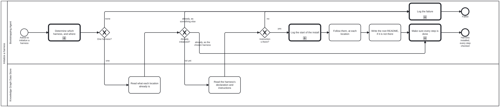
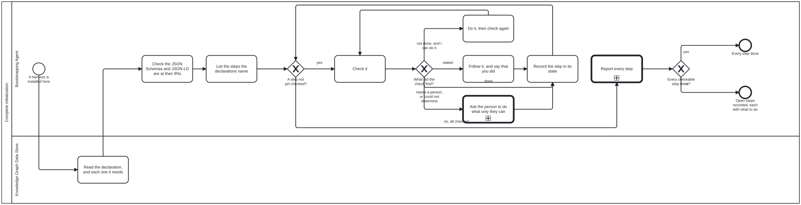
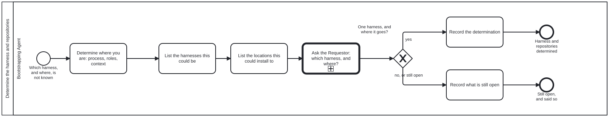
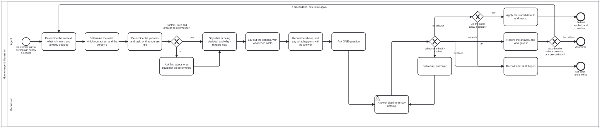

# bootstrap

This directory is where an agent starts when it has been handed a repository
and knows nothing else about it. Everything here is a file to read: text
(`.md`), data (`.json`) and diagrams (`.bpmn`). Nothing here is a program, so
you need nothing installed to use it.

A capitalized word on this page is a defined term. It links to its definition
the first time it appears, and `[src]` beside it opens the schema that defines
it. Every definition is drawn on one page,
[`schemas/README.md`](schemas/README.md), from one file,
[`schemas/graph.schema.json`](schemas/graph.schema.json).

**Contents**

<!-- kg:toc:begin -->

<!-- Generated by the bootstrap toolset (https://github.com/litlfred/bootstrap-tools, scripts/readme-sections.ts) from this README's own headings (section `kg:toc`) — do not edit; edit outside the markers, or change what it is generated from. -->
> *This section was generated by [bootstrap-tools](https://github.com/litlfred/bootstrap-tools) — [`scripts/readme-sections.ts`](https://github.com/litlfred/bootstrap-tools/blob/main/scripts/readme-sections.ts), from this README's own headings (section `kg:toc`). Do not edit it here; edit outside the markers, or change what it is generated from.*

- [What you are setting up](#what-you-are-setting-up)
- [Who takes part](#who-takes-part)
- [User story](#user-story)
- [Steps](#steps)
- [Functional Requirements](#functional-requirements)
- [Reading it on the web](#reading-it-on-the-web)
- [Every file here](#every-file-here)

<!-- kg:toc:end -->

---

## What you are setting up

A [Knowledge Graph](schemas/README.md#knowledge-graph) ([src](schemas/graph.schema.json#/$defs/KnowledgeGraph)) is
information kept as files in a repository: things, and the named relations
between them. One file at its root, `<name>.json`, declares it. That file
gives its name and lists its
[Subgraphs](schemas/README.md#subgraph) ([src](schemas/graph.schema.json#/$defs/Subgraph)), the named directories
it is divided into.

A [Harness](schemas/README.md#harness) ([src](schemas/graph.schema.json#/$defs/Harness)) is what you use to work
with a [Knowledge Graph](schemas/README.md#knowledge-graph). A [Harness](schemas/README.md#harness) is a [Knowledge Graph](schemas/README.md#knowledge-graph) too, declared the same
way. This directory is the first [Harness](schemas/README.md#harness), `bootstrap`, declared by
[`bootstrap.json`](bootstrap.json).

**Setting up a repository means instantiating one or more different kinds of
[Knowledge Graph](schemas/README.md#knowledge-graph) [Harness](schemas/README.md#harness) on the data in the repository.** A person chooses which
ones, and the choice is hard to undo.

---

## Who takes part

An [Actor](schemas/README.md#actor) ([src](schemas/graph.schema.json#/$defs/Actor)) is a person, an agent or a
program. Each [Actor](schemas/README.md#actor) takes a [Role](schemas/README.md#role) ([src](schemas/graph.schema.json#/$defs/Role)), and
the four [Roles](schemas/README.md#role) here are declared in [`scenarios/roles.json`](scenarios/roles.json):

| Role | who plays it |
|---|---|
| **Bootstrapping Agent** | you: the agent setting the repository up |
| **Requestor** | the person who asked for it. Only the Requestor chooses the [Harness](schemas/README.md#harness). |
| **Knowledge Graph Data Store** | a repository: the one being set up, and any a [Harness](schemas/README.md#harness) is read from |
| **Logger** | the record of what you did. Here, it is the conversation you are in. |

The same four, as [`scenarios/roles.json`](scenarios/roles.json) defines them, with every
name each goes by: other names in use today, and former names with the day each
was retired, so a name met in older text still leads to the right one.

<!-- kg:roles:begin -->

<!-- Generated by the bootstrap toolset (https://github.com/litlfred/bootstrap-tools, scripts/readme-sections.ts) from the Roles the instance declares (section `kg:roles`) — do not edit; edit outside the markers, or change what it is generated from. -->
> *This section was generated by [bootstrap-tools](https://github.com/litlfred/bootstrap-tools) — [`scripts/readme-sections.ts`](https://github.com/litlfred/bootstrap-tools/blob/main/scripts/readme-sections.ts), from the Roles the instance declares (section `kg:roles`). Do not edit it here; edit outside the markers, or change what it is generated from.*

| Role | what it is | also called | formerly |
|---|---|---|---|
| **Bootstrapping Agent** | An agent asked to set up a [Harness](schemas/README.md#harness) with ONLY the knowledge bootstrap's README.md hands it. |  | Initiator (until 2026-09-23) |
| **Knowledge Graph Data Store** | A git repository, reached either through the git CLI or through a forge's API. |  |  |
| **Requestor** | Wants to initialize — or bootstrap, or install, or load, or harness — a harness: bootstrap itself, or any [Harness](schemas/README.md#harness) built on it. |  |  |
| **Logger** | A machine that accepts log messages and puts them somewhere a person can read. |  |  |

<!-- kg:roles:end -->

As the Bootstrapping Agent you have no [Harness](schemas/README.md#harness) yet, so you have no
tools (programs to call): a [Harness](schemas/README.md#harness) defines those, and bootstrap does not. If a step
seems to need one, it belongs to the [Harness](schemas/README.md#harness) you are about to set up, not to
this one.

---

## User story

> **As** the Bootstrapping Agent, **I want** to set up the repository I was handed as
> the [Harness](schemas/README.md#harness) the Requestor chooses, **so that** everything added to it later
> is built on the right [Harness](schemas/README.md#harness).

The story ends in one of two ways, and both are acceptable: the [Harness](schemas/README.md#harness) is set
up, or the reason it could not be is recorded.

---

## Steps

The steps are drawn as a
[Process](schemas/README.md#process) ([src](schemas/graph.schema.json#/$defs/Process)),
[`initialize-harness.bpmn`](processes/initialize-harness.bpmn). It is the only
[Process](schemas/README.md#process) you start; every other one is called from a step. Each step names the
[Skill](schemas/README.md#skill) ([src](schemas/graph.schema.json#/$defs/Skill)) to read and the Functional
Requirement it must meet (see the next section).

```text
 1  Learn how to open files here
 |
 2  Determine the Harness and repositories  --- ask --->  the Requestor chooses one Harness
 |
 3  Check each repository  --- already this Harness? --->  go to 7
 |                         --- already another one? --->  record it and stop
 4  Record that you are starting
 |
 5  Follow the chosen Harness's own instructions
 |
 6  Leave a README at the repository's root, if it has none
 |
 7  Make sure every step the declarations name is done  --- only a person can? ---> ask
      first: the JSON Schemas and JSON-LD at the IRIs they name
 |
    Harness installed, every step reported: done, not done, could not determine, or stated

    At any step: something cannot be found or read  --->  record it and stop
    Whenever a person must decide or act  --->  the one human-agent discussion
      (first: say which process, as which role, in what context;
       what you cannot say is the first thing you ask)
```

The same steps, and the [Processes](schemas/README.md#process) they start, as the diagrams themselves:

<!-- kg:processes:begin -->

<!-- Generated by the bootstrap toolset (https://github.com/litlfred/bootstrap-tools, scripts/readme-sections.ts) from the Process diagrams the declaration lists (section `kg:processes`) — do not edit; edit outside the markers, or change what it is generated from. -->
> *This section was generated by [bootstrap-tools](https://github.com/litlfred/bootstrap-tools) — [`scripts/readme-sections.ts`](https://github.com/litlfred/bootstrap-tools/blob/main/scripts/readme-sections.ts), from the Process diagrams the declaration lists (section `kg:processes`). Do not edit it here; edit outside the markers, or change what it is generated from.*

**Initialize a harness**: [`processes/initialize-harness.bpmn`](processes/initialize-harness.bpmn), the one you start; it calls "Determine the harness and repositories", "Log a message" and "Complete initialization".



**Complete initialization**: [`processes/complete-initialization.bpmn`](processes/complete-initialization.bpmn), started from "Initialize a harness"; it calls "Human–agent discussion" and "Log a message".



**Determine the harness and repositories**: [`processes/discussion.bpmn`](processes/discussion.bpmn), started from "Initialize a harness"; it calls "Human–agent discussion".



**Human–agent discussion**: [`processes/human-agent-discussion.bpmn`](processes/human-agent-discussion.bpmn), a reusable sub-process, started from "Complete initialization" and "Determine the harness and repositories".



**Log a message**: [`processes/log-message.bpmn`](processes/log-message.bpmn), a reusable sub-process, started from "Complete initialization" and "Initialize a harness".


<!-- kg:processes:end -->

1. **Learn how to open files here.** Read
   [`skills/bootstrap-kg-navigation.md`](skills/bootstrap-kg-navigation.md).
   Opening files is all you can do (Functional Requirement 1, FR-1).
2. **Determine the Harness and repositories.** List the
   Harnesses the repository could become, and the repositories it could be
   set up in. Then ask the Requestor for one Harness and its repositories
   (FR-3), through the one reusable discussion (FR-9). Read
   [`skills/confirm-harness.md`](skills/confirm-harness.md) for what to ask,
   and [`skills/human-agent-discussion.md`](skills/human-agent-discussion.md)
   for how.
   This step is done when the answer is written down as a document that
   matches [`schemas/discussion.output.schema.json`](schemas/discussion.output.schema.json).
3. **Check each repository.** If its root already holds a declaration,
   `<name>.json`, it is already set up (FR-5). If it is the Harness the
   Requestor chose, go straight to step 7; if it is another, record that and
   stop.
4. **Record that you are starting.** Read
   [`skills/log-message.md`](skills/log-message.md).
5. **Follow the chosen Harness's own instructions.** Every Harness keeps them
   at the same path (FR-4):

   ```
   <name>/docs/bootstrap/initialization.md
   ```

   Here `<name>` is the name the Requestor chose, as it appears in that
   Harness's declaration, `<name>.json`.
6. **Leave a README at the repository's root, if it has none** (FR-8). Read
   [`skills/root-readme.md`](skills/root-readme.md).
7. **Make sure every step is done** (FR-10). The steps are the ones the
   declarations name. **First, and primary: the Harness's JSON Schemas and
   JSON-LD documents are published at the IRIs they name** (FR-11; read
   [`skills/publish-documents.md`](skills/publish-documents.md)). Then the
   declared directories and files, the README and the sections it opts
   into, each needed Harness's own instructions, and the site on GitHub
   Pages, which is how the documents get to their addresses. Check each one before doing anything, do what you
   can, and ask the person for what only they can do. Read
   [`skills/initialization-steps.md`](skills/initialization-steps.md) and,
   for the site, [`skills/publish-site.md`](skills/publish-site.md). Where
   a toolset that reads these declarations is available, it may perform the same checks.

If anything cannot be found or read along the way, record what failed (step
4's Skill) and stop (FR-6).

---

## Functional Requirements

A Functional Requirement is a rule the steps must meet. Each has a number, so
a step can name it: Functional Requirement 1 is FR-1.

| | rule |
|---|---|
| **FR-1** | Everything named here can be reached by opening files, and by nothing else. |
| **FR-2** | You start one Process, `initialize-harness`. The Processes `discussion`, `human-agent-discussion`, `complete-initialization` and `log-message` are started only by steps of another Process. |
| **FR-3** | Only the Requestor chooses the Harness. You may shorten the list of candidates, but never choose between two. |
| **FR-4** | Every Harness keeps its set-up instructions at `<name>/docs/bootstrap/initialization.md`, so you can set up a Harness you have never seen. |
| **FR-5** | A repository whose root already holds a declaration is already set up. You never set it up again: if it is the chosen Harness, you only check its steps (FR-10); if it is another, you record that and stop. |
| **FR-6** | Anything that cannot be found or read is recorded, and stops the Process. Nothing is worked around. |
| **FR-7** | This directory holds no program code, so FR-1 stays true. |
| **FR-8** | When the set-up succeeds, the repository's root has a `README.md` naming the Harness and whether the set-up succeeded everywhere. An existing README is added to, never replaced. |
| **FR-9** | Whenever a step needs a person to decide or to act, it calls `human-agent-discussion`. Before any question the asker determines where it is — the context, the Role it acts as and the person's, the Process and task (or that it is idle) — and asks first about whichever it cannot determine. Then: context, options, a recommendation and what happens with no answer, then one question. A default applies only where the calling step allows one, and never to where the asker is. |
| **FR-10** | Every initialization step the declarations name is checked before anything is done, and reported as done, not done, could not determine, or stated. "Could not determine" is never reported as done, and nothing somebody wrote is replaced. |
| **FR-11** | A Knowledge Graph Harness's JSON Schemas and JSON-LD documents (its vocabulary, its diagram vocabulary, its graph, each with its `@context`) are published at the IRIs they name. It is the primary initialization step: checked first after the declarations are read, and first in the report. A site is how they get there, not the goal. |

---

## Reading it on the web

Every README here, the root's first and then each directory's, is also one
page with a table of contents at
`https://litlfred.github.io/bootstrap/README.html`, beside every file as it
sits here; the site's root address redirects to it. The page is built by a
separate toolset, from these files, and published from outside this
repository: nothing here builds or publishes it, and no step in this README
needs it (FR-7). The site is also the first repository to go through its own
step 7: [`skills/publish-site.md`](skills/publish-site.md).

---

## Every file here

Grouped by directory, each described from the file itself. "Used by" names the
Process that reads a file, where a diagram says so.

<!-- kg:files:begin -->

<!-- Generated by the bootstrap toolset (https://github.com/litlfred/bootstrap-tools, scripts/readme-sections.ts) from the declared directories and each file in them (section `kg:files`) — do not edit; edit outside the markers, or change what it is generated from. -->
> *This section was generated by [bootstrap-tools](https://github.com/litlfred/bootstrap-tools) — [`scripts/readme-sections.ts`](https://github.com/litlfred/bootstrap-tools/blob/main/scripts/readme-sections.ts), from the declared directories and each file in them (section `kg:files`). Do not edit it here; edit outside the markers, or change what it is generated from.*

**At the top**

| file | what it is | used by |
|---|---|---|
| [`AGENTS.md`](AGENTS.md) | Phase one of two. |  |
| [`README.md`](README.md) | The flow, with every term linked to the schema that defines it. |  |
| [`ns.jsonld`](ns.jsonld) | Every term bootstrap defines, in order, and every Graph Typology it defines, as RDF and SKOS — the document bootstrap's namespace resolves to. |  |
| [`bootstrap.json`](bootstrap.json) | Bootstrap |  |

**[`skills/`](skills/README.md)**

| file | what it is | used by |
|---|---|---|
| [`bootstrap-graph-emission.md`](skills/bootstrap-graph-emission.md) | What bootstrap's own Knowledge Graph must be when it is written out as a data file, `.jsonld` with a `.json` copy. |  |
| [`bootstrap-graph-publication.md`](skills/bootstrap-graph-publication.md) | Where bootstrap's Knowledge Graph file is published, why its `@id` must be exactly that address, why a `.json` copy sits beside the `.jsonld`, and why the fi… |  |
| [`bootstrap-kg-navigation.md`](skills/bootstrap-kg-navigation.md) | Read and navigate a knowledge graph with nothing installed — no MCP server, no tools, no harness. | "Complete initialization", "Initialize a harness" |
| [`confirm-harness.md`](skills/confirm-harness.md) | Narrow the harnesses and locations this could be, then have the Requestor settle it. | "Determine the harness and repositories", "Initialize a harness" |
| [`discussion.md`](skills/discussion.md) | discussion — settling what an agent cannot read off disk |  |
| [`human-agent-discussion.md`](skills/human-agent-discussion.md) | Ask a person (or a sibling agent) for what no file holds. | "Complete initialization", "Determine the harness and repositories", "Human–agent discussion" |
| [`initialization-steps.md`](skills/initialization-steps.md) | Walk every initialization step the declarations name (the instance's own and each one it needs), check each before doing anything, do what can be done, ask f… | "Complete initialization", "Initialize a harness" |
| [`log-message.md`](skills/log-message.md) | Say what you are doing, to the Logger, in a form a reader can act on. | "Complete initialization", "Initialize a harness", "Log a message" |
| [`package-manifest.json`](skills/package-manifest.json) | What an agent reads before it knows whether this repository is an instance, what kind, or what for. |  |
| [`publish-documents.md`](skills/publish-documents.md) | The primary step of initializing a Knowledge Graph harness: every JSON Schema and JSON-LD document it names an address for (schemas, vocabulary, diagram voca… | "Complete initialization" |
| [`publish-site.md`](skills/publish-site.md) | Give an instance a site: its Knowledge Graph rendered for publication at its site address, and the address answering. | "Complete initialization" |
| [`root-readme.md`](skills/root-readme.md) | Write the repository's root README when there is none, carrying a link to the harness that was installed and the overall install status. | "Initialize a harness" |

**[`schemas/`](schemas/README.md)**: The schemas bootstrap is checked against: `graph.schema.json`, the shape of a declaration and the definition of every term bootstrap uses; and the input and…

| file | what it is | used by |
|---|---|---|
| [`discussion.input.schema.json`](schemas/discussion.input.schema.json) | Discussion Input |  |
| [`discussion.output.schema.json`](schemas/discussion.output.schema.json) | Discussion Output |  |
| [`graph.schema.json`](schemas/graph.schema.json) | Knowledge Graph declaration |  |
| [`model-registry.schema.json`](schemas/model-registry.schema.json) | Model Registry |  |
| [`requirement-set.schema.json`](schemas/requirement-set.schema.json) | Requirement Set |  |
| [`requirement.schema.json`](schemas/requirement.schema.json) | Requirement |  |

**[`scenarios/`](scenarios/README.md)**: bootstrap's four Roles: Bootstrapping Agent, Requestor, Knowledge Graph Data Store and Logger.

| file | what it is | used by |
|---|---|---|
| [`roles.json`](scenarios/roles.json) | data |  |

**[`processes/`](processes/README.md)**: bootstrap's Processes: `initialize-harness.bpmn`, the only one an Actor starts; `discussion.bpmn`, which it calls to determine the harness and repositories;…

| file | what it is | used by |
|---|---|---|
| [`complete-initialization.bpmn`](processes/complete-initialization.bpmn) | a Process: Complete initialization | "Initialize a harness" |
| [`complete-initialization.svg`](processes/complete-initialization.svg) | the picture of `complete-initialization.bpmn`, generated from it |  |
| [`discussion.bpmn`](processes/discussion.bpmn) | a Process: Determine the harness and repositories | "Initialize a harness" |
| [`discussion.svg`](processes/discussion.svg) | the picture of `discussion.bpmn`, generated from it |  |
| [`human-agent-discussion.bpmn`](processes/human-agent-discussion.bpmn) | a Process: Human–agent discussion | "Complete initialization", "Determine the harness and repositories" |
| [`human-agent-discussion.svg`](processes/human-agent-discussion.svg) | the picture of `human-agent-discussion.bpmn`, generated from it |  |
| [`initialize-harness.bpmn`](processes/initialize-harness.bpmn) | a Process: Initialize a harness |  |
| [`initialize-harness.svg`](processes/initialize-harness.svg) | the picture of `initialize-harness.bpmn`, generated from it |  |
| [`log-message.bpmn`](processes/log-message.bpmn) | a Process: Log a message | "Complete initialization", "Initialize a harness" |
| [`log-message.svg`](processes/log-message.svg) | the picture of `log-message.bpmn`, generated from it |  |
| [`ns.jsonld`](processes/ns.jsonld) | bootstrap's diagram elements |  |

**[`models/`](models/README.md)**: Which languages a model is good at, and whether anybody checked.

| file | what it is | used by |
|---|---|---|
| [`models.json`](models/models.json) | Which languages a model is good at, and whether anybody checked. |  |

<!-- kg:files:end -->
