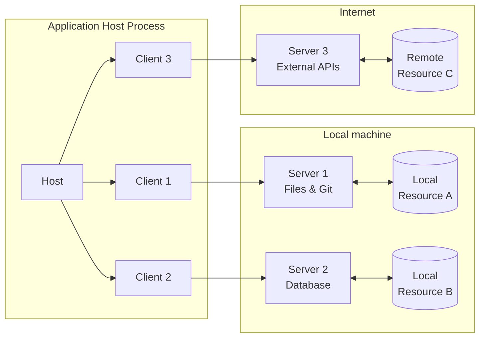

## Core Components

```mermaid
graph LR
    subgraph "Application Host Process"
        H[Host]
        C1[Client 1]
        C2[Client 2]
        C3[Client 3]
        H --> C1
        H --> C2
        H --> C3
    end

    subgraph "Local machine"
        S1[Server 1<br>Files & Git]
        S2[Server 2<br>Database]
        R1[("Local<br>Resource A")]
        R2[("Local<br>Resource B")]

        C1 --> S1
        C2 --> S2
        S1 <--> R1
        S2 <--> R2
    end

    subgraph "Internet"
        S3[Server 3<br>External APIs]
        R3[("Remote<br>Resource C")]

        C3 --> S3
        S3 <--> R3
    end
```
