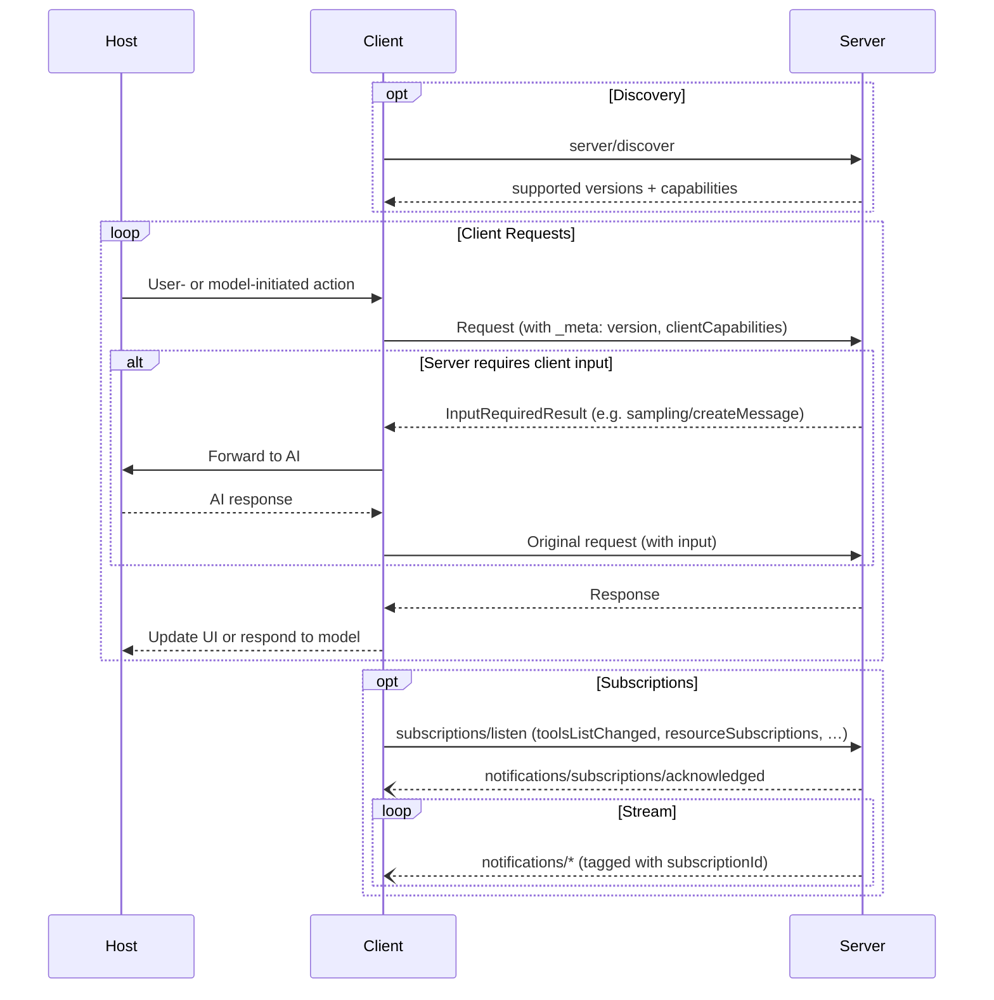

## Capability Negotiation

The Model Context Protocol uses a capability-based negotiation system where clients and
servers declare their supported features on each request. Clients include their
capabilities in `_meta.io.modelcontextprotocol/clientCapabilities` on every request.
Servers advertise their capabilities in response to
[`server/discover`](/specification/2026-07-28/server/discover), which clients may call before
any other request for up-front capability discovery.

- Servers declare capabilities like tool support, resource subscriptions, and prompt
  templates
- Clients declare capabilities like sampling support and elicitation handling
- Both parties must respect declared capabilities throughout the interaction
- Additional capabilities can be negotiated through extensions to the protocol

Each capability unlocks specific protocol features on a per-request basis. For example:

- Implemented [server features](/specification/2026-07-28/server) must be advertised in the
  server's capabilities
- Receiving resource update notifications requires opening a
  [`subscriptions/listen`](/specification/2026-07-28/basic/patterns/subscriptions) stream
  with the desired resource URIs
- [Tool](/specification/2026-07-28/server/tools) invocation requires the server to declare tool capabilities

This capability negotiation ensures clients and servers have a clear understanding of
supported functionality while maintaining protocol extensibility.
