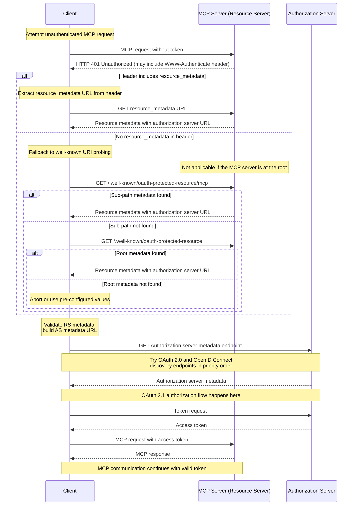

## Sequence Diagram

The following diagram outlines an example flow:

```mermaid
sequenceDiagram
    participant C as Client
    participant M as MCP Server (Resource Server)
    participant A as Authorization Server

    Note over C: Attempt unauthenticated MCP request
    C->>M: MCP request without token
    M-->>C: HTTP 401 Unauthorized (may include WWW-Authenticate header)

    alt Header includes resource_metadata
        Note over C: Extract resource_metadata URL from header
        C->>M: GET resource_metadata URI
        M-->>C: Resource metadata with authorization server URL
    else No resource_metadata in header
        Note over C: Fallback to well-known URI probing
        Note over M: _Not applicable if the MCP server is at the root_
        C->>M: GET /.well-known/oauth-protected-resource/mcp
        alt Sub-path metadata found
            M-->>C: Resource metadata with authorization server URL
        else Sub-path not found
            C->>M: GET /.well-known/oauth-protected-resource
            alt Root metadata found
                M-->>C: Resource metadata with authorization server URL
            else Root metadata not found
                Note over C: Abort or use pre-configured values
            end
        end
    end

    Note over C: Validate RS metadata,<br />build AS metadata URL

    C->>A: GET Authorization server metadata endpoint
    Note over C,A: Try OAuth 2.0 and OpenID Connect<br/>discovery endpoints in priority order
    A-->>C: Authorization server metadata

    Note over C,A: OAuth 2.1 authorization flow happens here

    C->>A: Token request
    A-->>C: Access token

    C->>M: MCP request with access token
    M-->>C: MCP response
    Note over C,M: MCP communication continues with valid token
```
