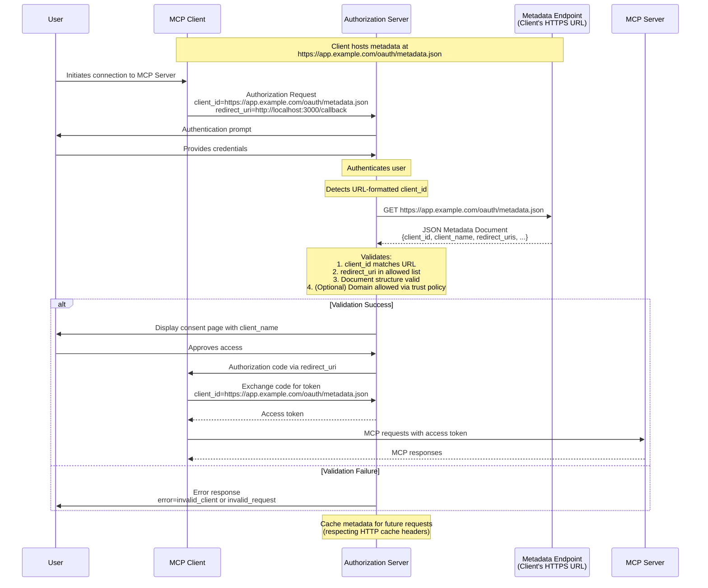

### Client ID Metadata Documents Flow

The following diagram illustrates the complete flow when using Client ID Metadata Documents:

```mermaid
sequenceDiagram
    participant User
    participant Client as MCP Client
    participant Server as Authorization Server
    participant Metadata as Metadata Endpoint<br/>(Client's HTTPS URL)
    participant Resource as MCP Server

    Note over Client,Metadata: Client hosts metadata at<br/>https://app.example.com/oauth/metadata.json

    User->>Client: Initiates connection to MCP Server
    Client->>Server: Authorization Request<br/>client_id=https://app.example.com/oauth/metadata.json<br/>redirect_uri=http://localhost:3000/callback

    Server->>User: Authentication prompt
    User->>Server: Provides credentials
    Note over Server: Authenticates user

    Note over Server: Detects URL-formatted client_id

    Server->>Metadata: GET https://app.example.com/oauth/metadata.json
    Metadata-->>Server: JSON Metadata Document<br/>{client_id, client_name, redirect_uris, ...}

    Note over Server: Validates:<br/>1. client_id matches URL<br/>2. redirect_uri in allowed list<br/>3. Document structure valid<br/>4. (Optional) Domain allowed via trust policy

    alt Validation Success
        Server->>User: Display consent page with client_name
        User->>Server: Approves access
        Server->>Client: Authorization code via redirect_uri
        Client->>Server: Exchange code for token<br/>client_id=https://app.example.com/oauth/metadata.json
        Server-->>Client: Access token
        Client->>Resource: MCP requests with access token
        Resource-->>Client: MCP responses
    else Validation Failure
        Server->>User: Error response<br/>error=invalid_client or invalid_request
    end

    Note over Server: Cache metadata for future requests<br/>(respecting HTTP cache headers)
```
