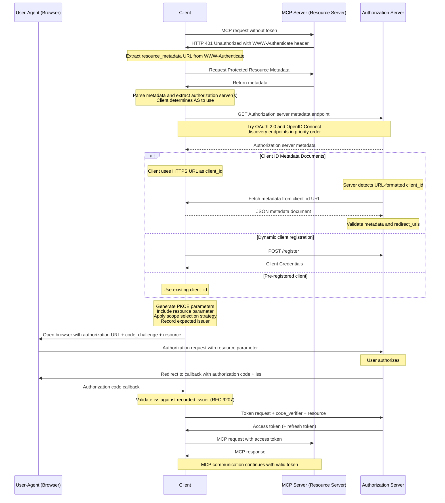

## Authorization Flow Steps

The registration step shown in the flow uses one of the mechanisms defined in
[Client Registration](/specification/2026-07-28/basic/authorization/client-registration).

The complete Authorization flow proceeds as follows:

