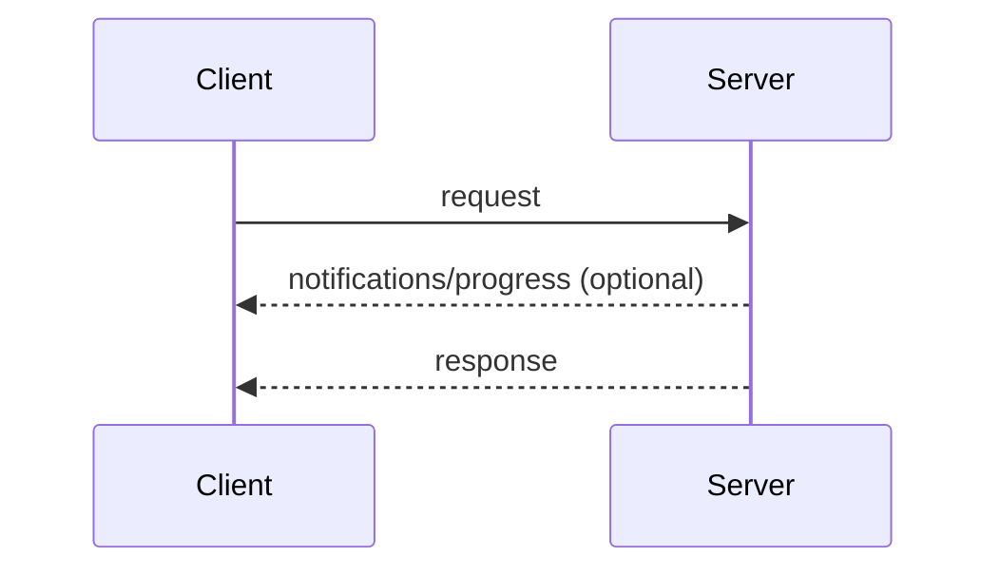

## Request and Response

The client sends a request; the server answers it with a result or an error.
While the request is in flight, the server **MAY** send notifications scoped
to it, such as
[`notifications/progress`](/specification/2026-07-28/basic/patterns/progress)
and [`notifications/message`](/specification/2026-07-28/server/utilities/logging).

