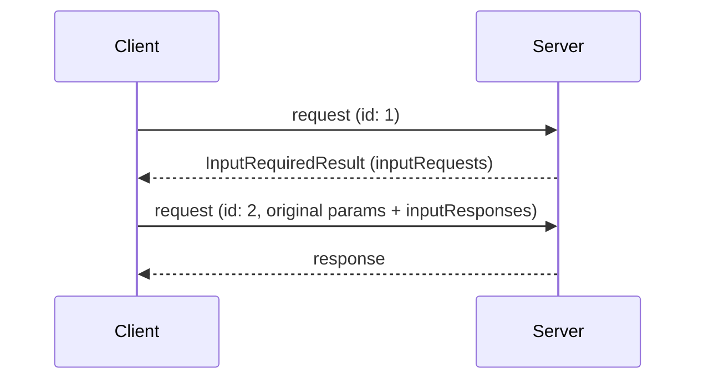

## Multi Round-Trip Requests

When a server needs client input (sampling, elicitation, or roots) to
complete a request, it answers with an
[`InputRequiredResult`](/specification/2026-07-28/basic/patterns/mrtr#inputrequiredresult)
and the client retries the request with the matching `inputResponses`. See
[Multi Round-Trip Requests](/specification/2026-07-28/basic/patterns/mrtr).

