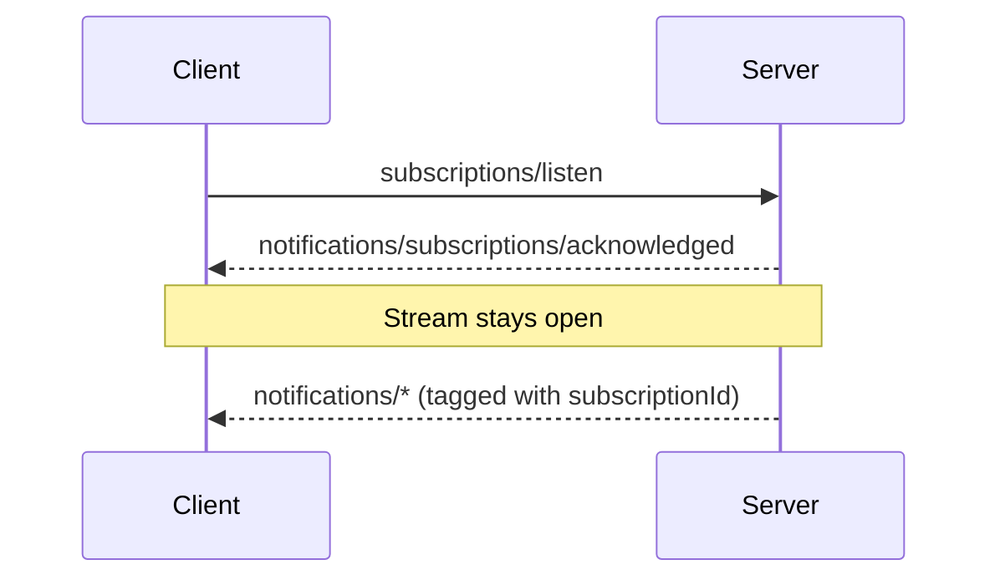

## Subscribe and Notify

To receive change notifications (list changes, resource updates), the client
sends a
[`subscriptions/listen`](/specification/2026-07-28/basic/patterns/subscriptions)
request; the reply is a long-lived stream of the requested notification
types. Stream state is scoped to the request: if the underlying channel is
lost, the client re-issues the request.

