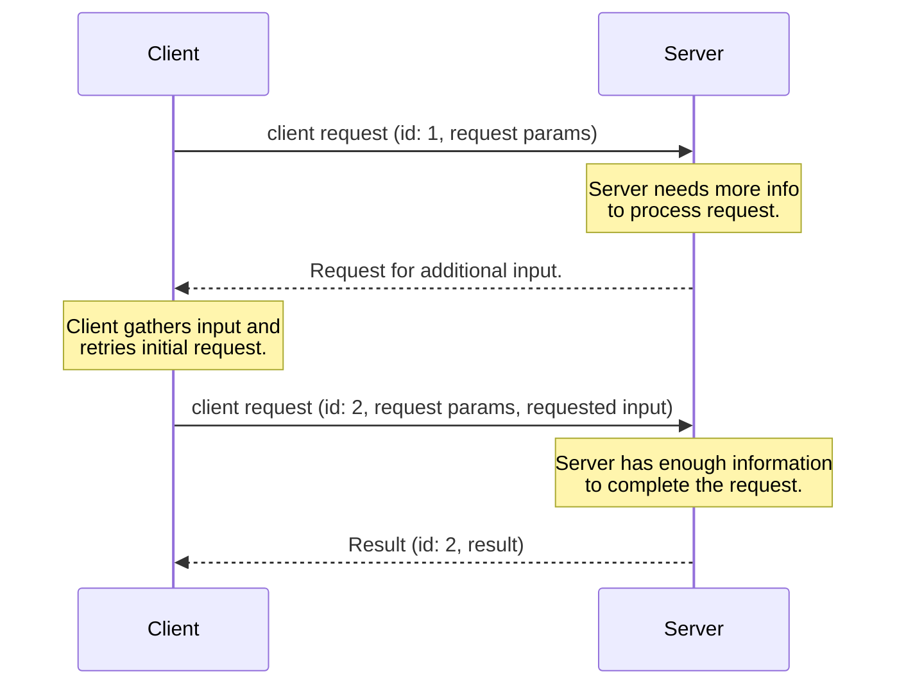

## Multi Round-Trip Requests

The Model Context Protocol (MCP) defines several ways for servers to request additional information
from users during the processing of client requests (such as
`roots/list`, `sampling/createMessage`, or `elicitation/create`). The **multi round-trip requests** pattern
provides a standardized way to handle these server-requests without requiring a shared storage layer across
server instances or requiring stateful load balancing.

The high level flow functions as follows:

1. Client sends an initial request to the server with the parameters needed to perform the operation.
1. Server determines that additional information is required to fulfill the request and responds requesting more information.
1. Client gathers the requested information from the user or other sources, then retries the original request including the additional requested information.
1. Server determines it has sufficient information to complete the operation, and responds with the final result.

