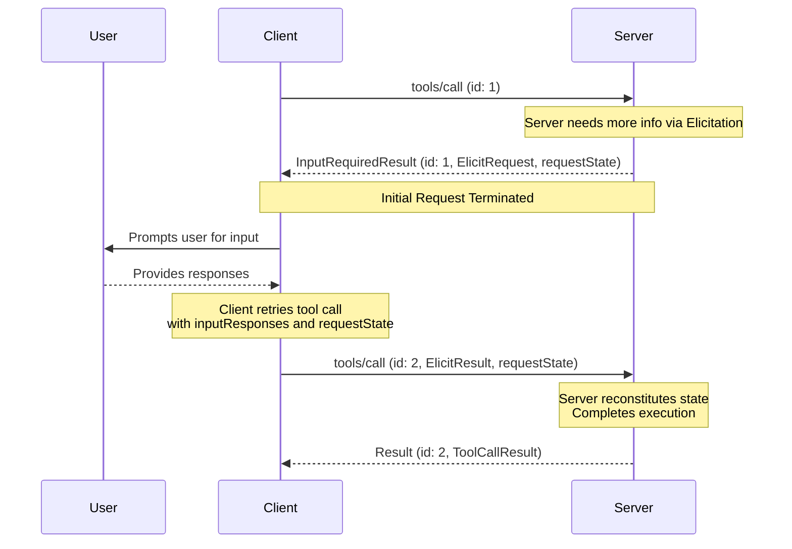

### Basic Workflow

The basic workflow describes how a server can request additional input from the client as part of a client-server request.
In this example we use `tools/call` as the client request, but the same pattern applies to any of the supported requests listed above.

Notably, it allows servers to request additional information without maintaining any server-side state.
The server encodes any needed context into the `requestState` field, which the client echoes back on retry.

Note that the requests in each step are completely independent: the server processing the retry does not need any information beyond
what is directly present in the retry request.
