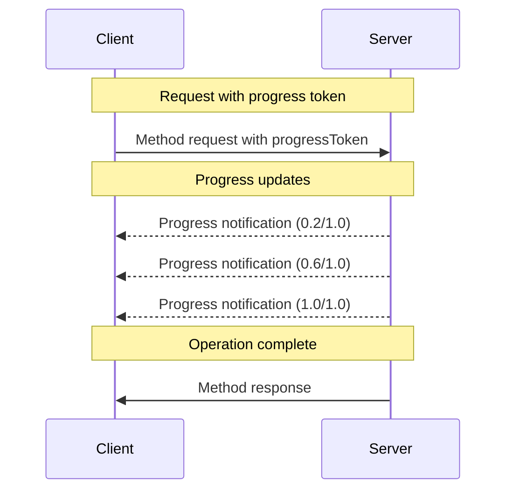

## Behavior Requirements

1. Progress notifications **MUST** only reference tokens that:
   - Were provided in an active request
   - Are associated with an in-progress operation

2. Servers receiving a request with a progress token **MAY**:
   - Choose not to send any progress notifications
   - Send notifications at whatever frequency they deem appropriate
   - Omit the total value if unknown

