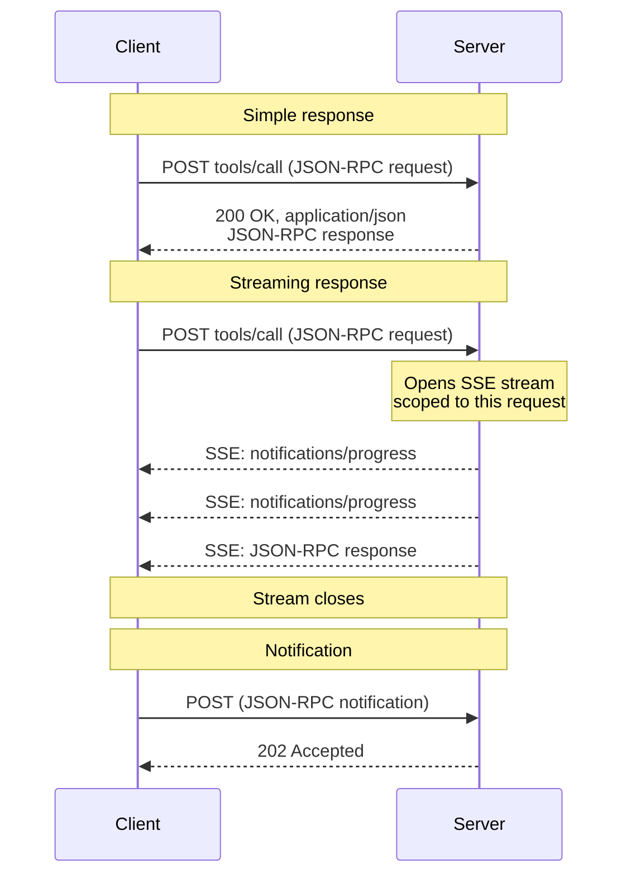
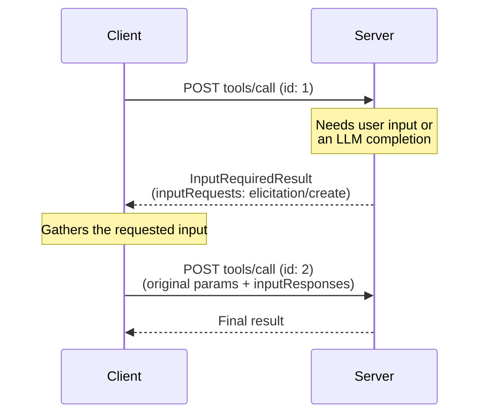
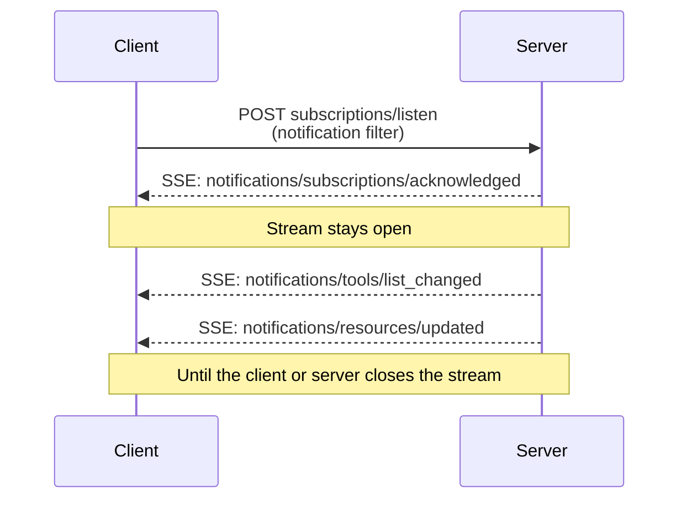

## Message Flow

The following diagrams illustrate the message flows on a single MCP endpoint.

**Requests and responses.** Each request is its own POST; the server chooses
per request whether to respond with a single JSON object or an SSE stream:

**Server-to-client interactions (MRTR).** When the server needs input from
the client — sampling, elicitation, or roots — it does not send its own
JSON-RPC request. It returns an
[`InputRequiredResult`][input-required-result] containing `inputRequests`,
and the client retries the original request with the matching
`inputResponses` (see [Multi Round-Trip Requests][mrtr]):

**Change notifications.** Clients that want server-initiated change
notifications open a long-lived stream with
[`subscriptions/listen`][subscriptions-listen]; the response stream stays
open and carries only the notification types the client opted in to:

