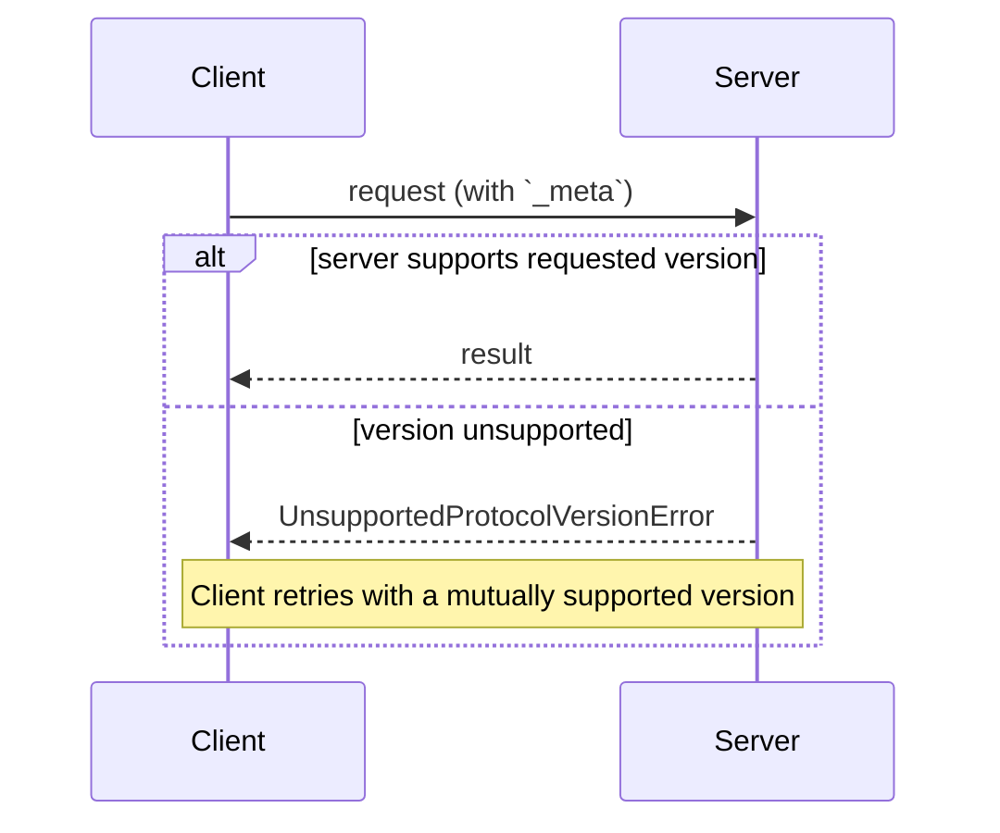

---
title: Versioning and Compatibility
---

This page defines how a client and server agree on what they are speaking:
the protocol version, declared on every request; optional extensions,
negotiated through capabilities; and interoperability with earlier,
handshake-based protocol revisions.

There is no negotiation handshake. Every request carries its protocol
version, and the server accepts or rejects each request independently:

