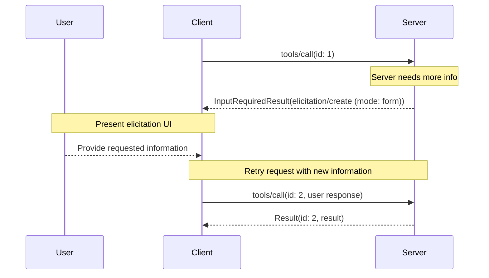

### Form Mode Flow

```mermaid
sequenceDiagram
    participant User
    participant Client
    participant Server

    Client->>Server: tools/call(id: 1)
    note over Server: Server needs more info
    Server-->>Client: InputRequiredResult(elicitation/create (mode: form))

    Note over User,Client: Present elicitation UI
    User-->>Client: Provide requested information

    Note over Server,Client: Retry request with new information
    Client->>Server: tools/call(id: 2, user response)
    Server-->>Client: Result(id: 2, result)
```
