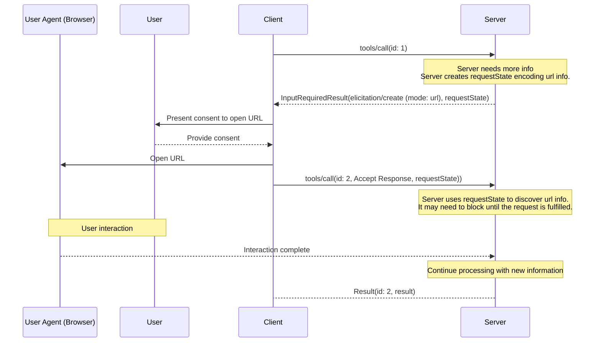

### URL Mode Flow

```mermaid
sequenceDiagram
    participant UserAgent as User Agent (Browser)
    participant User
    participant Client
    participant Server

    Client->>Server: tools/call(id: 1)
    Note over Server: Server needs more info <br/> Server creates requestState encoding url info.
    Server-->>Client: InputRequiredResult(elicitation/create (mode: url), requestState)

    Client->>User: Present consent to open URL
    User-->>Client: Provide consent

    Client->>UserAgent: Open URL
    Client->>Server: tools/call(id: 2, Accept Response, requestState))
    Note over Server: Server uses requestState to discover url info. <br/> It may need to block until the request is fulfilled.

    Note over User,UserAgent: User interaction
    UserAgent-->>Server: Interaction complete

    Note over Server: Continue processing with new information
    Server-->Client: Result(id: 2, result)
```
