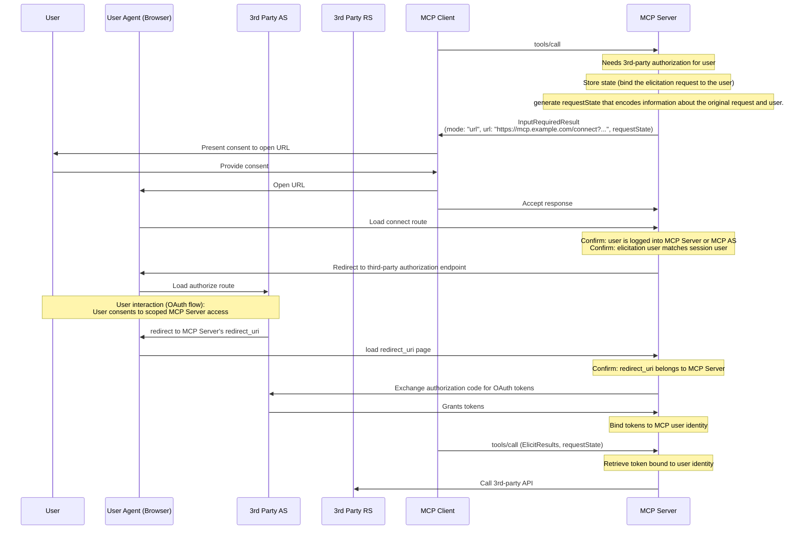

#### Implementation Pattern

When implementing external authorization via URL mode elicitation:

1. The MCP server generates an authorization URL, acting as an OAuth client to the third-party service
2. The MCP server stores internal state that associates (binds) the elicitation request with the user's identity.
3. The MCP server sends a URL mode elicitation request to the client with a URL that can start the authorization flow and an optional `requestState` that encodes information about the elicitation request and user (if needed).
4. The user completes the OAuth flow directly with the third-party authorization server
5. The third-party authorization server redirects back to the MCP server
6. The MCP server securely stores the third-party tokens, bound to the user's identity
7. Future MCP requests can leverage these stored tokens for API access to the third-party resource server

The following is a non-normative example of how this pattern could be implemented:

This pattern maintains clear security boundaries while enabling rich integrations with third-party services that require user authorization.
