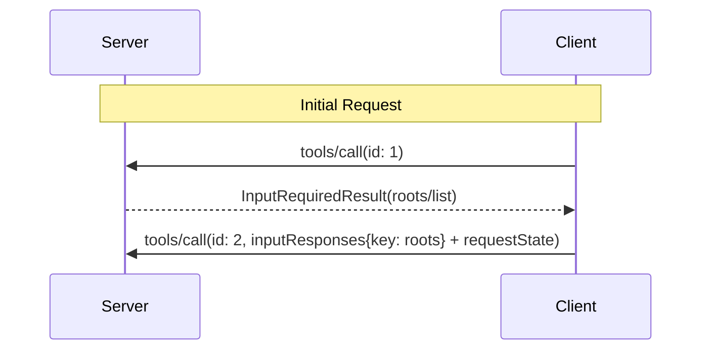

## Message Flow

```mermaid
sequenceDiagram
    participant Server
    participant Client

    Note over Server,Client: Initial Request
    Client->>Server: tools/call(id: 1)
    Server-->>Client: InputRequiredResult(roots/list)
    Client->>Server: tools/call(id: 2, inputResponses{key: roots} + requestState)
```
