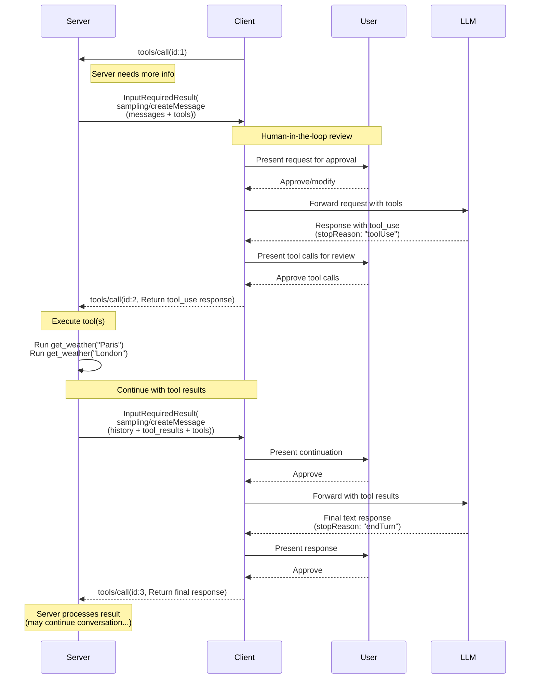

### Sampling with Tools

The following diagram illustrates the complete flow of sampling with tools, including the multi-turn tool loop:



To request LLM generation with tool use capabilities, servers include `tools` and optionally `toolChoice` in the request:

**Input request (Server -> Client, delivered inside `InputRequiredResult.inputRequests`):**

```json
{
  "method": "sampling/createMessage",
  "params": {
    "messages": [
      {
        "role": "user",
        "content": {
          "type": "text",
          "text": "What's the weather like in Paris and London?"
        }
      }
    ],
    "tools": [
      {
        "name": "get_weather",
        "description": "Get current weather for a city",
        "inputSchema": {
          "type": "object",
          "properties": {
            "city": {
              "type": "string",
              "description": "City name"
            }
          },
          "required": ["city"]
        }
      }
    ],
    "toolChoice": {
      "mode": "auto"
    },
    "maxTokens": 1000
  }
}
```

**Client result (Client -> Server, returned inside `inputResponses` on the retried request):**

```json
{
  "role": "assistant",
  "content": [
    {
      "type": "tool_use",
      "id": "call_abc123",
      "name": "get_weather",
      "input": {
        "city": "Paris"
      }
    },
    {
      "type": "tool_use",
      "id": "call_def456",
      "name": "get_weather",
      "input": {
        "city": "London"
      }
    }
  ],
  "model": "claude-3-sonnet-20240307",
  "stopReason": "toolUse"
}
```
