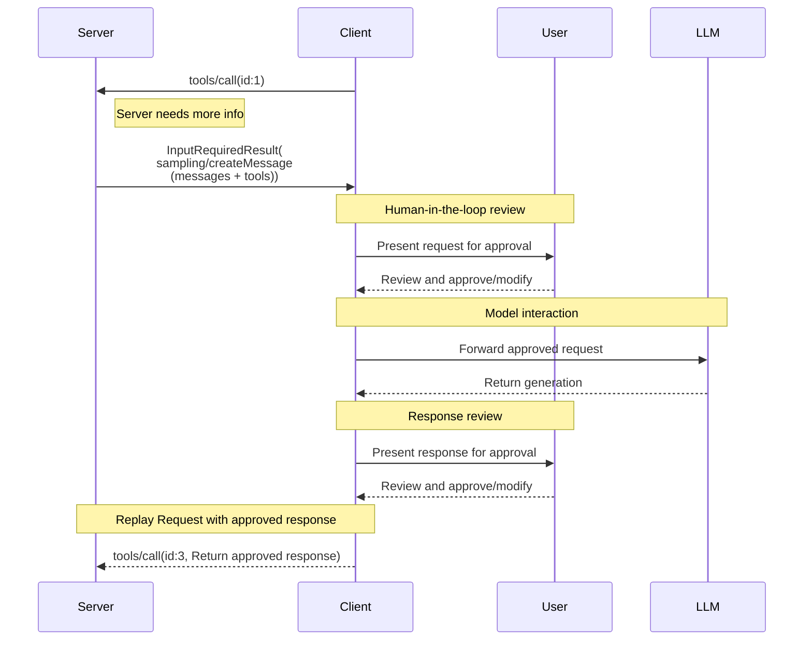

## Message Flow

```mermaid
sequenceDiagram
    participant Server
    participant Client
    participant User
    participant LLM

    Client->>Server: tools/call(id:1)
    note right of Server: Server needs more info
    Server->>Client: InputRequiredResult(<br/>sampling/createMessage<br/>(messages + tools))

    Note over Client,User: Human-in-the-loop review
    Client->>User: Present request for approval
    User-->>Client: Review and approve/modify

    Note over Client,LLM: Model interaction
    Client->>LLM: Forward approved request
    LLM-->>Client: Return generation

    Note over Client,User: Response review
    Client->>User: Present response for approval
    User-->>Client: Review and approve/modify

    Note over Server,Client: Replay Request with approved response
    Client-->>Server: tools/call(id:3, Return approved response)
```
