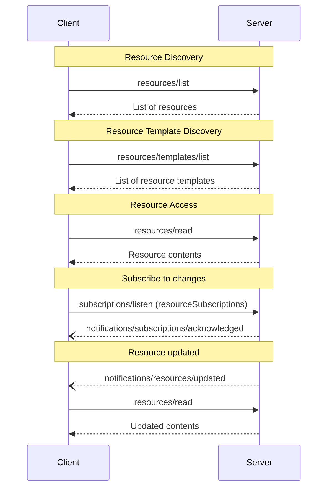

## Message Flow

```mermaid
sequenceDiagram
    participant Client
    participant Server

    Note over Client,Server: Resource Discovery
    Client->>Server: resources/list
    Server-->>Client: List of resources

    Note over Client,Server: Resource Template Discovery
    Client->>Server: resources/templates/list
    Server-->>Client: List of resource templates

    Note over Client,Server: Resource Access
    Client->>Server: resources/read
    Server-->>Client: Resource contents

    Note over Client,Server: Subscribe to changes
    Client->>Server: subscriptions/listen (resourceSubscriptions)
    Server--)Client: notifications/subscriptions/acknowledged

    Note over Client,Server: Resource updated
    Server--)Client: notifications/resources/updated
    Client->>Server: resources/read
    Server-->>Client: Updated contents
```
