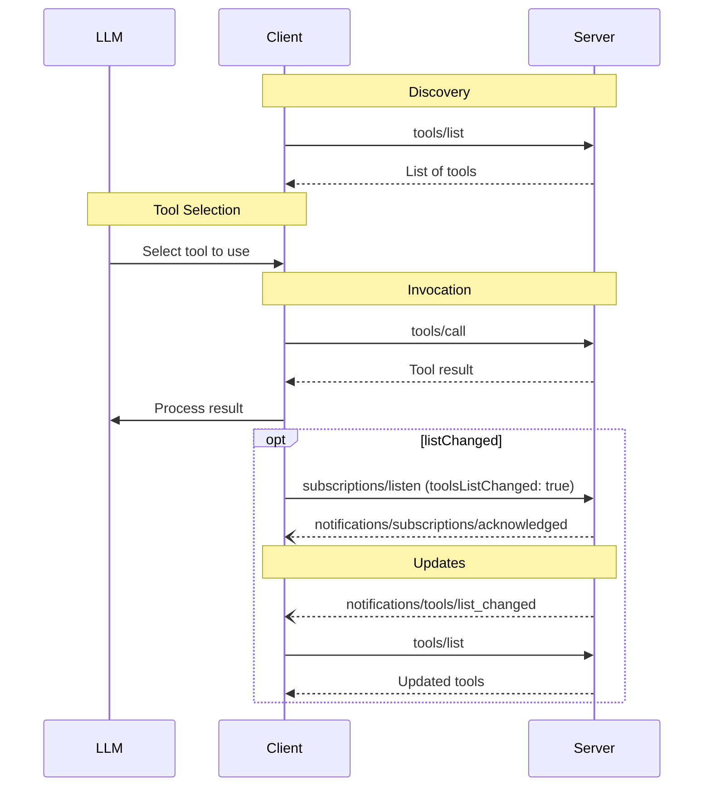

## Message Flow

```mermaid
sequenceDiagram
    participant LLM
    participant Client
    participant Server

    Note over Client,Server: Discovery
    Client->>Server: tools/list
    Server-->>Client: List of tools

    Note over Client,LLM: Tool Selection
    LLM->>Client: Select tool to use

    Note over Client,Server: Invocation
    Client->>Server: tools/call
    Server-->>Client: Tool result
    Client->>LLM: Process result

    opt listChanged
      Client->>Server: subscriptions/listen (toolsListChanged: true)
      Server--)Client: notifications/subscriptions/acknowledged
      Note over Client,Server: Updates
      Server--)Client: notifications/tools/list_changed
      Client->>Server: tools/list
      Server-->>Client: Updated tools
    end
```
