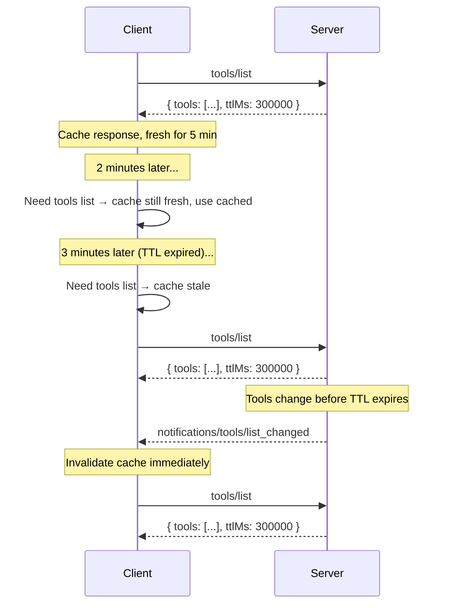

## Interaction with Notifications

TTL and server-push notifications are complementary:

- A server **MAY** provide `ttlMs` without advertising `listChanged: true` in its
  capabilities. In this case, the client relies entirely on TTL-based freshness.
- A server **MAY** advertise `listChanged: true` **and** provide `ttlMs`. In this case,
  the client can use the TTL to avoid unnecessary refetches between notifications, and
  the notification acts as an immediate invalidation signal.

When a relevant notification is received while a cached response is still fresh, the
notification **invalidates** the cached response and it should be considered immediately stale.

