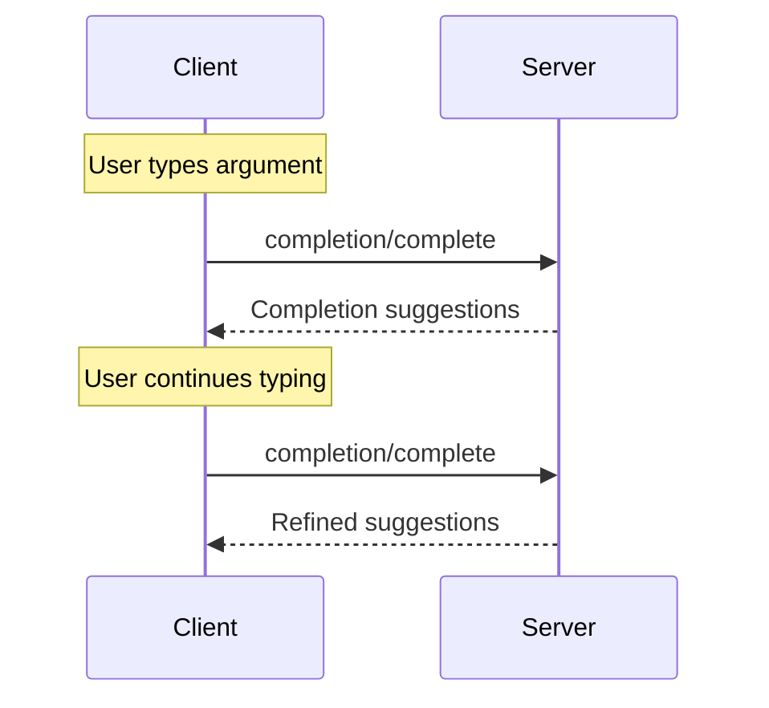

## Message Flow

```mermaid
sequenceDiagram
    participant Client
    participant Server

    Note over Client: User types argument
    Client->>Server: completion/complete
    Server-->>Client: Completion suggestions

    Note over Client: User continues typing
    Client->>Server: completion/complete
    Server-->>Client: Refined suggestions
```
