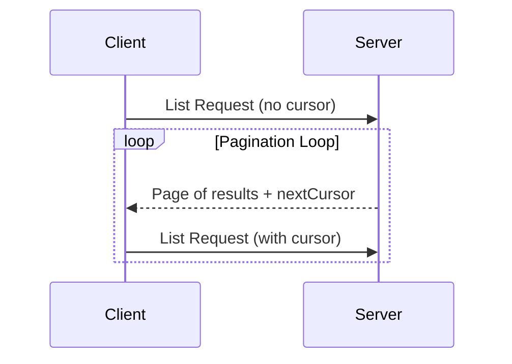

## Pagination Flow

```mermaid
sequenceDiagram
    participant Client
    participant Server

    Client->>Server: List Request (no cursor)
    loop Pagination Loop
      Server-->>Client: Page of results + nextCursor
      Client->>Server: List Request (with cursor)
    end
```
