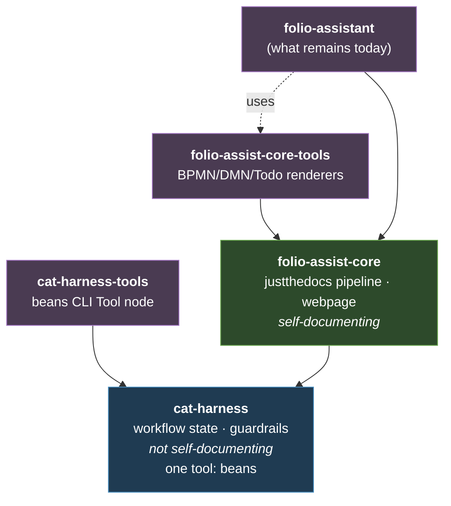

# The minimum `cat-harness` — and what moves where
{: .no_toc }

1. TOC
{:toc}

---

> **Proposal, nothing built.** Answers
> [#223 comment 16:13](https://github.com/litlfred/folio-assistant/issues/223#issuecomment-5732811137)
> (minimum contents, Tools strawperson, documentation move-table) as revised by
> [comment 16:28](https://github.com/litlfred/folio-assistant/issues/223#issuecomment-5732987719)
> (the harness is **not** self-documenting). Inventory measured on `main` at
> `d8632b6`, 2026-09-18.

## The revised repo set

The 16:28 revision changes the shape from the
[five-repo future state](future-state.html). Rendering moves out of the
harness, and each layer gains a Tools sibling:



## What "not self-documenting" actually constrains

This is the load-bearing sentence in the revision, and it is worth converting
into a test rather than a slogan.

**The harness cannot render a website.** The just-the-docs pipeline, the
`webpage` content type, and every renderer belong to `folio-assist-core`. So
the harness cannot document itself *as a folio* — its documentation is prose
files an agent reads, not pages a reader browses.

That yields a one-line admission test for every candidate:

> **If it produces something a human looks at, it is not the harness.**

Applied honestly it removes a great deal from the 16:13 list. The webpage
content type, the sticky-note Todo rendering, the QR code, dark/light mode, the
six UN languages, the audit-sidecar iconography, "links to edit in GitHub" —
all of these are **things a reader sees**, so all of them are
`folio-assist-core` or `folio-assist-core-tools`, not the minimum harness.

What survives in the harness is the part with no pixels: **schemas, process
definitions, and skills that tell an agent how to behave.**

### The falsifier, stated up front

If `cat-harness` ends up with dozens of skills and no crisp line against
core, "not self-documenting" has not constrained anything and the split is
still notional. **Measured below: 17 of 55 `folio-core` skills.** That is a
real constraint — it excludes 38 — but it is more than "a handful", and §"What
I would cut further" says where I would push if you want it smaller.

## `cat-harness` — the minimum

### Schemas (`.ts`, minimal)

The harness owns the vocabulary of *work*, not of *content*.

| schema | why the harness |
|---|---|
| `Skill` | what an actor knows how to do |
| `Tool` | how work actually gets done; a KG node, not a shell string |
| `Task` | the unit assigned to an actor in a swimlane |
| `Actor` / `Role` | who may do what — RBAC |
| `Process` (BPMN) / `Decision` (DMN) | the deterministic workflow itself |
| **`Todo`** | user/agent workflow state (16:28, explicit). **Already exists** — `TodoItem`, `schemas/types.ts:1330`. It moves; it does not need writing. |
| **`Bean`** | ditto, and **this one is genuinely missing**. `BeanRef` (`src/workflow/bean-link.ts:40`) is a *reference* to a bean, not a schema for one. |
| `CatHarness` declaration | which directories an instance scans, and each one's graph kind — already built, `schemas/cat-harness.ts` |
| `Content` (abstract) | the *base* only: identity, label, provenance. No block kinds, no profiles. |

**Of the two, only `Bean` is the gap** — I checked rather than assuming, and
the answer changed the recommendation below.

`TodoItem` already exists at `schemas/types.ts:1330` and carries `id`,
`summary`, `comment`, `status`, `priority`, `origin`, `targetLabel`,
`assignee`, timestamps, `updatedBy`, `data`, `related`, `author`. Its
`TodoStatus` union *already includes `blocked`*. So the Todo half of 16:28's
"add if not exists" is a **move, not a write**.

`Bean` is genuinely absent. Beans are markdown files with YAML front matter and
no TypeScript schema; the only Bean-shaped type is `BeanRef`
(`src/workflow/bean-link.ts:40`), which is a *reference* to a bean rather than a
schema for one. A workflow-state format with no schema cannot be validated,
cannot carry a QA sidecar, and cannot be a KG node.

### Skills — 24: 21 from `folio-core`, plus 3 written for MCP projection

> **The count was wrong and is corrected here.** This heading read "17" while
> the table below it listed **19** rows, and named a twentieth — the narrative
> process skill — as not yet written. That skill now exists as `process-state`,
> and `skills-and-tools` was added with it, bringing the moved-from-`folio-core`
> figure to **19 + 2 = 21**. The "17" was never recomputed after rows were
> appended. Three further skills — `mcp-projection`, `mcp-assembly`,
> `mcp-contract` — are **new writing rather than moves**, for a harness total
> of **24**. Counted 2026-09-18 with `grep -c` over the table; the grouping
> below sums to the same number, which is the check that catches the next
> drift.

Classified by reading each skill's description, not its filename — the
[bean `dh4f`](https://github.com/litlfred/folio-assistant/issues/223) lesson.

| skill | why the harness |
|---|---|
| `bean-coordination` | cross-session claim discipline |
| `todo-manager` | work-plan maintenance: the CLI, the STRICT create-check, coordination |
| `opening-brief` | brief a bean or topic before touching anything |
| `turn-reporting` | say which bean you are on, every turn |
| `pending-show` | read-only view of session pending work |
| `session-intent` | session-start intent, session-end results |
| `continual-progress` | PR from the first commit; visibility of in-flight work |
| `coordinate` | multi-PR coordination toward a shared goal |
| `pickup` | resume an existing open PR |
| `watch` | background-watch a branch or PR |
| `prepare-merge-auto` | the merge pipeline as a process |
| `idle-backlog` | what an agent does while blocked |
| `dispatch-agent` | background sub-agents — the swarm entry point |
| `interaction-modality` | how to talk to the person before deciding what to say |
| `symbiotic-interaction` | the three epistemic registers of author input |
| `crdm-detect` | feature-request detection (16:16, explicit) |
| `crdm-requirements-workflow` | the six-phase process (16:16, explicit) |
| `getting-started` | folio-creation triage (16:13, explicit) |
| `repo-conversion` | laying the harness over an existing repo — bootstrap |
| `integration-watcher` *(abstract parent only)* | the shared watcher mechanics; the concrete watchers are downstream |
| `directory-conventions` | the declaration and its graph kinds |

| `process-state` | reading a BPMN swimlane as process state for the role you are playing, and recovering when you find yourself outside it |
| `skills-and-tools` | the skill/Tool separation — the SOP every other skill follows |
| `mcp-projection` *(new)* | mapping a Tool node onto the MCP standard — how an agent stands a service up from a CLI tool |
| `mcp-assembly` *(new)* | composing many Tools into one service: naming, collisions, prefixes, versioning |
| `mcp-contract` *(new)* | verifying a served tool still matches the node it was projected from |

`process-state` and `skills-and-tools` were the 16:13 comment's "narrative
skill that does not yet exist"; both are now written, which is why the
moved-from-`folio-core` figure is 21 rather than 17. The three `mcp-*` skills
are **new writing, not moves** — nothing in `folio-core` covered projection.

### Documentation — the smallest set

Prose an agent reads, not pages a reader browses:

- the data models above, described as *one deterministic workflow*: Actors with
  Skills work Tasks in a Business Process, assigned by swimlane role;
- context-handling expectations, and bean info/workflow/management;
- a minimal coding policy ([#243](https://github.com/litlfred/folio-assistant/issues/243));
- how Tools are made available in shell/CLI and optionally as MCP, and how a
  Task's I/O corresponds to a Tool's inputs and outputs (16:28).

### Tools — four nodes, and no MCP

Per 16:28 the harness holds **beans and nothing else** as a *dependency*. That
is still true, and it is about what must be installed — not about how many Tool
nodes exist. The forge decision below adds a second subject, and beans turns out
to need two nodes rather than one:

| Tool node | satisfies | invocation |
|---|---|---|
| `beans-cli` | the six work-plan skills | `shell` — installed by `scripts/install-beans.sh` |
| `beans-manual` | the same six | `shell` — `scripts/beans-fallback.ts`, or a hand edit of the front matter |
| `github` | the four PR-choreography skills | `shell` — `gh`, or the REST call it wraps |
| `pages-publish` | `kg-export` | `shell` — push a directory to the `gh-pages` branch |

**Two beans nodes, not one.** The CLI is absent from a fresh container, and an
agent that knows only the CLI reads the plan and touches nothing — the
2026-09-18 failure where a session completed two merged PRs' worth of durable
work unclaimed. The fallback is a Tool of equal standing, not a footnote, and
modelling it as one is what forces the skill to say *when* to reach for it.

**`pages-publish` is where the harness's visibility problem is solved.** The
harness has no renderer — `folio` is the only `renderable` kind and it belongs
to core — so its knowledge graph is published as **data**, not as a page:
`kg-export` serializes it to one JSON document and this Tool puts the document
somewhere. That does not make the harness self-documenting; it makes it
inspectable, which is the property that was actually missing. A GitLab Pages or
object-store node satisfies the same skill later, which is the forge decision
above applied a second time.

**No MCP.** None of these needs a tool server: `ToolDefinition.invoke`
carries `mcp` as one optional arm beside `shell` and `container`, and the
harness relies on `shell`. A Tool whose only invocation is an MCP call is not
usable by the harness that defines it. MCP is acknowledged as a transport a
downstream instance may offer, and assumed nowhere.

**The Tool KG stays in the harness**, per 16:13 — that is what makes the harness
bootstrappable: it can describe its own tools in its own vocabulary, with no
renderer and no server.

## `cat-harness-tools` — the minimum

Almost empty by construction, and that is the point.

| item | note |
|---|---|
| beans CLI Tool node | install, invoke, I/O contract |
| `install-beans.sh` | the one script |

**All code snippets live here, not in skills** (16:13). Skills should carry
minimal code; a snippet in a skill is a Tool that has not been declared. That
is a QA audit criterion, not a style note — see the strawperson below.

## The Tools schema — built, and where the strawperson bent

> **No longer a strawperson.** `schemas/tool.ts` is real, `tools/` holds four
> nodes, and `bun run check:tools` gates them in CI. The shape below is what
> shipped; three things changed in contact with the first real Tools, and each
> is the kind of thing only writing them would have surfaced:
>
> - **`invoke.manual`** was added. `beans-manual` — editing a bean's front
>   matter by hand — is a real mechanism with equal standing to the CLI, and
>   modelling it as an absent `shell` would have made it indistinguishable from
>   an unfinished record.
> - **`install.none`** for the same reason: "nothing to install" and "not filled
>   in" must not render identically.
> - **`invoke` is refined to require an arm the harness can run.** A Tool whose
>   only invocation is `invoke.mcp` is unusable by the layer that defines it and
>   would make a projector emit a server that proxies itself. Rejected at parse
>   time.
>
> The two fields flagged below as too loose are both tightened: `io.*.schema` is
> an absolute IRI into a published `$defs` document (`schemas/tool-types.ts`),
> and `satisfies` must be non-empty — with `check:tools` resolving the names,
> which a schema cannot do because it does not get to read the tree.

## Strawperson: the Tools-repo schema

The 16:13 comment asks for a schema for Tools-repo contents plus options with
pros and cons. Here is the shape, written in the carrier the section below
settles on — **Zod is the authoritative form**, and the TypeScript type is
inferred from it rather than declared alongside it, so there is one definition
and not two that can drift.

```ts
// schemas/tool.ts
export const ToolDefinitionSchema = z.object({
  id: z.string(),                                   // stable KG node id
  title: z.string(),
  summary: z.string(),

  /** How to obtain it. */
  install: z.object({
    cli:       z.string().optional(),
    container: z.string().optional(),
    service:   z.string().optional(),
  }),

  /** How to run it, per environment. */
  invoke: z.object({
    shell:     z.string().optional(),
    mcp:       z.object({ tool: z.string() }).optional(),
    container: z.string().optional(),
  }),

  /** The contract a Task binds against — the 16:28 requirement. */
  io: z.object({
    inputs:  z.array(z.object({
      name: z.string(), schema: z.string(), required: z.boolean(),
    })),
    outputs: z.array(z.object({
      name: z.string(), schema: z.string(),
    })),
  }),

  /** Skills this tool can satisfy. One skill may have several tools. */
  satisfies: z.array(z.string()),

  requires: z.object({
    os:      z.array(z.string()).optional(),
    runtime: z.array(z.string()).optional(),
    network: z.boolean().optional(),
  }).optional(),
});

export type ToolDefinition = z.infer<typeof ToolDefinitionSchema>;
```

The `io` block is the part that earns its keep: it is what lets a Task's inputs
and outputs be checked against the Tool that will execute it, rather than
hoping they line up.

Two fields are deliberately loose at this stage and should be tightened before
anything is built on them. `io.*.schema` is a `string` — presumably an IRI into
the schema graph, but nothing yet says which, and an unresolvable reference is
the failure mode the `io` block exists to prevent. `satisfies` is a bare array
of skill ids with no check that the skills exist; that is the same
declared-but-absent defect `dh4f` found in the pipeline scripts, where a
consumer scans nothing and reports a clean run.
### Carrying it — authored once in Zod, rendered downstream

**Decided (2026-09-18, by the repository owner): the `.ts` Zod schema is
authoritative, and as many downstream renderings are generated from it as make
sense — JSON-LD and JSON Schema to begin with.** That is how every other schema
in this repository is defined, and the Tools schema gets no exception.

```
schemas/tool.ts            ← AUTHORITATIVE.  Zod + the inferred TS type.
  │
  ├─→ schemas/generated/Tool.schema.json      JSON Schema  (validation, editors)
  └─→ kg/tools/<id>.jsonld                    JSON-LD      (KG node, queryable)
```

The generation direction is the whole decision. `scripts/generate-schemas.ts`
already walks a map of Zod schemas through `zodToJsonSchema` into
`schemas/generated/*.schema.json`; adding `Tool` is one entry in that map, not a
new mechanism. The JSON-LD side has its precedent too — `toJsonLd()` in
`schemas/cat-harness.ts` projects a Zod-validated declaration into the folio
namespace. Both renderings are derived artefacts: regenerate, never hand-edit,
exactly as `docs/reference/skills/` and `docs/reference/skill-instructions/` are
already treated.

#### Why not the other three, including the one I first recommended

| | **Zod `.ts`, rendered down** | **JSON-LD authored** | **TS, no renderings** | **Skill front-matter** |
|---|---|---|---|---|
| **shape** | one Zod schema; per-tool instances validated against it | one hand-written `.jsonld` per tool | one `.ts` per tool, and nothing else | YAML block in the skill `.md` |
| **author-time checking** | yes | **no** — a typo is a runtime discovery | yes | no |
| **KG node** | yes, generated | yes, natively | **no** — needs a projection nobody wrote | no — unqueryable without parsing Markdown |
| **readable without a TS toolchain** | yes, via the renderings | yes | **no** | no |
| **number of truths** | **one** | one | one | one |
| **verdict** | **decided** | superseded | insufficient | **do not** |

An earlier draft of this page recommended authoring the JSON-LD directly, with
Zod validating it in CI. **That is the same two artefacts with the authority
pointing the wrong way**, and the difference is not cosmetic:

- **A hand-authored JSON-LD node is unchecked until CI runs.** Under the decided
  direction the Zod schema *is* the type, so a malformed tool definition fails
  at `tsc`, in the editor, before it is committed. Validation-after-the-fact
  catches the same error strictly later and only if CI is green — and this
  repository has just spent a bean (`dzl3`) on a suite that was not running at
  all, so "CI will catch it" is a claim with a poor local record.
- **It would have been a fourth pattern in a repo that already has one.** Zod →
  JSON Schema is `generate-schemas.ts`; Zod → docs is `generate-docs.ts`; Zod →
  JSON-LD is `toJsonLd`. Authoring the rendering and validating backwards is the
  only shape here that would have run against all three.
- **"Language-agnostic" was never the trade it looked like.** A shell or Python
  consumer reads the *generated* JSON-LD and JSON Schema under the decided
  direction just as well as it reads a hand-authored one. Nothing is lost by
  generating them; what is gained is that they cannot disagree with the type.

**C — front-matter in the skill — is still worth rejecting explicitly**, and for
unchanged reasons: it is the least work today, it directly contradicts the
instruction that code snippets belong in tools rather than skills, and it caps
the model at one tool per skill, which kills "several Tools may satisfy one
Skill" before it is built.

#### What "as many renderings as make sense" means in practice

Two now, and a test for any third. A rendering earns its place when a real
consumer cannot read the ones that exist: JSON Schema because editors and
validators speak it, JSON-LD because the KG query path does. A third — SHACL, an
OpenAPI fragment, a Turtle serialisation — is added when something needs it, not
in anticipation. Each one is another file to regenerate and another chance for a
stale artefact to be read as current, so the bar is a consumer, not a
possibility.

The corresponding rule: **a rendering is never the place a fix lands.** If a
generated `Tool.schema.json` is wrong, `schemas/tool.ts` is wrong; edit that and
regenerate. A `--check` mode in CI (the pattern `gen-skill-docs.ts --check`
already uses) is what makes that enforceable rather than merely stated.

## The documentation move-table

Measured on `main` at `d8632b6`: **18 top-level pages, 8 guides, 20 BPMN
processes, 115 skills across 9 packages.**

Legend — **AH** `cat-harness` · **AHT** `cat-harness-tools` ·
**C** `folio-assist-core` · **CT** `folio-assist-core-tools` ·
**S** `folio-asst-sci` · **W** `smart-base`/`smart-kg` · **FA** stays put

### Top-level pages (`docs/*.md`)

| page | lines | → | reasoning |
|---|---:|---|---|
| `agentic-harness.md` | 349 | **AH** + **C** | **Splits.** The interaction model, session lifecycle and request classification are harness; the published *page* is core. This is the clearest example of the whole exercise: the content is harness, the rendering is core. |
| `crdm-methodology.md` | 768 | **AH** | Feature-request process, explicit at 16:16. Largest single doc. |
| `beans-and-todos.md` | 169 | **AH** | Workflow state, explicit at 16:28. |
| `accessibility.md` | 219 | **AH** + **C** | **Splits.** User modalities are harness (how to talk to a person); dark/light, QR, contrast are core UI. |
| `publication-workflow.md` | 505 | **AH** + **C** | **Splits.** The BPMN index and the HCI validation gate are harness guardrails; draft→publish is core. |
| `architecture.md` + `architecture/*` | 131 + 4 pages | **C** | Describes the platform for readers; self-documentation is core's job. |
| `content-types.md` | 265 | **C** | Block kinds, profiles. |
| `skills.md` | 256 | **AH** | Skills, roles, RBAC composition — harness vocabulary. |
| `getting-started.md` | 271 | **AH** | 16:13, explicit ([#232](https://github.com/litlfred/folio-assistant/issues/232)). |
| `installation.md` | 186 | **AH** + **AHT** | Harness install story; the scripts are tools. |
| `translation-support.md` | 684 | **C** | Rendering-facing; six UN languages are a core UI default. |
| `document-ingestion.md` | 241 | **C** | Content intake. |
| `evidence.md` | 205 | **S** | Evidence/provenance for formal claims. |
| `sage-mcp.md` | 70 | **S** | Sage. |
| `qou-migration-checklist.md` | 70 | **FA** | One folio's checklist; should not survive the split at all. |
| `folio-assistant-migration.md` | 289 | **FA** | Historical record of the beans migration. |
| `contributing.md` | 86 | **AH** | Coding policy ([#243](https://github.com/litlfred/folio-assistant/issues/243)). |
| `index.md` | 118 | **C** | Site landing page. |

### Guides (`docs/guides/`)

| guide | lines | → | reasoning |
|---|---:|---|---|
| `agent-onboarding.md` | 202 | **AH** | Orientation for an agent — the harness's core job. |
| `new-content-type.md` | 117 | **C** | Adding an adapter. |
| `writing-a-document.md` | 303 | **C** | Authoring. |
| `writing-a-paper.md` | 342 | **S** | Lean + LaTeX. |
| `reseeding-the-lean-cache.md` | 288 | **S** | Lean toolchain. |
| `who-smart-dak.md` | 97 | **W** | L2. |
| `who-smart-ig.md` | 144 | **W** | L3. |

### BPMN processes (`skills/workflows/`) — 20 files

| process | → | reasoning |
|---|---|---|
| `crdm-requirements` | **AH** | 16:16. |
| `bean-lifecycle` | **AH** | Workflow state. |
| `getting-started` | **AH** | CatBootstrap. |
| `editing-hci-validation` | **AH** | The validation gate is a guardrail. |
| `content-lifecycle`, `draft-to-publication`, `content-change-review` | **AH** *(definition)* + **CT** *(rendering)* | The process is a guardrail; the diagram a reader looks at is core-tools. Per 16:28: *skills on how they are guardrails stay in cat-harness*. |
| `authoring-a-document` | **C** | Per content type. |
| `authoring-a-paper` | **S** | |
| `l2-dak-authoring`, `l3-fhir-pipeline`, `ig-incremental-build` | **W** | |
| `document-ingestion`, `ingest-*` (4), `evidence-retrieval` | **C** | Ingestion pipeline. |
| `translation-workflow`, `human-translation-workflow` | **C** | |

### Skills (115 across 9 packages)

| package | count | → |
|---|---:|---|
| `folio-core` | 55 | **17 → AH**, ~30 → **C**, ~8 → **S** (table above) |
| `folio-paper-adapter` | 47 | **S** |
| `content-lifecycle` | 8 | **C** |
| `folio-document-adapter` | 4 | **C** |
| `authoring-who-smart-guidelines` | 1 | **W** |
| `framework`, `remote-packages`, `authoring-math`, `folio-document-adapter` | 0 `.md` | manifests only — follow their package |

## User todo management — suggestions

The 16:28 comment asks for these explicitly, so they are proposals rather than
findings.

**1. Todo and Bean are the same object at different audiences — and `TodoItem`
is already most of it.** A bean is agent work-plan state; a Todo note is a
user-authored sticky. Both are "a unit of intent with status, provenance and
hierarchy", and `TodoItem` already has everything except hierarchy. I would
**extend `TodoItem` with an `audience` discriminator** (`agent` | `human`)
rather than write a second schema, and make the bean store a serialisation of
it. Two schemas means two answers to "what is outstanding", free to disagree —
the exact defect `AGENTS.md` records for the todos-vs-beans split that beans
resolved once already.

**2. Hierarchy is the one field genuinely missing.** `TodoItem` has `related[]`
for threading but **no `parent`** — I checked. The 16:13 comment wants child
Todos with navigation into the hierarchy, and 14:48 wants sub-beans for parallel
work; both are `parent?: string` plus an ordering key. That is a one-field
change to an existing schema, not a new mechanism.

**3. Blocking exists but is untimed.** `TodoStatus` already includes
`"blocked"` — "waiting on external input (author, upstream change)". What it
lacks is 14:48's timeout and handoff. I would add
`blockedOn?: { what, since, expires, handoff }`, so an expired block becomes a
*signal* rather than a bean that quietly sits forever, and so a second agent
knows what it is inheriting.

**4. The rendering is core's, the state is the harness's.** Sticky-note styling,
drag/resize, and the metadata for position belong in `folio-assist-core-tools`;
the Todo schema stays in the harness. This is the 16:28 rule applied
consistently, and it is what keeps a headless agent able to read and write
Todos with no renderer present.

## Decided: 17 stays, and the forge is isolated at the Tool layer

Settled 2026-09-18 by the repository owner. **All 17 skills stay in
`agentic-harness`. There is no sixth repository.**

The proposal was to split the four PR-choreography skills —
`prepare-merge-auto`, `pickup`, `watch`, `coordinate` — into an
`cat-harness-github` sibling, so the harness could run on GitLab or on
sovereign compute with no forge at all. The goal was right and the mechanism
was wrong, which the measurement makes plain.

**Measured on `main`, 2026-09-18.** The four skills total 1,404 lines.
`coordinate.md` alone is 731 lines carrying 94 matches for GitHub-ish terms —
of which **12** are concrete invocations (`mcp__github__*`, `gh pr`, `gh api`)
and the other 82 are conceptual: "pull request", "PR", "GitHub" as a noun.

```sh
# what was actually counted
grep -ciE 'github|gh pr|pull request|\bPR\b|mcp__github' skills/folio-core/coordinate.md   # 94
grep -cE  'mcp__github|gh api|gh pr|gh issue'             skills/folio-core/coordinate.md   # 12
```

So the split would have moved **1,404 lines of portable prose to isolate on the
order of a few dozen lines of mechanism** — and would have done it by cutting
along a repository boundary, the most expensive cut available, to separate
things that are not actually separable at that grain. The skills are already
forge-neutral; only their invocations are not.

**Isolate at the Tool layer instead.** A skill states the capability
generically; a `github` Tool node carries the invocations and names the skills
it satisfies. Adding GitLab later is a second Tool node against the same
skills — not a repository, not a fork, not a rewrite. The SOP is
[`skills-and-tools`](../../skills/folio-core/skills-and-tools.md); the Tool
schema is the strawperson above, whose `satisfies` field is exactly this edge.

The two consolidations also considered — `repo-conversion` into
`getting-started`, and `symbiotic-interaction` into `interaction-modality` —
are **not** taken. Both pairs overlap, but merging them is editorial tidying
with no architectural consequence, and the grouping below addresses the
find-the-right-one problem that motivated it.

### No MCP in the harness — but the harness knows how to emit one

**`agentic-harness` assumes no MCP server.** Everything it needs is files in
declared directories, readable with a filesystem and `<name>.json`
alone. `ToolDefinition.invoke` carries `mcp` as **one optional arm** beside
`shell` and `container`, and the harness relies on `shell`; a Tool whose only
invocation is an MCP call is not usable by the harness that defines it.

**That is a statement about dependency, not about ignorance.** MCP is an
*output* of this harness, not an input to it: the three `mcp-*` skills above
are how an agent takes a Tool node describing a CLI and produces a working MCP
service from it. The harness is the thing that knows the mapping; it just does
not need the result in order to run.

The projection is close to free, and that is the carrier decision paying off
rather than a coincidence. An MCP tool declaration is a name, a description and
a JSON Schema for its input — and `schemas/tool.ts` is authoritative Zod, whose
JSON Schema rendering is already generated (§"Carrying it"). `io.inputs` and
`io.outputs` are already the I/O contract; `invoke.shell` is already the
mechanism. **The projection is a rename, not a translation**, which is the sign
the Tool schema was shaped correctly.

Stating it this way settles what would otherwise look like a contradiction —
"no MCP" alongside three MCP skills — and it is the reason sovereign-compute
and air-gapped operation are reachable later without a second design: an
instance with no server loses a transport, not a capability.

## The `kg/` layout — group them, do not flatten them

Keeping all of them raises the problem the cuts were partly aimed at: a flat
directory of 24 files gives a reader no way to tell which one governs the task
in front of them. So the `kg` graph is **grouped**, and the group is part of
the address:

```
kg/
  work-plan/          bean-coordination, todo-manager, pending-show,          [6]
                      session-intent, continual-progress, idle-backlog
  pr-choreography/    prepare-merge-auto, pickup, watch, coordinate           [4]
  interaction/        interaction-modality, symbiotic-interaction             [2]
  process/            crdm-detect, crdm-requirements-workflow,                [4]
                      process-state, dispatch-agent
  bootstrap/          getting-started, repo-conversion,                       [7]
                      directory-conventions, skills-and-tools,
                      mcp-projection, mcp-assembly, mcp-contract
  watchers/           integration-watcher (abstract parent; the concrete       [1]
                      watchers are downstream)
                                                                        total  24
```

The three `mcp-*` skills sit in `bootstrap/` because standing a service up is
bootstrapping — that is the owner's classification, and it is the right one:
an agent looking for "how do I make this tool reachable" is asking a
setup question, not an MCP question. If `bootstrap/` keeps growing, an
`mcp/` subgroup under it is the natural split, and splitting a group is a
`git mv` rather than a decision to relitigate.

**The totals are written down deliberately.** The figure above this section was
wrong for as long as it took someone to append rows without recounting; a
grouping whose parts sum to a stated whole is the cheapest guard against that
happening again, and it is checkable by eye.

Two things this buys beyond tidiness. **`pr-choreography/` is the group the
forge Tools attach to**, so the boundary the sixth repo would have drawn is
still legible — as a directory, reversible for the price of a `git mv`, rather
than as a repository. And a group is the natural unit for the "which skill
governs this?" question, which is the one a flat list answers worst.

**The grouping is not implemented here.** This repo is pre-split and its `kg`
id points at `skills/`, flat. The layout above is the target for
`agentic-harness`, recorded so the split does not land as a flat dump of 17.

## What is deliberately not here

- **No implementation.** Nothing in this page creates a repo or moves a file.
- **The `folio` graph kind is currently mis-sited.** `schemas/cat-harness.ts`
  lists `folio` among the harness's graph kinds, which contradicts 16:28 —
  a renderable kind belongs to core. Tracked separately; it is a small
  correction, not a rewrite.
- **Swarm management** (14:48 — model levels, swarm size, CPU) is named as a
  separate skill set and is not designed here.
- **The L1/L2 boundary** still needs WHO domain context, unchanged from the
  [migration plan](migration-plan.html).
