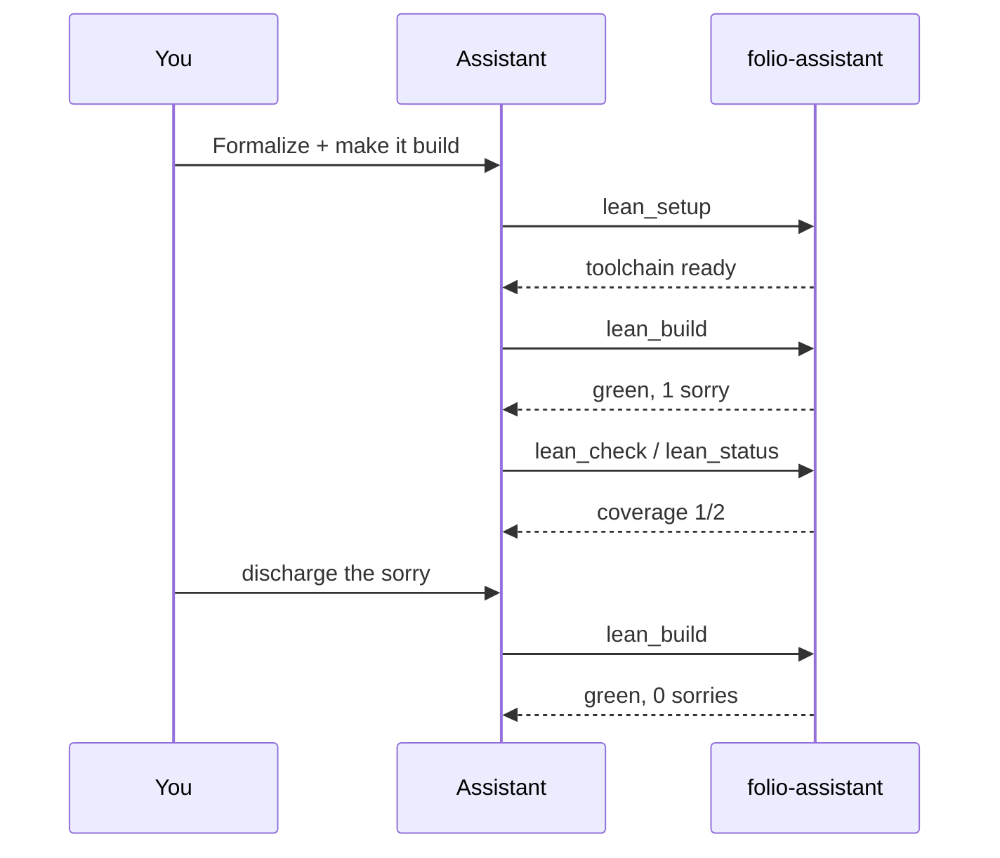

Now the agent sets up Lean and formalizes the definition and theorem, calling
`lean_setup`, `lean_build`, and `lean_check`.

> **You:** Formalize the definition and theorem in Lean and make it build.
>
> **Assistant:** *(loads `lean-formalization`; calls `lean_setup`)* Toolchain
> ready (Lean 4.16.0). I added:
>
> ```lean
> namespace HarmonicSeries
> def partialSum (n : ℕ) : ℝ := ∑ k ∈ Finset.range n, 1 / (k + 1 : ℝ)
>
> theorem diverges : ¬ ∃ B, ∀ n, partialSum n ≤ B := by
>   sorry -- Ref: [oresme] grouping argument
> ```
>
> *(calls `lean_build`)* Build is green with **1 `sorry`** remaining. *(calls
> `lean_status`)* Proof coverage: 1/2 blocks fully proved.
>
> **You:** Discharge the sorry using the grouping bound.
>
> **Assistant:** *(edits, `lean_build`)* ✅ Build green, **0 sorries**.
> `proof-verification` reports the axiom set is clean (no `sorryAx`).


