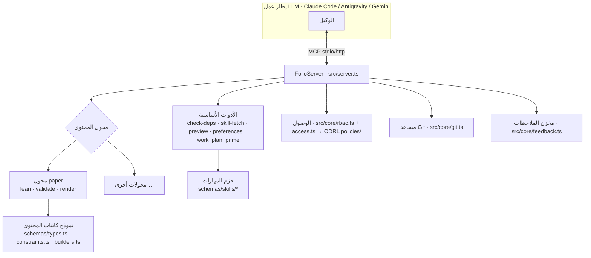

# الهندسة المعمارية
{: .no_toc }

1. TOC
{:toc}

---

## نظرة عامة

> **القواعد الكامنة وراء هذه الصفحة.** تصف الهندسة المعمارية الهيكل؛ بينما تحكم
> المهارات القرارات. المحولات مقابل ملفات التعريف —
> [`content-profiles`](reference/skill-instructions/content-profiles.html).
> أين تنتمي العقدة الجديدة قبل إنشائها —
> [`placement`](reference/skill-instructions/placement.html). وتخطيط المستودع
> وكل نوع من أنواع الرسوم البيانية —
> [`directory-conventions`](reference/skill-instructions/directory-conventions.html).
> وتركيب واجهة MCP والتحقق منها —
> [`mcp-assembly`](reference/skill-instructions/mcp-assembly.html) و
> [`mcp-contract`](reference/skill-instructions/mcp-contract.html).
> وحيثما تختلف هذه الصفحة مع إحدى المهارات، فإن المهارة هي التي تسود.

إن folio-assistant هو **خادم MCP** يضم طبقة **محولات محتوى** قابلة للتوصيل،
ونظام **مهارات**، و**نموذج كائنات محتوى** مصنف بالأنواع، ونظام **تحكم في الوصول قائم على الأدوار (RBAC)**،
وآلية نشر. ويعيش المحتوى الذي يعمل عليه في مستودع *منفصل* — فالمنصة
مستقلة عن المحتوى.

## فصل الاهتمامات — الوضع الحالي والمستقبلي

هذا المستودع اليوم هو **مستودع أدوات ومستودع محتوى في فحص كود (checkout) واحد**. تخطط المسألة
[#223](https://github.com/litlfred/folio-assistant/issues/223) للتقسيم
إلى خمس حالات (instances) قابلة للتركيب من folio-assistant. وتوضح ذلك الصفحات الفرعية:

| الصفحة | ما تجيب عليه |
|---|---|
| [تصنيف المستودعات](architecture/repo-taxonomy.html) | ما هي أنواع المستودعات الموجودة — أداة (Tool)، واختبار (Test)، ومحتوى (Content)، ومستهلك (Consumer) — وما قد يحتويه كل منها |
| [الوضع الحالي](architecture/current-state.html) | ما هو موجود بالفعل في هذا المستودع اليوم، بالأرقام المقاسة، وأين يكمن المزيج |
| [الوضع المستقبلي](architecture/future-state.html) | المستودعات الخمسة المستهدفة وأي دليل يستقر في أيّ منها |
| [خطة الانتقال](architecture/migration-plan.html) | المراحل 0/I/II/III، والبوابات، وما لم يُحسم بعد |
| [الحد الأدنى لـ `cat-harness`](architecture/cat-harness-minimum.html) | ما يتبقى في إطار العمل (harness) بمجرد تطبيق معيار "ليس توثيقًا ذاتيًا" كاختبار |
| [حالات إطار العمل](architecture/harness-instances.html) | ما هي الحالة (instance) في واقعها — المخططات، والتصورات المرئية، والأدوات؛ والأدلة الأربعة؛ والتصيير الافتراضي |

يبدو البندان الأخيران وكأنهما يتعارضان — فالحد الأدنى ينص على أن إطار العمل لا ينتج شيئًا ينظر إليه إنسان، بينما تنص صفحة الحالات على أن الحالة تقوم بالتصيير افتراضيًا. لكنهما لا يتعارضان: فالمتطلب هو **حد أدنى يرتفع تدريجيًا**، مع إعفاء `bootstrap` من أداة التصور المرئي مع التزامه بتقديم `.json`/`.jsonld` الخاصة به بدلاً من ذلك، في حين يمثل `cat-harness` الطبقة التي يبدأ عندها تطبيق الباقي. راجع
[أين يبدأ المتطلب](architecture/harness-instances.html#where-the-requirement-starts--bootstrap-is-the-exception).

يصف باقي هذه الصفحة الهندسة المعمارية **كما هي عليه الآن**.

## تخطيط المستودع

| المسار | ما يحتويه |
|------|-----------------|
| `src/` | خادم MCP (`server.ts`)، ونقطة الدخول (`index.ts`)، والوظائف الأساسية (`git`، و`rbac`، و`cache`، و`feedback`، و`logging`)، والأدوات الأساسية (`tools/`) |
| `adapters/` | محولات المحتوى — `paper/` (Lean + LaTeX) ومحول `mcp-server/` المستقل |
| `schemas/` | نموذج كائنات المحتوى (`types.ts`، و`constraints.ts`، و`builders.ts`) ومخططات JSON لكل مهارة (`schemas/skills/*`) |
| `skills/` | **حزم** المهارات (`content-lifecycle`، و`authoring-math`، و`authoring-who-smart-guidelines`) مع بيانات Docker الخاصة بها |
| `content/` | أدوات **خط أنابيب** المحتوى (أدوات التحقق، وضمان الجودة QA، ومساعدات التصيير) — وليس المحتوى نفسه |
| `ui/`، و`viewer/`، و`home_page/` | واجهة مستخدم الويب، والعارض التفاعلي، وموقع Pages النموذجي |
| `deploy/` | النشر (Caddy، وdocker-compose، والإعداد والتهيئة، وOAuth) |
| `docs/` | موقع التوثيق هذا |
| `.github/` | مهام سير عمل CI وبرامجها النصية (البناء، والنشر، وضمان الجودة QA، والتوثيق) |
| `.claude/skills/` | مهارات الوكيل المحلية + خطافات القدرات (capability hooks) |

## خادم MCP

يقوم `FolioServer` (`src/server.ts`) بتسجيل الأدوات الأساسية، ثم يطلب من **محول المحتوى** النشط تسجيل أدواته. وهو يدعم وسيلتي نقل — `--stdio` (التي تشغلها أطر العمل) و`--http` (حالة مشتركة طويلة التشغيل). ويتم تسجيل استدعاءات الأدوات مع توقيتاتها.

## محولات المحتوى

يغلف محول المحتوى كل ما يخص نوعًا معينًا: ما هي المخرجات (artifacts) الموجودة، وكيفية التحقق منها، وكيفية بنائها/تصييرها، وما هي أدوات MCP الإضافية التي يجب تسجيلها. ويعد محول `document` (`adapters/document/`) هو الأساس لملفات المحتوى النثرية؛ بينما يوسعه محول `paper` (`adapters/paper/`) ويوفر أدوات دورة حياة Lean (`lean_setup`/`build`/`check`/`status`)، والتحقق، والتصيير (`paper_render_pdf`/`html`، و`formula_render`). وتضيف أنواع المحتوى الجديدة محولاً جديدًا — راجع [إضافة نوع محتوى](guides/new-content-type.html).

## المهارات وحزم المهارات

الـ **مهارة** (skill) هي وحدة عمل موثقة ومقيدة بمخطط بياني (مثل `lean-formalization`). وتُجمع المهارات في **حزم** تعلن عن تبعات Docker وبيئة التشغيل الخاصة بها عبر ملف `package-manifest.json`. ويكتشف النموذج اللغوي الكبير (LLM) المهارات عبر `skill_list` ويحمّل التعليمات عبر `skill_fetch`. وتوجد القائمة الكاملة للمهارات والأدوار — وكيفية تكاملها مع النموذج اللغوي الكبير (RBAC، والقدرات، والمتطلبات) — في صفحة [المهارات والأدوار](skills.html)؛ كما يُنشر عقد المدخلات/المخرجات لكل مهارة في [مرجع مخططات المهارات](reference/skills/).

## نموذج كائنات المحتوى

بالنسبة للأوراق العلمية، فإن المحتوى هو شجرة من **الكتل** (blocks) محددة الأنواع يتم التحقق منها أثناء التشغيل عبر Zod:

- `schemas/types.ts` — `Block`، و`Section`، و`Chapter`، و`Paper`، وأنواع الكتل
- `schemas/constraints.ts` — مخططات Zod وقواعد القيود
- `schemas/builders.ts` — بناة الكائنات التي تم التحقق منها (`definition()`، و`theorem()`، …)

وهذه العناصر موثقة في [مرجع واجهة برمجة تطبيقات TypeScript](api/) المُولّد.

## التحكم في الوصول — ODRL، يتم التحقق منه قبل كل مهمة

يوجد نظام أذونات واحد فقط، وهو W3C ODRL 2.2 (المسألة #1180): الإجراءات في `skills/permissions/permissions.json`، والمنح في `policies/*.jsonld`، ويتم تقييمها عبر `permits()` / `decide()` في `schemas/odrl.ts`. ويستعلم عنه طرفان مستدعيان:

- **مُنفِّذ BPMN**، قبل كل مهمة وقرار (`src/workflow/authorize.ts`): هل الفاعل موثق، ومؤهل لدور المسار (lane)، ومصرح له بـ `perform-task` هنا، ومسموح له بلمس المحتوى؟ وهو استشاري اليوم: فالرفض `deny` أو عدم تطابق الدور يؤدي إلى الرفض، ويتم تسجيل الحالة `unknown`.
- **مسارات HTTP**، من خلال `src/core/rbac.ts`: يحدد كل مسار الإجراء الذي ينفذه (`content-authoring`، و`review-comments`، و`adjudication`)، وتُعد جلسات بوابة المصادقة (auth-gateway) فاعلين معلنين تكمن منحهم في `policies/http-gateway.jsonld`. وهنا تؤدي الحالة `unknown` إلى الرفض.

حتى المسألة #1207 (2026-09-23)، كان `rbac.ts` سلمًا منفصلاً من viewer < collaborator < owner، ولم يكن المنفذ يتحقق من أي شيء. والانضباط المتبع هو مهارة [`task-authorization`](reference/skill-instructions/task-authorization.html).

## تهيئة خطة العمل (عبر أطر العمل المختلفة)

يتم تخزين خطة العمل في `beans` وإبرازها بثلاث طرق حتى تتم تهيئة أي إطار عمل بشكل متطابق:

1. **`AGENTS.md`** — انضباط ثابت، يقرؤه كل وكيل أصلاً.
2. **خطاف `SessionStart`** — يشغل كل إطار عمل برنامج التهيئة المشترك `scripts/session-start-coord-sweep.sh`.
3. **أداة MCP المعنونة `work_plan_prime`** — تهيئة حية ومباشرة لأي وكيل متصل بـ MCP.

راجع `docs/folio-assistant-migration.md` للاطلاع على التصميم الكامل المشترك بين الوكلاء.

## النشر

يحتوي `deploy/` على قالب خادم وكيل عكسي (reverse-proxy) لـ Caddy، وملف `docker-compose.yml`، وبرنامج نصي للإعداد والتهيئة، وإعداد Google OAuth، وبرنامج نصي للتحديث الذاتي لتشغيل حالة HTTP مشتركة. وتجمع بيانات Docker الخاصة بحزم المهارات تبعات apt/pip/npm في صورة واحدة لكل مجموعة حزم نشطة.
