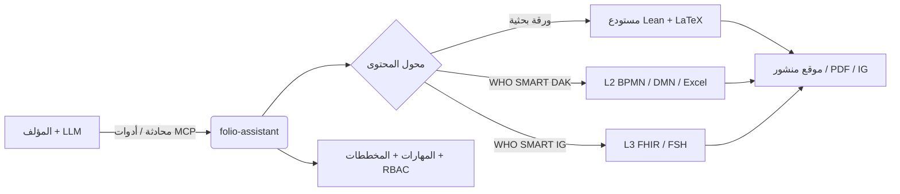
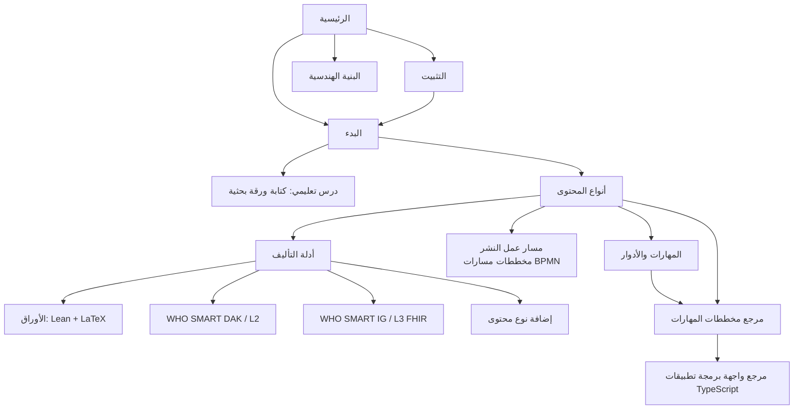



# folio-assistant
{: .fs-9 }


إطار عمل لمهارات الوكيل غير المرتبط بمحتوى محدد لتأليف محتوى دقيق باستخدام نموذج
لغوي كبير — الأوراق والكتب العلمية، وإرشادات منظمة الصحة العالمية SMART، وأدلة
تطبيق FHIR — مدعوم بخادم MCP، وتحكم في الوصول قائم على الأدوار، ونموذج
كائنات محتوى مصنف بالأنواع.
{: .fs-6 .fw-300 }

<!--
  `View on GitHub` STAYS. The site-wide `aux_links` GitHub text was removed from
  the chrome above every page (bean `udx8`, PR #352), and the obvious follow-up
  is to delete this button for consistency. Do not. Put to the repo owner on
  2026-09-19: this button is part of the landing page's own readme/description
  note — authored content on one page, not chrome — and the forge remains
  reachable from the navbar's Source tile regardless.
-->
[البدء](../start/getting-started.html){: .btn .btn-primary .fs-5 .mb-4 .mb-md-0 .mr-2 }
[التثبيت](../start/installation.html){: .btn .fs-5 .mb-4 .mb-md-0 .mr-2 }
[عرض على GitHub](https://github.com/litlfred/folio-assistant){: .btn .fs-5 .mb-4 .mb-md-0 }



---

## أربعة أمور، بالترتيب

**1. خطة العمل هي المكان الذي تقول فيه ما تفعله.**
ليست رسالة دردشة ولا تعليقًا، بل [beans]({{ '/guides/beans-and-todos.html' | relative_url }})، وهو مخزن خاضع لإدارة الإصدارات تستطيع أي جلسة أو أي وكيل قراءته. احجز العنصر قبل أن تعمل عليه كي لا تأخذه جلسة موازية؛ والـ bean الذي يتبيّن أنه غير مطلوب يُعلَّم `scrapped` مع أسبابه، ولا يُحذف أبدًا.

```sh
cat-harness/scripts/install-beans.sh && export PATH="$HOME/.local/bin:$PATH"
beans list                          # ما هو مفتوح
beans create "<title>"              # …بعد التحقق من أن العنوان غير موجود
beans <id> --status in-progress     # احجزه، بشكل مرئي
```

**2. أنشئ أول folio لك.** هذا المستودع هو *المنصة*؛ أما محتواك فيعيش في مستودعه الخاص. أمر واحد يُنشئ هيكله — البيانات الوصفية، والإعلان، وملفات الوكيل، والرابط إلى هنا:

```sh
bun run init-folio --help
```

بعد ذلك، يأخذك [البدء]({{ '/start/getting-started.html' | relative_url }}) مع الكتلة الأولى عبر التحقق والعرض والمراجعة.

**3. اعرف نوع ما تكتبه.** *المستند* نثر منظَّم؛ و*الورقة* (paper) هي ذلك بالإضافة إلى أنواع الكتل التي يكون تقريرها ادعاءً رياضيًا صوريًا، مدعومًا بـ Lean ومنضَّدًا عبر LaTeX. يحدد هذا الاختيار الكتل المسموح بها والفحوص التي تُشغَّل: [أنواع المحتوى]({{ '/concepts/content-types.html' | relative_url }}).

**4. التوثيق الذي لن تقرأه أبدًا.**
[كله]({{ '/guides/index.html' | relative_url }}) — أدلة التأليف، والبنية، وسير عمل النشر، والمرجع المولَّد للمخططات والمهارات. إنه هنا، وهو شامل، والتوقع الصادق أنك ستصل إليه من محرك بحث في اللحظة نفسها التي يتعطل فيها شيء ما. وهذه طريقة جيدة لاستخدامه. الخطوات الثلاث أعلاه هي التي تستحق القراءة الآن.

عندما تكون *الآلية* هي ما يحيّرك وليس التأليف — من يفعل أمرًا ما، وضمن أي عملية، وباستخدام أي مهارة — فابدأ من [المنصة]({{ '/platform.html' | relative_url }}). جملة واحدة هناك تحمل النموذج كله، وكل كلمة فيها كائن مُعلَن على حدة.

---

## ما هو folio-assistant؟

**folio-assistant** هو *المنصة* — وهو لا يحتوي على محتوى بحد ذاته. بل يوفر
المهارات، والمخططات، والأدوات، وخادم MCP (بروتوكول سياق النموذج / Model Context Protocol)
الذي يستخدمه وكيل مدفوع بنموذج لغوي كبير لتخطيط، وتأليف، والتحقق من، ومراجعة،
واختبار، ونشر **ملف محتوى (folio)** محفوظ في مستودع منفصل.

> **فصل الاهتمامات.** يصف هذا التوثيق *النموذج الشكلي لإطار العمل* و*كيفية استخدام
> folio-assistant* — مع الحفاظ عليه عمدًا **بمعزل عن أي محتوى محدد**. وحيثما يظهر
> المحتوى في هذه الصفحات، فإنه يكون فقط توضيحيًا (*مثالاً*)، وليس أبدًا المصنف المعياري.


```mermaid
flowchart LR
    A[المؤلف + LLM] -->|محادثة / أدوات MCP| B(folio-assistant)
    B --> C{محول المحتوى}
    C -->|ورقة بحثية| D[مستودع Lean + LaTeX]
    C -->|WHO SMART DAK| E[L2 BPMN / DMN / Excel]
    C -->|WHO SMART IG| F[L3 FHIR / FSH]
    B --> G[المهارات + المخططات + RBAC]
    D & E & F --> H[موقع منشور / PDF / IG]
```

## أنواع المحتوى المدعومة

إن folio-assistant **قابل للتوسيع** — تتم معالجة كل نوع محتوى بواسطة
*محول* محتوى و*حزمة* مهارات مطابقة. الأنواع المدعومة حاليًا:

| نوع المحتوى | المخرجات | حزمة المهارات |
|-------------|----------|---------------|
| **الأوراق والكتب العلمية** | الصياغة الرسمية بـ Lean 4 + LaTeX/Markdown | [`authoring-math`](../concepts/content-types.html#scientific-papers--books) |
| **حزم التكيف الرقمي (DAK) لإرشادات منظمة الصحة العالمية SMART** | مخرجات المستوى L2 — مخططات BPMN وDMN وقواميس بيانات Excel وشخصيات المستخدمين | [`authoring-who-smart-guidelines`](../concepts/content-types.html#who-smart-guidelines-daks-l2) |
| **أدلة تطبيق إرشادات منظمة الصحة العالمية SMART** | موارد FHIR للمستوى L3، وFSH، ومخرجات IG Publisher | [`authoring-who-smart-guidelines`](../concepts/content-types.html#who-smart-implementation-guides-l3) |
| **أخرى** | قابل للتوسيع — أضف محولاً جديدًا + حزمة مهارات | [إضافة نوع محتوى](../guides/new-content-type.html) |

تنطبق الحزمة الشاملة [`content-lifecycle`](../concepts/content-types.html#the-content-lifecycle)
(تخطيط → تأليف → تحقق → مراجعة → اختبار → نشر → ملاحظات → إحالة للتقاعد)
على كل نوع محتوى.
وينمذجها [مسار عمل النشر](../process/publication-workflow.html) بدقة —
في مخططات مسارات BPMN، مع تحديد الأدوار، وبوابة التحقق من التفاعل البشري الحاسوبي (HCI)،
وخطة العمل المشتركة.

## الخطوات التالية

- **[التثبيت](../start/installation.html)** — المتطلبات الأساسية، والاستنساخ، و`bun install`، والتحقق من القدرات.
- **[البدء](../start/getting-started.html)** — توصيل خادم MCP بنموذجك اللغوي وتشغيل مهاراتك الأولى.
- **[درس تعليمي: كتابة ورقة بحثية باستخدام folio-assistant](../guides/writing-a-paper.html)** — دليل تطبيقي كامل مدفوع بالنموذج اللغوي مع جلسة محادثة تجريبية.
- **[أنواع المحتوى](../concepts/content-types.html)** — الصياغة الرسمية لكل مجال من مجالات التأليف.
- **[مسار عمل النشر](../process/publication-workflow.html)** — مخططات مسارات BPMN لعمليات التحرير والنشر: بوابة التحقق من التفاعل البشري الحاسوبي (HCI)، وتوزيع مهام المراجعة، وخطة العمل المشتركة.
- **[توجيه الوكيل](../guides/agent-onboarding.html)** — تدريب تمهيدي لوكيل الذكاء الاصطناعي عند دمجه في ملف المحتوى: الخطوات الأولى، واكتشاف المهارات، ونموذج كائنات المحتوى، وملفات ضمان الجودة المرافقة (QA sidecars).
- **[المهارات والأدوار](../concepts/skills.html)** — جميع المهارات والأدوار، وكيفية عملها مع النموذج اللغوي الكبير.
- **[Beans والمهام (Beans and todos)](../guides/beans-and-todos.html)** — خطة العمل المشتركة، ولماذا هي خاضعة لإدارة الإصدارات ومحفوظة في المستودع.
- **[استيعاب الوثائق (Document ingestion)](../guides/document-ingestion.html)** — مسار تحويل uploads/ إلى المصادر الأولية L1: استخراج البنية، وتوليد المحتوى المشتق، وبناء رسم المعرفة البياني L1، وبوابة الاكتمال.
- **[الأدلة (Evidence)](../process/evidence.html)** — استرجاع الأدلة واستخراجها ومراجعتها من المصادر إلى الادعاءات.
- **[مرجع مخططات المهارات](../reference/skills/)** — عقود المدخلات والمخرجات المُنشأة لكل مهارة.
- **[مرجع واجهة برمجة تطبيقات TypeScript](../api/)** — نموذج كائنات المحتوى (`Block` و`Chapter` و`Paper`، وبناة الكائنات، وقيود Zod).
- **[البنية الهندسية](../concepts/architecture.html)** — المحولات، وخادم MCP، والتحكم في الوصول القائم على الأدوار (RBAC)، ونموذج الكتل.
- **[رسم المعرفة البياني (The Knowledge Graph)](../concepts/knowledge-graph.html)** — تصنيف الرسوم البيانية الفرعية، واتجاه المراجع، وكيفية تقسيم العمل بين المستودعات.
- **[The Harness (منظومة الربط والتسخير)](../concepts/harness.html)** — التهيئة، وتتبع التبعيات، والالتزامات المترتبة على تسخير دليل ما.

يستحق الاطلاع على مهارتين قبل قراءة الصفحات أعلاه، لأن كل ما عداهما يفترضهما مسبقًا:
توجّه مهارة [`getting-started`](../reference/skill-instructions/getting-started.html)
ما تحاول القيام به فعليًا، وتحدد مهارة [`placement`](../reference/skill-instructions/placement.html)
الموضع الذي تنتمي إليه العقدة الجديدة قبل إنشائها.

## خريطة التوثيق


```mermaid
flowchart TD
    Home[الرئيسية] --> Install[التثبيت]
    Home --> GS[البدء]
    Install --> GS
    GS --> Tut[درس تعليمي: كتابة ورقة بحثية]
    GS --> CT[أنواع المحتوى]
    CT --> Skills[المهارات والأدوار]
    CT --> WF["مسار عمل النشر<br/>مخططات مسارات BPMN"]
    CT --> Guides[أدلة التأليف]
    Guides --> Paper[الأوراق: Lean + LaTeX]
    Guides --> DAK[WHO SMART DAK / L2]
    Guides --> IG[WHO SMART IG / L3 FHIR]
    Guides --> New[إضافة نوع محتوى]
    Skills --> Ref[مرجع مخططات المهارات]
    CT --> Ref
    Ref --> API[مرجع واجهة برمجة تطبيقات TypeScript]
    Home --> Arch[البنية الهندسية]

    click Skills "skills.html" "Skills & roles"
    click WF "publication-workflow.html" "Publication workflow (BPMN)"
    click Install "installation.html" "Installation"
    click GS "getting-started.html" "Getting started"
    click Tut "guides/writing-a-paper.html" "Tutorial: writing a paper"
    click CT "content-types.html" "Content types"
    click Guides "guides/" "Authoring guides"
    click Paper "guides/writing-a-paper.html" "Papers: Lean + LaTeX"
    click DAK "guides/who-smart-dak.html" "WHO SMART DAK (L2)"
    click IG "guides/who-smart-ig.html" "WHO SMART IG (L3 FHIR)"
    click New "guides/new-content-type.html" "Add a content type"
    click Ref "reference/skills/" "Skill schema reference"
    click API "api/" "TypeScript API reference"
    click Arch "architecture.html" "Architecture"
```

> عقد الخريطة قابلة للنقر على موقع التوثيق.
