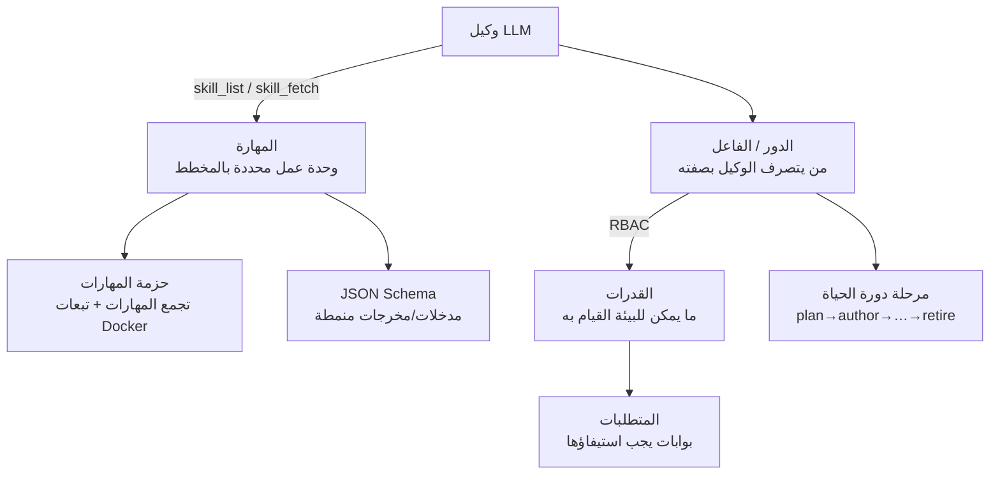

# المهارات والأدوار
{: .no_toc }

هذه الصفحة هي القائمة الرئيسية لكل **مهارة** و**دور** في folio-assistant،
وتوضح كيفية تناسقها وعملها مع النموذج اللغوي الكبير (LLM). للاطلاع على عقد المدخلات/المخرجات
محدد الأنواع لكل مهارة، راجع [مرجع مخططات المهارات](reference/skills/).

1. TOC
{:toc}

---

## كيف تعمل معًا مع النموذج اللغوي الكبير (LLM)

يمنح folio-assistant وكيل النموذج اللغوي الكبير طريقة مهيكلة لإنجاز عمل تأليفي حقيقي.
وتتألف المنظومة من خمسة مفاهيم:

1. **المهارة (Skill)** — وحدة عمل موثقة ومحددة بالمخطط (مثل
   `lean-formalization`). يكتشف الوكيل المهارات عبر أداة MCP المسماة `skill_list`
   ويحمّل تعليمات المهارة عبر `skill_fetch`. ولكل مهارة
   [عقد مدخلات/مخرجات](reference/skills/) محدد الأنواع.
2. **حزمة المهارات (Skill package)** — مجموعة من المهارات المترابطة التي تصرّح أيضًا
   عن تبعات Docker/بيئة التشغيل الخاصة بها (`package-manifest.json`).
3. **الدور (الفاعل / Role (actor))** — *من* يتصرف الوكيل بصفته. يتخذ **الفاعل** (actor)
   **دورًا** بناءً على مسار BPMN الذي يعمل فيه. أما ما يجوز للفاعل **القيام به** فهو
   سياسة W3C ODRL في `policies/`، وليس خاصية تابعة للدور ذاته. وقبل كل مهمة،
   يتحقق المنفذ من المصادقة، وتعيين الدور، والسياسة، والوصول إلى المحتوى
   ([`task-authorization`](reference/skill-instructions/task-authorization.html))؛
   وتستعلم مسارات HTTP عن السياسات نفسها من خلال `src/core/rbac.ts`.
4. **القدرة (Capability)** — إمكانية بيئية ملموسة (مثل `latex-compiler`،
   و`lean-toolchain`). تتطلب المهارات قدرات معينة؛ وتستكشفها أداة `check_dependencies`.
5. **المتطلب (Requirement)** — بوابة يجب استيفاؤها (مثل `commit-hygiene`،
   و`lean-verification`) قبل المضي في مرحلة ما أو في أثنائها.

الحلقة في التطبيق العملي: يقوم الوكيل بتهيئة خطة العمل (`work_plan_prime`)،
ويتحقق من امتلاكه للقدرات التي يحتاجها (`check_dependencies`)، ويسرد المهارة المناسبة
ويحمّلها (`skill_list` ← `skill_fetch`)، وينجز العمل بصفته دور المستخدم
(وفقًا لنظام RBAC)، ثم يتحقق من الصحة/يبني/ينشر عبر أدوات محول المحتوى.

---

## المهارات

### أين توجد المهارات (وحالتها)

تُعرَّف المهارة عبر عدة طبقات — وليس في ملف واحد. وبالنسبة لأي مهارة:

| الطبقة | الموقع | الحالة |
|-------|----------|--------|
| **التعريف** (الأدوار، القدرات المطلوبة، المتطلبات، أنماط التوجيه، مراحل دورة الحياة، مرجع المخطط) | `.claude/skills/local/<skill>.json` | ✅ جميع مهارات التأليف الـ 22 — تم التحقق منها في التكامل المستمر (CI) عبر `scripts/validate-skills.ts` |
| **العقد محدد الأنواع** (JSON Schema للمدخلات/المخرجات) | `schemas/skills/<skill>/` | ✅ جميع الـ 22 — راجع [المرجع](reference/skills/) |
| **متن التعليمات** (الدليل النثري الإرشادي الذي يحمّله النموذج اللغوي) — تصفحها في مرجع [تعليمات المهارات](reference/skill-instructions/) | `skills/content-lifecycle/*.md`، و`skills/folio-*-adapter/*.md`، و`src/skills/*.md` | ✅ مهارات دورة الحياة، والوكيل، وحزمة المنصة، و**folio-document-adapter**؛ ⏳ **نصوص authoring-math / authoring-who-smart-guidelines قيد التحديد (TBD)** (توفر تلك الحزم البيان الرسمي + تعريفات JSON) |
| **الحزمة** (تبعات Docker/بيئة التشغيل) | `skills/<package>/package-manifest.json` | ✅ جميع الحزم الأربع |

إذن، *نعم، المهارات موجودة بالفعل* — كتعريفات مهيكلة + مخططات محددة الأنواع، مع توفير
النصوص النثرية لمهارات دورة الحياة والوكيل. وتخدم أداة MCP المسماة `skill_fetch`
حاليًا النصوص الموجودة في `src/skills/*.md`؛ بينما تمثل النصوص النثرية لمهارات التأليف
الخطوة التالية التي سيتم استكمالها (مع وجود التعريفات والعقود التي ترتبط بها بالفعل).

### شاملة لعدة مجالات: `content-lifecycle`

مراحل دورة الحياة التي تنطبق على **كل** نوع من أنواع المحتوى:

| المهارة | المرحلة | الغرض |
|-------|-------|---------|
| [`content-plan`](reference/skills/content-plan.html) | plan (تخطيط) | تحديد النطاق، والفريق، والجدول الزمني، والحوكمة |
| [`content-author`](reference/skills/content-author.html) | author (تأليف) | إنشاء مخرجات مهيكلة |
| [`content-validate`](reference/skills/content-validate.html) | validate (تحقق) | فحص المخطط + القيود |
| [`content-review`](reference/skills/content-review.html) | review (مراجعة) | المراجعة والاعتماد الرسمي |
| [`content-test`](reference/skills/content-test.html) | test (اختبار) | ضمان جودة شامل من البداية للنهاية / بناء ناجح |
| [`content-publish`](reference/skills/content-publish.html) | publish (نشر) | التصيير والنشر |
| [`content-feedback`](reference/skills/content-feedback.html) | feedback (ملاحظات) | جمع الملاحظات وتصنيفها وتوجيهها |
| `content-retire` | retire (تقاعد) | إيقاف الاستخدام / الأرشفة |

### المستندات وإرشادات السياسات: `folio-document-adapter`

| المهارة | الغرض |
|-------|---------|
| [`document-authoring`](reference/skills/document-authoring.html) | إنشاء الكتل ومراجعتها في folio نثري |
| [`document-structure`](reference/skills/document-structure.html) | الفصول والأقسام — إضافة، وحذف، وإعادة ترتيب |
| [`normative-statements`](reference/skills/normative-statements.html) | تضمين توصية أو متطلب أو قاعدة |
| [`document-publishing`](reference/skills/document-publishing.html) | من Markdown إلى HTML / PDF، دون الحاجة إلى TeX |

### الأوراق والكتب العلمية: `authoring-math`

| المهارة | الغرض |
|-------|---------|
| [`lean-formalization`](reference/skills/lean-formalization.html) | الصياغة الرياضية الرسمية للعبارات/البراهين في Lean 4 |
| [`latex-authoring`](reference/skills/latex-authoring.html) | تأليف مستندات LaTeX |
| [`proof-verification`](reference/skills/proof-verification.html) | التحقق من البراهين، وتدقيق `sorry`/المسلّمات |
| `scientific-visualization` | الأشكال والرسوم البيانية |
| `hypothesis-generation` | اقتراح تخمينات / توجهات بحثية |
| `scientific-critical-thinking` | المراجعة النقدية والجدلية للحجج |

### إرشادات WHO SMART: `authoring-who-smart-guidelines`

| المهارة | الغرض |
|-------|---------|
| [`l2-dak-authoring`](reference/skills/l2-dak-authoring.html) | مخرجات DAK للمستوى L2 (قاموس البيانات، وما إلى ذلك) |
| [`l3-fhir-authoring`](reference/skills/l3-fhir-authoring.html) | موارد FHIR للمستوى L3 عبر FSH |
| [`bpmn-authoring`](reference/skills/bpmn-authoring.html) | العمليات التجارية بـ BPMN 2.0 |
| [`dmn-authoring`](reference/skills/dmn-authoring.html) | جداول قرارات DMN |
| [`terminology-management`](reference/skills/terminology-management.html) | أنظمة الترميز / مجموعات القيم |
| [`fhir-validation`](reference/skills/fhir-validation.html) | التحقق مقابل ملفات تعريف FHIR |
| [`ig-publication`](reference/skills/ig-publication.html) | بناء دليل التطبيق (IG) ونشره |
| [`quality-control`](reference/skills/quality-control.html) | بوابات ضمان الجودة (QA gates) |

### مهارات الوكيل/المنصة (`src/skills`)

المهارات التي يستخدمها النموذج اللغوي للعمل بفعالية في المستودع (تُحمَّل عبر `skill_fetch`،
ضمن حزمة `folio-assistant`):

| المهارة | الغرض |
|-------|---------|
| `corpus-grep` | البحث عبر مجموعة المحتوى (corpus) |

> توجد مهارات `editor`، و`readability-editing`، و`todo-review`، و`symbiotic-interaction`،
> و`deployment-auth` الآن (بصورة عامة) في حزمة **`folio-core`** أدناه —
> ويمكن جلبها باستخدام `package_name="folio-core"`.

يحتاج folio الورقة البحثية إلى مهارات `folio-document-adapter` أيضًا: فالورقة البحثية *هي*
مستند بالإضافة إلى كتل تحتوي على كود Lean، ولذلك ينطبق `document-structure` و
`document-publishing` على كليهما. وتُعد الحزمتان نصفين لنموذج محتوى واحد، وليستا بديلين
للاختيار بينهما.

### مهارات التنسيق المحلي (`.claude/skills/local`)

| المهارة | الغرض |
|-------|---------|
| `prepare-merge` | إيصال الفرع إلى حالة نظيفة/سليمة (green)/قابلة للدمج (راجع أيضًا `/watch`) |
| `bean-coordination` | انضباط الحجز والتنسيق بين الوكلاء المتعددين |
| `todo-manager` | انضباط إدارة المهام عبر beans |

### حزم مهارات المنصة (`skills/folio-core`، و`skills/folio-document-adapter`، و`skills/folio-paper-adapter`)

**حزم المنصة** الأكبر، اثنتان منها تم ترحيلهما من مستودع محتوى qou (راجع
[سجل الترحيل](migrations/2026-06-29-platform-skills-migration.html)
والمسألة [#27](https://github.com/litlfred/folio-assistant/issues/27)). وتتميز بأنها
مستقلة عن المحتوى ومصممة لتتم مزامنتها مع أي folio:

| الحزمة | المهارات | النطاق |
|--------|-------:|-------|
| **`folio-core`** | 43 | تنسيق الوكلاء، وإطار عمل المراقب (watcher)، ومسار ضمان الجودة / التصيير / المراجع / المسرد، والتوثيق، والنشر — ينطبق على *أي* نوع محتوى. |
| **`folio-document-adapter`** | 4 | الـ folios النثرية: تأليف الكتل، وهيكل الفصول/الأقسام، والبيانات المعيارية، ومسار النشر الخالي من TeX. ينطبق على الأوراق البحثية أيضًا. |
| **`folio-paper-adapter`** | 40 | محول الأوراق للرياضيات الرسمية (أي ورقة Lean 4 + LaTeX): سير عمل Lean، وأدوات البراهين، والتحقق من كائنات المحتوى، وLaTeX، وهيكل الورقة، والاستيراد، والمحاكيات. |

تم تجاوز مهارات فيزياء QOU غير القابلة للاختزال؛ وتم تعميم الأمثلة الخاصة بـ QOU في البقية. وتشحن كل حزمة ملف `package-manifest.json`.

> يتم توليد **مخططات** المهارات (المدخلات/المخرجات محددة الأنواع لمهارات التأليف)
> في [مرجع مخططات المهارات](reference/skills/) — ولا تحيد أبدًا عما
> يتحقق منه إطار العمل.

---

## الأدوار (الفاعلون)

تجيب الأدوار عن *من يتصرف الوكيل بصفته*. ويُعيَّن المستخدم الحالي إلى دور
بواسطة `role-assignments.json`، وتحد قدرات الدور مما يمكن للوكيل
القيام به (RBAC). كما أن الأدوار **تتورث** (على سبيل المثال، يرث `author` صلاحيات `reviewer`).

> لمعرفة هذه الأدوار *كمسارات* — من يحرر، ومن يراجع، ومن يعتمد،
> والخطوات التي يمكن للوكيل اتخاذها بمفرده — اقرأ
> [مسار عمل النشر ← من هو من](publication-workflow.html#who-is-who).

### الأشخاص

| الدور | ما يمكنهم فعله |
|------|------------------|
| `viewer` | قراءة فقط كحالة أساسية. عرض المحتوى، دون إجراء تغييرات. |
| `reviewer` | العرض + التعليقات والملاحظات؛ دون إجراء تغييرات مباشرة. |
| `author` | إنشاء/تعديل المحتوى (يرث صلاحيات reviewer). |
| `admin` | وصول إداري كامل — الأدوار، والإعدادات، وجميع المحتويات. |
| `programme-manager` | النطاق، وتشكيل الفريق، والجدول الزمني، وحوكمة أصحاب المصلحة. |
| `technical-officer` | منسق مجالات البرامج + مراجع المرحلة الأولى. |
| `business-analyst` | مؤلف DAK للمستوى L2 (مخططات BPMN، وقواميس البيانات، ومنطق القرارات، والمؤشرات). |
| `clinical-sme` | مدقق سريري / موفر الحقائق الميدانية المرجعية (ground-truth). |
| `terminologist` | حوكمة المصطلحات (ICD-11، وSNOMED CT، وLOINC). |
| `fhir-modeller` | مخرجات FHIR للمستوى L3 (FSH، وSUSHI، وCQL، وناشر IG). |
| `content-reviewer` | الموافقة والاعتماد الرسمي / التوقيع على الانتقال بين المراحل. |
| `qc-reviewer` | ضمان الجودة للجاهزية للنشر عبر مختلف الطبقات. |
| `publication-manager` | الإصدارات، وتكوين دليل التطبيق (IG config)، وعمليات البناء، وإدارة النسخ، والنشر. |
| `translator` | التوطين والترجمة للغات المعتمدة في الأمم المتحدة. |

### الفاعلون في النظام

| الفاعل | ما يوفره | ما لا يمكنه فعله |
|-------|----------|--------|
| `authoring-agent` | صياغة ومراجعة تغيير **مقترح** لكتلة محتوى | التثبيت (Commit) — تنتقل مخرجاته إلى المحرر عبر بوابة التحقق |
| `review-agent` | تحقق غير آلي: الدقة، والأسلوب، والعرض والشرح | الاعتماد (Approve) — يقدم تقارير بالنتائج فقط |
| `lean-mcp` | فحص براهين Lean 4 والتشخيص عبر MCP | — |
| `ig-publisher-service` | بناء FHIR IG Publisher وإعداد تقارير ضمان الجودة | — |

يتم نمذجة موقع كل طرف من هؤلاء في العملية — وما يجوز للوكيل وما لا يجوز له
اتخاذ قرار بشأنه — في مخططات BPMN الخاصة بـ
[مسار عمل النشر](publication-workflow.html).

### تعيين الأدوار

يقوم ملف `role-assignments.json` بتعيين هوية المستخدم (من إعدادات git أو المصادقة) إلى دور
بحسب الأولوية. الإعدادات الافتراضية المضمنة:

| النمط | المصدر | الدور | الأولوية |
|---------|--------|------|----------|
| `litlfred@gmail.com` | git-config | `admin` | 100 |
| `*@who.int` | git-config | `author` | 50 |
| `*` | default | `viewer` | 0 |

---

## القدرات والمتطلبات

**القدرات** هي إمكانيات بيئية ملموسة قد تتطلبها المهارة؛ وتستكشفها
أداة MCP المسماة `check_dependencies`:

`bun-runtime` · `node-runtime` · `python3` · `git-push` · `docker` ·
`latex-compiler` · `lean-toolchain` · `lean-mcp` · `ig-publisher` ·
`sushi-compiler` · `java-runtime` · `jekyll` · `plantuml` · `graphviz`

**المتطلبات** هي بوابات يجب استيفاؤها أثناء العمل:

`commit-hygiene` · `lean-verification` · `fhir-validation` ·
`content-lifecycle` · `session-start`

---

## انظر أيضًا

- [مسار عمل النشر](publication-workflow.html) — مسارات BPMN: أي مهارة تعمل في أي خطوة، ومن يقرر
- [تعليمات المهارات](reference/skill-instructions/) — النصوص النثرية الإرشادية التي يحمّلها النموذج اللغوي (LLM)
- [مرجع مخططات المهارات](reference/skills/) — المدخلات/المخرجات محددة الأنواع لكل مهارة
- [أنواع المحتوى](content-types.html) — المهارات التي يستخدمها كل نوع محتوى
- [البنية الهندسية](architecture.html) — التحكم في الوصول القائم على الأدوار (RBAC)، والمحولات، وخادم MCP
- [البدء](getting-started.html) — تشغيل أول مهارة لك
