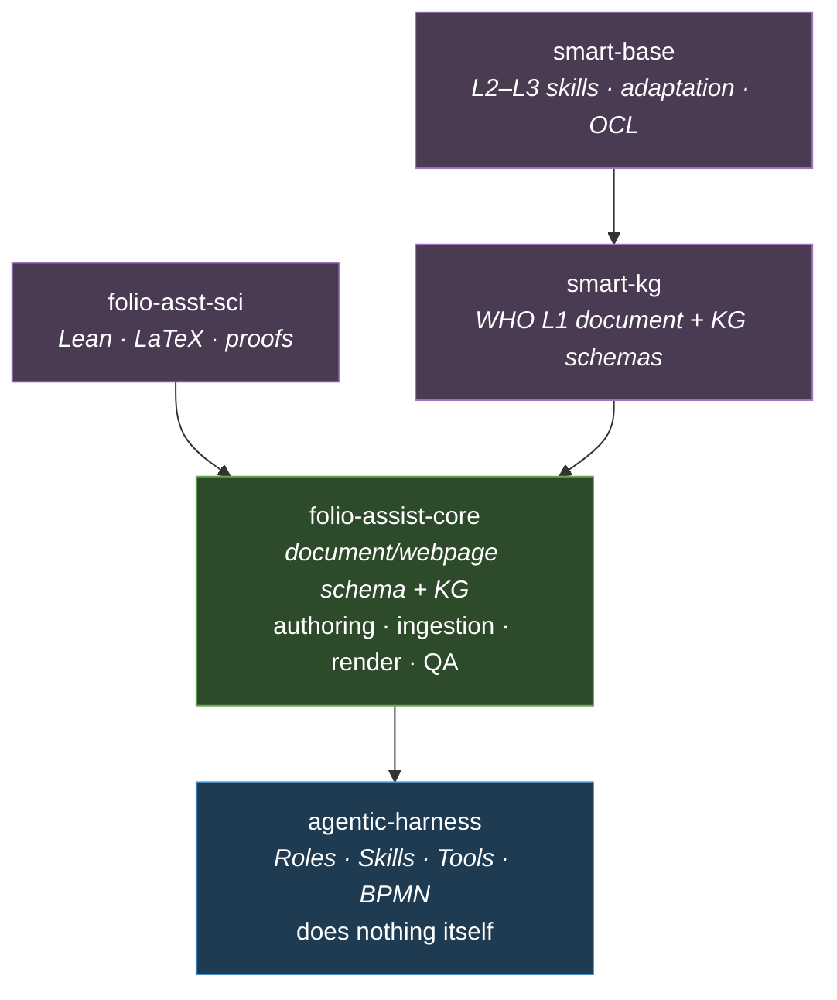

# Future state — five instances, one dependency mechanism
{: .no_toc }

1. TOC
{:toc}

---

> **This page is a proposal, not a description.** The five repositories below
> come from [issue #223](https://github.com/litlfred/folio-assistant/issues/223);
> the mapping of today's directories onto them is this document's work, and
> every judgement call is marked as one. Nothing here has been built.

## The shape

Five folio-assistant instances, composed through the
`dependencies.folioAssistant` mechanism that
[already exists](current-state.html#the-mechanism-the-split-already-has):

Arrows read **"depends on"**. The tree is deliberately shallow and strictly
acyclic — `resolveDependencyTree` has cycle detection, but a cycle here would
mean the boundary is wrong, not that the resolver should cope.

## The five

### `agentic-harness`

**Authoritative for:** how an agent and a human interact — Roles, Skills, Tools,
and the BPMN processes that sequence them. Test and benchmarking infrastructure.
Multi-model handling. Base infrastructure provisioning (OpenStack / Docker /
self-sovereign compute). QA sidecar infrastructure.

**The defining constraint: it does not "do" anything.** It defines what a Skill
*is*, what a Tool definition looks like as a KG node, how a Role scopes
permissions, and how a workflow advances — and it ships no content type, no
validator for any particular document, and no renderer. If a change to
`agentic-harness` would break only one content type, it belongs downstream.

Its own content is **self-documentation**: what installs, how to add a new
skill, how to add an MCP service. It is a Tool repo whose content is its manual.

| today | lands in |
|---|---|
| `src/server.ts`, `src/core/{rbac,git,cache,logging}.ts` | `agentic-harness` |
| `src/workflow/`, `src/tools/workflow.ts`, `processes/*.bpmn` (the three content-agnostic ones) | `agentic-harness` |
| `schemas/assistant-{package,types,workflow}.ts` | `agentic-harness` |
| `src/tools/{check-deps,capabilities,skill-fetch,preferences,beans-prime}.ts` | `agentic-harness` |
| `scripts/install-beans.sh`, `scripts/session-start-coord-sweep.sh`, `beans/` discipline | `agentic-harness` |
| `deploy/`, `Dockerfile`, `skills/framework/`, `skills/remote-packages/` | `agentic-harness` |
| QA **sidecar infrastructure** (the `*.qa.json` mechanism, axes, criterion registry *shape*) | `agentic-harness` |
| QA **criteria** (what a good theorem or a good DAK looks like) | downstream, not here |

That last pair is the sharpest boundary in the whole split, and the easiest to
get wrong. The harness owns *that* QA findings are sidecar JSON with severities
and axes; it must not own *which* findings exist.

### `folio-assist-core`

**Authoritative for:** the base, generic document / webpage / etc. schema and
its knowledge graph; the authoring pipeline; base workflows; ingestion; and the
rendering pipeline that takes a generic "paper" to PDF and to Just-the-Docs.

This is the largest of the five and the one that inherits most of today's repo.
It is what the `document` profile and the `document` adapter already are, plus
the pipeline that serves them.

| today | lands in |
|---|---|
| `schemas/{types,constraints,builders,block-kinds}.ts`, `schemas/jsonld.ts`, `schemas/webpage.ts` | `folio-assist-core` |
| `adapters/document/` | `folio-assist-core` |
| `content/pipeline/` minus the Lean/TeX files | `folio-assist-core` |
| `content/pipeline/render-markdown.ts` + `document_render_{md,html,pdf}` | `folio-assist-core` |
| ingestion (`docs/document-ingestion.md` and its pipeline) | `folio-assist-core` |
| `content/pipeline/readme-sections.ts`, `readme-links.ts`, `src/tools/readme-*.ts` | `folio-assist-core` |
| `skills/{folio-core,folio-document-adapter,content-lifecycle}/` | `folio-assist-core` |
| `translations/`, `schemas/translation.ts`, `src/tools/translation.ts` | `folio-assist-core` |
| `ui/`, `viewer/`, `blueprint/` | `folio-assist-core` (**judgement call** — see below) |

**Judgement call on the viewer.** `ui/`, `viewer/` and `blueprint/` render the
content-object model, which is core's. But `blueprint/` is an interactive
*graph* of a formal dependency structure, which is a scientific-authoring
concern. Splitting the viewer by content type is plausible and probably wrong —
more likely core owns a viewer with a registration point, and `folio-asst-sci`
registers into it. That mechanism does not exist today.

### `folio-asst-sci`

**Authoritative for:** the Lean, LaTeX and simulator content types, and the
scientific-authoring skills. Per the issue, it depends **only** on
`folio-assist-core`.

| today | lands in |
|---|---|
| the seven `MATH_BLOCK_KINDS` in `schemas/block-kinds.ts` | `folio-asst-sci` |
| `adapters/paper/` and `PaperContentAdapter` | `folio-asst-sci` |
| the Lean lifecycle tools — `lean_setup` / `build` / `check` / `status` | `folio-asst-sci` |
| `paper_render_pdf` / `paper_render_html` / `formula_render`, `latex/`, `scripts/render-tex/`, `scripts/docker-latex-build/` | `folio-asst-sci` |
| `computations/`, `src/sage-mcp-server.py` | `folio-asst-sci` |
| `schemas/{formalization-types,lean-packages,precision-scalar,refactor-strategy}.ts` | `folio-asst-sci` |
| `skills/{authoring-math,folio-paper-adapter}/` | `folio-asst-sci` |
| witness/proof-status tooling, `scripts/lean-*` (16 files) | `folio-asst-sci` |

**This repo is the acid test for the dependency model**, because it needs to
contribute all three of: a **block kind** (a schema), an **adapter** (code), and
**MCP tools** (`lean_build`). Until 2026-09-18 the dependency model resolved
[none of the three](current-state.html#what-the-model-used-to-rule-out--resolved-2026-09-18),
which made `folio-asst-sci` unbuildable outright.
[Phase 0.1](migration-plan.html#01--make-the-dependency-model-able-to-carry-the-split--decided-and-built)
has since been decided and built — load-time registration, with collisions
refused rather than resolved by order — so the blocker is cleared. The acid
test still stands: if a future change makes any of the three unreachable from a
dependency again, this repo is the one that stops being buildable first.

### `smart-kg`

**Authoritative for:** the WHO L1 document and knowledge-graph schemas, and the
skills and QA checks that go with them.

L1 is narrative guidance — the published guideline as a structured document. It
is a *document* folio in the existing profile sense, with a WHO-specific schema
layered on. It therefore depends on `folio-assist-core` and not on
`agentic-harness` directly.

| today | lands in |
|---|---|
| WHO L1 document structure, `docs/guides/who-smart-dak.md` (L1 portions) | `smart-kg` |
| L1 QA criteria | `smart-kg` |
| `skills/authoring-who-smart-guidelines/` (L1 portions) | `smart-kg` |

**This is the thinnest mapping on the page**, because L1 is the least-built part
of the current repo. Most WHO material here is L2 (DAK) and L3 (FHIR IG). The
L1/L2 line needs drawing by someone with the WHO SMART Guidelines context before
the split; this page should not invent it.

### `smart-base`

**Authoritative for:** SMART Guidelines skills, services and QA checks across
L2–L3; adaptation skills; OCL skills.

| today | lands in |
|---|---|
| `schemas/dak-blocks.ts`, the `dak` adapter's kinds | `smart-base` |
| `content/pipeline/fsh-cone.ts`, FHIR/FSH tooling | `smart-base` |
| `processes/l2-dak-authoring.bpmn`, `l3-fhir-pipeline.bpmn` | `smart-base` |
| `docs/guides/who-smart-{dak,ig}.md`, `skills/authoring-who-smart-guidelines/` (L2–L3) | `smart-base` |
| the DAK translation extractors (PlantUML, ArchiMate, Excel, BPMN) from [PR #237](https://github.com/litlfred/folio-assistant/pull/237) | `smart-base` |
| OCL skills, adaptation skills | `smart-base` (**mostly not yet written**) |
| DAK QA criteria (bean `sopq`, the WHO IG starter-kit SOPs) | `smart-base` |

`smart-base` depends on `smart-kg` because an L2 DAK is an operationalisation of
an L1 guideline: the DAK's business processes cite L1 recommendations, so the L2
tooling needs L1's schema to resolve them.

## The kind-splits the issue anticipates

> *"some of these may need be split into their respective Tool, Test, etc repos
> to avoid mixing of concerns. e.g. `smart-kg-tools`"*

Applying the [taxonomy's splitting rule](repo-taxonomy.html#splitting-a-mixed-repo)
— split when consumers or cadences differ — gives:

| candidate | split? | why |
|---|---|---|
| `smart-kg` / `smart-kg-tools` | **likely yes** | L1 guidance changes on WHO's cadence; the tooling changes on the platform's. Different reviewers entirely. |
| `smart-base` / `smart-base-tools` | **likely yes** | same argument, and L2–L3 tooling (FSH, OCL, ArchiMate) is heavy and independently versioned |
| `folio-assist-core` | **no** | its schemas and its pipeline always change together; splitting gives two repos with one changelog |
| `agentic-harness` | **no** | it is already a Tool repo whose content is its own manual |
| `folio-asst-sci` | **defer** | plausible later (`-sci-tools` for the Lean/LaTeX toolchain) but not before the extraction itself is proven |

**Test repos are additive, not extractions.** No Test repo exists today
([current state](current-state.html#what-this-repo-is-authoritative-for-today)),
so `smart-base-test`, `folio-core-test` and the rest are Phase III work that
builds something new, not Phase II work that moves something existing. Their
defining requirement is the one from the taxonomy: **test data assets must
themselves be folio content types in the KG**, so SME review of test data is the
same workflow as SME review of anything else.

## Phase III: what the split is *for*

The five repos are not the goal. The goal is that L4 (Consumer apps) and L5
content can be built off `agentic-harness` without inheriting a scientific
paper's LaTeX toolchain or a WHO guideline's FHIR profile — so that a
healthworker- or individual-facing workflow (immunizations is the issue's
example) composes exactly the three or four instances it needs.

That is the test to hold the boundary against. If a new consumer-facing folio
has to depend on `folio-asst-sci` to get a working install, the split has not
achieved anything.

---

Next: [Migration plan](migration-plan.html) — how to get from one to five.
