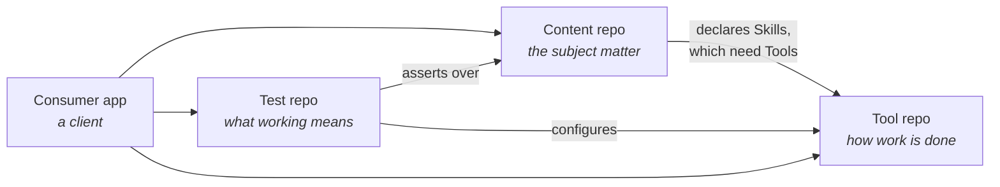

# Repo taxonomy — four kinds of repository
{: .no_toc }

1. TOC
{:toc}

---

## Why a taxonomy at all

folio-assistant is a **self-documenting set of skills** that is today a mixture
of two things: a *Content* repo and a *Tool* repo. That mixture is not a defect
so much as an unexamined default — the platform grew by accreting whatever the
first folio needed, and nothing forced the question *which kind of repo is this
change for?*

The taxonomy below exists to make that question askable on every change. It is
the vocabulary the [future state](future-state.html) and the
[migration plan](migration-plan.html) are written in.

A repository is classified by **what it is authoritative for**, not by what
files happen to sit in it. A repo can be more than one kind — this repo is — but
each kind it claims is a commitment about what consumers may depend on.

## The four kinds

### Tool repos

A Tool repo is authoritative for **how work gets done**.

It may:

- implement a Skill through coordinated use of Tools — scripts, retrieving and
  running software, remote or local services, Docker;
- make Tools available to agents via MCP services;
- make a Tool available for local execution;
- configure Tools for the test harness (ITB — the Interoperability Test Bed);
- define **more than one Tool for a Skill** (the same skill satisfied by a
  local binary, a container, or a remote service).

The load-bearing constraint: **Tool definitions are themselves nodes in the
knowledge graph.** A Tool is not a shell command that happens to exist; it is a
described, addressable object with inputs, outputs and requirements, which means
an agent can reason about substituting one for another.

### Test repos

A Test repo is authoritative for **what "working" means**.

It may:

- contain test data;
- contain test-data generation templates and/or configuration data;
- define Test Plans (FHIR TestScript, or an equivalent);
- define test-language dialects (Gherkin);
- make test data available to the ITB and/or to SME/author review.

The load-bearing constraint: **test data assets should themselves be
folio-assistant content types, in the knowledge graph.** Test data that is
merely files in a directory cannot be reviewed by an SME through the same
workflow as any other content, cannot carry QA sidecars, and cannot be
translated. Treating it as content is what makes SME review of test data the
same activity as SME review of a guideline.

### Content repos

A Content repo is authoritative for **the subject matter**.

It may:

- define schemas for Content types that are nodes of a knowledge graph;
- instantiate instances of those Content types;
- define Skills needed for publication and consumption of Content instances;
- designate Skills as **mechanical** or **human** (see the
  [HCI validation gate](../publication-workflow.html));
- **must** constrain Skill I/O with schemas (JSON Schema, TypeScript).

The `must` is the only hard requirement in the taxonomy, and it is what makes a
Content repo composable: a Skill whose inputs and outputs are unconstrained
cannot be substituted, tested, or run by an agent that has not read its prose.

### Consumer apps

A Consumer app is authoritative for **nothing** — it is a client, and it is
listed here because what consumers are permitted to depend on is what fixes the
public surface of the other three.

A Consumer app may:

- utilise KG schemas and instance data from Content repos;
- execute decision logic or indicator calculations from Content repos;
- utilise Test repos and/or Tool repos in developing their apps, preparing for
  a connectathon, or compliance testing.

## The composition rule

The kinds compose in one direction:

**A Tool repo must not depend on a Content repo.** This is the rule the current
repo breaks most often, and the one the migration exists to enforce. Every
genericity failure recorded in `AGENTS.md` — a platform script naming
`quantum-observable-universe`, a README generator carrying one folio's badges,
a module namespace hardcoded to `QOU.` — is the same violation: Tool code that
cannot run without a particular Content repo.

The inverse is fine and expected. A Content repo names the Tools its Skills
need, because that is what declaring a Skill *is*.

## Splitting a mixed repo

When a repo is more than one kind, the split is worth doing when the kinds have
**different consumers** or **different release cadences** — not merely when they
are conceptually distinct.

`smart-kg` and `smart-kg-tools` is the worked example from the issue: the WHO L1
document and KG schemas change when the guidance changes; the skills and services
that operate on them change when the tooling improves. Different cadences,
different reviewers, so different repos. Whereas splitting a Content repo's
schemas from its instances would give two repos that always change together.

---

Next: [Current state](current-state.html) — what this repo is today, measured.
