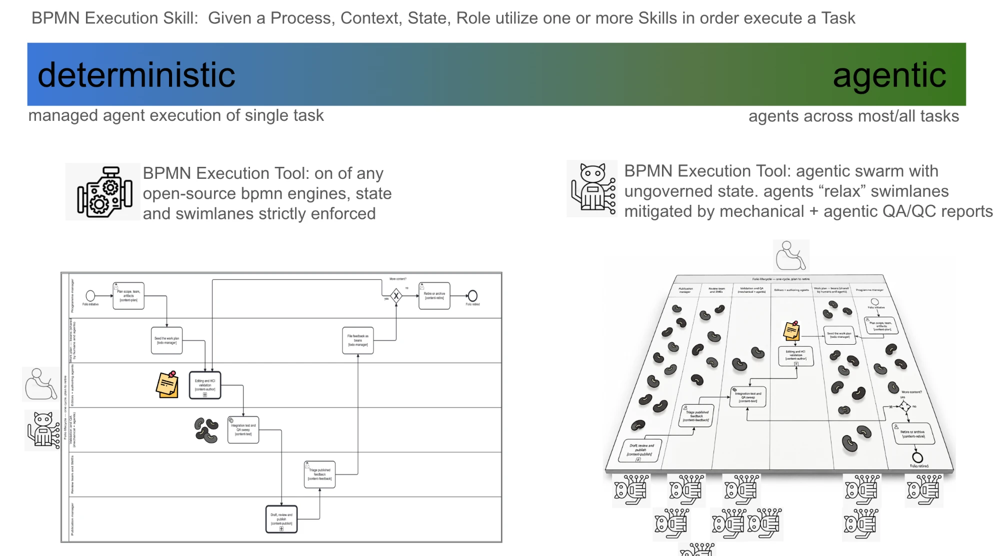
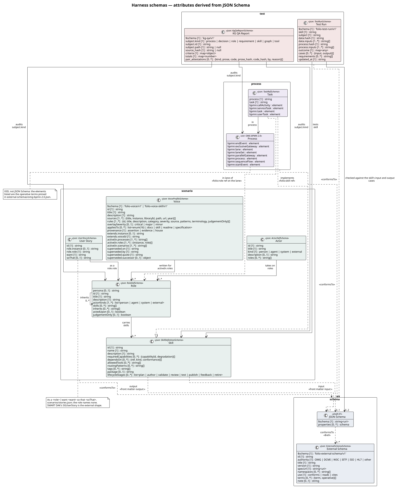
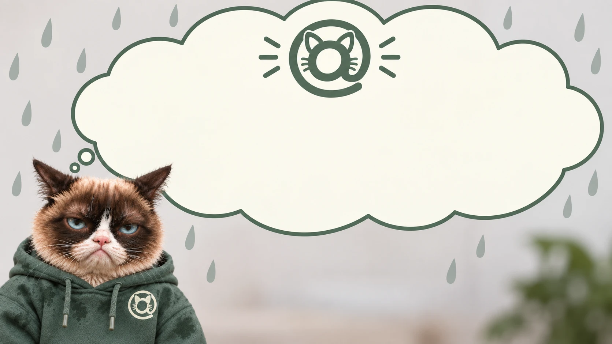

<!-- Generated by scripts/gen-docs-pages.ts from content/docs/concepts-harnessed-kg-overview/. Do not hand-edit: the next run overwrites it, and `docs:pages:check` fails on the difference. -->

# Harnessed Knowledge Graph Overview
{: .no_toc }

<button type="button" class="fa-qa-badge fa-qa-pending fa-qa-fam-translation" data-qa-family="translation" data-qa-key="page.translation" data-qa-label="Translation QA" data-qa-noun="page" data-qa-src="{{ '/assets/qa/concepts-harnessed-kg-overview/page.translation.json' | relative_url }}" data-qa-index="{{ '/assets/qa/concepts-harnessed-kg-overview/qa-index.json' | relative_url }}" aria-expanded="false" aria-busy="true" title="Translation QA: loading the verdict…" aria-label="Translation QA: loading the verdict…">TR…</button>

  
On this page

  {: .text-delta }
1. TOC
{:toc}

_This page is generated from [`content/docs/concepts-harnessed-kg-overview/`](https://github.com/litlfred/folio-assistant/tree/main/content/docs/concepts-harnessed-kg-overview) — each section below links to its own source._

[✎ Edit](https://github.com/litlfred/folio-assistant/edit/main/content/docs/concepts-harnessed-kg-overview/overview.md){: .fa-node-edit title="Edit content/docs/concepts-harnessed-kg-overview/overview.md" } <button type="button" class="fa-qa-badge fa-qa-pending fa-qa-fam-block" data-qa-family="block" data-qa-key="overview.block" data-qa-label="Content QA" data-qa-noun="block" data-qa-src="{{ '/assets/qa/concepts-harnessed-kg-overview/overview.block.json' | relative_url }}" data-qa-index="{{ '/assets/qa/concepts-harnessed-kg-overview/qa-index.json' | relative_url }}" aria-expanded="false" aria-busy="true" title="Content QA: loading the verdict…" aria-label="Content QA: loading the verdict…">QA…</button> <button type="button" class="fa-qa-badge fa-qa-pending fa-qa-fam-translation" data-qa-family="translation" data-qa-key="overview.translation" data-qa-label="Translation QA" data-qa-noun="block" data-qa-src="{{ '/assets/qa/concepts-harnessed-kg-overview/overview.translation.json' | relative_url }}" data-qa-index="{{ '/assets/qa/concepts-harnessed-kg-overview/qa-index.json' | relative_url }}" aria-expanded="false" aria-busy="true" title="Translation QA: loading the verdict…" aria-label="Translation QA: loading the verdict…">TR…</button>

The owner's deck *KG / folio-asst* (2026-09-30), rebuilt as a page. The page
is generated from the content and assets it describes, so it moves when they
move. The original is kept, frozen and dated, as the L1 source
`cat-harness/library/kg-folio-asst-2026-09-30`: thirteen slides, their speaker notes and all 33 images with
descriptions.

**Two differences from the original, both deliberate:**

- **The words are text.** Most of the original's content was baked into
  pictures, which search, translation and screen readers cannot reach. Every
  word below was read off those images and written out. The deck's own pictures
  are kept beside that text. Where the repository **generates** a picture (the
  BPMN process, the UML model), today's version is shown and the slide's version
  sits collapsed beneath it, so the current one is never the one you have to
  open.
- **Each slide is checked against the knowledge graph.** Under every slide,
  **Sources** names the KG nodes it depends on. A **Misaligned** note says where
  the snapshot and today's KG disagree, and which one is right. The last
  section lists them all.

**Format.** One slide is one `##` section of plain Markdown. That is Pandoc's
slide-level convention, so this same page can be converted to reveal.js,
Beamer or PPTX by Pandoc if a file is ever needed. No second source is kept.
Metadata follows schema.org `PresentationDigitalDocument`.

## 1 — Human and agentic actors and the SMART Guidelines content levels
{: #slide-01 data-fa-label="sec:harnessed-kg-overview-slide-01" }

[✎ Edit](https://github.com/litlfred/folio-assistant/edit/main/content/docs/concepts-harnessed-kg-overview/slide-01.md){: .fa-node-edit title="Edit content/docs/concepts-harnessed-kg-overview/slide-01.md" } <button type="button" class="fa-qa-badge fa-qa-pending fa-qa-fam-block" data-qa-family="block" data-qa-key="slide-01.block" data-qa-label="Content QA" data-qa-noun="block" data-qa-src="{{ '/assets/qa/concepts-harnessed-kg-overview/slide-01.block.json' | relative_url }}" data-qa-index="{{ '/assets/qa/concepts-harnessed-kg-overview/qa-index.json' | relative_url }}" aria-expanded="false" aria-busy="true" title="Content QA: loading the verdict…" aria-label="Content QA: loading the verdict…">QA…</button> <button type="button" class="fa-qa-badge fa-qa-pending fa-qa-fam-translation" data-qa-family="translation" data-qa-key="slide-01.translation" data-qa-label="Translation QA" data-qa-noun="block" data-qa-src="{{ '/assets/qa/concepts-harnessed-kg-overview/slide-01.translation.json' | relative_url }}" data-qa-index="{{ '/assets/qa/concepts-harnessed-kg-overview/qa-index.json' | relative_url }}" aria-expanded="false" aria-busy="true" title="Translation QA: loading the verdict…" aria-label="Translation QA: loading the verdict…">TR…</button>

WHO envisions a future where everyone in the world benefits fully and
immediately from clinical, public health and data-use recommendations. SMART
Guidelines systematize and accelerate the consistent application of recommended,
life-saving interventions in the digital age.

  

| level | | what it produces | on the slide |
|---|---|---|---|
| **L1** Narrative | WHO guideline publications | a knowledge graph of literature and data sources |  |
| **L2** Operational | the Digital Adaptation Kit | structured requirements |    |
| **L3** Machine readable | FHIR implementation guides | fully computable assets |    |
| **L4** Executable | reference software | customizable software |    |
| **L5** Dynamic | trained, optimised algorithms | advanced analytics for precision health |  |

**What spans which levels.** Under the five levels the slide draws four bars,
and each bar's reach is part of what the slide says. Read from the slide's
geometry, not its text:

<table class="kg-deck-spans">
<caption>Bars under the SMART levels on slide 1: each cell spans the levels its bar covers.</caption>
<thead><tr><th scope="col">bar</th><th scope="col">L1</th><th scope="col">L2</th><th scope="col">L3</th><th scope="col">L4</th><th scope="col">L5</th></tr></thead>
<tbody>
<tr><th scope="row">content</th><td colspan="3">content: L1 to L3</td><td></td><td></td></tr>
<tr><th scope="row">test data</th><td></td><td colspan="3">test data: L2 to L4</td><td></td></tr>
<tr><th scope="row">tooling</th><td></td><td></td><td colspan="2">tooling: L3 and L4</td><td></td></tr>
<tr><th scope="row">apps</th><td></td><td></td><td></td><td>apps: L4</td><td></td></tr>
</tbody>
</table>

So content is authored across L1 to L3, and L3 is where content and tooling
meet. Test data starts at the DAK and runs through executable software, and
apps are L4 alone. **No bar reaches L5.**

Two questions sit at the two ends of the band. **How can I reliably author,
review and adjudicate faster?** is drawn on the left, over L1, beside the human
actor (the cat at the laptop). **How am I verifiable?** is drawn on the right,
over L5, beside the agentic actor (the robot cat). The slide pairs each question
with an actor by position only; it states no pairing in words.

**Sources:** [FHIR content — the five layers](../fhir/fhir-content.html#the-three-layers);
`smart-base/library/mehl-2021-who-smart-guidelines` (the primary source, Lancet
Digital Health 2021); `smart-base/library/9789240093362-eng` §1.2 (WHO's handbook
restating them).

> **Misaligned (fixed on this branch):** the docs said SMART Guidelines "names
> three layers". It names five. The page now lists all five and says why
> FHIR content stops at L3.
>
> **Misread, and corrected here:** an earlier version of this page flattened
> the bars into one "who asks" label per level (content for L1 and L2, tooling
> for L3, apps for L4 and L5) and said test data "sits beside every level". The
> slide's geometry says otherwise: the table above is measured from the deck's
> shape positions.

## 2 — Accessing the WHO L1 corpus
{: #slide-02 data-fa-label="sec:harnessed-kg-overview-slide-02" }

[✎ Edit](https://github.com/litlfred/folio-assistant/edit/main/content/docs/concepts-harnessed-kg-overview/slide-02.md){: .fa-node-edit title="Edit content/docs/concepts-harnessed-kg-overview/slide-02.md" } <button type="button" class="fa-qa-badge fa-qa-pending fa-qa-fam-block" data-qa-family="block" data-qa-key="slide-02.block" data-qa-label="Content QA" data-qa-noun="block" data-qa-src="{{ '/assets/qa/concepts-harnessed-kg-overview/slide-02.block.json' | relative_url }}" data-qa-index="{{ '/assets/qa/concepts-harnessed-kg-overview/qa-index.json' | relative_url }}" aria-expanded="false" aria-busy="true" title="Content QA: loading the verdict…" aria-label="Content QA: loading the verdict…">QA…</button> <button type="button" class="fa-qa-badge fa-qa-pending fa-qa-fam-translation" data-qa-family="translation" data-qa-key="slide-02.translation" data-qa-label="Translation QA" data-qa-noun="block" data-qa-src="{{ '/assets/qa/concepts-harnessed-kg-overview/slide-02.translation.json' | relative_url }}" data-qa-index="{{ '/assets/qa/concepts-harnessed-kg-overview/qa-index.json' | relative_url }}" aria-expanded="false" aria-busy="true" title="Translation QA: loading the verdict…" aria-label="Translation QA: loading the verdict…">TR…</button>

WHO's public-health information is split between literature repositories, **IRIS**
(DSpace), and structured indicators in the **World Health Data Hub**. Unifying
them into one knowledge graph needs a platform with room to grow to about
**10 TB**, with high throughput and without high network costs.

| problem | proposed answer |
|---|---|
| Egress fees make serving 10 TB globally unpredictable | a zero-egress public CDN holding signed static assets |
| Automated traffic, above all in emergencies, can overload internal systems | decouple: an internal secure origin, published snapshots outside it |
| Authenticity and chain of custody in an era of AI-generated content | sign every published asset (WHO Trust Network gateway) |

The architecture drawn on the slide runs in three stages. An internal secure
origin (IRIS and the Data Hub) feeds an automated compile engine: folio-assistant
builds, signs, snapshots and publishes. That engine feeds a public CDN, named on
the slide as Cloudflare R2 storage and the Cloudflare edge network.

**Sources:** [`kg-to-portal`](../reference/skill-instructions/kg-to-portal.html)
(package and per-asset signatures; "a CDN is a LAYER");
`large-datasets` (the WHO IRIS source descriptor); `who-iris` (the DSpace skill).

> **Misaligned — proposal, not decision:** the repository treats the CDN as a
> swappable layer. `kg-to-portal` and `large-datasets`' artifact store name
> Cloudflare and R2 only as examples beside GitHub Pages, jsDelivr and S3. The
> slide names Cloudflare as *the* choice. Before this deck, the 10 TB figure,
> the World Health Data Hub and "Swiss Observatory schemas" appeared nowhere in
> the repository. The decision is now recorded, as **proposed, with no outcome yet**, in bean
> `l9v6` (MADR form). It holds the drivers, three real options (Cloudflare R2 +
> CDN, GitHub Pages alone, another object store + CDN) and what has to be
> measured before one is chosen. Read this slide as that proposal.

## 3 — The ten components of an L2 DAK
{: #slide-03 data-fa-label="sec:harnessed-kg-overview-slide-03" }

[✎ Edit](https://github.com/litlfred/folio-assistant/edit/main/content/docs/concepts-harnessed-kg-overview/slide-03.md){: .fa-node-edit title="Edit content/docs/concepts-harnessed-kg-overview/slide-03.md" } <button type="button" class="fa-qa-badge fa-qa-pending fa-qa-fam-block" data-qa-family="block" data-qa-key="slide-03.block" data-qa-label="Content QA" data-qa-noun="block" data-qa-src="{{ '/assets/qa/concepts-harnessed-kg-overview/slide-03.block.json' | relative_url }}" data-qa-index="{{ '/assets/qa/concepts-harnessed-kg-overview/qa-index.json' | relative_url }}" aria-expanded="false" aria-busy="true" title="Content QA: loading the verdict…" aria-label="Content QA: loading the verdict…">QA…</button> <button type="button" class="fa-qa-badge fa-qa-pending fa-qa-fam-translation" data-qa-family="translation" data-qa-key="slide-03.translation" data-qa-label="Translation QA" data-qa-noun="block" data-qa-src="{{ '/assets/qa/concepts-harnessed-kg-overview/slide-03.translation.json' | relative_url }}" data-qa-index="{{ '/assets/qa/concepts-harnessed-kg-overview/qa-index.json' | relative_url }}" aria-expanded="false" aria-busy="true" title="Translation QA: loading the verdict…" aria-label="Translation QA: loading the verdict…">TR…</button>

| # | component | what it holds |
|---|---|---|
| 1 | Health interventions and recommendations | the WHO guideline's recommendations; informs DAK scope |
| 2 | Generic personas | roles, responsibilities and interventions of the targeted personas |
| 3 | User scenarios | brief narratives of how the personas engage with the system |
| 4 | Business processes and workflows | generic clinical and non-clinical workflows; when data is collected and used |
| 5 | Core data elements | data for decisions and indicators; informs forms and L3 interoperability |
| 6 | Decision-support logic | decision tables for counselling and treatment algorithms |
| 7 | Scheduling logic | decision tables for scheduling by care plan (formerly part of 6) |
| 8 | Indicators and monitoring | numerators and denominators; person-centred data linked to aggregate |
| 9 | Functional and non-functional requirements | key functions and requirements of a digital tracking and decision-support system |
| 10 | Test scenarios | test data and scenarios to check a system against the other nine |

The slide drew nine cards and put the tenth, **testing: test data and test harness**, beside them. The squares below give all ten a card, and are generated from `DAK_COMPONENTS` (`smart-base/scripts/gen-dak-components-figure.ts`), so a component added there cannot go without one.

The figure as it appeared on the slide (2026-09-30): nine cards

**Sources:** the owner, 2026-09-30 (ten: the original eight plus scheduling
logic and test scenarios); the SMART Base 1.0.0 `DAK` logical model;
[the L2 artefacts and their skills](../guides/who-smart-dak.html).

> **Misaligned, in three directions:** the speaker notes said 8. The figure
> shows 9 cards, with testing beside them. The SMART Base `DAK` logical model
> (`DAK.fsh`) declares 9 fields: test scenarios **in**,
> scheduling logic carried **inside** decision-support logic. The owner's
> count is 10. WHO's IG starter kit disagrees with itself the same way: its
> introduction counts 9 with scheduling and no testing, and its table counts 9
> with test scenarios and scheduling inside decision support. Scheduling logic is authored as DMN decision tables but may not
> yet be formalized as its own L2 component or L3 artefact, and that is the
> gap the logical model shows. This repository's `DAK_COMPONENTS` lists all
> ten and marks scheduling logic as not yet formalized. The notes are
> corrected in the owner's copy.

## 4 — Existing L1/L2/L3 schemas
{: #slide-04 data-fa-label="sec:harnessed-kg-overview-slide-04" }

[✎ Edit](https://github.com/litlfred/folio-assistant/edit/main/content/docs/concepts-harnessed-kg-overview/slide-04.md){: .fa-node-edit title="Edit content/docs/concepts-harnessed-kg-overview/slide-04.md" } <button type="button" class="fa-qa-badge fa-qa-pending fa-qa-fam-block" data-qa-family="block" data-qa-key="slide-04.block" data-qa-label="Content QA" data-qa-noun="block" data-qa-src="{{ '/assets/qa/concepts-harnessed-kg-overview/slide-04.block.json' | relative_url }}" data-qa-index="{{ '/assets/qa/concepts-harnessed-kg-overview/qa-index.json' | relative_url }}" aria-expanded="false" aria-busy="true" title="Content QA: loading the verdict…" aria-label="Content QA: loading the verdict…">QA…</button> <button type="button" class="fa-qa-badge fa-qa-pending fa-qa-fam-translation" data-qa-family="translation" data-qa-key="slide-04.translation" data-qa-label="Translation QA" data-qa-noun="block" data-qa-src="{{ '/assets/qa/concepts-harnessed-kg-overview/slide-04.translation.json' | relative_url }}" data-qa-index="{{ '/assets/qa/concepts-harnessed-kg-overview/qa-index.json' | relative_url }}" aria-expanded="false" aria-busy="true" title="Translation QA: loading the verdict…" aria-label="Translation QA: loading the verdict…">TR…</button>

SMART Base publishes a JSON Schema, and an OpenAPI description, for every DAK
logical model and value set. Examples are the decision-support logic, health
interventions, functional and non-functional requirements, program indicator,
core data element, persona and business-process workflow models, the Dublin
Core metadata set, and value sets such as the classification of digital health
interventions. A source reference such as `DecisionSupportLogicSource` must give
exactly one of `url`, `canonical` or an inline `instance`.

On the slide the JSON Schema is drawn over the list as a callout of one entry,
`DecisionSupportLogicSource`, so it reads as "this is what one of these
entries holds". The QR code beside it points at the API page.

**Source:** <https://smart.who.int/base/dak-api.html>; the ingested index
`smart-base/fhir-artifact-index`.

> **Aligned in count, not checked item by item:** the slide shows "Logical
> Model Schemas (25 available)", and the ingested index holds 25
> StructureDefinition pages.

## 5 — Tie the L1/L2/L3 models into the larger KG
{: #slide-05 data-fa-label="sec:harnessed-kg-overview-slide-05" }

[✎ Edit](https://github.com/litlfred/folio-assistant/edit/main/content/docs/concepts-harnessed-kg-overview/slide-05.md){: .fa-node-edit title="Edit content/docs/concepts-harnessed-kg-overview/slide-05.md" } <button type="button" class="fa-qa-badge fa-qa-pending fa-qa-fam-block" data-qa-family="block" data-qa-key="slide-05.block" data-qa-label="Content QA" data-qa-noun="block" data-qa-src="{{ '/assets/qa/concepts-harnessed-kg-overview/slide-05.block.json' | relative_url }}" data-qa-index="{{ '/assets/qa/concepts-harnessed-kg-overview/qa-index.json' | relative_url }}" aria-expanded="false" aria-busy="true" title="Content QA: loading the verdict…" aria-label="Content QA: loading the verdict…">QA…</button> <button type="button" class="fa-qa-badge fa-qa-pending fa-qa-fam-translation" data-qa-family="translation" data-qa-key="slide-05.translation" data-qa-label="Translation QA" data-qa-noun="block" data-qa-src="{{ '/assets/qa/concepts-harnessed-kg-overview/slide-05.translation.json' | relative_url }}" data-qa-index="{{ '/assets/qa/concepts-harnessed-kg-overview/qa-index.json' | relative_url }}" aria-expanded="false" aria-busy="true" title="Translation QA: loading the verdict…" aria-label="Translation QA: loading the verdict…">TR…</button>

The DAK logical model (SMART Base 1.0.0) is a complete kit with its metadata
(id, name, title, description, version, status, publication, preview and
canonical URLs, licence, copyright year, publisher) and its components: nine in this model, ten by the owner's count (see slide 3). Each
component is held as a **source reference**, not inline: by URL, by canonical or
as an instance. That indirection is what lets the kit's parts be nodes of a
larger graph.

**Sources:** <https://smart.who.int/base/StructureDefinition-DAK.html>;
[FHIR content — the DAK API surface](../fhir/fhir-content.html#the-dak-surface).

## 6 — Roles, tasks, skills and tests in the publication lifecycle
{: #slide-06 data-fa-label="sec:harnessed-kg-overview-slide-06" }

[✎ Edit](https://github.com/litlfred/folio-assistant/edit/main/content/docs/concepts-harnessed-kg-overview/slide-06.md){: .fa-node-edit title="Edit content/docs/concepts-harnessed-kg-overview/slide-06.md" } <button type="button" class="fa-qa-badge fa-qa-pending fa-qa-fam-block" data-qa-family="block" data-qa-key="slide-06.block" data-qa-label="Content QA" data-qa-noun="block" data-qa-src="{{ '/assets/qa/concepts-harnessed-kg-overview/slide-06.block.json' | relative_url }}" data-qa-index="{{ '/assets/qa/concepts-harnessed-kg-overview/qa-index.json' | relative_url }}" aria-expanded="false" aria-busy="true" title="Content QA: loading the verdict…" aria-label="Content QA: loading the verdict…">QA…</button> <button type="button" class="fa-qa-badge fa-qa-pending fa-qa-fam-translation" data-qa-family="translation" data-qa-key="slide-06.translation" data-qa-label="Translation QA" data-qa-noun="block" data-qa-src="{{ '/assets/qa/concepts-harnessed-kg-overview/slide-06.translation.json' | relative_url }}" data-qa-index="{{ '/assets/qa/concepts-harnessed-kg-overview/qa-index.json' | relative_url }}" aria-expanded="false" aria-busy="true" title="Translation QA: loading the verdict…" aria-label="Translation QA: loading the verdict…">TR…</button>

An **agent** uses **skills** to execute one or more **tasks** in a **process**.
It works with a knowledge graph of static context (skills, user stories) and
dynamic context. A skill may have zero or more **tools**, used for **test**
execution anywhere on the deterministic-to-agentic spectrum.

- **Role:** played by a human, agentic or mechanical actor; a swimlane in BPMN.
- **Task:** a step in a process; a node in BPMN.
-  **Skill:** a gated capability with schema-defined inputs and outputs.
- **Test:** used to compare models, or for author review.
-  **Agentic state:** *beans*, which agents use to coordinate and track their
  state within a process ("changes to the vaccination schedule ready for review in
  staging").
-  **Human state:** *todos*, attached to process steps or knowledge assets
  ("please review this change in medication").

![Folio lifecycle — one cycle, plan to retire. A BPMN collaboration of six lanes: programme manager, work plan (beans shared by humans and agents), editors and authoring agents, validation and QA, review team and SMEs, publication manager. Tasks in order: plan scope, team and artefacts; seed the work plan; editing and HCI validation; integration test and QA sweep; draft, review and publish; triage published feedback; file feedback as beans; then a gateway, more content, which loops back to editing or ends in retire or archive.](../assets/img/workflows/content-lifecycle.svg)

The diagram as it appeared on the slide (2026-09-30)

**How the slide labels the diagram.** On the slide the terms sit around the
BPMN picture and lines tie each one to a part of it:

- **Process** points at the whole diagram, captioned *(publication lifecycle)*,
  with *(Context)* beside it.
- **User Story** is tied to **Role**, and **Role** to one lane, the one labelled
  *Editor* (editors and authoring agents).
- **Task** points at one node in that lane, *Edit Doc* (today: editing and HCI
  validation).
- **Skill** hangs off that task, and **Test** hangs off the skill.
- The beans icon sits by agentic state and the sticky note by human state.

So the slide says a user story names a role, a role is a lane, a task is a node
in it, a skill belongs to a task, and a test belongs to a skill.

**Sources:** `folio-assistant-core/processes/content/content-lifecycle.bpmn` (the picture above is generated
from it); [beans and todos](../guides/beans-and-todos.html).

> **Aligned:** the snapshot's diagram and today's process have the same six
> lanes and the same eight tasks.

## 7 — BPMN execution, from deterministic to agentic
{: #slide-07 data-fa-label="sec:harnessed-kg-overview-slide-07" }

[✎ Edit](https://github.com/litlfred/folio-assistant/edit/main/content/docs/concepts-harnessed-kg-overview/slide-07.md){: .fa-node-edit title="Edit content/docs/concepts-harnessed-kg-overview/slide-07.md" } <button type="button" class="fa-qa-badge fa-qa-pending fa-qa-fam-block" data-qa-family="block" data-qa-key="slide-07.block" data-qa-label="Content QA" data-qa-noun="block" data-qa-src="{{ '/assets/qa/concepts-harnessed-kg-overview/slide-07.block.json' | relative_url }}" data-qa-index="{{ '/assets/qa/concepts-harnessed-kg-overview/qa-index.json' | relative_url }}" aria-expanded="false" aria-busy="true" title="Content QA: loading the verdict…" aria-label="Content QA: loading the verdict…">QA…</button> <button type="button" class="fa-qa-badge fa-qa-pending fa-qa-fam-translation" data-qa-family="translation" data-qa-key="slide-07.translation" data-qa-label="Translation QA" data-qa-noun="block" data-qa-src="{{ '/assets/qa/concepts-harnessed-kg-overview/slide-07.translation.json' | relative_url }}" data-qa-index="{{ '/assets/qa/concepts-harnessed-kg-overview/qa-index.json' | relative_url }}" aria-expanded="false" aria-busy="true" title="Translation QA: loading the verdict…" aria-label="Translation QA: loading the verdict…">TR…</button>

**BPMN execution skill:** given a process, context, state and role, use one or
more skills to execute a task.

- **Deterministic end:** managed agent execution of a single task. The tool is
  any open-source BPMN engine, and state and swimlanes are strictly enforced.
- **Agentic end:** agents work across most or all tasks. The tool is an agentic
  swarm with ungoverned state. Agents "relax" swimlanes, and mechanical plus
  agentic QA/QC reports mitigate it.

**What the two halves place where.** On the deterministic side the human and
the agentic actor stand *beside* the flat diagram's lanes, with one sticky note
on the authoring task and one bean on the test task: one task at a time, each
state marker where its task is. On the agentic side the human rides *above* the
board, a row of agents hangs *beneath* it, and beans lie in every lane.

**Sources:** [BPMN execution](agentic-harness.html);
[`specification-compiled-agents`](../methodologies/index.html) (which now cites this deck).

> **Partly built:** no BPMN engine is wired in, and the agentic QA/QC report
> does not exist yet. The mechanical one does: `bun run prov:qaqc`.

## 8 — Core data models
{: #slide-08 data-fa-label="sec:harnessed-kg-overview-slide-08" }

[✎ Edit](https://github.com/litlfred/folio-assistant/edit/main/content/docs/concepts-harnessed-kg-overview/slide-08.md){: .fa-node-edit title="Edit content/docs/concepts-harnessed-kg-overview/slide-08.md" } <button type="button" class="fa-qa-badge fa-qa-pending fa-qa-fam-block" data-qa-family="block" data-qa-key="slide-08.block" data-qa-label="Content QA" data-qa-noun="block" data-qa-src="{{ '/assets/qa/concepts-harnessed-kg-overview/slide-08.block.json' | relative_url }}" data-qa-index="{{ '/assets/qa/concepts-harnessed-kg-overview/qa-index.json' | relative_url }}" aria-expanded="false" aria-busy="true" title="Content QA: loading the verdict…" aria-label="Content QA: loading the verdict…">QA…</button> <button type="button" class="fa-qa-badge fa-qa-pending fa-qa-fam-translation" data-qa-family="translation" data-qa-key="slide-08.translation" data-qa-label="Translation QA" data-qa-noun="block" data-qa-src="{{ '/assets/qa/concepts-harnessed-kg-overview/slide-08.translation.json' | relative_url }}" data-qa-index="{{ '/assets/qa/concepts-harnessed-kg-overview/qa-index.json' | relative_url }}" aria-expanded="false" aria-busy="true" title="Translation QA: loading the verdict…" aria-label="Translation QA: loading the verdict…">TR…</button>

The harness's own schemas, drawn from the JSON Schemas they are generated from,
in four packages. **test** holds the KG QA report and the test run. **process**
holds the task and the OMG BPMN 2.0 process. **scenario** holds actor, role,
user story, voice and skill. **schema** holds JSON Schema and external schema. An actor
takes on roles, a role carries skills, a task sits in a lane of a role and uses
a skill, a test run tests a skill, and a QA report audits any kind of subject.

The diagram as it appeared on the slide (2026-09-30), without Voice Profile

**Source:** `bun run uml:overview` regenerates the picture above from the schemas.

> **Misaligned — the snapshot is older:** today's diagram has a **Voice
> Profile** class that slide 8 does not. The picture above is the current one.
> The owner's copy now shows it too: slide 8 carries a fresh render, cropped
> to the same four packages.

## 9 — Knowledge graphs in git, and the questions each repository kind answers
{: #slide-09 data-fa-label="sec:harnessed-kg-overview-slide-09" }

[✎ Edit](https://github.com/litlfred/folio-assistant/edit/main/content/docs/concepts-harnessed-kg-overview/slide-09.md){: .fa-node-edit title="Edit content/docs/concepts-harnessed-kg-overview/slide-09.md" } <button type="button" class="fa-qa-badge fa-qa-pending fa-qa-fam-block" data-qa-family="block" data-qa-key="slide-09.block" data-qa-label="Content QA" data-qa-noun="block" data-qa-src="{{ '/assets/qa/concepts-harnessed-kg-overview/slide-09.block.json' | relative_url }}" data-qa-index="{{ '/assets/qa/concepts-harnessed-kg-overview/qa-index.json' | relative_url }}" aria-expanded="false" aria-busy="true" title="Content QA: loading the verdict…" aria-label="Content QA: loading the verdict…">QA…</button> <button type="button" class="fa-qa-badge fa-qa-pending fa-qa-fam-translation" data-qa-family="translation" data-qa-key="slide-09.translation" data-qa-label="Translation QA" data-qa-noun="block" data-qa-src="{{ '/assets/qa/concepts-harnessed-kg-overview/slide-09.translation.json' | relative_url }}" data-qa-index="{{ '/assets/qa/concepts-harnessed-kg-overview/qa-index.json' | relative_url }}" aria-expanded="false" aria-busy="true" title="Translation QA: loading the verdict…" aria-label="Translation QA: loading the verdict…">TR…</button>

Knowledge graphs are managed in git repositories, made of self-documenting JSON
and JSON-LD. Content is rendered in several formats for downstream knowledge
products and for public, clinical and personal health applications.

| kind | the question it answers | examples on the slide |
|---|---|---|
| **Tool** repos | how can we compare deterministic and agentic workflows in well-defined processes? | `who/smart-kg-tools`, `ohs/folio-asst-tools` |
| **Content** repos | how can agentic workflows support quality-assured, evidence-based authoring and publication, and how can agentic access to knowledge assets keep trusted provenance without overloading existing systems? | `ohs/harness`, `ohs/folio-asst`, `who/ref-arch`, `who/iris`, `who/smart-hiv`, `kenya/smart-hiv`, `who/data-hub` |
| **Test** repos | how can we adjudicate, quality-control and compliance-test model performance in several modalities? | `who/smart-imz-test`, `kenya/smart-hiv-test` |
| **Consumer apps** | how can they be assured in agentic public-health and clinical workflows? | `app:ohs-*`, `app:anthropic-mcp`, `app:turn.io` |

**The colours are slide 1's.** Each repository kind is filled in the colour of
a bar under the SMART levels on slide 1: tool repos in *tooling*'s colour, test
repos in *test data*'s, consumer apps in *apps*', and content repos unfilled
like *content*. So the slide ties each kind to a span of levels: content to L1
to L3, tools to L3 and L4, tests to L2 to L4, apps to L4.

**Source:** [Repo taxonomy](architecture/repo-taxonomy.html).

> **Misaligned — target, not current:** none of these repositories exists under
> these names. Today it is one monorepo, `litlfred/folio-assistant`, with
> instance directories (`cat-harness`, `folio-assistant-core`, `smart-base`,
> `smart-immunizations`, `who-iris`, …).
> [Current state](architecture/current-state.html) is the measured picture, and
> the slide is the [future state](architecture/future-state.html).

## 10 — What each repository kind may do
{: #slide-10 data-fa-label="sec:harnessed-kg-overview-slide-10" }

[✎ Edit](https://github.com/litlfred/folio-assistant/edit/main/content/docs/concepts-harnessed-kg-overview/slide-10.md){: .fa-node-edit title="Edit content/docs/concepts-harnessed-kg-overview/slide-10.md" } <button type="button" class="fa-qa-badge fa-qa-pending fa-qa-fam-block" data-qa-family="block" data-qa-key="slide-10.block" data-qa-label="Content QA" data-qa-noun="block" data-qa-src="{{ '/assets/qa/concepts-harnessed-kg-overview/slide-10.block.json' | relative_url }}" data-qa-index="{{ '/assets/qa/concepts-harnessed-kg-overview/qa-index.json' | relative_url }}" aria-expanded="false" aria-busy="true" title="Content QA: loading the verdict…" aria-label="Content QA: loading the verdict…">QA…</button> <button type="button" class="fa-qa-badge fa-qa-pending fa-qa-fam-translation" data-qa-family="translation" data-qa-key="slide-10.translation" data-qa-label="Translation QA" data-qa-noun="block" data-qa-src="{{ '/assets/qa/concepts-harnessed-kg-overview/slide-10.translation.json' | relative_url }}" data-qa-index="{{ '/assets/qa/concepts-harnessed-kg-overview/qa-index.json' | relative_url }}" aria-expanded="false" aria-busy="true" title="Translation QA: loading the verdict…" aria-label="Translation QA: loading the verdict…">TR…</button>

- **Tool repos** may implement a skill through coordinated tools (scripts,
  retrieved software, local or remote services, containers). They may make tools
  available to agents over MCP or for local execution, configure tools for the
  test harness (the ITB), and define more than one tool for a skill.
- **Content repos** may define schemas for the content types of KG nodes and
  instantiate them. They may define the skills needed to publish and consume
  that content, and designate each skill agentic, mechanical or human. They
  **must** constrain skill inputs and outputs with schemas (JSON, `.ts`).
- **Test repos** may hold test data, test-data generation templates and
  configuration, FHIR test plans and test-language dialects (Gherkin), and may
  make test data available to the ITB and to SME review.
- **Consumer apps** may use KG schemas and instance data from content repos,
  execute their decision logic or indicator calculations, and use test and tool
  repos to develop, prepare for a connectathon or test compliance.

**How the slide relates them.** Slide 10 draws named repositories joined by
labelled lines. The lines carry no arrowheads, so the direction below is read
from each label, not from the drawing:

| from | relation | to |
|---|---|---|
| `who/smart-kg` | depends on | `who/smart-base` |
| `who/smart-immz` | depends on | `who/smart-base` |
| `who/smart-kg` | references | `who/smart-kg-tools` |
| `who/smart-base` | references | `who/smart-base-tools` |
| `who/smart-immz` | references | `who/smart-imz-test` |
| `who/smart-kg-tools` | utilizes | `who/smart-base-tools` |
| `who/smart-imz-test` | utilizes | `who/smart-base-tools` |
| consumer apps | utilize | `who/smart-immz`, `who/smart-imz-test` |

Read as a rule: **depends on** runs content to content, **references** runs from
content to its own tools and tests, and **utilizes** runs from a tool, a test or
an app to what it uses.

**Sources:** [Repo taxonomy](architecture/repo-taxonomy.html);
[KGraph repositories](../kgraph.html).

> **Aligned:** slide 10's `who/smart-kg` is a real, separate repository, which
> is the repo taxonomy's worked example of splitting content from tools. Its
> stub directory in this checkout was removed because the repository already
> exists elsewhere (bean `wg7r`), and the taxonomy now says so. An earlier
> version of this note read that removal as the example going stale.

## 11 — C@T: the computable asset acquisition, adjudication and agentic test tool harness
{: #slide-11 data-fa-label="sec:harnessed-kg-overview-slide-11" }

[✎ Edit](https://github.com/litlfred/folio-assistant/edit/main/content/docs/concepts-harnessed-kg-overview/slide-11.md){: .fa-node-edit title="Edit content/docs/concepts-harnessed-kg-overview/slide-11.md" } <button type="button" class="fa-qa-badge fa-qa-pending fa-qa-fam-block" data-qa-family="block" data-qa-key="slide-11.block" data-qa-label="Content QA" data-qa-noun="block" data-qa-src="{{ '/assets/qa/concepts-harnessed-kg-overview/slide-11.block.json' | relative_url }}" data-qa-index="{{ '/assets/qa/concepts-harnessed-kg-overview/qa-index.json' | relative_url }}" aria-expanded="false" aria-busy="true" title="Content QA: loading the verdict…" aria-label="Content QA: loading the verdict…">QA…</button> <button type="button" class="fa-qa-badge fa-qa-pending fa-qa-fam-translation" data-qa-family="translation" data-qa-key="slide-11.translation" data-qa-label="Translation QA" data-qa-noun="block" data-qa-src="{{ '/assets/qa/concepts-harnessed-kg-overview/slide-11.translation.json' | relative_url }}" data-qa-index="{{ '/assets/qa/concepts-harnessed-kg-overview/qa-index.json' | relative_url }}" aria-expanded="false" aria-busy="true" title="Translation QA: loading the verdict…" aria-label="Translation QA: loading the verdict…">TR…</button>

*caaaaatt → caa∞aat → ca&at → c@t → **cat-harness***. The name compresses one
letter at a time. The harness is the platform layer every folio builds on.

**Sources:** [the harness](harness.html); `cat-harness/cat-harness.json`.

> **Misaligned — "not yet live":** the slide gives <http://litlfred.github.io/>
> and <http://github.com/litlfred/> with no path. The harness is published
> today as part of <https://litlfred.github.io/folio-assistant/>.

## 12 — folio-assistant
{: #slide-12 data-fa-label="sec:harnessed-kg-overview-slide-12" }

[✎ Edit](https://github.com/litlfred/folio-assistant/edit/main/content/docs/concepts-harnessed-kg-overview/slide-12.md){: .fa-node-edit title="Edit content/docs/concepts-harnessed-kg-overview/slide-12.md" } <button type="button" class="fa-qa-badge fa-qa-pending fa-qa-fam-block" data-qa-family="block" data-qa-key="slide-12.block" data-qa-label="Content QA" data-qa-noun="block" data-qa-src="{{ '/assets/qa/concepts-harnessed-kg-overview/slide-12.block.json' | relative_url }}" data-qa-index="{{ '/assets/qa/concepts-harnessed-kg-overview/qa-index.json' | relative_url }}" aria-expanded="false" aria-busy="true" title="Content QA: loading the verdict…" aria-label="Content QA: loading the verdict…">QA…</button> <button type="button" class="fa-qa-badge fa-qa-pending fa-qa-fam-translation" data-qa-family="translation" data-qa-key="slide-12.translation" data-qa-label="Translation QA" data-qa-noun="block" data-qa-src="{{ '/assets/qa/concepts-harnessed-kg-overview/slide-12.translation.json' | relative_url }}" data-qa-index="{{ '/assets/qa/concepts-harnessed-kg-overview/qa-index.json' | relative_url }}" aria-expanded="false" aria-busy="true" title="Translation QA: loading the verdict…" aria-label="Translation QA: loading the verdict…">TR…</button>

Site: <https://litlfred.github.io/folio-assistant/> ·
repository: <https://github.com/litlfred/folio-assistant>

> **Misaligned — broken link:** the slide spells the repository
> `github.com/litlfred/folio-assitant` (missing an *s*). That link resolves to
> nothing. It is corrected in the owner's copy.

## 13 — Operating model: how the layers meet
{: #slide-13 data-fa-label="sec:harnessed-kg-overview-slide-13" }

[✎ Edit](https://github.com/litlfred/folio-assistant/edit/main/content/docs/concepts-harnessed-kg-overview/slide-13.md){: .fa-node-edit title="Edit content/docs/concepts-harnessed-kg-overview/slide-13.md" } <button type="button" class="fa-qa-badge fa-qa-pending fa-qa-fam-block" data-qa-family="block" data-qa-key="slide-13.block" data-qa-label="Content QA" data-qa-noun="block" data-qa-src="{{ '/assets/qa/concepts-harnessed-kg-overview/slide-13.block.json' | relative_url }}" data-qa-index="{{ '/assets/qa/concepts-harnessed-kg-overview/qa-index.json' | relative_url }}" aria-expanded="false" aria-busy="true" title="Content QA: loading the verdict…" aria-label="Content QA: loading the verdict…">QA…</button> <button type="button" class="fa-qa-badge fa-qa-pending fa-qa-fam-translation" data-qa-family="translation" data-qa-key="slide-13.translation" data-qa-label="Translation QA" data-qa-noun="block" data-qa-src="{{ '/assets/qa/concepts-harnessed-kg-overview/slide-13.translation.json' | relative_url }}" data-qa-index="{{ '/assets/qa/concepts-harnessed-kg-overview/qa-index.json' | relative_url }}" aria-expanded="false" aria-busy="true" title="Translation QA: loading the verdict…" aria-label="Translation QA: loading the verdict…">TR…</button>

**An actor performs a task in a process as a role, using that role's skills.**

| | | |
|---|---|---|
| **Actor** | *who* | a concrete participant, human, agentic or mechanical; carries permissions across all lanes |
| **Task** | *does what* | an activity in a diagram; names the skill to run and the bean operation to perform |
| **Process** | *where* | an executable BPMN diagram with DMN gateways; its state is committed so sibling sessions agree |
| **Role** | *as whom* | a swimlane; an actor acts as a reviewer only for the length of a lane |
| **Skill** | *knowing how* | the instruction body for the task; lives in the knowledge graph and is inherited across instances |

**Sources:** [platform](../platform.html); the `role-model` skill.

> **Aligned:** the Actor schema spells the three kinds `person`, `agent` and
> `system` (human, agentic and mechanical), and adds a fourth, `external`: a
> participant outside this instance, which is never given a task. The
> `role-model` skill and the schema's own documentation state the same
> mapping. An earlier version of this note called the four values a
> contradiction. That read the enum without its documentation.

## Misalignments at a glance
{: #misalignments data-fa-label="sec:harnessed-kg-overview-misalignments" }

[✎ Edit](https://github.com/litlfred/folio-assistant/edit/main/content/docs/concepts-harnessed-kg-overview/misalignments.md){: .fa-node-edit title="Edit content/docs/concepts-harnessed-kg-overview/misalignments.md" } <button type="button" class="fa-qa-badge fa-qa-pending fa-qa-fam-block" data-qa-family="block" data-qa-key="misalignments.block" data-qa-label="Content QA" data-qa-noun="block" data-qa-src="{{ '/assets/qa/concepts-harnessed-kg-overview/misalignments.block.json' | relative_url }}" data-qa-index="{{ '/assets/qa/concepts-harnessed-kg-overview/qa-index.json' | relative_url }}" aria-expanded="false" aria-busy="true" title="Content QA: loading the verdict…" aria-label="Content QA: loading the verdict…">QA…</button> <button type="button" class="fa-qa-badge fa-qa-pending fa-qa-fam-translation" data-qa-family="translation" data-qa-key="misalignments.translation" data-qa-label="Translation QA" data-qa-noun="block" data-qa-src="{{ '/assets/qa/concepts-harnessed-kg-overview/misalignments.translation.json' | relative_url }}" data-qa-index="{{ '/assets/qa/concepts-harnessed-kg-overview/qa-index.json' | relative_url }}" aria-expanded="false" aria-busy="true" title="Translation QA: loading the verdict…" aria-label="Translation QA: loading the verdict…">TR…</button>

| slide | what disagrees | which is right | state |
|---|---|---|---|
| 1 | docs said SMART has three layers | five (Mehl et al. 2021, the primary source) | fixed on this branch |
| 1 | this page flattened the bars under the levels | the slide's geometry: content L1–L3, test data L2–L4, tooling L3–L4, apps L4, none at L5 | corrected on this page |
| 2 | Cloudflare named as *the* CDN; 10 TB, Data Hub, "Swiss Observatory" appear nowhere else | undecided — the repo keeps the CDN swappable | recorded as proposed: bean `l9v6` |
| 3 | notes 8; figure 9; logical model 9, scheduling not its own field | 10: the original 8 + scheduling logic + test scenarios (owner) | code lists 10, scheduling marked unformalized; WHO model lags |
| 8 | UML lacks Voice Profile | the generated diagram | page shows current; owner's copy re-rendered |
| 9 | target repository names | the monorepo today | target vs current |
| 9 | this page listed `ohs/harness` as a tool repo | the slide places it with the content repos | corrected on this page |
| 10 | this page summarised the relations in one line, wrongly | the eight labelled lines on the slide | corrected on this page |
| 11 | "not yet live" links | published under folio-assistant | snapshot only |
| 12 | `folio-assitant` link | `folio-assistant` | corrected in the owner's copy |

Aligned: slides 4 (count), 5, 6 (same lanes and tasks), 7 (partly built), 10 (`smart-kg` is its own repository) and 13 (three taskable actor kinds, plus `external`).
