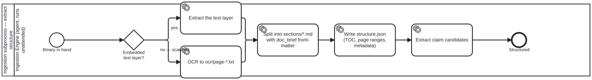
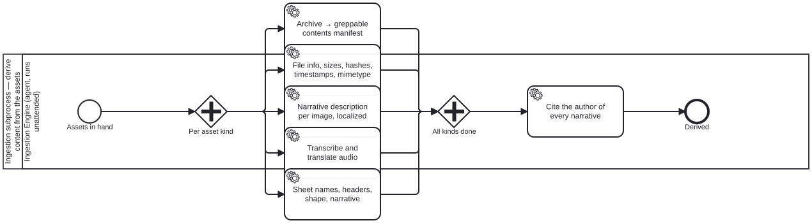
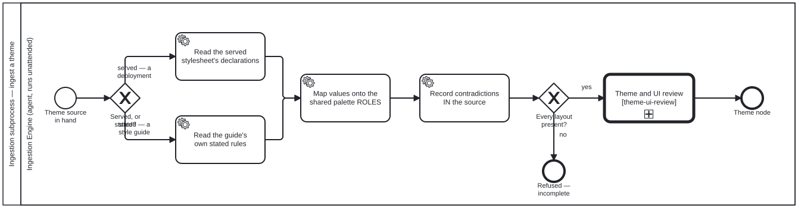
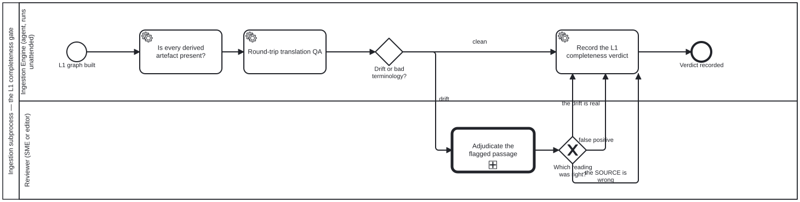

<!-- Generated by scripts/gen-docs-pages.ts from content/docs/document-ingestion/. Do not hand-edit: the next run overwrites it, and `docs:pages:check` fails on the difference. -->

# Document ingestion
{: .no_toc }

TR

  
On this page

  {: .text-delta }
1. TOC
{:toc}

_This page is generated from [`content/docs/document-ingestion/`](https://github.com/litlfred/folio-assistant/tree/main/content/docs/document-ingestion) — each section below links to its own source._

[✎ Edit](https://github.com/litlfred/folio-assistant/edit/main/content/docs/document-ingestion/overview.md){: .fa-node-edit title="Edit content/docs/document-ingestion/overview.md" } <button type="button" class="fa-qa-badge fa-qa-pending fa-qa-fam-block" data-qa-family="block" data-qa-key="overview.block" data-qa-label="Content QA" data-qa-noun="block" data-qa-src="{{ '/assets/qa/document-ingestion/overview.block.json' | relative_url }}" data-qa-index="{{ '/assets/qa/document-ingestion/qa-index.json' | relative_url }}" aria-expanded="false" aria-busy="true" title="Content QA: loading the verdict…" aria-label="Content QA: loading the verdict…">QA…</button> TR

How a dropped file becomes an **L1 source** the corpus can cite — expressed as
**BPMN 2.0 swimlane diagrams**, with the Ingestion Engine as a named actor and
every not-yet-built step linked to the bean that tracks it.

---

## `uploads/` and `library/` are two stages of one pipeline
{: #uploads-and-library-are-two-stages-of-one-pipeline data-fa-label="sec:document-ingestion-uploads-and-library-are-two-stages-of-one-pipeline" }

[✎ Edit](https://github.com/litlfred/folio-assistant/edit/main/content/docs/document-ingestion/uploads-and-library-are-two-stages-of-one-pipeline.md){: .fa-node-edit title="Edit content/docs/document-ingestion/uploads-and-library-are-two-stages-of-one-pipeline.md" } <button type="button" class="fa-qa-badge fa-qa-pending fa-qa-fam-block" data-qa-family="block" data-qa-key="uploads-and-library-are-two-stages-of-one-pipeline.block" data-qa-label="Content QA" data-qa-noun="block" data-qa-src="{{ '/assets/qa/document-ingestion/uploads-and-library-are-two-stages-of-one-pipeline.block.json' | relative_url }}" data-qa-index="{{ '/assets/qa/document-ingestion/qa-index.json' | relative_url }}" aria-expanded="false" aria-busy="true" title="Content QA: loading the verdict…" aria-label="Content QA: loading the verdict…">QA…</button> TR

They are not the same directory under two names, and the distinction is
load-bearing:

| | `uploads/` | `library/<bib-slug>/` |
|---|---|---|
| what it holds | raw files as dropped | ingested, structured, described |
| stage | incoming queue | **L1 source content** |
| greppable by the corpus checklist | **no** | yes |

That last row is the one that costs sessions. The corpus-grep checklist
searches `library/` only — so a paper still sitting in `uploads/` does not
merely go unread, it makes a **clean grep** read as *"nobody has done this"*
while the source is sitting on disk. An un-ingested source is worse than an
absent one, because it produces false confidence rather than a gap.

## `library/` is L1
{: #library-is-l1 data-fa-label="sec:document-ingestion-library-is-l1" }

[✎ Edit](https://github.com/litlfred/folio-assistant/edit/main/content/docs/document-ingestion/library-is-l1.md){: .fa-node-edit title="Edit content/docs/document-ingestion/library-is-l1.md" } <button type="button" class="fa-qa-badge fa-qa-pending fa-qa-fam-block" data-qa-family="block" data-qa-key="library-is-l1.block" data-qa-label="Content QA" data-qa-noun="block" data-qa-src="{{ '/assets/qa/document-ingestion/library-is-l1.block.json' | relative_url }}" data-qa-index="{{ '/assets/qa/document-ingestion/qa-index.json' | relative_url }}" aria-expanded="false" aria-busy="true" title="Content QA: loading the verdict…" aria-label="Content QA: loading the verdict…">QA…</button> TR

Anything under `library/` is **L1 source content**. Any knowledge-graph
reference to a source — from a paper, an L2 DAK, an L3 IG, or any other
artefact — resolves to it **through `library/`**, never to a loose path or a
bare URL.

A bibliography entry may point at a **remote** asset rather than a local
binary. That lives in a sibling `assets[]` field carrying kind / role /
url-or-path / checksum / retrieved — **not** inside `library:`, because
`LibraryRef` is regenerated from the tree on every sync and an authored URL
placed there is silently dropped.

## The pipeline
{: #the-pipeline data-fa-label="sec:document-ingestion-the-pipeline" }

[✎ Edit](https://github.com/litlfred/folio-assistant/edit/main/processes/document-ingestion.bpmn){: .fa-node-edit title="Edit processes/document-ingestion.bpmn" } <button type="button" class="fa-qa-badge fa-qa-pending fa-qa-fam-block" data-qa-family="block" data-qa-key="the-pipeline.block" data-qa-label="Content QA" data-qa-noun="block" data-qa-src="{{ '/assets/qa/document-ingestion/the-pipeline.block.json' | relative_url }}" data-qa-index="{{ '/assets/qa/document-ingestion/qa-index.json' | relative_url }}" aria-expanded="false" aria-busy="true" title="Content QA: loading the verdict…" aria-label="Content QA: loading the verdict…">QA…</button> TR <button type="button" class="fa-qa-badge fa-qa-pending fa-qa-fam-kg" data-qa-family="kg" data-qa-key="the-pipeline.kg" data-qa-label="Knowledge-graph QA" data-qa-noun="diagram" data-qa-src="{{ '/assets/qa/document-ingestion/the-pipeline.kg.json' | relative_url }}" data-qa-index="{{ '/assets/qa/document-ingestion/qa-index.json' | relative_url }}" aria-expanded="false" aria-busy="true" title="Knowledge-graph QA: loading the verdict…" aria-label="Knowledge-graph QA: loading the verdict…">KG…</button>

  

[Open the BPMN source](https://github.com/litlfred/folio-assistant/blob/main/processes/document-ingestion.bpmn){: .btn .btn-outline }

Four things in that diagram are worth reading closely.

**The Ingestion Engine is an actor, not a script.** It runs unattended. A drop
during an editing session triggers ingestion in the background — the
contributor does not wait for it, and nothing about the editing flow blocks on
it.

**The failure edge is a bean, not a log line.** When the completeness gate finds
a missing derived artefact, the engine opens a bean and the document **stays in
`uploads/`**. It does not land half-ingested in `library/` looking finished.

**Each subprocess is its own file**, called with `bpmn:callActivity` and
declared with `bpmn:import`. Open any of them on its own in bpmn.io; the parent
stays readable because it does not inline them.

**The end is where authoring begins.** "Available to cite as an L1 source" is
the hand-off into [the publication workflow](publication-workflow.html) — the
same corpus an author edits and a reviewer reviews.

### Extract structure
{: #extract-structure data-fa-label="sec:document-ingestion-extract-structure" }

[✎ Edit](https://github.com/litlfred/folio-assistant/edit/main/processes/ingest-extract-structure.bpmn){: .fa-node-edit title="Edit processes/ingest-extract-structure.bpmn" } <button type="button" class="fa-qa-badge fa-qa-pending fa-qa-fam-block" data-qa-family="block" data-qa-key="extract-structure.block" data-qa-label="Content QA" data-qa-noun="block" data-qa-src="{{ '/assets/qa/document-ingestion/extract-structure.block.json' | relative_url }}" data-qa-index="{{ '/assets/qa/document-ingestion/qa-index.json' | relative_url }}" aria-expanded="false" aria-busy="true" title="Content QA: loading the verdict…" aria-label="Content QA: loading the verdict…">QA…</button> TR <button type="button" class="fa-qa-badge fa-qa-pending fa-qa-fam-kg" data-qa-family="kg" data-qa-key="extract-structure.kg" data-qa-label="Knowledge-graph QA" data-qa-noun="diagram" data-qa-src="{{ '/assets/qa/document-ingestion/extract-structure.kg.json' | relative_url }}" data-qa-index="{{ '/assets/qa/document-ingestion/qa-index.json' | relative_url }}" aria-expanded="false" aria-busy="true" title="Knowledge-graph QA: loading the verdict…" aria-label="Knowledge-graph QA: loading the verdict…">KG…</button>

  

[Open the BPMN source](https://github.com/litlfred/folio-assistant/blob/main/processes/ingest-extract-structure.bpmn){: .btn .btn-outline }

The OCR branch is the one to know about. A document ingested that way keeps its
text in `ocr/page-*.txt` and only a **stub** in `sections/` — so the documented
`sections/` grep cannot see its mathematics at all. That asymmetry is why the
corpus-grep checklist has a fourth tier, and why a clean `sections/` grep is not
evidence that the library lacks a topic.

Each section file carries the document brief in its front-matter. That is
contextual retrieval: a chunk in isolation loses what makes it mean anything, so
a hit is interpretable without opening anything else.

### Derive content
{: #derive-content data-fa-label="sec:document-ingestion-derive-content" }

[✎ Edit](https://github.com/litlfred/folio-assistant/edit/main/processes/ingest-derive-content.bpmn){: .fa-node-edit title="Edit processes/ingest-derive-content.bpmn" } <button type="button" class="fa-qa-badge fa-qa-pending fa-qa-fam-block" data-qa-family="block" data-qa-key="derive-content.block" data-qa-label="Content QA" data-qa-noun="block" data-qa-src="{{ '/assets/qa/document-ingestion/derive-content.block.json' | relative_url }}" data-qa-index="{{ '/assets/qa/document-ingestion/qa-index.json' | relative_url }}" aria-expanded="false" aria-busy="true" title="Content QA: loading the verdict…" aria-label="Content QA: loading the verdict…">QA…</button> TR <button type="button" class="fa-qa-badge fa-qa-pending fa-qa-fam-kg" data-qa-family="kg" data-qa-key="derive-content.kg" data-qa-label="Knowledge-graph QA" data-qa-noun="diagram" data-qa-src="{{ '/assets/qa/document-ingestion/derive-content.kg.json' | relative_url }}" data-qa-index="{{ '/assets/qa/document-ingestion/qa-index.json' | relative_url }}" aria-expanded="false" aria-busy="true" title="Knowledge-graph QA: loading the verdict…" aria-label="Knowledge-graph QA: loading the verdict…">KG…</button>

  

[Open the BPMN source](https://github.com/litlfred/folio-assistant/blob/main/processes/ingest-derive-content.bpmn){: .btn .btn-outline }

**This subprocess is mostly not built yet.** Every task in it is tracked; see
the table below. It is drawn in full anyway, because the shape of the pipeline
is the thing being agreed, and a diagram that shows only what already exists
cannot be used to decide what to build.

The step that is easy to skip and expensive to retrofit is the last one. A
generated description is **a claim by someone**, not a property of the file.
Recording whether a human or an agent wrote it — and for an agent, which model
version — is what lets a reader weigh it, and what makes a superseded model's
descriptions findable as a set later. It is unrecoverable once lost.

### Ingest the theme
{: #ingest-the-theme data-fa-label="sec:document-ingestion-ingest-the-theme" }

[✎ Edit](https://github.com/litlfred/folio-assistant/edit/main/processes/ingest-theme.bpmn){: .fa-node-edit title="Edit processes/ingest-theme.bpmn" } QA TR <button type="button" class="fa-qa-badge fa-qa-pending fa-qa-fam-kg" data-qa-family="kg" data-qa-key="ingest-the-theme.kg" data-qa-label="Knowledge-graph QA" data-qa-noun="diagram" data-qa-src="{{ '/assets/qa/document-ingestion/ingest-the-theme.kg.json' | relative_url }}" data-qa-index="{{ '/assets/qa/document-ingestion/qa-index.json' | relative_url }}" aria-expanded="false" aria-busy="true" title="Knowledge-graph QA: loading the verdict…" aria-label="Knowledge-graph QA: loading the verdict…">KG…</button>

  

[Open the BPMN source](https://github.com/litlfred/folio-assistant/blob/main/processes/ingest-theme.bpmn){: .btn .btn-outline }

**Only some sources are themes, and a person decides which.** After content is
derived, the gateway *A theme source?* asks whoever is ingesting whether this
document also carries a theme: a deployed site that serves one, or a style
guide that states one. There is deliberately no rule that computes the answer.
Whether a branded document is a theme source is an authoring judgement, and
the owner ruled it so for bean `j66n`. A source that is not a theme skips
straight to building the knowledge graph.

The decision sits at a gateway, not inside the subprocess, because "this is
not a theme" and "this theme is malformed" are different outcomes. The first
is the normal case. The second is a defect, and the subprocess reports it by
refusing.

Inside, the two kinds of source differ in one step only: a deployment's
**served** stylesheet is read for its declarations, while a guide's **stated**
rules are read as it writes them. After that the paths join:

- values are mapped onto the shared palette **roles**;
- contradictions **in the source** are recorded as data, never silently resolved
  by picking one;
- a value the source is silent on is marked as a choice, not presented as a
  measurement;
- if a layout is missing, the subprocess **refuses** as incomplete rather than
  producing a theme quietly degraded to the layouts it was given.

A complete theme goes to the theme and UI review, and the result is one Theme
node. It is one node kind, not three, because the palette vocabulary is shared
and only the geometry varies between a sticky, a webpage and a publication.

### Build the L1 knowledge graph
{: #build-the-l1-knowledge-graph data-fa-label="sec:document-ingestion-build-the-l1-knowledge-graph" }

[✎ Edit](https://github.com/litlfred/folio-assistant/edit/main/processes/ingest-build-l1-kg.bpmn){: .fa-node-edit title="Edit processes/ingest-build-l1-kg.bpmn" } <button type="button" class="fa-qa-badge fa-qa-pending fa-qa-fam-block" data-qa-family="block" data-qa-key="build-the-l1-knowledge-graph.block" data-qa-label="Content QA" data-qa-noun="block" data-qa-src="{{ '/assets/qa/document-ingestion/build-the-l1-knowledge-graph.block.json' | relative_url }}" data-qa-index="{{ '/assets/qa/document-ingestion/qa-index.json' | relative_url }}" aria-expanded="false" aria-busy="true" title="Content QA: loading the verdict…" aria-label="Content QA: loading the verdict…">QA…</button> TR <button type="button" class="fa-qa-badge fa-qa-pending fa-qa-fam-kg" data-qa-family="kg" data-qa-key="build-the-l1-knowledge-graph.kg" data-qa-label="Knowledge-graph QA" data-qa-noun="diagram" data-qa-src="{{ '/assets/qa/document-ingestion/build-the-l1-knowledge-graph.kg.json' | relative_url }}" data-qa-index="{{ '/assets/qa/document-ingestion/qa-index.json' | relative_url }}" aria-expanded="false" aria-busy="true" title="Knowledge-graph QA: loading the verdict…" aria-label="Knowledge-graph QA: loading the verdict…">KG…</button>

  

[Open the BPMN source](https://github.com/litlfred/folio-assistant/blob/main/processes/ingest-build-l1-kg.bpmn){: .btn .btn-outline }

Each folder gets a **standalone `dublin-core.jsonld`** as its record of truth,
referenced from `manifest.jsonld`. `dcterms` is already this corpus's JSON-LD
vocabulary, so this extends a live context rather than introducing one.

The folder name **is** the bibliography citation key, so a citation and a
directory are the same string.

### The L1 completeness gate
{: #the-l1-completeness-gate data-fa-label="sec:document-ingestion-the-l1-completeness-gate" }

[✎ Edit](https://github.com/litlfred/folio-assistant/edit/main/processes/ingest-l1-completeness-gate.bpmn){: .fa-node-edit title="Edit processes/ingest-l1-completeness-gate.bpmn" } <button type="button" class="fa-qa-badge fa-qa-pending fa-qa-fam-block" data-qa-family="block" data-qa-key="the-l1-completeness-gate.block" data-qa-label="Content QA" data-qa-noun="block" data-qa-src="{{ '/assets/qa/document-ingestion/the-l1-completeness-gate.block.json' | relative_url }}" data-qa-index="{{ '/assets/qa/document-ingestion/qa-index.json' | relative_url }}" aria-expanded="false" aria-busy="true" title="Content QA: loading the verdict…" aria-label="Content QA: loading the verdict…">QA…</button> TR <button type="button" class="fa-qa-badge fa-qa-pending fa-qa-fam-kg" data-qa-family="kg" data-qa-key="the-l1-completeness-gate.kg" data-qa-label="Knowledge-graph QA" data-qa-noun="diagram" data-qa-src="{{ '/assets/qa/document-ingestion/the-l1-completeness-gate.kg.json' | relative_url }}" data-qa-index="{{ '/assets/qa/document-ingestion/qa-index.json' | relative_url }}" aria-expanded="false" aria-busy="true" title="Knowledge-graph QA: loading the verdict…" aria-label="Knowledge-graph QA: loading the verdict…">KG…</button>

  

[Open the BPMN source](https://github.com/litlfred/folio-assistant/blob/main/processes/ingest-l1-completeness-gate.bpmn){: .btn .btn-outline }

Without this gate every derivation step above is optional in practice: the
document lands in `library/`, reads as ingested, and the gap surfaces whenever
someone next needs the missing artefact — long after the context is gone.

The **round trip** is why the translation check is shaped the way it is. A
forward-only check asks whether the target-language text reads well, which a
confident mistranslation passes. Back-translating and comparing asks whether the
*meaning* survived, which is the property actually wanted, and needs no
reference translation. What it cannot do is decide which reading is right —
that edge goes to a reviewer.

---

## What is not built yet
{: #what-is-not-built-yet data-fa-label="sec:document-ingestion-what-is-not-built-yet" }

[✎ Edit](https://github.com/litlfred/folio-assistant/edit/main/content/docs/document-ingestion/what-is-not-built-yet.md){: .fa-node-edit title="Edit content/docs/document-ingestion/what-is-not-built-yet.md" } <button type="button" class="fa-qa-badge fa-qa-pending fa-qa-fam-block" data-qa-family="block" data-qa-key="what-is-not-built-yet.block" data-qa-label="Content QA" data-qa-noun="block" data-qa-src="{{ '/assets/qa/document-ingestion/what-is-not-built-yet.block.json' | relative_url }}" data-qa-index="{{ '/assets/qa/document-ingestion/qa-index.json' | relative_url }}" aria-expanded="false" aria-busy="true" title="Content QA: loading the verdict…" aria-label="Content QA: loading the verdict…">QA…</button> TR

Every one of these is drawn in the diagrams above and tracked as a bean. None is
implemented.

| Step | Bean | Notes |
|---|---|---|
| One pipeline entry point | [`folio-assistant-apui`](https://github.com/litlfred/folio-assistant/blob/main/beans/defs/folio-assistant-apui--ingest-one-pipeline-entry-point-uploads-to-library.md) | Today the move is a script plus whatever the agent remembers |
| Archive contents manifest | [`folio-assistant-twqe`](https://github.com/litlfred/folio-assistant/blob/main/beans/defs/folio-assistant-twqe--ingest-archives-extract-a-standardized-greppable-c.md) | A tar is opaque to every grep until listed as data |
| Technical file metadata | [`folio-assistant-nso8`](https://github.com/litlfred/folio-assistant/blob/main/beans/defs/folio-assistant-nso8--ingest-technical-file-metadata-fileinfo-sizes-hash.md) | The checksum is what makes a remote asset verifiable |
| Image descriptions, localized | [`folio-assistant-d5f1`](https://github.com/litlfred/folio-assistant/blob/main/beans/defs/folio-assistant-d5f1--ingest-narrative-description-per-image-localized-i.md) | **Including images extracted from PDFs** |
| Audio transcription + translation | [`folio-assistant-1r0p`](https://github.com/litlfred/folio-assistant/blob/main/beans/defs/folio-assistant-1r0p--ingest-audio-transcription-and-translation.md) | |
| Tabular metadata | [`folio-assistant-p67i`](https://github.com/litlfred/folio-assistant/blob/main/beans/defs/folio-assistant-p67i--ingest-csv-and-spreadsheet-sheet-names-headers-sha.md) | Sheets, headers, shape, narrative |
| Narrative provenance | [`folio-assistant-iqim`](https://github.com/litlfred/folio-assistant/blob/main/beans/defs/folio-assistant-iqim--ingest-narrative-provenance-cite-the-human-or-agen.md) | Human or agent + **model version** |
| L1 completeness gate | [`folio-assistant-pn6j`](https://github.com/litlfred/folio-assistant/blob/main/beans/defs/folio-assistant-pn6j--ingest-l1-completeness-gate-derived-content-must-b.md) | Makes the rest obligatory rather than aspirational |
| Round-trip translation QA | [`folio-assistant-ktt2`](https://github.com/litlfred/folio-assistant/blob/main/beans/defs/folio-assistant-ktt2--ingest-round-trip-translation-qa-back-translate-to.md) | Detects drift; a human adjudicates it |

## How much of this does Dublin Core carry?
{: #how-much-of-this-does-dublin-core-carry data-fa-label="sec:document-ingestion-how-much-of-this-does-dublin-core-carry" }

[✎ Edit](https://github.com/litlfred/folio-assistant/edit/main/content/docs/document-ingestion/how-much-of-this-does-dublin-core-carry.md){: .fa-node-edit title="Edit content/docs/document-ingestion/how-much-of-this-does-dublin-core-carry.md" } <button type="button" class="fa-qa-badge fa-qa-pending fa-qa-fam-block" data-qa-family="block" data-qa-key="how-much-of-this-does-dublin-core-carry.block" data-qa-label="Content QA" data-qa-noun="block" data-qa-src="{{ '/assets/qa/document-ingestion/how-much-of-this-does-dublin-core-carry.block.json' | relative_url }}" data-qa-index="{{ '/assets/qa/document-ingestion/qa-index.json' | relative_url }}" aria-expanded="false" aria-busy="true" title="Content QA: loading the verdict…" aria-label="Content QA: loading the verdict…">QA…</button> TR

Some of it, and it is worth being exact about which, because the answer decides
whether a field is a `dcterms` term or something this project invents.

**Dublin Core covers the bibliographic layer well** — `dcterms:title`,
`creator`, `date`, `language`, `identifier`, `hasPart`, `format`, `extent`. The
per-folder record and the archive's part/whole structure sit comfortably there.

**It does not cover the derived layer.** A narrative description of a figure, a
transcript, a back-translation confidence, a sheet's column headers, and above
all the **provenance of a generated narrative** are not `dcterms` terms, and a
published vocabulary is the wrong place to guess an IRI.

The house rule already in `schemas/jsonld.ts` decides the shape: *generalising
is sound; inventing is not.* Where an existing vocabulary has the term, use it;
where it does not, the term goes in this project's own namespace rather than
being bent into an approximate `dcterms` one. Which vocabularies to reach for
first — PROV-O for provenance is the obvious candidate — is **not yet decided**
and must be settled against the published specifications rather than from
memory.

## Editing an ingested source
{: #editing-an-ingested-source data-fa-label="sec:document-ingestion-editing-an-ingested-source" }

[✎ Edit](https://github.com/litlfred/folio-assistant/edit/main/content/docs/document-ingestion/editing-an-ingested-source.md){: .fa-node-edit title="Edit content/docs/document-ingestion/editing-an-ingested-source.md" } <button type="button" class="fa-qa-badge fa-qa-pending fa-qa-fam-block" data-qa-family="block" data-qa-key="editing-an-ingested-source.block" data-qa-label="Content QA" data-qa-noun="block" data-qa-src="{{ '/assets/qa/document-ingestion/editing-an-ingested-source.block.json' | relative_url }}" data-qa-index="{{ '/assets/qa/document-ingestion/qa-index.json' | relative_url }}" aria-expanded="false" aria-busy="true" title="Content QA: loading the verdict…" aria-label="Content QA: loading the verdict…">QA…</button> TR

Ingestion never edits corpus content. It produces L1 records; authoring and
review consume them through the ordinary flow in
[the publication workflow](publication-workflow.html), where a change to a
content block goes through validation, findings, and an editor's decision.

The one coupling worth stating: a drop into `uploads/` **during** an editing
session starts ingestion in the background. The editor is not blocked, and the
new source becomes citeable when the gate passes — not before.
