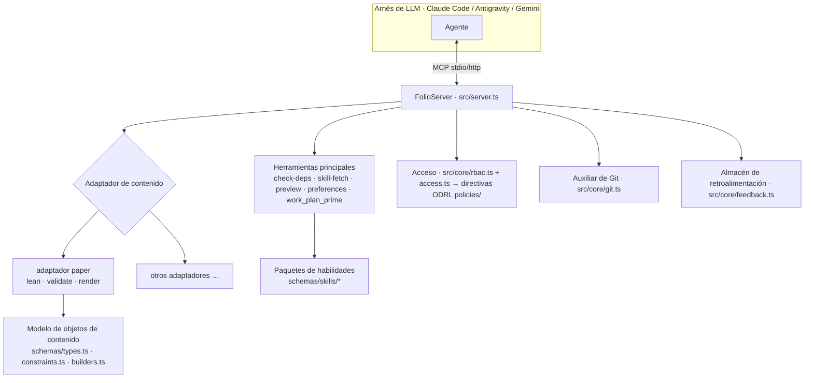

# Arquitectura
{: .no_toc }

1. TOC
{:toc}

---

## Visión general

> **Las reglas detrás de esta página.** La arquitectura describe la forma; las habilidades
> rigen las decisiones. Adaptadores frente a perfiles —
> [`content-profiles`](reference/skill-instructions/content-profiles.html).
> A dónde pertenece un nuevo nodo antes de crearlo —
> [`placement`](reference/skill-instructions/placement.html). La estructura del
> repositorio y cada tipo de grafo —
> [`directory-conventions`](reference/skill-instructions/directory-conventions.html).
> Composición y verificación de la superficie MCP —
> [`mcp-assembly`](reference/skill-instructions/mcp-assembly.html) y
> [`mcp-contract`](reference/skill-instructions/mcp-contract.html).
> Donde esta página y una habilidad discrepen, la habilidad prevalece.

folio-assistant es un **servidor MCP** con una capa conectable de **adaptadores de contenido**,
un sistema de **habilidades**, un **modelo de objetos de contenido** tipado, **RBAC** y una
estrategia de despliegue. El contenido sobre el que opera reside en un repositorio *independiente*:
la plataforma es independiente del contenido.

## Separación de responsabilidades — estado actual y futuro

Este repositorio es hoy un **repositorio de herramientas y un repositorio de contenido en un solo checkout**. El issue
[#223](https://github.com/litlfred/folio-assistant/issues/223) planifica la división
en cinco instancias componibles de folio-assistant. Las páginas secundarias lo detallan:

| página | qué responde |
|---|---|
| [Taxonomía de repositorios](architecture/repo-taxonomy.html) | Qué tipos de repositorios existen — Herramienta, Prueba, Contenido, Consumidor — y qué puede contener cada uno |
| [Estado actual](architecture/current-state.html) | Qué hay realmente en este repositorio hoy, cuantificado, y dónde se encuentra la mezcla |
| [Estado futuro](architecture/future-state.html) | Los cinco repositorios de destino y qué directorio va a parar a cuál |
| [Plan de migración](architecture/migration-plan.html) | Fases 0/I/II/III, las puertas de validación y lo que aún no se ha decidido |
| [`cat-harness` mínimo](architecture/cat-harness-minimum.html) | Qué sobrevive en el arnés una vez que se aplica «no autodocumentado» como prueba |
| [Instancias de arnés](architecture/harness-instances.html) | Qué ES una instancia — esquemas, visualizaciones, herramientas; los cuatro directorios; el renderizado por defecto |

Las dos últimas parecen contradecirse: la versión mínima dice que un arnés no produce
nada que un humano mire, y la página de instancias dice que una instancia renderiza por
defecto. No se contradicen: el requisito es un **suelo que se eleva**, con
`bootstrap` exento del visualizador y debiendo proporcionar en su lugar su propio `.json`/`.jsonld`,
siendo `cat-harness` la capa donde el resto comienza a aplicarse. Consulta
[Dónde comienza el requisito](architecture/harness-instances.html#where-the-requirement-starts--bootstrap-is-the-exception).

El resto de esta página describe la arquitectura **tal como es ahora**.

## Estructura del repositorio

| Ruta | Qué reside aquí |
|------|-----------------|
| `src/` | El servidor MCP (`server.ts`), punto de entrada (`index.ts`), núcleo (`git`, `rbac`, `cache`, `feedback`, `logging`) y herramientas principales (`tools/`) |
| `adapters/` | Adaptadores de contenido — `paper/` (Lean + LaTeX) y el independiente `mcp-server/` |
| `schemas/` | El modelo de objetos de contenido (`types.ts`, `constraints.ts`, `builders.ts`) y esquemas JSON por habilidad (`schemas/skills/*`) |
| `skills/` | **Paquetes** de habilidades (`content-lifecycle`, `authoring-math`, `authoring-who-smart-guidelines`) con sus manifiestos de Docker |
| `content/` | Herramientas de la **canalización** de contenido (validadores, QA, asistentes de renderizado) — no el contenido en sí |
| `ui/`, `viewer/`, `home_page/` | Interfaz web, visor interactivo y el sitio de ejemplo de Pages |
| `deploy/` | Despliegue (Caddy, docker-compose, aprovisionamiento, OAuth) |
| `docs/` | Este sitio de documentación |
| `.github/` | Flujos de trabajo y scripts de CI (compilación, publicación, QA, docs) |
| `.claude/skills/` | Habilidades del agente local + hooks de capacidades |

## El servidor MCP

`FolioServer` (`src/server.ts`) registra las herramientas principales y luego solicita al
**adaptador de contenido** activo que registre sus herramientas. Admite dos transportes: `--stdio`
(el que inician los arneses) y `--http` (una instancia compartida de ejecución continua). Las llamadas a
herramientas se registran con su tiempo de ejecución.

## Adaptadores de contenido

Un adaptador de contenido encapsula todo lo específico de un tipo: qué artefactos existen,
cómo validarlos, cómo compilarlos/renderizarlos y qué herramientas MCP adicionales
registrar. El adaptador `document` (`adapters/document/`) es la base para folios en prosa;
el adaptador `paper` (`adapters/paper/`) lo extiende y proporciona herramientas del ciclo de vida de Lean
(`lean_setup`/`build`/`check`/`status`), validación y renderizado
(`paper_render_pdf`/`html`, `formula_render`). Los nuevos tipos de contenido añaden un nuevo
adaptador; consulta [Añadir un tipo de contenido](guides/new-content-type.html).

## Habilidades y paquetes de habilidades

Una **habilidad** es una unidad de trabajo documentada y delimitada por esquemas (por ejemplo,
`lean-formalization`). Las habilidades se agrupan en **paquetes** que declaran sus
dependencias de Docker/tiempo de ejecución mediante un archivo `package-manifest.json`. El LLM descubre
habilidades con `skill_list` y carga instrucciones con `skill_fetch`. La lista
completa de habilidades y roles —y cómo se combinan con el LLM (RBAC, capacidades,
requisitos)— se encuentra en la página [Habilidades y roles](skills.html); el contrato de
entrada/salida de cada habilidad está publicado en la
[Referencia de esquemas de habilidades](reference/skills/).

## El modelo de objetos de contenido

Para los artículos, el contenido es un árbol de **bloques** tipados y validados en tiempo de ejecución con Zod:

- `schemas/types.ts` — `Block`, `Section`, `Chapter`, `Paper` y los tipos de bloques
- `schemas/constraints.ts` — esquemas de Zod y reglas de restricciones
- `schemas/builders.ts` — constructores validados (`definition()`, `theorem()`, …)

Estos están documentados en la [Referencia de la API de TypeScript](api/) generada.

## Control de acceso — ODRL, comprobado antes de cada tarea

Existe un único sistema de permisos, y es W3C ODRL 2.2 (issue #1180): acciones
en `skills/permissions/permissions.json`, concesiones en `policies/*.jsonld`,
evaluadas por `permits()` / `decide()` en `schemas/odrl.ts`. Dos invocadores lo consultan:

- **El ejecutor de BPMN**, antes de cada tarea y decisión
  (`src/workflow/authorize.ts`): ¿está el actor autenticado, cumple los requisitos para
  el rol del carril, tiene permiso para `perform-task` aquí y se le permite manipular el
  contenido? Actualmente consultivo: un `deny` o una discrepancia de rol genera un rechazo, y
  se registra `unknown`.
- **Las rutas HTTP**, a través de `src/core/rbac.ts`: cada ruta especifica la acción
  que realiza (`content-authoring`, `review-comments`, `adjudication`), y las
  sesiones de la pasarela de autenticación (auth-gateway) se declaran como actores cuyas concesiones son
  `policies/http-gateway.jsonld`. En este caso, `unknown` genera un rechazo.

Hasta el issue #1207 (23-09-2026), `rbac.ts` era una escala independiente de visor < colaborador
< propietario y el ejecutor no comprobaba nada. La disciplina correspondiente es la
habilidad [`task-authorization`](reference/skill-instructions/task-authorization.html).

## Preparación del plan de trabajo (entre arneses)

El plan de trabajo se almacena en `beans` y se expone de tres formas para que cualquier arnés se
inicialice de manera idéntica:

1. **`AGENTS.md`** — disciplina estática, leída de forma nativa por cada agente.
2. **Hook `SessionStart`** — cada arnés ejecuta el preparador compartido
   `scripts/session-start-coord-sweep.sh`.
3. **Herramienta MCP `work_plan_prime`** — preparación en tiempo real para cualquier agente conectado por MCP.

Consulta `docs/folio-assistant-migration.md` para el diseño completo entre agentes.

## Despliegue

`deploy/` contiene una plantilla de proxy inverso de Caddy, `docker-compose.yml`, un
script de aprovisionamiento, configuración de Google OAuth y un script de actualización automática para ejecutar una
instancia HTTP compartida. Los manifiestos de Docker de los paquetes de habilidades agregan las dependencias de apt/pip/npm
en una sola imagen por cada conjunto de paquetes activo.
