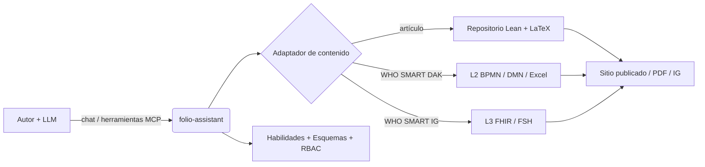
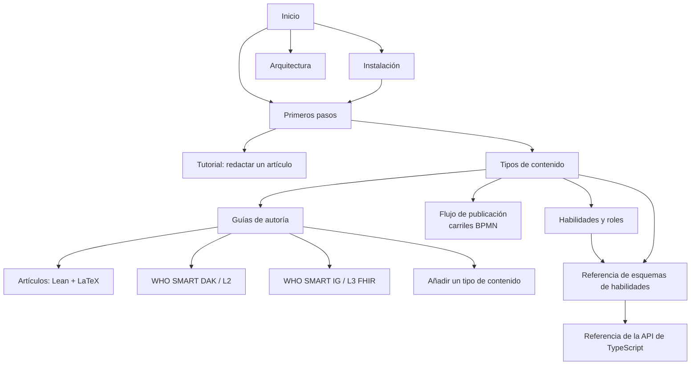



# folio-assistant
{: .fs-9 }


Un marco de habilidades de agente independiente del contenido para la autoría de
contenido riguroso con un modelo de lenguaje grande — artículos científicos y
libros, Directrices SMART de la OMS y Guías de Implementación FHIR —
respaldado por un servidor MCP, control de acceso basado en roles y un modelo
de objetos de contenido tipado.
{: .fs-6 .fw-300 }

<!--
  `View on GitHub` STAYS. The site-wide `aux_links` GitHub text was removed from
  the chrome above every page (bean `udx8`, PR #352), and the obvious follow-up
  is to delete this button for consistency. Do not. Put to the repo owner on
  2026-09-19: this button is part of the landing page's own readme/description
  note — authored content on one page, not chrome — and the forge remains
  reachable from the navbar's Source tile regardless.
-->
[Comenzar]({{ '/docs/cat-harness/getting-started.html' | relative_url }}){: .btn .btn-primary .fs-5 .mb-4 .mb-md-0 .mr-2 }
[Instalar]({{ '/docs/cat-harness/installation.html' | relative_url }}){: .btn .fs-5 .mb-4 .mb-md-0 .mr-2 }
[Ver en GitHub](https://github.com/litlfred/folio-assistant){: .btn .fs-5 .mb-4 .mb-md-0 }



---

## Cuatro cosas, en orden

**1. El plan de trabajo es donde dices lo que estás haciendo.**
No un mensaje de chat, no un comentario: [beans]({{ '/docs/cat-harness/beans-and-todos.html' | relative_url }}), un almacén versionado que cualquier sesión o agente puede leer. Reclama antes de trabajar para que una sesión hermana no tome el mismo elemento; un bean que resulta no ser necesario se marca `scrapped`, con sus razones, y nunca se elimina.

```sh
cat-harness/scripts/install-beans.sh && export PATH="$HOME/.local/bin:$PATH"
beans list                          # lo que está abierto
beans create "<title>"              # …tras comprobar que el título no existe
beans <id> --status in-progress     # reclamarlo, de forma visible
```

**2. Crea tu primer folio.** Este repositorio es la *plataforma*; tu contenido vive en el suyo propio. Un solo comando lo prepara — los manifiestos, la declaración, los archivos del agente y el enlace de vuelta aquí:

```sh
bun run init-folio --help
```

Después, [Primeros pasos]({{ '/docs/cat-harness/getting-started.html' | relative_url }}) acompaña el primer bloque por la validación, el renderizado y la revisión.

**3. Conoce qué tipo de cosa estás escribiendo.** Un *documento* es prosa estructurada; un *artículo* (paper) es eso más los tipos de bloque cuya aserción es una afirmación formal, respaldada por Lean y compuesta con LaTeX. La elección decide qué bloques son válidos y qué controles se ejecutan: [Tipos de contenido]({{ '/docs/cat-harness/content-types.html' | relative_url }}).

**4. La documentación que nunca leerás.**
[Toda ella]({{ '/docs/cat-harness/guides/index.html' | relative_url }}) — las guías de autoría, la arquitectura, el flujo de publicación, la referencia generada de esquemas y habilidades. Está aquí, es exhaustiva, y lo honesto es esperar que llegues a ella desde un buscador en el momento exacto en que algo se rompa. Es una buena forma de usarla. Los tres pasos de arriba son los que vale la pena leer ahora.

Cuando lo que te desconcierta es la *maquinaria* y no la autoría — quién hace qué cosa, en qué proceso, con qué habilidad — empieza por [La plataforma]({{ '/docs/cat-harness/platform.html' | relative_url }}). Una sola frase allí sostiene todo el modelo, y cada palabra en ella es un objeto declarado por separado.

---

## ¿Qué es folio-assistant?

**folio-assistant** es la *plataforma* — no contiene contenido. Proporciona
las habilidades, los esquemas, las herramientas y un servidor MCP (Model Context
Protocol) que un agente impulsado por LLM utiliza para planificar, redactar, validar,
revisar, probar y publicar un **folio** de contenido que reside en un repositorio independiente.

> **Separación de responsabilidades.** Esta documentación describe el *formalismo del
> marco de trabajo* y *cómo usar folio-assistant* — mantenido deliberadamente **separado
> de cualquier contenido específico**. Cuando aparece contenido en estas páginas, es
> puramente ilustrativo (un *ejemplo*), nunca el artefacto canónico.



## Tipos de contenido admitidos

folio-assistant es **extensible** — cada tipo de contenido es gestionado por un
*adaptador* de contenido y un *paquete* de habilidades correspondiente. Los tipos admitidos actualmente:

| Tipo de contenido | Artefactos | Paquete de habilidades |
|-------------------|------------|------------------------|
| **Artículos científicos y libros** | Formalización Lean 4 + LaTeX/Markdown | [`authoring-math`]({{ site.baseurl }}/docs/cat-harness/content-types.html#scientific-papers--books) |
| **Kits de adaptación digital (DAK) de las Directrices SMART de la OMS** | Artefactos L2 — BPMN, DMN, diccionarios de datos Excel, personas | [`authoring-who-smart-guidelines`]({{ site.baseurl }}/docs/cat-harness/content-types.html#who-smart-guidelines-daks-l2) |
| **Guías de implementación SMART de la OMS** | Recursos FHIR L3, FSH, salida de IG Publisher | [`authoring-who-smart-guidelines`]({{ site.baseurl }}/docs/cat-harness/content-types.html#who-smart-implementation-guides-l3) |
| **Otros** | Extensible — añade un nuevo adaptador + paquete de habilidades | [Añadir un tipo de contenido]({{ site.baseurl }}/docs/cat-harness/guides/new-content-type.html) |

El paquete transversal [`content-lifecycle`]({{ '/docs/cat-harness/content-types.html' | relative_url }}#the-content-lifecycle)
(planificar → redactar → validar → revisar → probar → publicar → retroalimentación → retirar)
se aplica a cada tipo de contenido. El
[flujo de publicación]({{ '/docs/cat-harness/publication-workflow.html' | relative_url }}) lo modela adecuadamente — como
carriles BPMN, con los roles, la puerta de validación HCI y el plan de trabajo compartido.

## A dónde ir a continuación

- **[Instalación]({{ '/docs/cat-harness/installation.html' | relative_url }})** — requisitos previos, clonación, `bun install`, verificación de capacidades.
- **[Primeros pasos]({{ '/docs/cat-harness/getting-started.html' | relative_url }})** — conecta el servidor MCP a tu LLM y ejecuta tu primera habilidad.
- **[Tutorial: Redactar un artículo con folio-assistant]({{ '/docs/cat-harness/guides/writing-a-paper.html' | relative_url }})** — un recorrido completo guiado por LLM con una sesión de chat simulada.
- **[Tipos de contenido]({{ '/docs/cat-harness/content-types.html' | relative_url }})** — el formalismo de cada dominio de autoría.
- **[Flujo de publicación]({{ '/docs/cat-harness/publication-workflow.html' | relative_url }})** — diagramas de carriles BPMN de los procesos de edición y publicación: la puerta de validación de HCI, quién revisa qué y el plan de trabajo compartido.
- **[Incorporación del agente]({{ '/docs/cat-harness/guides/agent-onboarding.html' | relative_url }})** — orientación para un agente LLM situado en un folio: primeros pasos, búsqueda de habilidades, el modelo de objetos de contenido, sidecars de QA.
- **[Habilidades y roles]({{ '/docs/cat-harness/skills.html' | relative_url }})** — cada habilidad y rol, y cómo interactúan junto con el LLM.
- **[Referencia del esquema de habilidades](../reference/skills/)** — contratos de entrada/salida generados para cada habilidad.
- **[Referencia de la API de TypeScript](../api/)** — el modelo de objetos de contenido (`Block`, `Chapter`, `Paper`, builders, restricciones Zod).
- **[Arquitectura]({{ '/docs/cat-harness/architecture.html' | relative_url }})** — adaptadores, servidor MCP, RBAC, el modelo de bloques.
- **[El grafo de conocimiento]({{ '/docs/cat-harness/knowledge-graph.html' | relative_url }})** — la taxonomía de subgrafos, en qué sentido van las referencias y cómo dividen el trabajo los repositorios.
- **[The Harness]({{ '/docs/cat-harness/harness.html' | relative_url }})** — la instanciación, el recorrido de dependencias y a qué obliga incorporar un directorio al arnés.

Vale la pena leer dos habilidades antes que las páginas anteriores, porque todo lo demás
las asume: [`getting-started`](../reference/skill-instructions/getting-started.html)
enruta lo que realmente estás intentando hacer, y
[`placement`](../reference/skill-instructions/placement.html) determina a dónde
pertenece un nuevo nodo antes de crearlo.

## Mapa de la documentación



> Los nodos del mapa son clicables en el sitio de documentación.
