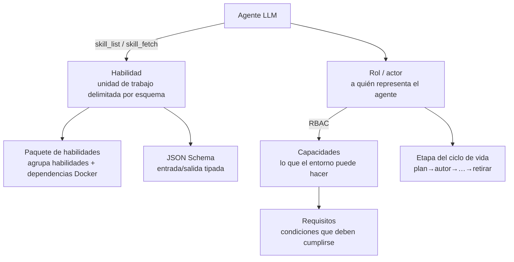

# Habilidades y roles
{: .no_toc }

Esta página es la lista maestra de cada **habilidad** (*skill*) y **rol** (*role*) en folio-assistant,
y explica cómo encajan entre sí con el LLM. Para conocer el contrato de entrada/salida
tipado de cada habilidad, consulta la [Referencia de esquemas de habilidades](reference/skills/).

1. TOC
{:toc}

---

## Cómo funciona junto con el LLM

folio-assistant proporciona a un agente LLM una forma estructurada de realizar trabajo de autoría real.
Se compone de cinco conceptos:

1. **Habilidad (*skill*)** — una unidad de trabajo documentada y delimitada por un esquema (por ejemplo,
   `lean-formalization`). El agente descubre habilidades con la herramienta MCP
   `skill_list` y carga las instrucciones de una habilidad con `skill_fetch`. Cada habilidad cuenta con un
   [contrato de entrada/salida](reference/skills/) tipado.
2. **Paquete de habilidades (*skill package*)** — un grupo de habilidades relacionadas que también declara sus
   dependencias de Docker/tiempo de ejecución (`package-manifest.json`).
3. **Rol (actor)** — *a quién* representa el agente. Un **actor** asume un
   **rol** debido al carril BPMN en el que actúa. Lo que el actor puede **hacer** es una
   política ODRL de W3C en `policies/`, no una propiedad del rol. Antes de cada tarea,
   el ejecutor comprueba la autenticación, la asignación de roles, la política y el acceso
   al contenido ([`task-authorization`](reference/skill-instructions/task-authorization.html));
   las rutas HTTP consultan las mismas políticas a través de `src/core/rbac.ts`.
4. **Capacidad (*capability*)** — una habilidad concreta del entorno (por ejemplo, `latex-compiler`,
   `lean-toolchain`). Las habilidades requieren capacidades; `check_dependencies` las
   sondea.
5. **Requisito (*requirement*)** — una condición (*gate*) que debe cumplirse (por ejemplo, `commit-hygiene`,
   `lean-verification`) antes o durante el avance de una etapa.

El bucle, en la práctica: el agente prepara el plan de trabajo (`work_plan_prime`),
comprueba que cuenta con las capacidades que necesita (`check_dependencies`), lista y carga
la habilidad adecuada (`skill_list` → `skill_fetch`), realiza el trabajo bajo el rol del usuario
(sujeto a RBAC) y valida/compila/publica a través de las herramientas del adaptador de contenido.

---

## Habilidades

### Dónde residen las habilidades (y su estado)

Una habilidad se define a lo largo de varias capas — no en un único archivo. Para cualquier habilidad:

| Capa | Ubicación | Estado |
|------|-----------|--------|
| **Definición** (roles, capacidades requeridas, requisitos, patrones de enrutamiento, etapas del ciclo de vida, referencia de esquema) | `.claude/skills/local/<skill>.json` | ✅ las 22 habilidades de autoría — validadas en CI mediante `scripts/validate-skills.ts` |
| **Contrato tipado** (JSON Schema de entrada/salida) | `schemas/skills/<skill>/` | ✅ las 22 — consulta la [referencia](reference/skills/) |
| **Cuerpo de instrucciones** (guía práctica en prosa que carga el LLM) — consúltalas en la referencia de [Instrucciones de habilidades](reference/skill-instructions/) | `skills/content-lifecycle/*.md`, `skills/folio-*-adapter/*.md`, `src/skills/*.md` | ✅ habilidades de ciclo de vida, agente, paquete de plataforma y **folio-document-adapter**; ⏳ **los cuerpos de authoring-math / authoring-who-smart-guidelines están pendientes (TBD)** (esos paquetes incluyen el manifiesto y las definiciones JSON) |
| **Paquete** (dependencias Docker/tiempo de ejecución) | `skills/<package>/package-manifest.json` | ✅ los cuatro paquetes |

Así que *sí, las habilidades existen* — como definiciones estructuradas + esquemas tipados, con cuerpos
en prosa incluidos para las habilidades del ciclo de vida y del agente. La herramienta MCP `skill_fetch`
actualmente sirve los cuerpos de `src/skills/*.md`; los cuerpos en prosa de las habilidades de autoría
son lo siguiente por completar (las definiciones y los contratos a los que se vincularían
ya están en su lugar).

### Transversal: `content-lifecycle`

Las etapas del ciclo de vida que se aplican a **cada** tipo de contenido:

| Habilidad | Etapa | Propósito |
|-----------|-------|-----------|
| [`content-plan`](reference/skills/content-plan.html) | plan | Alcance, equipo, cronograma, gobernanza |
| [`content-author`](reference/skills/content-author.html) | author | Crear artefactos estructurados |
| [`content-validate`](reference/skills/content-validate.html) | validate | Comprobar esquema + restricciones |
| [`content-review`](reference/skills/content-review.html) | review | Revisión y aprobación formal |
| [`content-test`](reference/skills/content-test.html) | test | QA de extremo a extremo / compilación en verde |
| [`content-publish`](reference/skills/content-publish.html) | publish | Renderizar y desplegar |
| [`content-feedback`](reference/skills/content-feedback.html) | feedback | Recopilar y clasificar retroalimentación |
| `content-retire` | retire | Desaprobar / archivar |

### Documentos y guías normativas: `folio-document-adapter`

| Habilidad | Propósito |
|-----------|-----------|
| [`document-authoring`](reference/skills/document-authoring.html) | Crear y revisar bloques en un folio en prosa |
| [`document-structure`](reference/skills/document-structure.html) | Capítulos y secciones — añadir, eliminar, reordenar |
| [`normative-statements`](reference/skills/normative-statements.html) | Portar una recomendación, requisito o regla |
| [`document-publishing`](reference/skills/document-publishing.html) | Markdown → HTML / PDF, sin TeX |

### Artículos y libros: `authoring-math`

| Habilidad | Propósito |
|-----------|-----------|
| [`lean-formalization`](reference/skills/lean-formalization.html) | Formalizar enunciados/demostraciones en Lean 4 |
| [`latex-authoring`](reference/skills/latex-authoring.html) | Redactar documentos LaTeX |
| [`proof-verification`](reference/skills/proof-verification.html) | Verificar demostraciones, auditar `sorry`/axiomas |
| `scientific-visualization` | Figuras y diagramas |
| `hypothesis-generation` | Proponer conjeturas / líneas de investigación |
| `scientific-critical-thinking` | Revisión crítica adversarial de argumentos |

### Directrices SMART de la OMS: `authoring-who-smart-guidelines`

| Habilidad | Propósito |
|-----------|-----------|
| [`l2-dak-authoring`](reference/skills/l2-dak-authoring.html) | Artefactos DAK L2 (diccionario de datos, etc.) |
| [`l3-fhir-authoring`](reference/skills/l3-fhir-authoring.html) | Recursos FHIR L3 mediante FSH |
| [`bpmn-authoring`](reference/skills/bpmn-authoring.html) | Procesos de negocio BPMN 2.0 |
| [`dmn-authoring`](reference/skills/dmn-authoring.html) | Tablas de decisiones DMN |
| [`terminology-management`](reference/skills/terminology-management.html) | Sistemas de códigos / conjuntos de valores |
| [`fhir-validation`](reference/skills/fhir-validation.html) | Validar contra perfiles FHIR |
| [`ig-publication`](reference/skills/ig-publication.html) | Compilar y publicar la IG |
| [`quality-control`](reference/skills/quality-control.html) | Compuertas de control de calidad (*QA gates*) |

### Habilidades de agente/plataforma (`src/skills`)

Habilidades que el LLM utiliza para trabajar de manera efectiva en el repositorio (cargadas mediante `skill_fetch`,
paquete `folio-assistant`):

| Habilidad | Propósito |
|-----------|-----------|
| `corpus-grep` | Buscar en todo el corpus de contenido |

> `editor`, `readability-editing`, `todo-review`, `symbiotic-interaction` y
> `deployment-auth` ahora residen (generalizadas) en el paquete **`folio-core`** a continuación —
> cárgalas con `package_name="folio-core"`.

Un folio de artículo (*paper folio*) también requiere las habilidades de `folio-document-adapter`: un artículo *es* un
documento con bloques que contienen Lean, por lo que `document-structure` y
`document-publishing` se aplican a ambos. Los dos paquetes son mitades de un único modelo
de contenido, no alternativas entre las que elegir.

### Habilidades locales de coordinación (`.claude/skills/local`)

| Habilidad | Propósito |
|-----------|-----------|
| `prepare-merge` | Llevar una rama a un estado limpio/en verde/fusionable (consulta también `/watch`) |
| `bean-coordination` | Disciplina de reclamación/coordinación multiagente |
| `todo-manager` | Disciplina de beans como tareas pendientes (*beans-as-todos*) |

### Paquetes de habilidades de plataforma (`skills/folio-core`, `skills/folio-document-adapter`, `skills/folio-paper-adapter`)

**Paquetes de plataforma** más amplios, dos de ellos migrados desde el repositorio de contenido qou (consulta el
[registro de migración](migrations/2026-06-29-platform-skills-migration.html) y el
*issue* [#27](https://github.com/litlfred/folio-assistant/issues/27)). Son
independientes del contenido y están diseñados para sincronizarse en cualquier folio:

| Paquete | Habilidades | Alcance |
|---------|------------:|---------|
| **`folio-core`** | 43 | Coordinación de agentes, el marco de trabajo del observador (*watcher framework*), canalización de QA / renderizado / bibliografía / glosario, documentación, despliegue — se aplica a *cualquier* tipo de contenido. |
| **`folio-document-adapter`** | 4 | Folios en prosa: autoría de bloques, estructura de capítulos/secciones, declaraciones normativas y la vía de publicación sin TeX. Se aplica también a artículos. |
| **`folio-paper-adapter`** | 40 | Adaptador para artículos de matemáticas formales (cualquier artículo con Lean 4 + LaTeX): flujo de trabajo de Lean, herramientas de demostración, validación de objetos de contenido, LaTeX, estructura de artículos, importación, simuladores. |

Se omitieron las habilidades de física irreductibles de QOU; los ejemplos específicos de QOU en el resto
se generalizaron. Cada paquete incluye un `package-manifest.json`.

> Los **esquemas** de habilidades (entrada/salida tipada para las habilidades de autoría) se generan
> en la [Referencia de esquemas de habilidades](reference/skills/) — nunca se desvíen de lo que
> valida el marco de trabajo.

---

## Roles (actores)

Los roles responden a *a quién representa el agente*. El usuario actual se asigna a un rol
mediante `role-assignments.json`, y las capacidades del rol delimitan lo que el agente puede
hacer (RBAC). Los roles **heredan** (por ejemplo, `author` hereda de `reviewer`).

> Para ver estos roles *como carriles* — quién edita, quién revisa, quién da el visto bueno y
> qué pasos puede dar un agente por su cuenta —, consulta
> [Flujo de publicación → Quién es quién](publication-workflow.html#who-is-who).

### Personas

| Rol | Qué pueden hacer |
|-----|------------------|
| `viewer` | Lectura básica únicamente. Ver contenido, sin cambios. |
| `reviewer` | Ver + comentarios de revisión; sin cambios directos. |
| `author` | Crear/modificar contenido (hereda de reviewer). |
| `admin` | Acceso administrativo completo — roles, configuración, todo el contenido. |
| `programme-manager` | Alcance, conformación de equipos, cronograma, gobernanza de partes interesadas. |
| `technical-officer` | Coordinador de área de programa + revisor de primera pasada. |
| `business-analyst` | Autor de DAK L2 (BPMN, diccionarios de datos, lógica de decisiones, indicadores). |
| `clinical-sme` | Validador clínico / proveedor de información de referencia (*ground-truth*). |
| `terminologist` | Gobernanza terminológica (CIE-11, SNOMED CT, LOINC). |
| `fhir-modeller` | Artefactos FHIR L3 (FSH, SUSHI, CQL, IG Publisher). |
| `content-reviewer` | Aprobación formal / visto bueno para la transición de fase. |
| `qc-reviewer` | Control de calidad (QA) de preparación para la publicación en todas las capas. |
| `publication-manager` | Lanzamientos, configuración de IG, compilaciones, versionado, publicación. |
| `translator` | Localización para idiomas oficiales admitidos por la ONU. |

### Actores del sistema

| Actor | Proporciona | No puede |
|-------|-------------|----------|
| `authoring-agent` | Redacta y revisa un cambio **propuesto** a un bloque de contenido | Confirmar (*commit*) — su salida se envía al editor a través de la compuerta de validación |
| `review-agent` | Validación no mecánica: precisión, tono/voz, exposición | Aprobar — únicamente informa hallazgos |
| `lean-mcp` | Comprobación de demostraciones y diagnósticos de Lean 4 mediante MCP | — |
| `ig-publisher-service` | Compilación de FHIR IG Publisher e informes de QA | — |

El lugar que ocupa cada uno de estos en el proceso — y lo que un agente puede y no puede
decidir — está modelado en los diagramas BPMN del
[flujo de publicación](publication-workflow.html).

### Asignación de roles

`role-assignments.json` asigna una identidad de usuario (proveniente de la configuración de Git o de la autenticación) a un rol
según su prioridad. Los valores predeterminados suministrados:

| Patrón | Origen | Rol | Prioridad |
|--------|--------|-----|-----------|
| `litlfred@gmail.com` | git-config | `admin` | 100 |
| `*@who.int` | git-config | `author` | 50 |
| `*` | default | `viewer` | 0 |

---

## Capacidades y requisitos

Las **capacidades** (*capabilities*) son habilidades concretas del entorno que una habilidad puede requerir; la
herramienta MCP `check_dependencies` las sondea:

`bun-runtime` · `node-runtime` · `python3` · `git-push` · `docker` ·
`latex-compiler` · `lean-toolchain` · `lean-mcp` · `ig-publisher` ·
`sushi-compiler` · `java-runtime` · `jekyll` · `plantuml` · `graphviz`

Los **requisitos** (*requirements*) son condiciones (*gates*) que deben cumplirse durante el trabajo:

`commit-hygiene` · `lean-verification` · `fhir-validation` ·
`content-lifecycle` · `session-start`

---

## Véase también

- [Flujo de publicación](publication-workflow.html) — carriles BPMN (*swimlanes*): qué habilidad se ejecuta en cada paso y quién decide
- [Instrucciones de habilidades](reference/skill-instructions/) — los cuerpos prácticos en prosa que carga el LLM
- [Referencia de esquemas de habilidades](reference/skills/) — entrada/salida tipada para cada habilidad
- [Tipos de contenido](content-types.html) — qué habilidades utiliza cada tipo de contenido
- [Arquitectura](architecture.html) — RBAC, adaptadores y el servidor MCP
- [Primeros pasos](getting-started.html) — ejecutar tu primera habilidad
