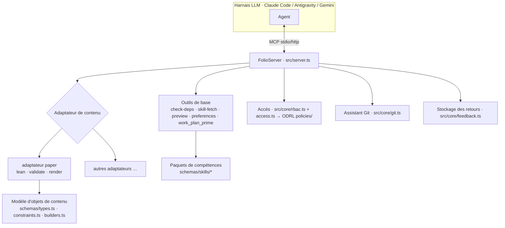

# Architecture
{: .no_toc }

1. TOC
{:toc}

---

## Vue d'ensemble

> **Les règles derrière cette page.** L'architecture décrit la forme ; les compétences
> régissent les décisions. Les adaptateurs par rapport aux profils —
> [`content-profiles`](reference/skill-instructions/content-profiles.html).
> L'emplacement d'un nouveau nœud avant sa création —
> [`placement`](reference/skill-instructions/placement.html). L'agencement
> du dépôt et chaque type de graphe —
> [`directory-conventions`](reference/skill-instructions/directory-conventions.html).
> Composition et vérification de la surface MCP —
> [`mcp-assembly`](reference/skill-instructions/mcp-assembly.html) et
> [`mcp-contract`](reference/skill-instructions/mcp-contract.html).
> En cas de désaccord entre cette page et une compétence, la compétence l'emporte.

folio-assistant est un **serveur MCP** doté d'une couche d'**adaptateurs de contenu** enfichable,
d'un système de **compétences**, d'un **modèle d'objets de contenu** typé, d'un **RBAC** et d'une
stratégie de déploiement. Le contenu sur lequel il opère réside dans un dépôt *séparé* — la
plateforme est indépendante du contenu.

## Séparation des préoccupations — état actuel et futur

Ce dépôt est aujourd'hui à la fois un **dépôt d'outils et un dépôt de contenu en un seul checkout**. Le ticket
[#223](https://github.com/litlfred/folio-assistant/issues/223) prévoit la division
en cinq instances composables de folio-assistant. Les pages filles le détaillent :

| page | ce à quoi elle répond |
|---|---|
| [Taxonomie des dépôts](architecture/repo-taxonomy.html) | Quels types de dépôts existent — Outils, Tests, Contenu, Consommateur — et ce que chacun peut contenir |
| [État actuel](architecture/current-state.html) | Ce qui se trouve réellement dans ce dépôt aujourd'hui, mesures à l'appui, et où se situe le mélange |
| [État futur](architecture/future-state.html) | Les cinq dépôts cibles et dans lequel chaque répertoire atterrit |
| [Plan de migration](architecture/migration-plan.html) | Phases 0/I/II/III, les étapes clés (gates) et ce qui reste à trancher |
| [`cat-harness` minimal](architecture/cat-harness-minimum.html) | Ce qui subsiste dans le harnais une fois que le critère « non auto-documenté » est appliqué comme test |
| [Instances de harnais](architecture/harness-instances.html) | Ce qu'EST une instance — schémas, visualisations, outils ; les quatre répertoires ; le rendu par défaut |

Les deux dernières semblent se contredire — le minimum indique qu'un harnais ne produit
rien qu'un humain regarde, et la page des instances indique qu'une instance effectue un rendu
par défaut. Ce n'est pas le cas : l'exigence est un **plancher qui s'élève**,
`bootstrap` étant exempté du visualiseur et devant fournir ses propres `.json`/`.jsonld`
à la place, et `cat-harness` étant la couche où le reste commence à s'appliquer. Voir
[Où commence l'exigence](architecture/harness-instances.html#where-the-requirement-starts--bootstrap-is-the-exception).

Le reste de cette page décrit l'architecture **telle qu'elle est actuellement**.

## Agencement du dépôt

| Chemin | Ce qui s'y trouve |
|--------|-------------------|
| `src/` | Le serveur MCP (`server.ts`), le point d'entrée (`index.ts`), le cœur (`git`, `rbac`, `cache`, `feedback`, `logging`) et les outils de base (`tools/`) |
| `adapters/` | Adaptateurs de contenu — `paper/` (Lean + LaTeX) et le `mcp-server/` autonome |
| `schemas/` | Le modèle d'objets de contenu (`types.ts`, `constraints.ts`, `builders.ts`) et les schémas JSON par compétence (`schemas/skills/*`) |
| `skills/` | Les **paquets** de compétences (`content-lifecycle`, `authoring-math`, `authoring-who-smart-guidelines`) avec leurs manifestes Docker |
| `content/` | Outillage du **pipeline** de contenu (validateurs, QA, assistants de rendu) — pas le contenu lui-même |
| `ui/`, `viewer/`, `home_page/` | Interface utilisateur Web, visualiseur interactif et site d'exemple Pages |
| `deploy/` | Déploiement (Caddy, docker-compose, provisionnement, OAuth) |
| `docs/` | Ce site de documentation |
| `.github/` | Workflows et scripts CI (compilation, publication, QA, documentation) |
| `.claude/skills/` | Compétences d'agent locales + points d'ancrage de capacités |

## Le serveur MCP

`FolioServer` (`src/server.ts`) enregistre les outils de base, puis demande à l'**adaptateur
de contenu** actif d'enregistrer ses propres outils. Il prend en charge deux modes de transport — `--stdio`
(ce que lancent les harnais) et `--http` (une instance partagée à longue durée de vie). Les appels d'outils
sont consignés avec leur temps d'exécution.

## Adaptateurs de contenu

Un adaptateur de contenu encapsule tout ce qui est spécifique à un type : quels artefacts existent,
comment les valider, comment les compiler/effectuer leur rendu, et quels outils MCP supplémentaires
enregistrer. L'adaptateur `document` (`adapters/document/`) constitue la base pour les folios
de prose ; l'adaptateur `paper` (`adapters/paper/`) l'étend et fournit les outils du cycle de vie Lean
(`lean_setup`/`build`/`check`/`status`), la validation et le rendu
(`paper_render_pdf`/`html`, `formula_render`). Les nouveaux types de contenu ajoutent un nouvel
adaptateur — voir [Ajouter un type de contenu](guides/new-content-type.html).

## Compétences et paquets de compétences

Une **compétence** est une unité de travail documentée et délimitée par un schéma (par ex.
`lean-formalization`). Les compétences sont regroupées en **paquets** qui déclarent leurs
dépendances Docker/d'exécution via un fichier `package-manifest.json`. Le LLM découvre les
compétences avec `skill_list` et charge les instructions avec `skill_fetch`. La liste complète
des compétences et des rôles — ainsi que la manière dont ils se composent avec le LLM (RBAC, capacités,
exigences) — se trouve sur la page [Compétences et rôles](skills.html) ; le contrat
d'entrée/sortie de chaque compétence est publié dans la
[Référence des schémas de compétences](reference/skills/).

## Le modèle d'objets de contenu

Pour les articles, le contenu est un arbre de **blocs** typés validés à l'exécution avec Zod :

- `schemas/types.ts` — `Block`, `Section`, `Chapter`, `Paper`, et types de blocs
- `schemas/constraints.ts` — schémas Zod et règles de contraintes
- `schemas/builders.ts` — constructeurs validés (`definition()`, `theorem()`, …)

Ceux-ci sont documentés dans la [Référence de l'API TypeScript](api/) générée.

## Contrôle d'accès — ODRL, vérifié avant chaque tâche

Il n'existe qu'un seul système de permissions, et il s'agit de W3C ODRL 2.2 (ticket #1180) : les actions
dans `skills/permissions/permissions.json`, les autorisations dans `policies/*.jsonld`,
évaluées par `permits()` / `decide()` dans `schemas/odrl.ts`. Deux appelants le sollicitent :

- **L'exécuteur BPMN**, avant chaque tâche et décision
  (`src/workflow/authorize.ts`) : l'acteur est-il authentifié, éligible pour le
  rôle du couloir, autorisé à exécuter `perform-task` ici, et autorisé à toucher au
  contenu ? Consultatif aujourd'hui : un refus (`deny`) ou une non-concordance de rôle est rejeté, et `unknown`
  est consigné.
- **Les routes HTTP**, via `src/core/rbac.ts` : chaque route nomme l'action
  qu'elle effectue (`content-authoring`, `review-comments`, `adjudication`), et les
  sessions de la passerelle d'authentification sont des acteurs déclarés dont les droits sont
  définis dans `policies/http-gateway.jsonld`. Ici, `unknown` refuse.

Jusqu'au ticket #1207 (23-09-2026), `rbac.ts` était une hiérarchie distincte viewer < collaborator
< owner et l'exécuteur ne vérifiait rien. La règle de conduite est définie par la compétence
[`task-authorization`](reference/skill-instructions/task-authorization.html).

## Amorçage du plan de travail (inter-harnais)

Le plan de travail est stocké dans `beans` et exposé de trois manières pour que tout harnais soit
amorcé de façon identique :

1. **`AGENTS.md`** — discipline statique, lue nativement par chaque agent.
2. **Hook `SessionStart`** — chaque harnais exécute l'amorce partagée
   `scripts/session-start-coord-sweep.sh`.
3. **Outil MCP `work_plan_prime`** — amorçage en direct pour tout agent connecté via MCP.

Voir `docs/folio-assistant-migration.md` pour la conception inter-agents complète.

## Déploiement

`deploy/` contient un modèle de proxy inverse Caddy, `docker-compose.yml`, un
script de provisionnement, la configuration de Google OAuth et un script de mise à jour automatique pour exécuter une
instance HTTP partagée. Les manifestes Docker des paquets de compétences regroupent les dépendances apt/pip/npm
dans une image unique par ensemble de paquets actif.
