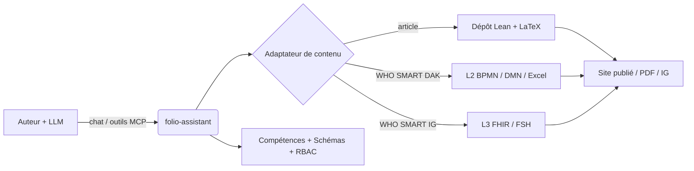
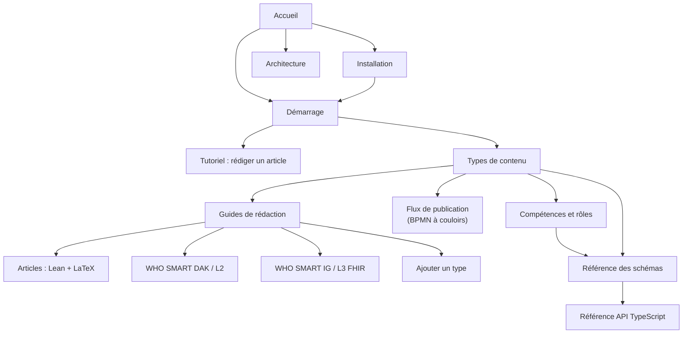

# folio-assistant
{: .fs-9 }


Un cadre de compétences d'agent indépendant du contenu pour la rédaction de
contenus rigoureux avec un grand modèle de langage — articles scientifiques et
livres, Lignes directrices SMART de l'OMS, et Guides d'implémentation FHIR —
appuyé par un serveur MCP, un contrôle d'accès basé sur les rôles, et un modèle
d'objets de contenu typé.
{: .fs-6 .fw-300 }

[Démarrer](../getting-started.html){: .btn .btn-primary .fs-5 .mb-4 .mb-md-0 .mr-2 }
[Installer](../installation.html){: .btn .fs-5 .mb-4 .mb-md-0 .mr-2 }
[Voir sur GitHub](https://github.com/litlfred/folio-assistant){: .btn .fs-5 .mb-4 .mb-md-0 }

---

## Quatre choses, dans l'ordre

**1. Le plan de travail est l'endroit où vous dites ce que vous faites.**
Pas un message de discussion, pas un commentaire — des [beans]({{ '/beans-and-todos.html' | relative_url }}), un dépôt versionné que toute session ou tout agent peut lire. Réservez avant de travailler, pour qu'une session voisine ne prenne pas le même élément ; un bean qui s'avère inutile est marqué `scrapped`, avec ses raisons, jamais supprimé.

```sh
cat-harness/scripts/install-beans.sh && export PATH="$HOME/.local/bin:$PATH"
beans list                          # ce qui est ouvert
beans create "<title>"              # …après avoir vérifié que le titre n'existe pas
beans <id> --status in-progress     # le réserver, visiblement
```

**2. Créez votre premier folio.** Ce dépôt est la *plateforme* ; votre contenu vit dans le sien. Une seule commande le prépare — les manifestes, la déclaration, les fichiers d'agent et le lien vers ici :

```sh
bun run init-folio --help
```

Ensuite, [Démarrer]({{ '/getting-started.html' | relative_url }}) accompagne le premier bloc à travers la validation, le rendu et la relecture.

**3. Sachez quel genre de chose vous écrivez.** Un *document* est de la prose structurée ; un *article* (paper) est cela, plus les types de blocs dont l'assertion est une affirmation formelle, appuyée par Lean et composée avec LaTeX. Ce choix décide quels blocs sont permis et quels contrôles s'exécutent : [Types de contenu]({{ '/content-types.html' | relative_url }}).

**4. La documentation que vous ne lirez jamais.**
[Toute la documentation]({{ '/guides/index.html' | relative_url }}) — les guides de rédaction, l'architecture, le flux de publication, la référence générée des schémas et des compétences. Elle est là, elle est complète, et l'attente honnête est que vous y arriverez depuis un moteur de recherche au moment exact où quelque chose casse. C'est une bonne façon de s'en servir. Les trois étapes ci-dessus sont celles qui valent d'être lues maintenant.

Quand c'est la *machinerie* qui vous déroute plutôt que la rédaction — qui fait quoi, dans quel processus, avec quelle compétence — commencez par [La plateforme]({{ '/platform.html' | relative_url }}). Une seule phrase y porte tout le modèle, et chacun de ses mots est un objet déclaré séparément.

---

## Qu'est-ce que folio-assistant ?

**folio-assistant** est la *plateforme* — elle ne contient pas de contenu. Elle
fournit les compétences, les schémas, les outils et un serveur MCP (Model Context
Protocol) qu'un agent piloté par un LLM utilise pour planifier, rédiger, valider,
réviser, tester et publier un **folio** de contenu qui réside dans un dépôt séparé.

> **Séparation des préoccupations.** Cette documentation décrit le *formalisme du
> cadre* et *comment utiliser folio-assistant* — délibérément maintenue **séparée
> de tout contenu spécifique**. Lorsque du contenu apparaît dans ces pages, il est
> purement illustratif (un *exemple*), jamais l'artefact canonique.



## Types de contenu pris en charge

folio-assistant est **extensible** — chaque type de contenu est géré par un
adaptateur de contenu et un ensemble de compétences correspondant. Les types
actuellement pris en charge :

| Type de contenu | Artefacts | Ensemble de compétences |
|-----------------|-----------|-------------------------|
| **Articles scientifiques et livres** | Formalisation Lean 4 + LaTeX/Markdown | [`authoring-math`](../content-types.html#scientific-papers--books) |
| **Kits d'adaptation numérique (DAK) des Lignes directrices SMART de l'OMS** | Artefacts L2 — BPMN, DMN, dictionnaires de données Excel, personas | [`authoring-who-smart-guidelines`](../content-types.html#who-smart-guidelines-daks-l2) |
| **Guides d'implémentation SMART de l'OMS** | Ressources FHIR L3, FSH, sortie de l'éditeur d'IG | [`authoring-who-smart-guidelines`](../content-types.html#who-smart-implementation-guides-l3) |
| **Autres** | Extensible — ajoutez un nouvel adaptateur + ensemble de compétences | [Ajouter un type de contenu](../guides/new-content-type.html) |

Le cycle transversal [`content-lifecycle`](../content-types.html#the-content-lifecycle)
(planifier → rédiger → valider → réviser → tester → publier → retour → retirer)
s'applique à chaque type de contenu. Le
[flux de publication](../publication-workflow.html) le modélise correctement —
en diagrammes BPMN à couloirs, avec les rôles, la porte de validation IHM, et le
plan de travail partagé.

## Où aller ensuite

- **[Installation](../installation.html)** — prérequis, clonage, `bun install`, vérification des capacités.
- **[Démarrage](../getting-started.html)** — connectez le serveur MCP à votre LLM et exécutez votre première compétence.
- **[Tutoriel : Rédiger un article avec folio-assistant](../guides/writing-a-paper.html)** — un guide complet piloté par LLM avec une session de chat simulée.
- **[Types de contenu](../content-types.html)** — le formalisme de chaque domaine de rédaction.
- **[Flux de publication](../publication-workflow.html)** — diagrammes BPMN à couloirs des processus d'édition et de publication.
- **[Intégration de l'agent](../guides/fr/agent-onboarding.html)** — orientation pour un agent LLM intégré dans un folio.
- **[Compétences et rôles](../skills.html)** — chaque compétence et rôle, et comment ils fonctionnent ensemble avec le LLM.
- **[Référence du schéma de compétences](../reference/skills/)** — contrats d'entrée/sortie générés pour chaque compétence.
- **[Référence de l'API TypeScript](../api/)** — le modèle d'objets de contenu (`Block`, `Chapter`, `Paper`, builders, contraintes Zod).
- **[Architecture](../architecture.html)** — adaptateurs, serveur MCP, RBAC, le modèle de blocs.

## Carte de la documentation



> Les nœuds de la carte sont cliquables sur le site de documentation.
