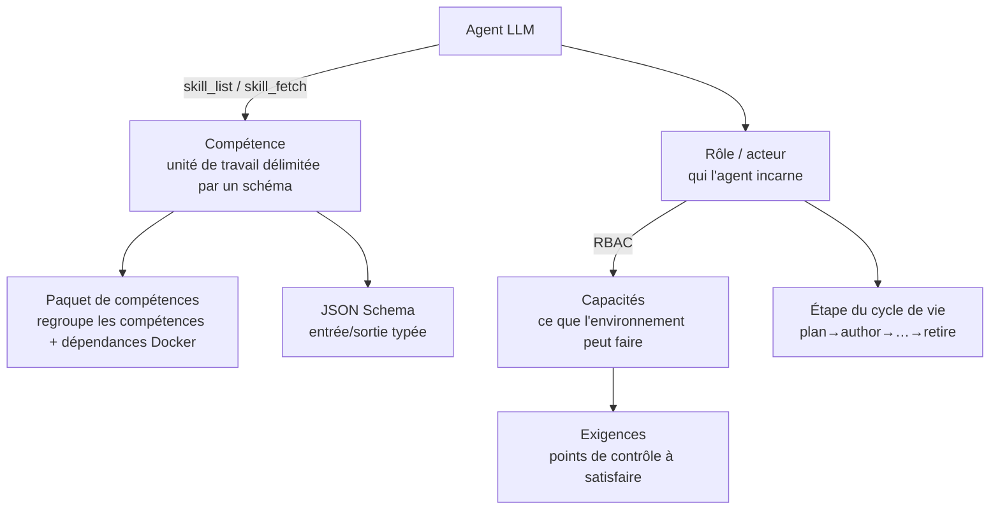

# Compétences et rôles
{: .no_toc }

Cette page constitue la liste de référence de chaque **compétence** et **rôle** dans folio-assistant,
et explique comment ils s'articulent avec le LLM. Pour le contrat d'entrée/sortie typé
de chaque compétence, consultez la [référence des schémas de compétences](reference/skills/).

1. TOC
{:toc}

---

## Fonctionnement avec le LLM

folio-assistant offre à un agent LLM un cadre structuré pour effectuer un véritable travail de rédaction.
Cinq concepts s'articulent :

1. **Compétence** — une unité de travail documentée et délimitée par un schéma (par ex.
   `lean-formalization`). L'agent découvre les compétences grâce à l'outil MCP `skill_list`
   et charge les instructions d'une compétence avec `skill_fetch`. Chaque compétence possède un
   [contrat d'entrée/sortie](reference/skills/) typé.
2. **Paquet de compétences** — un groupe de compétences associées qui déclare également
   ses dépendances Docker/d'exécution (`package-manifest.json`).
3. **Rôle (acteur)** — *qui* l'agent incarne. Un **acteur** assume un
   **rôle** en fonction du couloir BPMN dans lequel il opère. Ce que l'acteur peut **faire** relève d'une
   politique ODRL du W3C dans `policies/`, et non d'une propriété du rôle. Avant chaque tâche,
   l'exécuteur vérifie l'authentification, l'attribution du rôle, la politique et l'accès
   au contenu ([`task-authorization`](reference/skill-instructions/task-authorization.html)) ;
   les routes HTTP interrogent les mêmes politiques via `src/core/rbac.ts`.
4. **Capacité** — une aptitude concrète de l'environnement (par ex. `latex-compiler`,
   `lean-toolchain`). Les compétences requièrent des capacités ; `check_dependencies` les
   sonde.
5. **Exigence** — un point de contrôle (gate) qui doit être satisfait (par ex. `commit-hygiene`,
   `lean-verification`) avant ou pendant le déroulement d'une étape.

La boucle, en pratique : l'agent amorce le plan de travail (`work_plan_prime`),
vérifie qu'il dispose des capacités nécessaires (`check_dependencies`), liste et charge
la bonne compétence (`skill_list` → `skill_fetch`), effectue le travail sous le rôle de l'utilisateur
(soumis au RBAC), puis valide, compile et publie via les outils de l'adaptateur de contenu.

---

## Compétences

### Emplacement des compétences (et leur état)

Une compétence est définie à travers plusieurs couches — et non dans un seul fichier. Pour toute compétence :

| Couche | Emplacement | État |
|--------|-------------|------|
| **Définition** (rôles, capacités requises, exigences, modèles de routage, étapes du cycle de vie, réf. de schéma) | `.claude/skills/local/<skill>.json` | ✅ les 22 compétences de rédaction — validées en CI par `scripts/validate-skills.ts` |
| **Contrat typé** (JSON Schema d'entrée/sortie) | `schemas/skills/<skill>/` | ✅ les 22 — voir la [référence](reference/skills/) |
| **Corps d'instructions** (guide textuel que le LLM charge) — parcourez-les dans la référence des [instructions de compétences](reference/skill-instructions/) | `skills/content-lifecycle/*.md`, `skills/folio-*-adapter/*.md`, `src/skills/*.md` | ✅ compétences de cycle de vie, d'agent, du lot de plateforme et de **folio-document-adapter** ; ⏳ **les corps pour authoring-math / authoring-who-smart-guidelines sont à venir** (ces paquets fournissent le manifeste + les définitions JSON) |
| **Paquet** (dépendances Docker / exécution) | `skills/<package>/package-manifest.json` | ✅ les quatre paquets |

Ainsi, *oui, les compétences existent* — sous forme de définitions structurées et de schémas typés, avec des corps
textuels inclus pour les compétences de cycle de vie et d'agent. L'outil MCP `skill_fetch`
dessert actuellement les corps `src/skills/*.md` ; les corps textuels des compétences de rédaction
constituent le prochain élément à compléter (les définitions et les contrats auxquels ils se rattacheraient
sont déjà en place).

### Transversal : `content-lifecycle`

Les étapes du cycle de vie qui s'appliquent à **chaque** type de contenu :

| Compétence | Étape | Objectif |
|------------|-------|----------|
| [`content-plan`](reference/skills/content-plan.html) | plan | Périmètre, équipe, calendrier, gouvernance |
| [`content-author`](reference/skills/content-author.html) | author | Créer des artefacts structurés |
| [`content-validate`](reference/skills/content-validate.html) | validate | Vérifier le schéma + les contraintes |
| [`content-review`](reference/skills/content-review.html) | review | Relecture formelle et approbation |
| [`content-test`](reference/skills/content-test.html) | test | QA de bout en bout / compilation au vert |
| [`content-publish`](reference/skills/content-publish.html) | publish | Rendu et déploiement |
| [`content-feedback`](reference/skills/content-feedback.html) | feedback | Recueillir et trier les retours |
| `content-retire` | retire | Déprécier / archiver |

### Documents et directives politiques : `folio-document-adapter`

| Compétence | Objectif |
|------------|----------|
| [`document-authoring`](reference/skills/document-authoring.html) | Créer et réviser des blocs dans un folio de prose |
| [`document-structure`](reference/skills/document-structure.html) | Chapitres et sections — ajouter, supprimer, réordonner |
| [`normative-statements`](reference/skills/normative-statements.html) | Porter une recommandation, une exigence ou une règle |
| [`document-publishing`](reference/skills/document-publishing.html) | Markdown → HTML / PDF, sans TeX |

### Articles scientifiques et livres : `authoring-math`

| Compétence | Objectif |
|------------|----------|
| [`lean-formalization`](reference/skills/lean-formalization.html) | Formaliser des énoncés/preuves en Lean 4 |
| [`latex-authoring`](reference/skills/latex-authoring.html) | Rédiger des documents LaTeX |
| [`proof-verification`](reference/skills/proof-verification.html) | Vérifier les preuves, auditer les `sorry`/axiomes |
| `scientific-visualization` | Figures et diagrammes |
| `hypothesis-generation` | Proposer des conjectures / orientations |
| `scientific-critical-thinking` | Examen contradictoire des arguments |

### Lignes directrices SMART de l'OMS : `authoring-who-smart-guidelines`

| Compétence | Objectif |
|------------|----------|
| [`l2-dak-authoring`](reference/skills/l2-dak-authoring.html) | Artefacts DAK L2 (dictionnaire de données, etc.) |
| [`l3-fhir-authoring`](reference/skills/l3-fhir-authoring.html) | Ressources FHIR L3 via FSH |
| [`bpmn-authoring`](reference/skills/bpmn-authoring.html) | Processus métier BPMN 2.0 |
| [`dmn-authoring`](reference/skills/dmn-authoring.html) | Tables de décision DMN |
| [`terminology-management`](reference/skills/terminology-management.html) | Systèmes de codage / jeux de valeurs |
| [`fhir-validation`](reference/skills/fhir-validation.html) | Valider par rapport aux profils FHIR |
| [`ig-publication`](reference/skills/ig-publication.html) | Compiler et publier l'IG |
| [`quality-control`](reference/skills/quality-control.html) | Points de contrôle QA (QA gates) |

### Compétences d'agent/de plateforme (`src/skills`)

Compétences que le LLM utilise pour travailler efficacement dans le dépôt (chargées via `skill_fetch`,
paquet `folio-assistant`) :

| Compétence | Objectif |
|------------|----------|
| `corpus-grep` | Rechercher dans l'ensemble du corpus de contenu |

> `editor`, `readability-editing`, `todo-review`, `symbiotic-interaction` et
> `deployment-auth` résident désormais (généralisées) dans le lot **`folio-core`** ci-dessous —
> chargez-les avec `package_name="folio-core"`.

Un folio d'article scientifique nécessite également les compétences de `folio-document-adapter` : un article *est* un
document auquel s'ajoutent des blocs s'appuyant sur Lean, de sorte que `document-structure` et
`document-publishing` s'appliquent aux deux. Les deux lots constituent les deux moitiés d'un même modèle
de contenu, et non des alternatives entre lesquelles choisir.

### Compétences locales de coordination (`.claude/skills/local`)

| Compétence | Objectif |
|------------|----------|
| `prepare-merge` | Amener une branche à un état propre/au vert/fusionnable (voir aussi `/watch`) |
| `bean-coordination` | Discipline d'appropriation et de coordination multi-agents |
| `todo-manager` | Discipline des tâches basées sur les beans (beans-as-todos) |

### Lots de compétences de plateforme (`skills/folio-core`, `skills/folio-document-adapter`, `skills/folio-paper-adapter`)

Des **lots de plateforme** plus importants, dont deux ont été migrés depuis le dépôt de contenu qou (voir le
[registre de migration](migrations/2026-06-29-platform-skills-migration.html) et
le ticket [#27](https://github.com/litlfred/folio-assistant/issues/27)). Ils sont
indépendants du contenu et conçus pour être synchronisés dans n'importe quel folio :

| Lot | Compétences | Portée |
|-----|------------:|--------|
| **`folio-core`** | 43 | Coordination d'agents, cadre watcher, pipeline QA / rendu / bibliographie / glossaire, documentation, déploiement — s'applique à *tout* type de contenu. |
| **`folio-document-adapter`** | 4 | Folios de prose : rédaction de blocs, structure en chapitres/sections, énoncés normatifs et chaîne de publication sans TeX. S'applique également aux articles scientifiques. |
| **`folio-paper-adapter`** | 40 | Adaptateur d'articles de mathématiques formelles (tout article Lean 4 + LaTeX) : flux de travail Lean, outillage de preuve, validation d'objets de contenu, LaTeX, structure d'article, importation, simulateurs. |

Les compétences physiques irréductibles de QOU ont été ignorées ; les exemples spécifiques à QOU dans le reste
ont été généralisés. Chaque lot inclut un fichier `package-manifest.json`.

> Les **schémas** de compétences (entrée/sortie typée pour les compétences de rédaction) sont générés
> dans la [référence des schémas de compétences](reference/skills/) — ne déviez jamais de ce que
> le cadre valide.

---

## Rôles (acteurs)

Les rôles déterminent *qui l'agent incarne*. L'utilisateur actuel est associé à un rôle
par `role-assignments.json`, et les capacités du rôle délimitent ce que l'agent peut
faire (RBAC). Les rôles **héritent** les uns des autres (par ex. `author` hérite de `reviewer`).

> Pour visualiser ces rôles *sous forme de couloirs* — qui édite, qui relit, qui valide, et
> quelles étapes un agent peut entreprendre de son propre chef — consultez
> [Flux de publication → Qui est qui](publication-workflow.html#who-is-who).

### Personnes

| Rôle | Ce qu'ils peuvent faire |
|------|-------------------------|
| `viewer` | Lecture seule de base. Consultation du contenu, aucune modification. |
| `reviewer` | Consultation + commentaires de relecture ; aucune modification directe. |
| `author` | Création/modification de contenu (hérite de reviewer). |
| `admin` | Accès administratif complet — rôles, paramètres, l'ensemble du contenu. |
| `programme-manager` | Périmètre, constitution de l'équipe, calendrier, gouvernance des parties prenantes. |
| `technical-officer` | Coordinateur de domaine de programme + relecteur de premier niveau. |
| `business-analyst` | Auteur de DAK L2 (BPMN, dictionnaires de données, logique décisionnelle, indicateurs). |
| `clinical-sme` | Validateur clinique / garant de la vérité terrain. |
| `terminologist` | Gouvernance terminologique (CIM-11, SNOMED CT, LOINC). |
| `fhir-modeller` | Artefacts FHIR L3 (FSH, SUSHI, CQL, IG Publisher). |
| `content-reviewer` | Approbation formelle / validation de transition de phase. |
| `qc-reviewer` | QA d'aptitude à la publication à travers les différentes couches. |
| `publication-manager` | Versions publiées (releases), configuration de l'IG, compilations, gestion des versions, publication. |
| `translator` | Localisation pour les langues prises en charge par l'ONU. |

### Acteurs système

| Acteur | Fournit | Ne peut pas |
|--------|---------|-------------|
| `authoring-agent` | Rédige et révise une modification **proposée** d'un bloc de contenu | Effectuer un commit — sa production est transmise à l'éditeur via le point de contrôle de validation |
| `review-agent` | Validation non mécanique : exactitude, ton, clarté de l'exposé | Approuver — il signale uniquement ses constats |
| `lean-mcp` | Vérification de preuves et diagnostics Lean 4 via MCP | — |
| `ig-publisher-service` | Compilation FHIR IG Publisher et rapports QA | — |

La place de chacun d'eux dans le processus — et ce qu'un agent peut ou ne peut pas
décider — est modélisée dans les diagrammes BPMN du
[flux de publication](publication-workflow.html).

### Attribution des rôles

`role-assignments.json` associe une identité utilisateur (issue de la configuration git ou de l'authentification) à un rôle
par ordre de priorité. Les valeurs par défaut fournies :

| Motif (pattern) | Source | Rôle | Priorité |
|------------------|--------|------|----------|
| `litlfred@gmail.com` | git-config | `admin` | 100 |
| `*@who.int` | git-config | `author` | 50 |
| `*` | default | `viewer` | 0 |

---

## Capacités et exigences

Les **capacités** (capabilities) sont des aptitudes concrètes de l'environnement qu'une compétence peut requérir ;
l'outil MCP `check_dependencies` les sonde :

`bun-runtime` · `node-runtime` · `python3` · `git-push` · `docker` ·
`latex-compiler` · `lean-toolchain` · `lean-mcp` · `ig-publisher` ·
`sushi-compiler` · `java-runtime` · `jekyll` · `plantuml` · `graphviz`

Les **exigences** (requirements) sont des points de contrôle (gates) qui doivent être satisfaits pendant le travail :

`commit-hygiene` · `lean-verification` · `fhir-validation` ·
`content-lifecycle` · `session-start`

---

## Voir aussi

- [Flux de publication](publication-workflow.html) — Couloirs BPMN : quelle compétence s'exécute à quelle étape, et qui décide
- [Instructions des compétences](reference/skill-instructions/) — les corps textuels explicatifs que le LLM charge
- [Référence des schémas de compétences](reference/skills/) — entrée/sortie typée pour chaque compétence
- [Types de contenu](content-types.html) — les compétences utilisées par chaque type de contenu
- [Architecture](architecture.html) — RBAC, adaptateurs et serveur MCP
- [Premiers pas](getting-started.html) — exécuter votre première compétence
