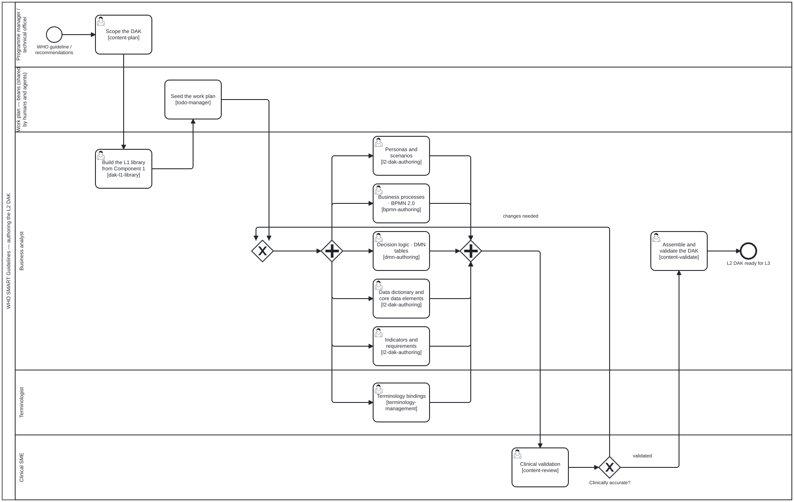

<!-- Generated by scripts/gen-docs-pages.ts from content/docs/guides-who-smart-dak/. Do not hand-edit: the next run overwrites it, and `docs:pages:check` fails on the difference. -->

# Authoring a WHO SMART DAK (L2)
{: .no_toc }

<button type="button" class="fa-qa-badge fa-qa-pending fa-qa-fam-translation" data-qa-family="translation" data-qa-key="page.translation" data-qa-label="Translation QA" data-qa-noun="page" data-qa-src="{{ '/assets/qa/guides-who-smart-dak/page.translation.json' | relative_url }}" data-qa-index="{{ '/assets/qa/guides-who-smart-dak/qa-index.json' | relative_url }}" aria-expanded="false" aria-busy="true" title="Translation QA: loading the verdict…" aria-label="Translation QA: loading the verdict…">TR…</button>

  
On this page

  {: .text-delta }
1. TOC
{:toc}

_This page is generated from [`content/docs/guides-who-smart-dak/`](https://github.com/litlfred/folio-assistant/tree/main/content/docs/guides-who-smart-dak) — each section below links to its own source._

[✎ Edit](https://github.com/litlfred/folio-assistant/edit/main/content/docs/guides-who-smart-dak/overview.md){: .fa-node-edit title="Edit content/docs/guides-who-smart-dak/overview.md" } <button type="button" class="fa-qa-badge fa-qa-pending fa-qa-fam-block" data-qa-family="block" data-qa-key="overview.block" data-qa-label="Content QA" data-qa-noun="block" data-qa-src="{{ '/assets/qa/guides-who-smart-dak/overview.block.json' | relative_url }}" data-qa-index="{{ '/assets/qa/guides-who-smart-dak/qa-index.json' | relative_url }}" aria-expanded="false" aria-busy="true" title="Content QA: loading the verdict…" aria-label="Content QA: loading the verdict…">QA…</button> <button type="button" class="fa-qa-badge fa-qa-pending fa-qa-fam-translation" data-qa-family="translation" data-qa-key="overview.translation" data-qa-label="Translation QA" data-qa-noun="block" data-qa-src="{{ '/assets/qa/guides-who-smart-dak/overview.translation.json' | relative_url }}" data-qa-index="{{ '/assets/qa/guides-who-smart-dak/qa-index.json' | relative_url }}" aria-expanded="false" aria-busy="true" title="Translation QA: loading the verdict…" aria-label="Translation QA: loading the verdict…">TR…</button>

A **Digital Adaptation Kit (DAK)** is the *L2* — machine-readable but
implementation-neutral — representation of a WHO SMART Guideline. This guide
covers authoring the L2 artifacts with folio-assistant and an LLM.

**Skill package:** `authoring-who-smart-guidelines`

---

## The L2 artifacts
{: #the-l2-artifacts data-fa-label="sec:guides-who-smart-dak-the-l2-artifacts" }

[✎ Edit](https://github.com/litlfred/folio-assistant/edit/main/../smart-base/processes/content/l2-dak-authoring.bpmn){: .fa-node-edit title="Edit ../smart-base/processes/content/l2-dak-authoring.bpmn" } <button type="button" class="fa-qa-badge fa-qa-pending fa-qa-fam-block" data-qa-family="block" data-qa-key="the-l2-artifacts.block" data-qa-label="Content QA" data-qa-noun="block" data-qa-src="{{ '/assets/qa/guides-who-smart-dak/the-l2-artifacts.block.json' | relative_url }}" data-qa-index="{{ '/assets/qa/guides-who-smart-dak/qa-index.json' | relative_url }}" aria-expanded="false" aria-busy="true" title="Content QA: loading the verdict…" aria-label="Content QA: loading the verdict…">QA…</button> <button type="button" class="fa-qa-badge fa-qa-pending fa-qa-fam-translation" data-qa-family="translation" data-qa-key="the-l2-artifacts.translation" data-qa-label="Translation QA" data-qa-noun="block" data-qa-src="{{ '/assets/qa/guides-who-smart-dak/the-l2-artifacts.translation.json' | relative_url }}" data-qa-index="{{ '/assets/qa/guides-who-smart-dak/qa-index.json' | relative_url }}" aria-expanded="false" aria-busy="true" title="Translation QA: loading the verdict…" aria-label="Translation QA: loading the verdict…">TR…</button> <button type="button" class="fa-qa-badge fa-qa-pending fa-qa-fam-kg" data-qa-family="kg" data-qa-key="the-l2-artifacts.kg" data-qa-label="Knowledge-graph QA" data-qa-noun="diagram" data-qa-src="{{ '/assets/qa/guides-who-smart-dak/the-l2-artifacts.kg.json' | relative_url }}" data-qa-index="{{ '/assets/qa/guides-who-smart-dak/qa-index.json' | relative_url }}" aria-expanded="false" aria-busy="true" title="Knowledge-graph QA: loading the verdict…" aria-label="Knowledge-graph QA: loading the verdict…">KG…</button>

  

[BPMN 2.0 source](https://github.com/litlfred/folio-assistant/blob/main/smart-base/processes/content/l2-dak-authoring.bpmn) · [full-size SVG](../assets/img/workflows/l2-dak-authoring.svg)
{: .bpmn-source }

| Artifact | Skill | Format |
|----------|-------|--------|
| Business processes | [`bpmn-authoring`]({{ site.baseurl }}/reference/skills/bpmn-authoring.html) | BPMN 2.0 XML |
| Decision logic | [`dmn-authoring`]({{ site.baseurl }}/reference/skills/dmn-authoring.html) | DMN tables |
| Data dictionary | [`l2-dak-authoring`]({{ site.baseurl }}/reference/skills/l2-dak-authoring.html) | Excel / structured |
| Terminology | [`terminology-management`]({{ site.baseurl }}/reference/skills/terminology-management.html) | code systems / value sets |
| Review | [`content-review`]({{ site.baseurl }}/reference/skills/content-review.html) | criteria-based |

The table is the authoring skills, not the DAK. A DAK has **ten components**
(owner, 2026-09-30): the original eight, plus **scheduling logic**, split out
of decision-support logic, and **test scenarios**. Against the skills above:

| # | DAK component | covered above by |
|---|---|---|
| 1 | Health interventions and recommendations | — (cites L1) |
| 2 | Generic personas | — |
| 3 | User scenarios | — |
| 4 | Business processes and workflows | `bpmn-authoring` |
| 5 | Core data elements | `l2-dak-authoring`, `terminology-management` |
| 6 | Decision-support logic | `dmn-authoring` |
| 7 | Scheduling logic | `dmn-authoring` (decision tables) |
| 8 | Indicators and monitoring | — |
| 9 | Functional and non-functional requirements | — |
| 10 | Test scenarios | — |

A dash means *no skill in this table*. It does not mean no skill anywhere. It
is where to look before starting a component.

**Scheduling logic is authored, but not yet formalized.** It is written as DMN
decision tables, like decision-support logic. But it may not yet have its own
L2 logical-model component or L3 artefact (owner, 2026-09-30). That is why the
sources count differently, and the difference is recorded here:

- WHO's DAK figure (slide 3 of `cat-harness/library/kg-folio-asst-2026-09-30`)
  shows nine cards, with scheduling logic as #7, and testing drawn beside them.
- The SMART Base `DAK` logical model (`DAK.fsh`) declares nine fields: test
  scenarios **in**, and scheduling logic carried **inside** decision-support
  logic.
- The speaker notes on that slide said eight.
- WHO's IG starter kit, *L2 DAK authoring*
  (<https://smart.who.int/ig-starter-kit/l2_dak_authoring.html>; source
  `input/pagecontent/l2_dak_authoring.md` in
  `WorldHealthOrganization/smart-ig-starter-kit`, read from `main` on
  2026-09-30) **disagrees with itself**. Its introduction counts *"9
  interlinked components"* with scheduling logic as #7 and no testing. Its own
  table counts 9 with **test scenarios** as #9, and scheduling logic inside
  decision-support logic.

Ten is the owner's count, and this repository encodes it. `DAK_COMPONENTS` in
`smart-base/schemas/dak-kinds.ts` lists ten, and names scheduling logic in
`DAK_UNFORMALIZED_COMPONENTS`: it has a field name ready (`schedulingLogic`),
but `DAK.fsh` does not yet declare that field. The other nine are checked
against `DAK.fsh` field for field.

## Workflow
{: #workflow data-fa-label="sec:guides-who-smart-dak-workflow" }

[✎ Edit](https://github.com/litlfred/folio-assistant/edit/main/content/docs/guides-who-smart-dak/workflow.md){: .fa-node-edit title="Edit content/docs/guides-who-smart-dak/workflow.md" } <button type="button" class="fa-qa-badge fa-qa-pending fa-qa-fam-block" data-qa-family="block" data-qa-key="workflow.block" data-qa-label="Content QA" data-qa-noun="block" data-qa-src="{{ '/assets/qa/guides-who-smart-dak/workflow.block.json' | relative_url }}" data-qa-index="{{ '/assets/qa/guides-who-smart-dak/qa-index.json' | relative_url }}" aria-expanded="false" aria-busy="true" title="Content QA: loading the verdict…" aria-label="Content QA: loading the verdict…">QA…</button> <button type="button" class="fa-qa-badge fa-qa-pending fa-qa-fam-translation" data-qa-family="translation" data-qa-key="workflow.translation" data-qa-label="Translation QA" data-qa-noun="block" data-qa-src="{{ '/assets/qa/guides-who-smart-dak/workflow.translation.json' | relative_url }}" data-qa-index="{{ '/assets/qa/guides-who-smart-dak/qa-index.json' | relative_url }}" aria-expanded="false" aria-busy="true" title="Translation QA: loading the verdict…" aria-label="Translation QA: loading the verdict…">TR…</button>

1. **Plan** — `content-plan`: enumerate the processes, decisions, and data
   elements the guideline implies; identify actors (business analyst, clinical
   SME, terminologist).
2. **Author business processes** — ask the agent to draft BPMN for each clinical
   workflow (`bpmn-authoring`); it produces valid BPMN 2.0.
3. **Author decision logic** — capture recommendations as DMN decision tables
   (`dmn-authoring`), linked to the data dictionary.
4. **Author the data dictionary** — define core data elements with types,
   cardinality, and terminology bindings (`l2-dak-authoring`).
5. **Manage terminology** — define code systems / value sets and bind them
   (`terminology-management`).
6. **Validate & review** — `content-validate` then `content-review` against the
   DAK criteria.

## A mock session
{: #a-mock-session data-fa-label="sec:guides-who-smart-dak-a-mock-session" }

[✎ Edit](https://github.com/litlfred/folio-assistant/edit/main/content/docs/guides-who-smart-dak/a-mock-session.md){: .fa-node-edit title="Edit content/docs/guides-who-smart-dak/a-mock-session.md" } <button type="button" class="fa-qa-badge fa-qa-pending fa-qa-fam-block" data-qa-family="block" data-qa-key="a-mock-session.block" data-qa-label="Content QA" data-qa-noun="block" data-qa-src="{{ '/assets/qa/guides-who-smart-dak/a-mock-session.block.json' | relative_url }}" data-qa-index="{{ '/assets/qa/guides-who-smart-dak/qa-index.json' | relative_url }}" aria-expanded="false" aria-busy="true" title="Content QA: loading the verdict…" aria-label="Content QA: loading the verdict…">QA…</button> <button type="button" class="fa-qa-badge fa-qa-pending fa-qa-fam-translation" data-qa-family="translation" data-qa-key="a-mock-session.translation" data-qa-label="Translation QA" data-qa-noun="block" data-qa-src="{{ '/assets/qa/guides-who-smart-dak/a-mock-session.translation.json' | relative_url }}" data-qa-index="{{ '/assets/qa/guides-who-smart-dak/qa-index.json' | relative_url }}" aria-expanded="false" aria-busy="true" title="Translation QA: loading the verdict…" aria-label="Translation QA: loading the verdict…">TR…</button>

> **You:** Plan the L2 DAK for the immunization guideline — I need the
> "administer vaccine" process and the "is the client due" decision.
>
> **Assistant:** *(loads `content-plan`)* Proposed: 1 BPMN process
> `administer-vaccine`, 1 DMN decision `client-due-for-vaccine`, 4 core data
> elements (client id, antigen, dose number, date administered), 1 value set
> (antigen codes). Scaffold it?
>
> **You:** Yes.
>
> **Assistant:** *(loads `bpmn-authoring`, `dmn-authoring`, `l2-dak-authoring`)*
> Created the BPMN with start → check eligibility → administer → record, the DMN
> table keyed on age/last-dose, and the data dictionary. *(calls
> `content_validate`)* All artifacts valid.

## Next
{: #next data-fa-label="sec:guides-who-smart-dak-next" }

[✎ Edit](https://github.com/litlfred/folio-assistant/edit/main/content/docs/guides-who-smart-dak/next.md){: .fa-node-edit title="Edit content/docs/guides-who-smart-dak/next.md" } <button type="button" class="fa-qa-badge fa-qa-pending fa-qa-fam-block" data-qa-family="block" data-qa-key="next.block" data-qa-label="Content QA" data-qa-noun="block" data-qa-src="{{ '/assets/qa/guides-who-smart-dak/next.block.json' | relative_url }}" data-qa-index="{{ '/assets/qa/guides-who-smart-dak/qa-index.json' | relative_url }}" aria-expanded="false" aria-busy="true" title="Content QA: loading the verdict…" aria-label="Content QA: loading the verdict…">QA…</button> <button type="button" class="fa-qa-badge fa-qa-pending fa-qa-fam-translation" data-qa-family="translation" data-qa-key="next.translation" data-qa-label="Translation QA" data-qa-noun="block" data-qa-src="{{ '/assets/qa/guides-who-smart-dak/next.translation.json' | relative_url }}" data-qa-index="{{ '/assets/qa/guides-who-smart-dak/qa-index.json' | relative_url }}" aria-expanded="false" aria-busy="true" title="Translation QA: loading the verdict…" aria-label="Translation QA: loading the verdict…">TR…</button>

Turn the L2 DAK into a computable FHIR Implementation Guide →
[Authoring a WHO SMART IG (L3)](who-smart-ig.html).
