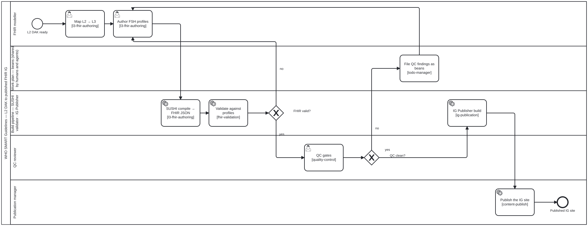

<!-- Generated by scripts/gen-docs-pages.ts from content/docs/guides-who-smart-ig/. Do not hand-edit: the next run overwrites it, and `docs:pages:check` fails on the difference. -->

# Authoring a WHO SMART IG (L3)
{: .no_toc }

TR

  
On this page

  {: .text-delta }
1. TOC
{:toc}

_This page is generated from [`content/docs/guides-who-smart-ig/`](https://github.com/litlfred/folio-assistant/tree/main/content/docs/guides-who-smart-ig) — each section below links to its own source._

[✎ Edit](https://github.com/litlfred/folio-assistant/edit/main/content/docs/guides-who-smart-ig/overview.md){: .fa-node-edit title="Edit content/docs/guides-who-smart-ig/overview.md" } <button type="button" class="fa-qa-badge fa-qa-pending fa-qa-fam-block" data-qa-family="block" data-qa-key="overview.block" data-qa-label="Content QA" data-qa-noun="block" data-qa-src="{{ '/assets/qa/guides-who-smart-ig/overview.block.json' | relative_url }}" data-qa-index="{{ '/assets/qa/guides-who-smart-ig/qa-index.json' | relative_url }}" aria-expanded="false" aria-busy="true" title="Content QA: loading the verdict…" aria-label="Content QA: loading the verdict…">QA…</button> TR

The *L3* layer turns an L2 DAK into a computable **FHIR Implementation Guide**.
This guide covers authoring FHIR artifacts as FSH, compiling with SUSHI,
validating, and publishing with the HL7 IG Publisher — all driven by the LLM.

**Skill package:** `authoring-who-smart-guidelines`

---

## Prerequisites
{: #prerequisites data-fa-label="sec:guides-who-smart-ig-prerequisites" }

[✎ Edit](https://github.com/litlfred/folio-assistant/edit/main/content/docs/guides-who-smart-ig/prerequisites.md){: .fa-node-edit title="Edit content/docs/guides-who-smart-ig/prerequisites.md" } <button type="button" class="fa-qa-badge fa-qa-pending fa-qa-fam-block" data-qa-family="block" data-qa-key="prerequisites.block" data-qa-label="Content QA" data-qa-noun="block" data-qa-src="{{ '/assets/qa/guides-who-smart-ig/prerequisites.block.json' | relative_url }}" data-qa-index="{{ '/assets/qa/guides-who-smart-ig/qa-index.json' | relative_url }}" aria-expanded="false" aria-busy="true" title="Content QA: loading the verdict…" aria-label="Content QA: loading the verdict…">QA…</button> TR

The L3 toolchain is heavier than the platform baseline. The
`authoring-who-smart-guidelines` package's Docker manifest provisions it; to run
locally you need:

| Tool | Purpose | Install |
|------|---------|---------|
| Java 21 (JRE) | IG Publisher | `apt install openjdk-21-jre-headless` |
| FHIR IG Publisher | build the IG | download `publisher.jar` from [HL7/fhir-ig-publisher](https://github.com/HL7/fhir-ig-publisher/releases/latest) |
| SUSHI (`fsh-sushi`) | compile FSH → FHIR | `npm i -g fsh-sushi` |
| Jekyll | IG site rendering | `gem install jekyll bundler` |

Run `bun run check-deps` and the agent's `check_dependencies` tool to confirm.

## The L3 pipeline
{: #the-l3-pipeline data-fa-label="sec:guides-who-smart-ig-the-l3-pipeline" }

[✎ Edit](https://github.com/litlfred/folio-assistant/edit/main/processes/l3-fhir-pipeline.bpmn){: .fa-node-edit title="Edit processes/l3-fhir-pipeline.bpmn" } <button type="button" class="fa-qa-badge fa-qa-pending fa-qa-fam-block" data-qa-family="block" data-qa-key="the-l3-pipeline.block" data-qa-label="Content QA" data-qa-noun="block" data-qa-src="{{ '/assets/qa/guides-who-smart-ig/the-l3-pipeline.block.json' | relative_url }}" data-qa-index="{{ '/assets/qa/guides-who-smart-ig/qa-index.json' | relative_url }}" aria-expanded="false" aria-busy="true" title="Content QA: loading the verdict…" aria-label="Content QA: loading the verdict…">QA…</button> TR KG

  

[BPMN 2.0 source](https://github.com/litlfred/folio-assistant/blob/main/processes/l3-fhir-pipeline.bpmn) · [full-size SVG](../assets/img/workflows/l3-fhir-pipeline.svg)
{: .bpmn-source }

| Step | Skill |
|------|-------|
| Author FSH (profiles, extensions, value sets, examples) | [`l3-fhir-authoring`](../reference/skills/l3-fhir-authoring.html) |
| Validate against FHIR profiles | [`fhir-validation`](../reference/skills/fhir-validation.html) |
| QC gates | [`quality-control`](../reference/skills/quality-control.html) |
| Publish the IG | [`ig-publication`](../reference/skills/ig-publication.html) |

## Workflow
{: #workflow data-fa-label="sec:guides-who-smart-ig-workflow" }

[✎ Edit](https://github.com/litlfred/folio-assistant/edit/main/content/docs/guides-who-smart-ig/workflow.md){: .fa-node-edit title="Edit content/docs/guides-who-smart-ig/workflow.md" } <button type="button" class="fa-qa-badge fa-qa-pending fa-qa-fam-block" data-qa-family="block" data-qa-key="workflow.block" data-qa-label="Content QA" data-qa-noun="block" data-qa-src="{{ '/assets/qa/guides-who-smart-ig/workflow.block.json' | relative_url }}" data-qa-index="{{ '/assets/qa/guides-who-smart-ig/qa-index.json' | relative_url }}" aria-expanded="false" aria-busy="true" title="Content QA: loading the verdict…" aria-label="Content QA: loading the verdict…">QA…</button> TR

1. **Map L2 → L3** — `l3-fhir-authoring`: turn each data element into a FHIR
   profile, each value set into a `ValueSet`, each decision into a
   `PlanDefinition` / `Library` as appropriate.
2. **Author FSH** — the agent writes FHIR Shorthand; SUSHI compiles it to FHIR
   resources.
3. **Validate** — `fhir-validation` runs the validator against the profiles.
4. **QC** — `quality-control` enforces the IG's quality gates.
5. **Publish** — `ig-publication` runs the IG Publisher and renders the site.

## Making the build incremental
{: #making-the-build-incremental data-fa-label="sec:guides-who-smart-ig-making-the-build-incremental" }

[✎ Edit](https://github.com/litlfred/folio-assistant/edit/main/processes/ig-incremental-build.bpmn){: .fa-node-edit title="Edit processes/ig-incremental-build.bpmn" } <button type="button" class="fa-qa-badge fa-qa-pending fa-qa-fam-block" data-qa-family="block" data-qa-key="making-the-build-incremental.block" data-qa-label="Content QA" data-qa-noun="block" data-qa-src="{{ '/assets/qa/guides-who-smart-ig/making-the-build-incremental.block.json' | relative_url }}" data-qa-index="{{ '/assets/qa/guides-who-smart-ig/qa-index.json' | relative_url }}" aria-expanded="false" aria-busy="true" title="Content QA: loading the verdict…" aria-label="Content QA: loading the verdict…">QA…</button> TR KG

  

[BPMN 2.0 source](https://github.com/litlfred/folio-assistant/blob/main/processes/ig-incremental-build.bpmn) · [full-size SVG](../assets/img/workflows/ig-incremental-build.svg)
{: .bpmn-source }

Every trigger in a DAK repository — a push to a PR branch, `/validate`, `/deploy`, a
push to `main`, a release — runs the same full IG Publisher build, and a one-line edit to
one profile costs all of it. [Proposal: incremental IG build](../proposals/ig-incremental-build.html)
measures why that is avoidable: on `smart-immunizations` the median artefact has no
dependents and the 90th percentile has six, so almost every edit invalidates a handful
of resources and the index. [Its overview](../proposals/ig-incremental-build-overview.html)
lists the eleven changes and pins each to the stage of the review and publish pipeline
where it runs.

The process above is the L3 pipeline's build lane once the derived artefacts are cached
by dependency cone. Restore first; compute the change's cone with
`bun run content/pipeline/fsh-cone.ts <ig-root> --changed <files>`; compile and
validate only the cone against the warm validator; re-render the cone's records;
rebuild the meta-index; assemble the site. A cache miss or a moved toolchain falls back
to today's full build, and only a green build of `main` or a release seeds the cache.

| Step | Implemented by |
|------|----------------|
| Restore and seed the derived state | `ig-cache.sh` (proposed; the `lake-cache.sh` contract) |
| Compute the cone of the change | [`content/pipeline/fsh-cone.ts`](https://github.com/litlfred/folio-assistant/blob/main/content/pipeline/fsh-cone.ts) |
| Validate the cone | [`fhir-validation`](../reference/skills/fhir-validation.html) over the warm validator service (proposed MCP tools) |
| Rebuild the meta-index, assemble the site | `ig_metaindex_rebuild` (proposed), [`ig-publication`](../reference/skills/ig-publication.html) |
| QC gates, deploy | [`quality-control`](../reference/skills/quality-control.html), [`content-publish`](../reference/skills/content-publish.html) |

## A mock session
{: #a-mock-session data-fa-label="sec:guides-who-smart-ig-a-mock-session" }

[✎ Edit](https://github.com/litlfred/folio-assistant/edit/main/content/docs/guides-who-smart-ig/a-mock-session.md){: .fa-node-edit title="Edit content/docs/guides-who-smart-ig/a-mock-session.md" } <button type="button" class="fa-qa-badge fa-qa-pending fa-qa-fam-block" data-qa-family="block" data-qa-key="a-mock-session.block" data-qa-label="Content QA" data-qa-noun="block" data-qa-src="{{ '/assets/qa/guides-who-smart-ig/a-mock-session.block.json' | relative_url }}" data-qa-index="{{ '/assets/qa/guides-who-smart-ig/qa-index.json' | relative_url }}" aria-expanded="false" aria-busy="true" title="Content QA: loading the verdict…" aria-label="Content QA: loading the verdict…">QA…</button> TR

> **You:** Generate the FHIR profile and value set for the immunization data
> dictionary from the L2 DAK, then build the IG.
>
> **Assistant:** *(loads `l3-fhir-authoring`)* Authored `ImmunizationRecord`
> profile + `AntigenCodes` value set as FSH. *(runs SUSHI)* Compiled to FHIR R4.
> *(loads `fhir-validation`)* Validator: 0 errors, 2 warnings. *(loads
> `ig-publication`)* Built the IG with the HL7 publisher — site is in `output/`.
>
> **You:** Show me the QA report.
>
> **Assistant:** *(loads `quality-control`)* QA: broken links 0, profile
> conformance ✓, terminology bindings resolved ✓.

## Next
{: #next data-fa-label="sec:guides-who-smart-ig-next" }

[✎ Edit](https://github.com/litlfred/folio-assistant/edit/main/content/docs/guides-who-smart-ig/next.md){: .fa-node-edit title="Edit content/docs/guides-who-smart-ig/next.md" } <button type="button" class="fa-qa-badge fa-qa-pending fa-qa-fam-block" data-qa-family="block" data-qa-key="next.block" data-qa-label="Content QA" data-qa-noun="block" data-qa-src="{{ '/assets/qa/guides-who-smart-ig/next.block.json' | relative_url }}" data-qa-index="{{ '/assets/qa/guides-who-smart-ig/qa-index.json' | relative_url }}" aria-expanded="false" aria-busy="true" title="Content QA: loading the verdict…" aria-label="Content QA: loading the verdict…">QA…</button> TR

- [Content types — WHO SMART IGs](../content-types.html#who-smart-implementation-guides-l3)
- [Authoring a WHO SMART DAK (L2)](who-smart-dak.html) — the upstream L2 layer
