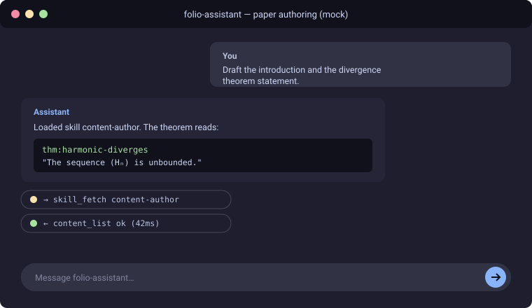
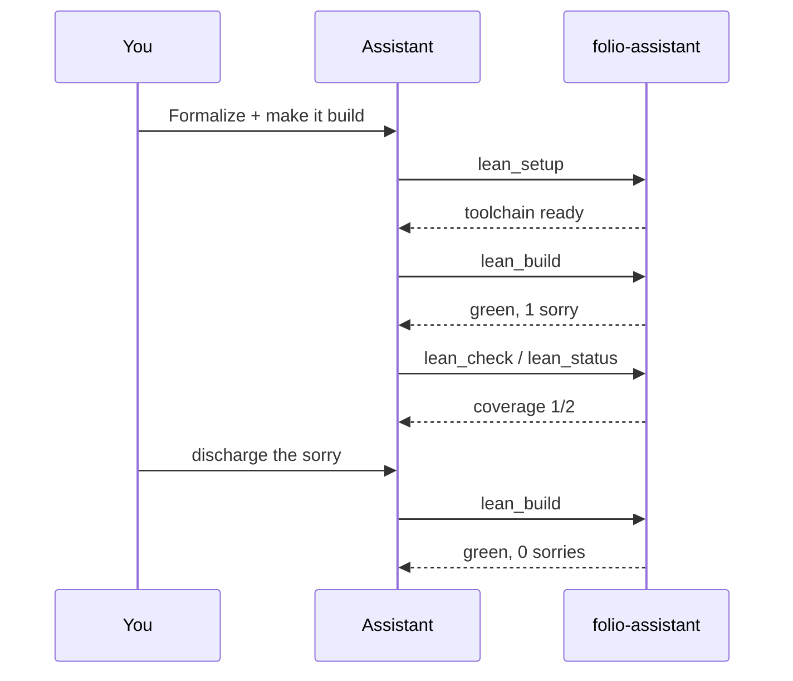
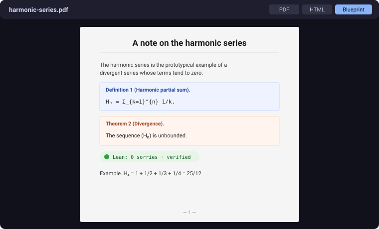

<!-- Generated by scripts/gen-docs-pages.ts from content/docs/guides-writing-a-paper/. Do not hand-edit: the next run overwrites it, and `docs:pages:check` fails on the difference. -->

# Tutorial — writing a paper with folio-assistant
{: .no_toc }

<span class="fa-qa-badges fa-page-qa-badges"><span class="fa-qa-badge fa-qa-unswept fa-qa-fam-translation" title="Translation QA: not swept — no block on this page carries a translation verdict" aria-label="Translation QA: not swept — no block on this page carries a translation verdict"><span class="fa-qa-tag">TR</span></span></span>

<details open markdown="block">
  <summary>On this page</summary>
  {: .text-delta }
1. TOC
{:toc}
</details>

_This page is generated from [`content/docs/guides-writing-a-paper/`](https://github.com/litlfred/folio-assistant/tree/main/content/docs/guides-writing-a-paper) — each section below links to its own source._

[✎ Edit](https://github.com/litlfred/folio-assistant/edit/main/content/docs/guides-writing-a-paper/overview.md){: .fa-node-edit title="Edit content/docs/guides-writing-a-paper/overview.md" } <span class="fa-qa-badges"><button type="button" class="fa-qa-badge fa-qa-pending fa-qa-fam-block" data-qa-family="block" data-qa-key="overview.block" data-qa-label="Content QA" data-qa-noun="block" data-qa-src="{{ '/assets/qa/guides-writing-a-paper/overview.block.json' | relative_url }}" data-qa-index="{{ '/assets/qa/guides-writing-a-paper/qa-index.json' | relative_url }}" aria-expanded="false" aria-busy="true" title="Content QA: loading the verdict…" aria-label="Content QA: loading the verdict…"><span class="fa-qa-tag">QA</span><span class="fa-qa-glyph" aria-hidden="true">…</span></button> <span class="fa-qa-badge fa-qa-unswept fa-qa-fam-translation" title="Translation QA: not swept — no sidecar for this block" aria-label="Translation QA: not swept — no sidecar for this block"><span class="fa-qa-tag">TR</span></span></span>

This tutorial walks through authoring a rigorous scientific paper **with an LLM**
driving folio-assistant: the agent plans the paper, drafts blocks, formalizes
theorems in Lean 4, renders LaTeX, and publishes — while you steer.

It uses a small running example — *"A note on the harmonic series"* — purely to
illustrate the workflow. The content is not the point; the **formalism and the
LLM workflow** are.

---

## The end-to-end workflow
{: #the-end-to-end-workflow data-fa-label="sec:guides-writing-a-paper-the-end-to-end-workflow" }

[✎ Edit](https://github.com/litlfred/folio-assistant/edit/main/skills/workflows/authoring-a-paper.bpmn){: .fa-node-edit title="Edit skills/workflows/authoring-a-paper.bpmn" } <span class="fa-qa-badges"><button type="button" class="fa-qa-badge fa-qa-pending fa-qa-fam-block" data-qa-family="block" data-qa-key="the-end-to-end-workflow.block" data-qa-label="Content QA" data-qa-noun="block" data-qa-src="{{ '/assets/qa/guides-writing-a-paper/the-end-to-end-workflow.block.json' | relative_url }}" data-qa-index="{{ '/assets/qa/guides-writing-a-paper/qa-index.json' | relative_url }}" aria-expanded="false" aria-busy="true" title="Content QA: loading the verdict…" aria-label="Content QA: loading the verdict…"><span class="fa-qa-tag">QA</span><span class="fa-qa-glyph" aria-hidden="true">…</span></button> <span class="fa-qa-badge fa-qa-unswept fa-qa-fam-translation" title="Translation QA: not swept — no sidecar for this block" aria-label="Translation QA: not swept — no sidecar for this block"><span class="fa-qa-tag">TR</span></span> <button type="button" class="fa-qa-badge fa-qa-pending fa-qa-fam-kg" data-qa-family="kg" data-qa-key="the-end-to-end-workflow.kg" data-qa-label="Knowledge-graph QA" data-qa-noun="diagram" data-qa-src="{{ '/assets/qa/guides-writing-a-paper/the-end-to-end-workflow.kg.json' | relative_url }}" data-qa-index="{{ '/assets/qa/guides-writing-a-paper/qa-index.json' | relative_url }}" aria-expanded="false" aria-busy="true" title="Knowledge-graph QA: loading the verdict…" aria-label="Knowledge-graph QA: loading the verdict…"><span class="fa-qa-tag">KG</span><span class="fa-qa-glyph" aria-hidden="true">…</span></button></span>

<div class="bpmn-figure" id="figure-the-end-to-end-workflow">
  
</div>

[BPMN 2.0 source](https://github.com/litlfred/folio-assistant/blob/main/skills/workflows/authoring-a-paper.bpmn) · [full-size SVG](../assets/img/workflows/authoring-a-paper.svg)
{: .bpmn-source }

Every step is something the LLM does *for you* by calling folio-assistant's MCP
tools — you converse in natural language and approve the work. *Approve* is
literal: steps 3–5 are a loop, and the assistant's edit is a **proposal** until
you have seen the validation findings and accepted it. The
[publication workflow](../publication-workflow.html) models that gate, and the
review and release that follow, as BPMN swimlane diagrams.

---

## Before you start
{: #before-you-start data-fa-label="sec:guides-writing-a-paper-before-you-start" }

[✎ Edit](https://github.com/litlfred/folio-assistant/edit/main/content/docs/guides-writing-a-paper/before-you-start.md){: .fa-node-edit title="Edit content/docs/guides-writing-a-paper/before-you-start.md" } <span class="fa-qa-badges"><button type="button" class="fa-qa-badge fa-qa-pending fa-qa-fam-block" data-qa-family="block" data-qa-key="before-you-start.block" data-qa-label="Content QA" data-qa-noun="block" data-qa-src="{{ '/assets/qa/guides-writing-a-paper/before-you-start.block.json' | relative_url }}" data-qa-index="{{ '/assets/qa/guides-writing-a-paper/qa-index.json' | relative_url }}" aria-expanded="false" aria-busy="true" title="Content QA: loading the verdict…" aria-label="Content QA: loading the verdict…"><span class="fa-qa-tag">QA</span><span class="fa-qa-glyph" aria-hidden="true">…</span></button> <span class="fa-qa-badge fa-qa-unswept fa-qa-fam-translation" title="Translation QA: not swept — no sidecar for this block" aria-label="Translation QA: not swept — no sidecar for this block"><span class="fa-qa-tag">TR</span></span></span>

1. [Install folio-assistant](../installation.html) and run `bun run check-deps`.
   For papers you want `bun`, `latexmk`/`texlive`, and Lean (`elan`).
2. [Connect your LLM harness](../installation.html#connecting-an-llm-harness)
   (Claude Code, Antigravity, …) so the agent has the MCP tools.
3. Create an (empty) content repository for your paper and add a
   `<name>.config.json` with `"contentType": "paper"`.

---

## Step 1 — Plan the paper
{: #step-1-plan-the-paper data-fa-label="sec:guides-writing-a-paper-step-1-plan-the-paper" }

[✎ Edit](https://github.com/litlfred/folio-assistant/edit/main/content/docs/guides-writing-a-paper/step-1-plan-the-paper.md){: .fa-node-edit title="Edit content/docs/guides-writing-a-paper/step-1-plan-the-paper.md" } <span class="fa-qa-badges"><button type="button" class="fa-qa-badge fa-qa-pending fa-qa-fam-block" data-qa-family="block" data-qa-key="step-1-plan-the-paper.block" data-qa-label="Content QA" data-qa-noun="block" data-qa-src="{{ '/assets/qa/guides-writing-a-paper/step-1-plan-the-paper.block.json' | relative_url }}" data-qa-index="{{ '/assets/qa/guides-writing-a-paper/qa-index.json' | relative_url }}" aria-expanded="false" aria-busy="true" title="Content QA: loading the verdict…" aria-label="Content QA: loading the verdict…"><span class="fa-qa-tag">QA</span><span class="fa-qa-glyph" aria-hidden="true">…</span></button> <span class="fa-qa-badge fa-qa-unswept fa-qa-fam-translation" title="Translation QA: not swept — no sidecar for this block" aria-label="Translation QA: not swept — no sidecar for this block"><span class="fa-qa-tag">TR</span></span></span>

Start by asking the agent to load the planning skill and propose a structure.
Behind the scenes it calls `skill_fetch content-plan`.

> **You:** I want to write a short paper, *"A note on the harmonic series"*. It
> should define the partial sums, state and prove that the series diverges, and
> include one worked example. Plan it out.
>
> **Assistant:** *(loads `content-plan`)* Here's a proposed plan:
>
> 1. **`prose`** — Introduction & motivation
> 2. **`definition`** `def:harmonic-partial-sum` — the partial sum $H_n$
> 3. **`theorem`** `thm:harmonic-diverges` — $H_n \to \infty$
> 4. **`proof`** `prf:harmonic-diverges` — Oresme's grouping argument
> 5. **`example`** `ex:H4` — compute $H_4$
>
> The definition and theorem will get Lean counterparts. Shall I scaffold the
> repo and create these blocks as drafts?
>
> **You:** Yes, go ahead.

This is also where you'd open work-plan items so the plan survives across
sessions:

```sh
beans create "Draft harmonic-series paper: blocks + Lean"
beans <id> --status in-progress
```

## Step 2 — Scaffold the repository
{: #step-2-scaffold-the-repository data-fa-label="sec:guides-writing-a-paper-step-2-scaffold-the-repository" }

[✎ Edit](https://github.com/litlfred/folio-assistant/edit/main/content/docs/guides-writing-a-paper/step-2-scaffold-the-repository.md){: .fa-node-edit title="Edit content/docs/guides-writing-a-paper/step-2-scaffold-the-repository.md" } <span class="fa-qa-badges"><button type="button" class="fa-qa-badge fa-qa-pending fa-qa-fam-block" data-qa-family="block" data-qa-key="step-2-scaffold-the-repository.block" data-qa-label="Content QA" data-qa-noun="block" data-qa-src="{{ '/assets/qa/guides-writing-a-paper/step-2-scaffold-the-repository.block.json' | relative_url }}" data-qa-index="{{ '/assets/qa/guides-writing-a-paper/qa-index.json' | relative_url }}" aria-expanded="false" aria-busy="true" title="Content QA: loading the verdict…" aria-label="Content QA: loading the verdict…"><span class="fa-qa-tag">QA</span><span class="fa-qa-glyph" aria-hidden="true">…</span></button> <span class="fa-qa-badge fa-qa-unswept fa-qa-fam-translation" title="Translation QA: not swept — no sidecar for this block" aria-label="Translation QA: not swept — no sidecar for this block"><span class="fa-qa-tag">TR</span></span></span>

The agent creates the block files and a `main.tex`, then confirms with
`content_list`.

### Required `.gitignore` baseline
{: #required-gitignore-baseline data-fa-label="sec:guides-writing-a-paper-required-gitignore-baseline" }

[✎ Edit](https://github.com/litlfred/folio-assistant/edit/main/content/docs/guides-writing-a-paper/required-gitignore-baseline.md){: .fa-node-edit title="Edit content/docs/guides-writing-a-paper/required-gitignore-baseline.md" } <span class="fa-qa-badges"><button type="button" class="fa-qa-badge fa-qa-pending fa-qa-fam-block" data-qa-family="block" data-qa-key="required-gitignore-baseline.block" data-qa-label="Content QA" data-qa-noun="block" data-qa-src="{{ '/assets/qa/guides-writing-a-paper/required-gitignore-baseline.block.json' | relative_url }}" data-qa-index="{{ '/assets/qa/guides-writing-a-paper/qa-index.json' | relative_url }}" aria-expanded="false" aria-busy="true" title="Content QA: loading the verdict…" aria-label="Content QA: loading the verdict…"><span class="fa-qa-tag">QA</span><span class="fa-qa-glyph" aria-hidden="true">…</span></button> <span class="fa-qa-badge fa-qa-unswept fa-qa-fam-translation" title="Translation QA: not swept — no sidecar for this block" aria-label="Translation QA: not swept — no sidecar for this block"><span class="fa-qa-tag">TR</span></span></span>

Every new folio repository starts with these entries. They are not optional
polish — agent sandboxes accumulate scratch directories as untracked state, and
a single `git add -A` then commits all of it under a message describing
something else. In the `qou` folio that mechanism produced one commit adding
**46,155 files / 11.4 M insertions** under a one-file Lean subject line,
including 14,688 duplicate beans.

```gitignore
# Agent scratch state — transient tooling state, never repository content.
# Leading slash = root-level only. Keep it (see the warning below).
/.agents/
/amalgamated_done/
/amalgamated_input/
/_deprecated/
/scratch/
.claude/worktrees/

# Python bytecode
__pycache__/
*.py[cod]
```

**Keep the leading slashes.** A gitignore pattern containing no internal slash
matches at *every* directory depth, not just the root. Written unanchored, the
`_deprecated/` line above silently captured two documented archives in the `qou`
folio — `computations/_deprecated/` (1,449 tracked files, including
`script-qa/*.script-qa.json` QA sidecars) and `docs/audits/_deprecated/` (66) —
and `scratch/` reached every `content/**/scratch/`. Already-tracked files were
unaffected, because an ignore rule never untracks; the hazard is that any *new*
file under such a path is skipped by `git add` with no error and no output. If
your folio keeps a nested archive or scratch area under one of these names, the
anchored form is what keeps it committable.

Two deliberate exclusions:

- **`beans/` stays tracked.** It is the durable, cross-session work plan; a
  sibling agent has to be able to read it. Bean *duplication* is prevented by
  the create-guard in
  [`skills/folio-core/todo-manager.md`](../../skills/folio-core/todo-manager.md),
  not by ignoring the directory.
- **Any directory your folio documents as a real pipeline stays tracked** — in
  `qou`, `uploads/` is the document-intake stage and belongs in git. Check your
  own `AGENTS.md` §Project structure before adding a path to this list: if it is
  documented there, it is content, not scratch.

> **Assistant:** *(creates blocks, calls `content_list`)* Scaffolded 5 blocks
> under `content/harmonic-series/`. Current artifacts:
>
> ```
> content/harmonic-series/
> ├── 00-intro.prose.md
> ├── 10-def-partial-sum.definition.md
> ├── 20-thm-diverges.theorem.md
> ├── 21-prf-diverges.proof.md
> └── 30-ex-h4.example.md
> ```

Each block carries typed front-matter validated against the
[content-object model](../api/). A definition block, for example:

```markdown
---
kind: definition
id: def:harmonic-partial-sum
title: Harmonic partial sum
lean: HarmonicSeries.partialSum
---
For $n \ge 1$, the *$n$-th harmonic partial sum* is
$$ H_n = \sum_{k=1}^{n} \frac{1}{k}. $$
```

## Step 3 — Author the content
{: #step-3-author-the-content data-fa-label="sec:guides-writing-a-paper-step-3-author-the-content" }

[✎ Edit](https://github.com/litlfred/folio-assistant/edit/main/content/docs/guides-writing-a-paper/step-3-author-the-content.md){: .fa-node-edit title="Edit content/docs/guides-writing-a-paper/step-3-author-the-content.md" } <span class="fa-qa-badges"><button type="button" class="fa-qa-badge fa-qa-pending fa-qa-fam-block" data-qa-family="block" data-qa-key="step-3-author-the-content.block" data-qa-label="Content QA" data-qa-noun="block" data-qa-src="{{ '/assets/qa/guides-writing-a-paper/step-3-author-the-content.block.json' | relative_url }}" data-qa-index="{{ '/assets/qa/guides-writing-a-paper/qa-index.json' | relative_url }}" aria-expanded="false" aria-busy="true" title="Content QA: loading the verdict…" aria-label="Content QA: loading the verdict…"><span class="fa-qa-tag">QA</span><span class="fa-qa-glyph" aria-hidden="true">…</span></button> <span class="fa-qa-badge fa-qa-unswept fa-qa-fam-translation" title="Translation QA: not swept — no sidecar for this block" aria-label="Translation QA: not swept — no sidecar for this block"><span class="fa-qa-tag">TR</span></span></span>

Ask the agent to draft prose and statements; review and refine conversationally.

> **You:** Draft the introduction and the divergence theorem statement.
>
> **Assistant:** *(loads `content-author`, edits the blocks)* Done. The theorem
> reads: *"The sequence $(H_n)$ is unbounded; equivalently $\sum 1/k$ diverges."*
> I kept the statement Lean-friendly so it maps cleanly to `Filter.Tendsto`.

A mock of the chat-driven authoring session:



## Step 4 — Formalize in Lean
{: #step-4-formalize-in-lean data-fa-label="sec:guides-writing-a-paper-step-4-formalize-in-lean" }

[✎ Edit](https://github.com/litlfred/folio-assistant/edit/main/content/docs/guides-writing-a-paper/step-4-formalize-in-lean.md){: .fa-node-edit title="Edit content/docs/guides-writing-a-paper/step-4-formalize-in-lean.md" } <span class="fa-qa-badges"><button type="button" class="fa-qa-badge fa-qa-pending fa-qa-fam-block" data-qa-family="block" data-qa-key="step-4-formalize-in-lean.block" data-qa-label="Content QA" data-qa-noun="block" data-qa-src="{{ '/assets/qa/guides-writing-a-paper/step-4-formalize-in-lean.block.json' | relative_url }}" data-qa-index="{{ '/assets/qa/guides-writing-a-paper/qa-index.json' | relative_url }}" aria-expanded="false" aria-busy="true" title="Content QA: loading the verdict…" aria-label="Content QA: loading the verdict…"><span class="fa-qa-tag">QA</span><span class="fa-qa-glyph" aria-hidden="true">…</span></button> <span class="fa-qa-badge fa-qa-unswept fa-qa-fam-translation" title="Translation QA: not swept — no sidecar for this block" aria-label="Translation QA: not swept — no sidecar for this block"><span class="fa-qa-tag">TR</span></span></span>

Now the agent sets up Lean and formalizes the definition and theorem, calling
`lean_setup`, `lean_build`, and `lean_check`.

> **You:** Formalize the definition and theorem in Lean and make it build.
>
> **Assistant:** *(loads `lean-formalization`; calls `lean_setup`)* Toolchain
> ready (Lean 4.16.0). I added:
>
> ```lean
> namespace HarmonicSeries
> def partialSum (n : ℕ) : ℝ := ∑ k ∈ Finset.range n, 1 / (k + 1 : ℝ)
>
> theorem diverges : ¬ ∃ B, ∀ n, partialSum n ≤ B := by
>   sorry -- Ref: [oresme] grouping argument
> ```
>
> *(calls `lean_build`)* Build is green with **1 `sorry`** remaining. *(calls
> `lean_status`)* Proof coverage: 1/2 blocks fully proved.
>
> **You:** Discharge the sorry using the grouping bound.
>
> **Assistant:** *(edits, `lean_build`)* ✅ Build green, **0 sorries**.
> `proof-verification` reports the axiom set is clean (no `sorryAx`).



## Step 5 — Validate
{: #step-5-validate data-fa-label="sec:guides-writing-a-paper-step-5-validate" }

[✎ Edit](https://github.com/litlfred/folio-assistant/edit/main/content/docs/guides-writing-a-paper/step-5-validate.md){: .fa-node-edit title="Edit content/docs/guides-writing-a-paper/step-5-validate.md" } <span class="fa-qa-badges"><button type="button" class="fa-qa-badge fa-qa-pending fa-qa-fam-block" data-qa-family="block" data-qa-key="step-5-validate.block" data-qa-label="Content QA" data-qa-noun="block" data-qa-src="{{ '/assets/qa/guides-writing-a-paper/step-5-validate.block.json' | relative_url }}" data-qa-index="{{ '/assets/qa/guides-writing-a-paper/qa-index.json' | relative_url }}" aria-expanded="false" aria-busy="true" title="Content QA: loading the verdict…" aria-label="Content QA: loading the verdict…"><span class="fa-qa-tag">QA</span><span class="fa-qa-glyph" aria-hidden="true">…</span></button> <span class="fa-qa-badge fa-qa-unswept fa-qa-fam-translation" title="Translation QA: not swept — no sidecar for this block" aria-label="Translation QA: not swept — no sidecar for this block"><span class="fa-qa-tag">TR</span></span></span>

Validation checks every block against its schema and the project's constraint
rules (label prefixes, required Lean links, citation resolution, …).

> **You:** Validate the whole paper.
>
> **Assistant:** *(calls `content_validate`)* All 5 blocks valid. Constraints:
> `def:` block has its required Lean link ✓, theorem has a proof block ✓, example
> references a defined symbol ✓.

## Step 6 — Render
{: #step-6-render data-fa-label="sec:guides-writing-a-paper-step-6-render" }

[✎ Edit](https://github.com/litlfred/folio-assistant/edit/main/content/docs/guides-writing-a-paper/step-6-render.md){: .fa-node-edit title="Edit content/docs/guides-writing-a-paper/step-6-render.md" } <span class="fa-qa-badges"><button type="button" class="fa-qa-badge fa-qa-pending fa-qa-fam-block" data-qa-family="block" data-qa-key="step-6-render.block" data-qa-label="Content QA" data-qa-noun="block" data-qa-src="{{ '/assets/qa/guides-writing-a-paper/step-6-render.block.json' | relative_url }}" data-qa-index="{{ '/assets/qa/guides-writing-a-paper/qa-index.json' | relative_url }}" aria-expanded="false" aria-busy="true" title="Content QA: loading the verdict…" aria-label="Content QA: loading the verdict…"><span class="fa-qa-tag">QA</span><span class="fa-qa-glyph" aria-hidden="true">…</span></button> <span class="fa-qa-badge fa-qa-unswept fa-qa-fam-translation" title="Translation QA: not swept — no sidecar for this block" aria-label="Translation QA: not swept — no sidecar for this block"><span class="fa-qa-tag">TR</span></span></span>

The agent renders a PDF (and/or HTML) with the paper adapter.

> **You:** Render the PDF and show me a preview.
>
> **Assistant:** *(calls `paper_render_pdf`, then `paper_preview`)* Rendered
> `harmonic-series.pdf` (3 pages). Preview below.



You can set rendering preferences (engine, scope, math renderer) via the
`paper_preferences` tool:

> **You:** Use lualatex and render only the theorem section next time.
>
> **Assistant:** *(calls `paper_preferences action=set latex_engine=lualatex render_scope=section`)* Saved.

## Step 7 — Review & feedback
{: #step-7-review-feedback data-fa-label="sec:guides-writing-a-paper-step-7-review-feedback" }

[✎ Edit](https://github.com/litlfred/folio-assistant/edit/main/content/docs/guides-writing-a-paper/step-7-review-feedback.md){: .fa-node-edit title="Edit content/docs/guides-writing-a-paper/step-7-review-feedback.md" } <span class="fa-qa-badges"><button type="button" class="fa-qa-badge fa-qa-pending fa-qa-fam-block" data-qa-family="block" data-qa-key="step-7-review-feedback.block" data-qa-label="Content QA" data-qa-noun="block" data-qa-src="{{ '/assets/qa/guides-writing-a-paper/step-7-review-feedback.block.json' | relative_url }}" data-qa-index="{{ '/assets/qa/guides-writing-a-paper/qa-index.json' | relative_url }}" aria-expanded="false" aria-busy="true" title="Content QA: loading the verdict…" aria-label="Content QA: loading the verdict…"><span class="fa-qa-tag">QA</span><span class="fa-qa-glyph" aria-hidden="true">…</span></button> <span class="fa-qa-badge fa-qa-unswept fa-qa-fam-translation" title="Translation QA: not swept — no sidecar for this block" aria-label="Translation QA: not swept — no sidecar for this block"><span class="fa-qa-tag">TR</span></span></span>

Reviewer feedback is captured in the feedback store and routed back into the
authoring loop (`content-review` / `content-feedback`).

> **You:** A reviewer says the example should also show $H_8$. Log it and address it.
>
> **Assistant:** *(records feedback, edits `ex:H4` → adds $H_8$, re-validates,
> re-renders)* Done; feedback item resolved.

## Step 8 — Publish
{: #step-8-publish data-fa-label="sec:guides-writing-a-paper-step-8-publish" }

[✎ Edit](https://github.com/litlfred/folio-assistant/edit/main/content/docs/guides-writing-a-paper/step-8-publish.md){: .fa-node-edit title="Edit content/docs/guides-writing-a-paper/step-8-publish.md" } <span class="fa-qa-badges"><button type="button" class="fa-qa-badge fa-qa-pending fa-qa-fam-block" data-qa-family="block" data-qa-key="step-8-publish.block" data-qa-label="Content QA" data-qa-noun="block" data-qa-src="{{ '/assets/qa/guides-writing-a-paper/step-8-publish.block.json' | relative_url }}" data-qa-index="{{ '/assets/qa/guides-writing-a-paper/qa-index.json' | relative_url }}" aria-expanded="false" aria-busy="true" title="Content QA: loading the verdict…" aria-label="Content QA: loading the verdict…"><span class="fa-qa-tag">QA</span><span class="fa-qa-glyph" aria-hidden="true">…</span></button> <span class="fa-qa-badge fa-qa-unswept fa-qa-fam-translation" title="Translation QA: not swept — no sidecar for this block" aria-label="Translation QA: not swept — no sidecar for this block"><span class="fa-qa-tag">TR</span></span></span>

Finally, publish the rendered artifacts. In CI this is the `publish` workflow;
locally the agent runs `content_build` and the render tools, then commits.

> **You:** Publish it.
>
> **Assistant:** *(loads `content-publish`, `content_build`, commits + pushes)*
> Published. PDF, HTML, and the Lean blueprint are built; the work-plan item is
> marked resolved.

```sh
beans <id> --status resolved
```

---

## What you end up with
{: #what-you-end-up-with data-fa-label="sec:guides-writing-a-paper-what-you-end-up-with" }

[✎ Edit](https://github.com/litlfred/folio-assistant/edit/main/content/docs/guides-writing-a-paper/what-you-end-up-with.md){: .fa-node-edit title="Edit content/docs/guides-writing-a-paper/what-you-end-up-with.md" } <span class="fa-qa-badges"><button type="button" class="fa-qa-badge fa-qa-pending fa-qa-fam-block" data-qa-family="block" data-qa-key="what-you-end-up-with.block" data-qa-label="Content QA" data-qa-noun="block" data-qa-src="{{ '/assets/qa/guides-writing-a-paper/what-you-end-up-with.block.json' | relative_url }}" data-qa-index="{{ '/assets/qa/guides-writing-a-paper/qa-index.json' | relative_url }}" aria-expanded="false" aria-busy="true" title="Content QA: loading the verdict…" aria-label="Content QA: loading the verdict…"><span class="fa-qa-tag">QA</span><span class="fa-qa-glyph" aria-hidden="true">…</span></button> <span class="fa-qa-badge fa-qa-unswept fa-qa-fam-translation" title="Translation QA: not swept — no sidecar for this block" aria-label="Translation QA: not swept — no sidecar for this block"><span class="fa-qa-tag">TR</span></span></span>

- A paper as a tree of **typed, validated blocks**
- A **Lean 4 formalization** with zero `sorry`s and a clean axiom audit
- **PDF + HTML** renders and an interactive blueprint
- A reproducible **CI pipeline** (validate → build → render → publish)

## Where to go deeper
{: #where-to-go-deeper data-fa-label="sec:guides-writing-a-paper-where-to-go-deeper" }

[✎ Edit](https://github.com/litlfred/folio-assistant/edit/main/content/docs/guides-writing-a-paper/where-to-go-deeper.md){: .fa-node-edit title="Edit content/docs/guides-writing-a-paper/where-to-go-deeper.md" } <span class="fa-qa-badges"><button type="button" class="fa-qa-badge fa-qa-pending fa-qa-fam-block" data-qa-family="block" data-qa-key="where-to-go-deeper.block" data-qa-label="Content QA" data-qa-noun="block" data-qa-src="{{ '/assets/qa/guides-writing-a-paper/where-to-go-deeper.block.json' | relative_url }}" data-qa-index="{{ '/assets/qa/guides-writing-a-paper/qa-index.json' | relative_url }}" aria-expanded="false" aria-busy="true" title="Content QA: loading the verdict…" aria-label="Content QA: loading the verdict…"><span class="fa-qa-tag">QA</span><span class="fa-qa-glyph" aria-hidden="true">…</span></button> <span class="fa-qa-badge fa-qa-unswept fa-qa-fam-translation" title="Translation QA: not swept — no sidecar for this block" aria-label="Translation QA: not swept — no sidecar for this block"><span class="fa-qa-tag">TR</span></span></span>

- [Content types — papers & books](../content-types.html#scientific-papers--books)
- Skill contracts:
  [`latex-authoring`](../reference/skills/latex-authoring.html),
  [`lean-formalization`](../reference/skills/lean-formalization.html),
  [`proof-verification`](../reference/skills/proof-verification.html)
- [TypeScript API reference](../api/) — the block model in detail
- [Architecture](../architecture.html) — how the paper adapter is wired

> **Note on the screenshots.** The images above are *mockups* illustrating the
> chat-driven workflow and the viewer. Replace them with real screenshots from
> your own session under `docs/assets/img/` to keep the tutorial current.
