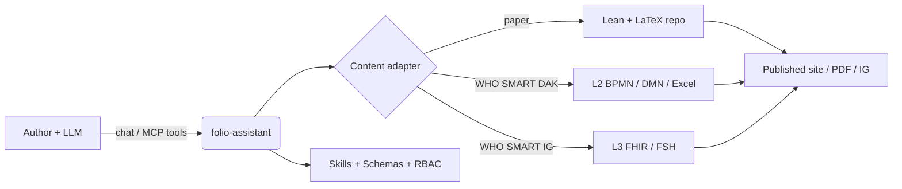
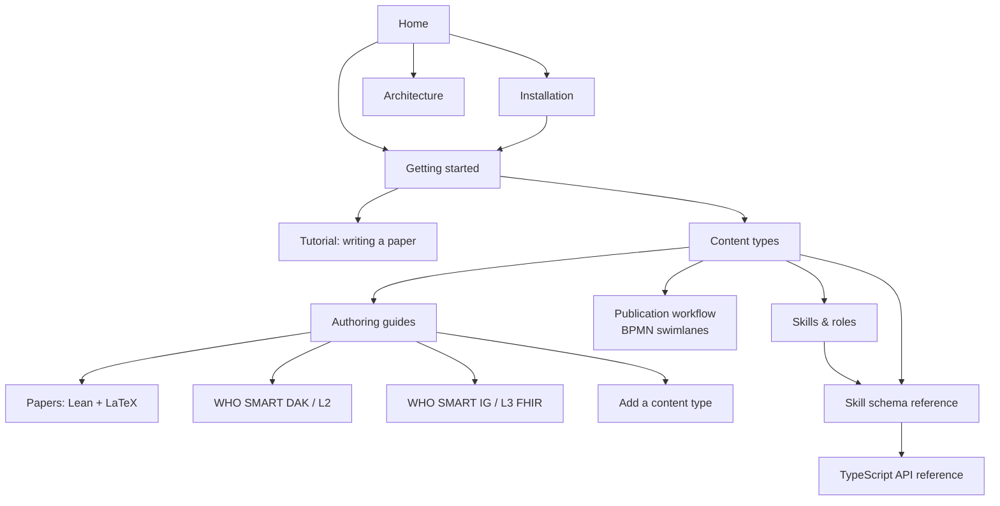



# folio-assistant
{: .fs-9 }


A content-agnostic agent skills framework for authoring rigorous content with a
large language model — scientific papers and books, WHO SMART Guidelines, and
FHIR Implementation Guides — backed by an MCP server, role-based access control,
and a typed content-object model.
{: .fs-6 .fw-300 }

<!--
  `View on GitHub` STAYS. The site-wide `aux_links` GitHub text was removed from
  the chrome above every page (bean `udx8`, PR #352), and the obvious follow-up
  is to delete this button for consistency. Do not. Put to the repo owner on
  2026-09-19: this button is part of the landing page's own readme/description
  note — authored content on one page, not chrome — and the forge remains
  reachable from the navbar's Source tile regardless.
-->
[Get started]({{ '/getting-started.html' | relative_url }}){: .btn .btn-primary .fs-5 .mb-4 .mb-md-0 .mr-2 }
[Install](installation.html){: .btn .fs-5 .mb-4 .mb-md-0 .mr-2 }
[View on GitHub](https://github.com/litlfred/folio-assistant){: .btn .fs-5 .mb-4 .mb-md-0 }



---

## Four things, in order

**1. The work plan is where you say what you are doing.**
Not a chat message, not a comment — [beans]({{ '/beans-and-todos.html' | relative_url }}), a committed
store any session or agent can read. Claim before you work so a sibling session
does not pick up the same item; a bean that turns out not to be wanted is
`scrapped`, with its reasons, never deleted.

```sh
cat-harness/scripts/install-beans.sh && export PATH="$HOME/.local/bin:$PATH"
beans list                          # what is open
beans create "<title>"              # ...after checking the title does not exist
beans <id> --status in-progress     # claim it, visibly
```

**2. Make your first folio.** This repository is the *platform*; your content
lives in its own. One command scaffolds it — the manifests, the declaration, the
agent files and the link back here:

```sh
bun run init-folio --help
```

Then [Get started](getting-started.html) walks the first block through validate,
render and review.

**3. Know which kind of thing you are writing.** A *document* is structured
prose; a *paper* is that plus the block kinds whose assertion is a formal claim,
backed by Lean and typeset through LaTeX. The choice decides which blocks are
legal and which gates run: [Content types]({{ '/content-types.html' | relative_url }}).

**4. The documentation you will never read.**
[All of it]({{ '/guides/index.html' | relative_url }}) — the authoring guides, the architecture, the
publication workflow, the generated schema and skill reference. It is here, it
is thorough, and the honest expectation is that you will arrive at it from a
search engine at the exact moment something breaks. That is a fine way to use
it. The three steps above are the ones worth reading now.

When it is the *machinery* that has you puzzled rather than the authoring —
who does a thing, under which process, using which skill — start at
[The platform]({{ '/platform.html' | relative_url }}). One sentence there
carries the whole model, and every word in it is a separately declared
object.

---

## What is folio-assistant?

**folio-assistant** is the *platform* — it does not contain content. It provides
the skills, schemas, tooling, and an MCP (Model Context Protocol) server that an
LLM-driven agent uses to plan, author, validate, review, test, and publish a
**folio** of content that lives in a separate repository.

> **Separation of concerns.** This documentation describes the *formalism of the
> framework* and *how to use folio-assistant* — deliberately kept **separate from
> any specific content**. Where content appears in these pages, it is purely
> illustrative (an *example*), never the canonical artifact.



## Supported content types

folio-assistant is **pluggable** — each content type is handled by a content
*adapter* and a matching skill *package*. The currently supported types:

| Content type | Artifacts | Skill package |
|--------------|-----------|---------------|
| **Scientific papers & books** | Lean 4 formalization + LaTeX/Markdown | [`authoring-math`](content-types.html#scientific-papers--books) |
| **WHO SMART Guidelines DAKs** | L2 artifacts — BPMN, DMN, Excel data dictionaries, personas | [`authoring-who-smart-guidelines`](content-types.html#who-smart-guidelines-daks-l2) |
| **WHO SMART Implementation Guides** | L3 FHIR resources, FSH, IG Publisher output | [`authoring-who-smart-guidelines`](content-types.html#who-smart-implementation-guides-l3) |
| **Others** | Pluggable — add a new adapter + skill package | [Adding a content type](guides/new-content-type.html) |

The cross-cutting [`content-lifecycle`](content-types.html#the-content-lifecycle)
package (plan → author → validate → review → test → publish → feedback → retire)
applies to every content type. The
[publication workflow](publication-workflow.html) models it properly — as BPMN
swimlanes, with the roles, the HCI validation gate, and the shared work plan.

## Where to go next

- **[Installation](installation.html)** — prerequisites, clone, `bun install`, capability check.
- **[Getting started](getting-started.html)** — connect the MCP server to your LLM and run your first skill.
- **[Tutorial: Writing a paper with folio-assistant](guides/writing-a-paper.html)** — a full, LLM-driven walk-through with a mock chat session.
- **[Content types](content-types.html)** — the formalism of each authoring domain.
- **[Publication workflow](publication-workflow.html)** — BPMN swimlane diagrams of the editing and publication processes: the HCI validation gate, who reviews what, and the shared work plan.
- **[Agent onboarding](guides/agent-onboarding.html)** — orientation for an LLM agent dropped into a folio: first steps, finding skills, the content-object model, QA sidecars.
- **[Skills & roles](skills.html)** — every skill and role, and how they work together with the LLM.
- **[Skill schema reference](reference/skills/)** — generated input/output contracts for every skill.
- **[TypeScript API reference](api/)** — the content-object model (`Block`, `Chapter`, `Paper`, builders, Zod constraints).
- **[Architecture](architecture.html)** — adapters, MCP server, RBAC, the block model.
- **[The KGraph](kgraph.html)** — the subgraph taxonomy, which way the references run, and how repositories divide the work.
- **[The Harness](harness.html)** — instantiation, the dependency walk, and what harnessing a directory obliges.

Two Skills are worth reading before the pages above, because everything else
assumes them: [`getting-started`](reference/skill-instructions/getting-started.html)
routes what you are actually trying to do, and
[`placement`](reference/skill-instructions/placement.html) settles where a new
node belongs before you make one.

## Documentation map



> The map nodes are clickable on the docs site.
