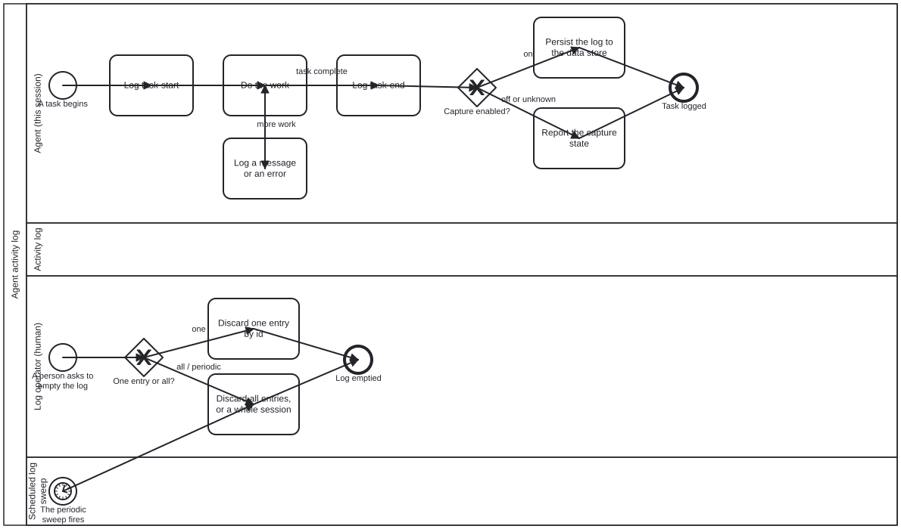

{: .note }
> Generated from `cat-harness/processes/activity-log.bpmn` by `gen-processes-viz.ts` — do not edit here. [All processes](index.html)


# Agent activity log

`Process_ActivityLog` · advisory · 8 step(s)

What an agent writes down about its own run, and what a person can do with it afterwards: task starts and ends, messages and errors, persisted where somebody can read them. You are in this process on every task, whether or not capture is on — the first gateway is what decides, and an agent that does not check it logs into nothing. The log operator's lane is the other half: a person discards one entry or a whole session, and the scheduled sweep does neither on its own. This is not the work plan. `beans` records WHAT is being worked on and survives the session; this records what happened during it. The two answer different questions and a reader reaching for one is badly served by the other.

## How it connects

- **Called by:** no call activity names this process
- **Calls:** none
- **Skill:** [`activity-log`](../reference/skill-instructions/activity-log.html)

## Lanes — who acts

| lane | role | what it does here |
|---|---|---|
| Agent (this session) | `authoring-agent` | Brackets its own work with a start and an end entry rather than leaving either implied, and reads Gateway_Capture rather than assuming it: persisting when capture is on, but merely reporting the setting — never silently dropping the entry — when it is off or could not be determined. |
| Activity log | `log` | — |
| Log operator (human) | `user` | The only lane in this diagram that chooses: one entry by id, or everything. It was split out from a single conflated lane because a person's choice and a scheduled sweep's fixed program are not the same actor, which is why the sweep below has a lane of its own rather than sharing this one. |
| Scheduled log sweep | `build-pipeline` | — |

## Steps

Every one of the 8 step(s) is documented.

| step | lane | skill / sub-process | what it does |
|---|---|---|---|
| **Log task-start** `A_LogStart` | Agent (this session) | [`activity-log`](../reference/skill-instructions/activity-log.html) | Write a task-start entry before touching anything: summary, actor, and the process/task/bean/branch/session it belongs to where they exist. role, process and task are optional on purpose — do not invent a lane for work done outside a process. |
| **Do the work** `A_DoWork` | Agent (this session) | — | The task itself. This diagram says nothing about how it is done; it only brackets it, so that a reader of the log can tell where one run of work began and ended. |
| **Log a message or an error** `A_LogMessage` | Agent (this session) | [`activity-log`](../reference/skill-instructions/activity-log.html) | Write a message or error entry whenever a later reader would need it. A command run goes in `execution` (command, exit code, where output went) — never the output itself, and never a secret, token or credential: capture on puts entries in git. |
| **Log task-end** `A_LogEnd` | Agent (this session) | [`activity-log`](../reference/skill-instructions/activity-log.html) | Write a task-end entry, with the outcome in the detail. The step is the unit: an entry per step, not one when the whole process finishes, or every intermediate entry is lost. |
| **Persist the log to the data store** `A_PersistLog` | Agent (this session) | [`activity-log`](../reference/skill-instructions/activity-log.html) | Capture is explicitly on — by <cat-harness.processes:log capture="on"/> on the process or by config — so the entries go to the git data store. Only this branch commits anything. |
| **Report the capture state** `A_ReportCaptureState` | Agent (this session) | [`activity-log`](../reference/skill-instructions/activity-log.html) | Capture is off or unknown, so nothing is committed. Say which of the two it is: off is somebody's decision, unknown means nobody could tell, and an agent that believes it has an audit trail when it has none acts on a false belief. |
| **Discard one entry by id** `A_EmptyOne` | Log operator (human) | [`activity-log`](../reference/skill-instructions/activity-log.html) | Remove one entry by its stable id, with emptyLog({ id }). Logs are the one exception to the never-delete rule because an entry records no decision; the exception covers files that declare folio-log/v1, not the directory. |
| **Discard all entries, or a whole session** `A_EmptyAll` | Log operator (human) | [`activity-log`](../reference/skill-instructions/activity-log.html) | Remove every entry, one session's, or those before a date — emptyLog with { all }, { session } or { before }; there is no default selector. A file that will not parse is kept, and the result must say what was refused and why, not only what was removed. |

## Decisions

Every one of the 2 decision(s) is documented.

| decision | what decides it | branches |
|---|---|---|
| **Capture enabled?** `Gateway_Capture` | Asked after a task ends: is log capture switched on for this session? `on` persists the entry to the data store. `off or unknown` persists nothing and reports the capture state instead, so an unknown setting is said out loud rather than read as off. | **on** → Persist the log to the data store **off or unknown** → Report the capture state |
| **One entry or all?** `Gateway_EmptyScope` | Asked when a person asks to empty the log: which entries? `one` discards a single entry by id; `all / periodic` discards every entry or a whole session, the branch a scheduled clean-up also takes. | **one** → Discard one entry by id **all / periodic** → Discard all entries, or a whole session |


