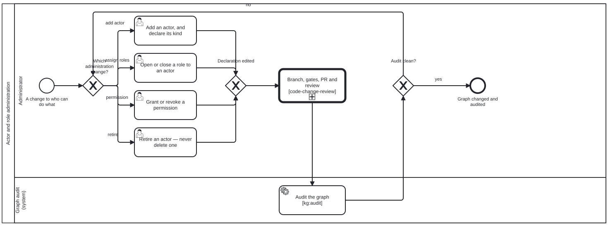

{: .note }
> Generated from `cat-harness/processes/actor-role-administration.bpmn` by `gen-processes-viz.ts` — do not edit here. [All processes](index.html)


# Actor and role administration

`Process_ActorRoleAdministration` · strict · 6 step(s)

Changing who can do what: adding an actor, opening or closing a role to one, granting or revoking a permission — and auditing the graph afterwards, because the declaration and the graph are two things that can disagree. You are in this process when the substrate every other diagram's lanes bind to is what is changing. That is why it is drawn rather than left as a filesystem edit: a role added without an audit is a lane binding that resolves today and may not tomorrow, and nothing else in the corpus would notice. Retirement, never deletion. An actor id is referenced from commits, sidecars and other declarations, so removing one makes an old record unreadable while retiring one leaves it legible and says the actor has stopped.

## How it connects

- **Called by:** no call activity names this process
- **Calls:** [Code change and review](code-change-review.html)

## Lanes — who acts

| lane | role | what it does here |
|---|---|---|
| Administrator | `administrator` | All four administration verbs — add, assign, grant, retire — converge at Gateway_Changed onto the same CallActivity_CodeChangeReview, so no kind of substrate edit gets a lighter review path than another; and Gateway_AuditClean's 'no' branch (A13) loops back to this lane rather than ending the process, because whether a `major` finding holds the change is this lane's policy call, not something Task_RunKgAudit decides for it. |
| Graph audit (system) | `build-pipeline` | Runs only after CallActivity_CodeChangeReview has already completed its own review, because the breakage this lane exists to catch — a join across role, lane, actor and skill — is invisible to a code reviewer reading the diff in isolation; ordinary code review clears the edit, and only this lane's whole-graph pass can tell whether it silently broke something three diagrams away. |

## Steps

Every one of the 6 step(s) is documented.

| step | lane | skill / sub-process | what it does |
|---|---|---|---|
| **Add an actor, and declare its kind** `Task_AddActor` | Administrator | [`role-model`](../reference/skill-instructions/role-model.html) | Human, agentic or mechanical. A userTask because the agentic/mechanical line is JUDGEMENT — role-model.md says so — and reading it wrong disqualifies the actor from every judgement task it exists to perform, silently. |
| **Open or close a role to an actor** `Task_AssignRoles` | Administrator | [`role-model`](../reference/skill-instructions/role-model.html) | The join every other diagram depends on. An empty `roles` is a DETERMINED empty — it says the actor takes on none — and is not the same as an absent one, which asserts nothing. |
| **Grant or revoke a permission** `Task_GrantOrRevoke` | Administrator | [`role-model`](../reference/skill-instructions/role-model.html) | A permission travels with the PARTICIPANT and cross-cuts every lane, so unlike a role it cannot be scoped by the diagram it is used in. Granting one is a standing decision, which is why this lane is person-only and why the log capture on this process is on. |
| **Retire an actor — never delete one** `Task_RetireActor` | Administrator | [`deletion-requires-confirmation`](../reference/skill-instructions/deletion-requires-confirmation.html) [`role-model`](../reference/skill-instructions/role-model.html) | An actor id is referenced from roles, diagrams, beans and commits, so removing the file leaves every one of those unable to tell retirement from accident. Same rule, and the same reason, as a scrapped bean. |
| **Branch, gates, PR and review** `CallActivity_CodeChangeReview` | Administrator | calls [Code change and review](code-change-review.html) [`prepare-merge`](../reference/skill-instructions/prepare-merge.html) [`continual-progress`](../reference/skill-instructions/continual-progress.html) | Called rather than restated. The mechanics of getting an edit reviewed and merged are not specific to the role graph, and a second description of them is a second thing free to disagree with the first. |
| **Audit the graph [kg:audit]** `Task_RunKgAudit` | Graph audit (system) | [`role-model`](../reference/skill-instructions/role-model.html) | AFTER the change, not before. Every criterion here is a join — role to lane, actor to role, activity to skill — so what an administrative edit breaks is not in the file it edited. The sidecars under `test/results/kg-qa/` are committed for the reason a printed verdict is not: without them, "unbound since it was drawn" and "broken by this change" are indistinguishable. |


