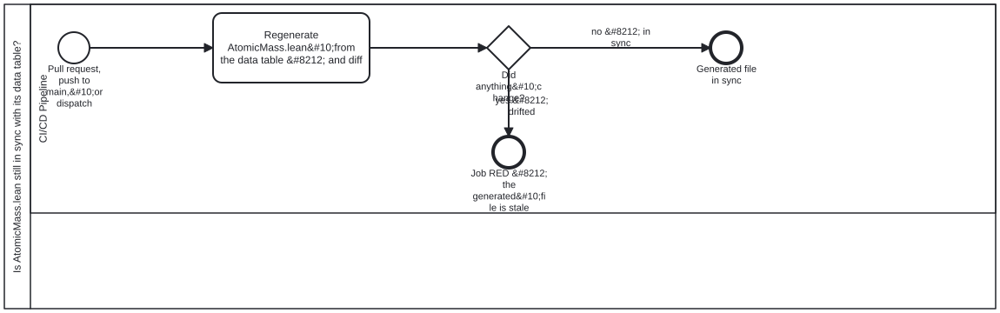

{: .note }
> Generated from `cat-harness/processes/atomic-mass-drift-check.bpmn` by `gen-processes-viz.ts` — do not edit here. [All processes](index.html)


# Is AtomicMass.lean still in sync with its data table?

`Process_AtomicMassDrift` · strict · 1 step(s)

THE SMALLEST WORKFLOW HERE, AND THE ONE WHOSE OUTPUT A PROOF DEPENDS ON. `AtomicMass.lean` is generated from a data table; if the two part company, a Lean file that compiles is nevertheless carrying numbers nothing produced. So the job regenerates and diffs, and any difference is red.&#10;&#10;THIS DIAGRAM IS DELIBERATELY SMALL, AND SAYING SO IS PART OF IT. Bean `7yvd` warns that "a diagram that is drawn once and then drifts is worse than none, because it is consulted", so each of the six was read before being drawn and classified by whether it says anything the YAML does not. `docs-site`, `ci-health`, `health-check` and `code-quality-gates` do &#8212; a full-replace compensation pair, two three-state verdict gateways, five independent parallel jobs. THIS ONE DOES NOT: it is one job with no branch and no compensation path, and dressing it up as more would be decoration that still has to be maintained.&#10;&#10;IT EARNS A DIAGRAM FOR A DIFFERENT REASON. Without one its job names no node (`# bpmn-node:` in the workflow), so `check:workflow-coverage` has nothing to compare and a job added here would tell nobody. That is drift detection rather than exposition, and it is worth the file on its own &#8212; but the two are not the same thing, and a reader who opens this expecting the second should be told which they are getting.

## How it connects

- **Called by:** no call activity names this process
- **Calls:** none
- **Presented on:** no docs page section shows this diagram

## Lanes — who acts

| lane | role | what it does here |
|---|---|---|
| CI/CD Pipeline | `build-pipeline` | The only lane in the smallest workflow here, and there is nothing else to hand off to: Task_Check's diff result is what GW_Drift reads directly, with no reviewer, no QC pass and no second lane positioned to catch a bad regeneration before End_Drift or End_Clean fires. Keeping this to one mechanical step is deliberate — a second lane would be ceremony over a check that either matches or does not. |

## Steps

Every one of the 1 step(s) is documented.

| step | lane | skill / sub-process | what it does |
|---|---|---|---|
| **Regenerate AtomicMass.lean&#10;from the data table &#8212; and diff** `Task_Check` | CI/CD Pipeline | — | Run gen_atomic_mass.py --check: regenerate AtomicMass.lean from the data table and diff it against the committed file. Any divergence exits 1 with a unified diff and fails the PR — a Lean file that compiles must not carry numbers the table no longer produces. |

## Decisions

Every one of the 1 decision(s) is documented.

| decision | what decides it | branches |
|---|---|---|
| **Did anything&#10;change?** `GW_Drift` | Answered by the diff Task_Check takes after regenerating AtomicMass.lean from the data table. No difference ends clean; any difference ends the job red, because the committed file is stale against its source. | **no &#8212; in sync** → Generated file in sync **yes &#8212; drifted** → Job RED &#8212; the generated&#10;file is stale |


